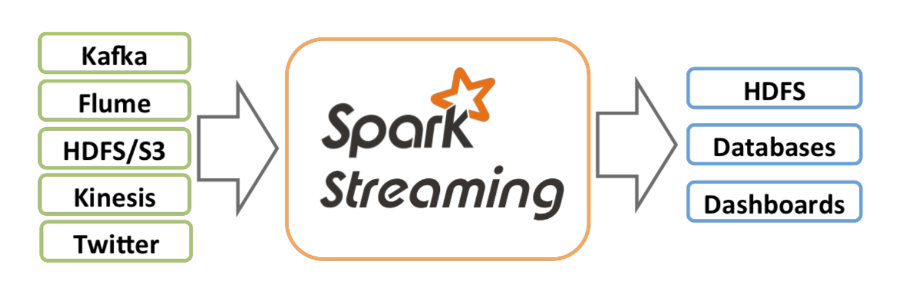
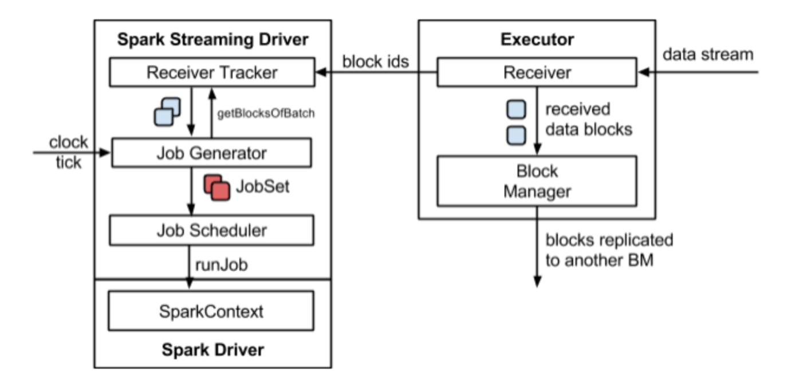
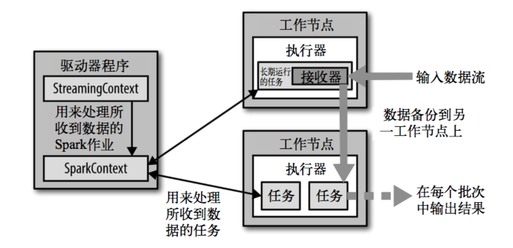
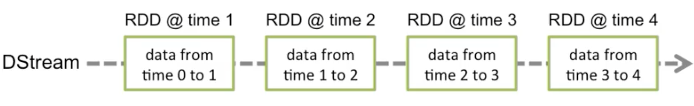
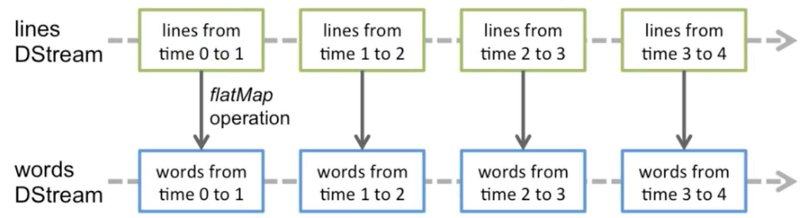

>[https://www.bilibili.com/video/BV11A411L7CK?p=185](https://www.bilibili.com/video/BV11A411L7CK?p=185)

之前学习的Spark RDD、Spark SQL 主要是针对离线数据的处理，而Spark Streaming 则是用于处理流式数据

流式数据处理可以简单的理解为来一条数据处理一条，就像水流一样源源不断的流到管道中；而批量数据处理，来一条不是立即处理，而是积攒一批后再统一处理

Spark Streaming 是一个准实时（延时在秒、分钟级别）、微批次（不能真正做到一条一条处理，实际也是一批一批处理，但是一批并不会太多，太多的话就达不到准实时，所以就有一个设定时间的概念，比如3 秒钟计算一次，这样保证这个时间间隔内数据量不会太多，而且延迟相对短）的数据处理框架

Spark Streaming 支持的数据输入源很多，比如：Kafka、Flume、Twitter、ZeroMQ、Socket 套接字等。数据输入后可以用Spark 的高度抽象原语，比如：map、reduce、join、window 等进行计算。而结果也能保存在很多地方，比如HDFS、数据库等



和Spark 基于RDD 的概念很相似，Spark Streaming 使用离散化流（discretized stream）作为抽象表示，叫做DStream。DStream 是随时间推移而收到的数据的序列。在内部，每个时间区间收到的数据都作为RDD 存在，而DStream 是由这些RDD 所组成的序列（因此得名“离散化”）。简单来说，DStream 就是对RDD 在实时处理处理场景的一种封装





Spark Streaming 的底层实现还是基于RDD！在内部实现上，DStream 是一系列连续的RDD 来表示，每个RDD 含有一段时间间隔内的数据



对数据的操作也是按照RDD 为单位来进行的



## Spark Streaming 的例子

使用netcat 工具向9999 端口不断发送数据，通过SparkStreaming 读取端口数据并统计不同单词出现的次数

```scala
package com.atguigu.bigdata.spark.streaming

import org.apache.spark.SparkConf
import org.apache.spark.streaming.dstream.{DStream, ReceiverInputDStream}
import org.apache.spark.streaming.{Seconds, StreamingContext}

object SparkStreaming01_WordCount {

    def main(args: Array[String]): Unit = {

        // 创建环境对象
        // StreamingContext创建时，需要传递两个参数
        // 第一个参数表示环境配置
        val sparkConf = new SparkConf().setMaster("local[*]").setAppName("SparkStreaming")
        // 第二个参数表示批量处理的周期（采集周期），这里表示每3 秒采集一批数据进行处理、分析，流的粒度就是每3 秒的数据
        val ssc = new StreamingContext(sparkConf, Seconds(3))

        // 逻辑处理
        // 从指定端口（9999）获取数据
        val lines: ReceiverInputDStream[String] = ssc.socketTextStream("localhost", 9999)

        // 以空格为分隔符，切分读取到的字符串信息，得到一个一个的单词
        val words = lines.flatMap(_.split(" "))

        val wordToOne = words.map((_,1))

        val wordToCount: DStream[(String, Int)] = wordToOne.reduceByKey(_+_)

        wordToCount.print()

        // 由于SparkStreaming采集器是长期执行的任务，所以不能直接关闭
        // 如果main方法执行完毕，应用程序也会自动结束。所以不能让main执行完毕
        //ssc.stop()
        // 1. 启动采集器
        ssc.start()
        // 2. 等待采集器的关闭
        ssc.awaitTermination()
    }
}
```


## 简单总结

>[笔记.zip](../download/20201126/笔记.zip)

>[笔记.zip](../download/20201126/代码.zip)