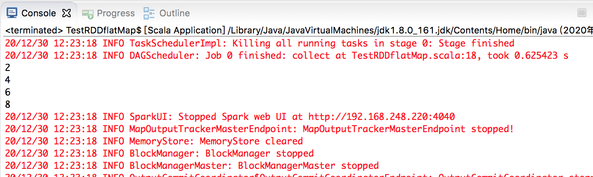
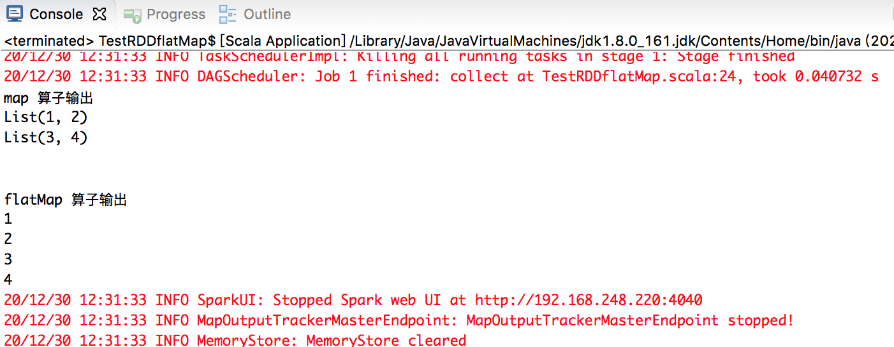
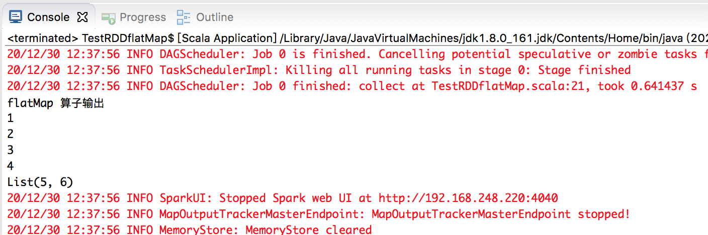

在之前的《Spark 计算框架》系列文章中，根据个人学习尚硅谷的课程对于Spark 知识体系进行初步的梳理，接下来将会根据实际的应用场景进行逐个点的分析！

之前在[Spark 计算框架：RDD 转换算子](http://www.xumenger.com/spark-core-3-rdd-operator-20201125/) 有提到Spark 提供的各种转换算子，但是关于map 和flatMap 还是没有讲得很详细

## map算子

将处理的数据逐条进行映射转换，可以是类型的转换，也可以是值的转换

```scala
import org.apache.spark.SparkConf
import org.apache.spark.SparkContext
import org.apache.spark.rdd.RDD

object TestRDDflatMap 
{
  def main(args: Array[String]): Unit = 
  {
    // 创建Spark 运行配置对象，连接。[*]表示当前本机的核数是多少，比如8核，那么就会用8个线程模拟运行场景
    val sparkConf = new SparkConf().setMaster("local[*]").setAppName("TestRDDflatMap")
    val sc = new SparkContext(sparkConf)
    
    // 创建一个RDD，将List 中的每个元素转换成RDD 的每个元素
    val rdd : RDD[Int] = sc.makeRDD(List(1,2,3,4), 1)
    
    val mapRdd = rdd.map(v => v * 2)
    
    // 运行算子
    mapRdd.collect().foreach(println)
    
    sc.stop()
  }
}
```

运行效果如下，可以看到每个元素都做了乘以二的操作



如果将上面的map 算子换成flatMap 算子，会有语法错误，因为flatMap 要求元素是可迭代对象，而上面的List(1,2,3,4) 转换成RDD，是一个个Int 对象，所以无法处理

## flatMap算子

所以将元素编程可迭代对象，看一下flatMap 和map 算子的区别

```scala
import org.apache.spark.SparkConf
import org.apache.spark.SparkContext
import org.apache.spark.rdd.RDD

object TestRDDflatMap 
{
  def main(args: Array[String]): Unit = 
  {
    // 创建Spark 运行配置对象，连接。[*]表示当前本机的核数是多少，比如8核，那么就会用8个线程模拟运行场景
    val sparkConf = new SparkConf().setMaster("local[*]").setAppName("TestRDDflatMap")
    val sc = new SparkContext(sparkConf)
    
    // 创建一个RDD，元素都是可迭代对象
    val rdd : RDD[List[Int]] = sc.makeRDD(List(List(1,2), List(3,4)), 1)
    
    // map 算子
    val mapRdd = rdd.map(v => v)
    // flatMap 算子
    val flatMapRdd = rdd.flatMap(v => v)
    
    val mapResult = mapRdd.collect()
    val flatMapResult = flatMapRdd.collect()
    
    println("map 算子输出")
    mapResult.foreach(println)
    println
    println
    println("flatMap 算子输出")
    flatMapResult.foreach(println)
    
    sc.stop()
  }
}
```

运行效果如下



简单解释一下，上面的代码首先使用List(List(1,2), List(3,4)) 创建RDD，所以RDD 中有两个元素List(1,2)、List(3,4)，对于map，它是逐个元素进行处理的；而flatMap，因为List(1,2)、List(3,4) 都是可迭代的元素，所以会对逐个元素迭代处理，List(1,2) 迭代出来的就是1、2，List(3,4) 迭代出来的就是3、4

## 迭代对象的子元素也是迭代对象呢

上面看到flatMap 算子处理List(List(1,2), List(3,4)) 生产的RDD 时，是逐个对迭代对象进行迭代处理，那如果迭代对象的子元素也是可迭代的呢？会递归迭代吗？

```scala
import org.apache.spark.SparkConf
import org.apache.spark.SparkContext
import org.apache.spark.rdd.RDD

object TestRDDflatMap 
{
  def main(args: Array[String]): Unit = 
  {
    // 创建Spark 运行配置对象，连接。[*]表示当前本机的核数是多少，比如8核，那么就会用8个线程模拟运行场景
    val sparkConf = new SparkConf().setMaster("local[*]").setAppName("TestRDDflatMap")
    val sc = new SparkContext(sparkConf)
    
    // 创建一个RDD，元素都是可迭代对象
    val rdd = sc.makeRDD(List(List(1,2), List(3,4,List(5,6))), 1)
    
    // flatMap 算子
    val flatMapRdd = rdd.flatMap(v => v)
    
    val flatMapResult = flatMapRdd.collect()
    
    println("flatMap 算子输出")
    flatMapResult.foreach(println)
    
    sc.stop()
  }
}
```

运行效果如下



可以看到并不会递归处理可迭代对象！