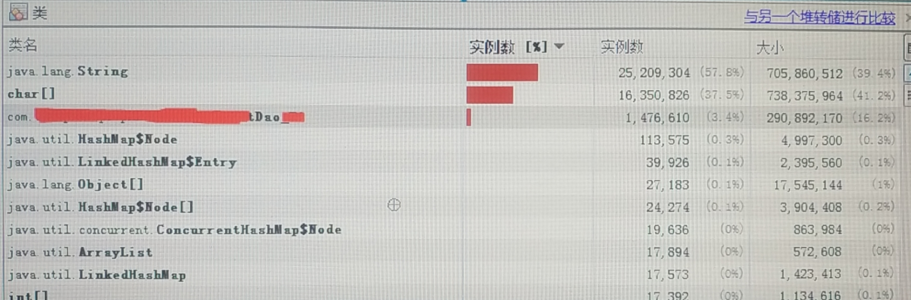

>[《记一次 JVM Young GC 排查经历》](http://www.xumenger.com/java-heap-01-20200827/)，这里面对于JVM 内存模型、各种工具进行了简单介绍

测试环境的某一台机器CPU 占用过高，通过top 命令看到这个进程的CPU 占用达到195.4%。补充一下配置信息：Java 1.8、Jboss
 
```
$  top
 
top - 16:41:36 up 196 days, 19:44,  2 users,  load average: 3.41, 2.95, 2.83
Tasks: 280 total,   2 running, 278 sleeping,   0 stopped,   0 zombie
%Cpu(s): 98.8 us,  0.8 sy,  0.0 ni,  0.3 id,  0.0 wa,  0.0 hi,  0.0 si,  0.0 st
KiB Mem :  3861520 total,    45980 free,  3123156 used,   692384 buff/cache
KiB Swap:  8388604 total,  8061368 free,   327236 used.   462096 avail Mem
 
   PID USER      PR  NI    VIRT    RES    SHR S  %CPU %MEM     TIME+ COMMAND
 58276 qappsom   20   0 4866436 2.208g   8008 S 195.4 60.0 180:21.23 java
```
 
然后进一步看一下这个进程内部具体是哪个线程导致CPU 占用过高的，可以看到是48228、48229 这两个线程的CPU 占用过高
 
```
$ top -H -p 58276
 
top - 16:42:43 up 196 days, 19:45,  2 users,  load average: 3.74, 3.11, 2.89
Threads: 215 total,   2 running, 213 sleeping,   0 stopped,   0 zombie
%Cpu(s): 97.2 us,  1.3 sy,  0.0 ni,  1.3 id,  0.0 wa,  0.0 hi,  0.2 si,  0.0 st
KiB Mem :  3861520 total,    57160 free,  3123288 used,   681072 buff/cache
KiB Swap:  8388604 total,  8061112 free,   327492 used.   453892 avail Mem
 
   PID USER      PR  NI    VIRT    RES    SHR S %CPU %MEM     TIME+ COMMAND
 48228 qappsom   20   0 4866436 2.208g   8052 R 94.0 60.0  56:49.42 java
 48229 qappsom   20   0 4866436 2.208g   8052 R 94.0 60.0  56:48.45 java
```
 
jstack -F 58276 > dump.txt，输出这个进程内部各个线程的调用栈信息，然后在dump.txt 中找到这两个线程（需要将10 进制的线程ID 转换成16 进制的线程ID 然后搜索），找到这两个线程，发现其是
 
```
"GC task thread#0 (ParallelGC)" os_prio=0 tid=0x00007fe1a8020000 nid=0xbc64 runnable
 
"GC task thread#1 (ParallelGC)" os_prio=0 tid=0x00007fe1a8021800 nid=0xbc65 runnable
```
 
显然这两个是垃圾回收线程。Parallel Scavenge 收集器是Java虚拟机中垃圾收集器的一种。又称为吞吐量优先收集器，和ParNew 收集器类似，是一个新生代收集器。使用复制算法的并行多线程收集器。Parallel Scavenge 是Java1.8 默认的收集器，特点是并行的多线程回收，以吞吐量优先

-XX:ParallelGCThreads进行设置。默认值就是当前机器的核心数
 
使用ps 命令查看这个进程的启动命令，检查一下JVM 的参数配置
 
```
$ ps -elf | grep jboss

0 S qappsom   58276  48113  9  80   0 - 1218413 futex_ Dec28 ?      04:02:19 /usr/java/jdk1.8.0_191-amd64//bin/java -D[Standalone] -XX:+UseCompressedOops -verbose:gc -Xloggc:/opt/jbshome/appserver/zwss01062010tsServer1/log/gc.log -XX:+PrintGCDetails -XX:+PrintGCDateStamps -XX:+UseGCLogFileRotation -XX:NumberOfGCLogFiles=5 -XX:GCLogFileSize=3M -XX:-TraceClassUnloading -server -Xms1932m -Xmx1932m -XX:NewSize=1024m -XX:MaxNewSize=1200m -XX:MetaspaceSize=256m -XX:MaxMetaspaceSize=512m -Djava.net.preferIPv4Stack=true -Djboss.modules.system.pkgs=org.jboss.byteman -Djava.awt.headless=true -XX:+HeapDumpOnOutOfMemoryError -XX:HeapDumpPath=/opt/jbshome/jboss_dump/zwss01062010tsServer1-OOM-pid%p.hprof -Dorg.jboss.boot.log.file=/opt/jbshome/appserver/zwss01062010tsServer1/log/server.log -Dlogging.configuration=file:/opt/jbshome/appserver/zwss01062010tsServer1/configuration/logging.properties -jar /opt/jbshome/jboss-eap-6.4/jboss-modules.jar -mp /opt/jbshome/jboss-eap-6.4/modules -jaxpmodule javax.xml.jaxp-provider org.jboss.as.standalone -Djboss.home.dir=/opt/jbshome/jboss-eap-6.4 -Djboss.server.base.dir=/opt/jbshome/appserver/zwss01062010tsServer1 -Djboss.server.base.dir=/opt/jbshome/appserver/zwss01062010tsServer1/ --server-config=standalone.xml -Djboss.bind.address.management=55.13.30.39 -Djboss.bind.address=55.13.30.39 -Djboss.socket.binding.port-offset=0 -Djboss.node.name=zwss01062010tsServer1
```
 
-Xloggc:/opt/jbshome/appserver/zwss01062010tsServer1/log/gc.log.0.current，查看垃圾回收日志，发现在15:40 时间点前后的垃圾回收出现异常

```
2020-12-30T00:42:30.109+0800: 97841.651: [GC (Allocation Failure) [PSYoungGen: 1185706K->3920K(1209344K)] 1842402K->660923K(1958912K), 0.0350280 secs] [Times: user=0.06 sys=0.00, real=0.03 secs]
2020-12-30T01:05:40.176+0800: 99231.718: [GC (Allocation Failure) [PSYoungGen: 1192272K->1872K(1207808K)] 1849275K->661528K(1957376K), 0.0436638 secs] [Times: user=0.08 sys=0.00, real=0.05 secs]
2020-12-30T01:28:30.234+0800: 100601.776: [GC (Allocation Failure) [PSYoungGen: 1190224K->3760K(1211392K)] 1849880K->663972K(1960960K), 0.0461865 secs] [Times: user=0.09 sys=0.00, real=0.05 secs]
2020-12-30T01:51:44.981+0800: 101996.523: [GC (Allocation Failure) [PSYoungGen: 1196208K->1280K(1209856K)] 1856420K->664109K(1959424K), 0.0418245 secs] [Times: user=0.08 sys=0.00, real=0.04 secs]
2020-12-30T02:14:53.240+0800: 103384.782: [GC (Allocation Failure) [PSYoungGen: 1193728K->2272K(1212928K)] 1856557K->665189K(1962496K), 0.0360392 secs] [Times: user=0.07 sys=0.00, real=0.03 secs]
2020-12-30T02:38:09.275+0800: 104780.817: [GC (Allocation Failure) [PSYoungGen: 1198304K->3936K(1211904K)] 1861221K->667662K(1961472K), 0.0369950 secs] [Times: user=0.07 sys=0.00, real=0.04 secs]
2020-12-30T03:01:32.851+0800: 106184.393: [GC (Allocation Failure) [PSYoungGen: 1199968K->1216K(1214464K)] 1863694K->667603K(1964032K), 0.0398930 secs] [Times: user=0.07 sys=0.00, real=0.04 secs]
2020-12-30T03:24:58.278+0800: 107589.820: [GC (Allocation Failure) [PSYoungGen: 1200832K->3792K(1213952K)] 1867219K->670215K(1963520K), 0.0325167 secs] [Times: user=0.06 sys=0.00, real=0.03 secs]
2020-12-30T03:48:30.590+0800: 109002.132: [GC (Allocation Failure) [PSYoungGen: 1203408K->1344K(1216000K)] 1869831K->670308K(1965568K), 0.0356933 secs] [Times: user=0.06 sys=0.00, real=0.03 secs]
2020-12-30T04:12:00.667+0800: 110412.209: [GC (Allocation Failure) [PSYoungGen: 1204032K->1248K(1215488K)] 1872996K->670372K(1965056K), 0.0411486 secs] [Times: user=0.07 sys=0.00, real=0.05 secs]
2020-12-30T04:35:18.466+0800: 111810.008: [GC (Allocation Failure) [PSYoungGen: 1203936K->5920K(1216512K)] 1873060K->675069K(1966080K), 0.0280267 secs] [Times: user=0.05 sys=0.00, real=0.03 secs]
2020-12-30T04:58:47.181+0800: 113218.723: [GC (Allocation Failure) [PSYoungGen: 1210144K->1216K(1216512K)] 1879293K->675062K(1966080K), 0.0295152 secs] [Times: user=0.05 sys=0.00, real=0.03 secs]
2020-12-30T05:22:13.695+0800: 114625.237: [GC (Allocation Failure) [PSYoungGen: 1205438K->1312K(1217536K)] 1879285K->675182K(1967104K), 0.0239872 secs] [Times: user=0.04 sys=0.00, real=0.03 secs]
2020-12-30T05:45:03.288+0800: 115994.830: [GC (Allocation Failure) [PSYoungGen: 1207072K->3968K(1217024K)] 1880942K->677862K(1966592K), 0.0518130 secs] [Times: user=0.10 sys=0.00, real=0.05 secs]
2020-12-30T06:10:38.368+0800: 117529.910: [GC (Allocation Failure) [PSYoungGen: 1209728K->1696K(1218048K)] 1883622K->678271K(1967616K), 0.0463241 secs] [Times: user=0.09 sys=0.00, real=0.04 secs]
2020-12-30T06:40:07.120+0800: 119298.662: [GC (Allocation Failure) [PSYoungGen: 1208992K->4128K(1218048K)] 1885567K->681156K(1967616K), 0.0427904 secs] [Times: user=0.08 sys=0.00, real=0.04 secs]
2020-12-30T07:09:17.785+0800: 121049.327: [GC (Allocation Failure) [PSYoungGen: 1211424K->1376K(1219072K)] 1888452K->681061K(1968640K), 0.0421157 secs] [Times: user=0.08 sys=0.00, real=0.05 secs]
2020-12-30T07:38:24.360+0800: 122795.902: [GC (Allocation Failure) [PSYoungGen: 1210208K->4032K(1218560K)] 1889893K->683749K(1968128K), 0.0446098 secs] [Times: user=0.08 sys=0.00, real=0.04 secs]
2020-12-30T08:07:30.157+0800: 124541.699: [GC (Allocation Failure) [PSYoungGen: 1212864K->1344K(1219584K)] 1892581K->683734K(1969152K), 0.0327197 secs] [Times: user=0.06 sys=0.00, real=0.04 secs]
2020-12-30T08:35:56.601+0800: 126248.143: [GC (Allocation Failure) [PSYoungGen: 1211200K->9024K(1219072K)] 1893590K->691431K(1968640K), 0.0471582 secs] [Times: user=0.09 sys=0.00, real=0.05 secs]
2020-12-30T09:03:54.433+0800: 127925.975: [GC (Allocation Failure) [PSYoungGen: 1218880K->1536K(1217024K)] 1901287K->691635K(1966592K), 0.0509339 secs] [Times: user=0.09 sys=0.00, real=0.05 secs]
2020-12-30T09:32:15.118+0800: 129626.660: [GC (Allocation Failure) [PSYoungGen: 1208832K->6048K(1218048K)] 1898931K->696320K(1967616K), 0.0256709 secs] [Times: user=0.05 sys=0.00, real=0.02 secs]
2020-12-30T10:00:55.791+0800: 131347.333: [GC (Allocation Failure) [PSYoungGen: 1213344K->3200K(1218560K)] 1903616K->698153K(1968128K), 0.0417977 secs] [Times: user=0.08 sys=0.00, real=0.04 secs]
2020-12-30T10:29:20.934+0800: 133052.476: [GC (Allocation Failure) [PSYoungGen: 1211008K->6624K(1218048K)] 1905961K->702938K(1967616K), 0.0442476 secs] [Times: user=0.08 sys=0.00, real=0.05 secs]
2020-12-30T10:57:49.235+0800: 134760.777: [GC (Allocation Failure) [PSYoungGen: 1214432K->3408K(1218560K)] 1910746K->705027K(1968128K), 0.0468550 secs] [Times: user=0.09 sys=0.00, real=0.05 secs]
2020-12-30T11:26:40.356+0800: 136491.898: [GC (Allocation Failure) [PSYoungGen: 1211216K->5232K(1218048K)] 1912835K->708380K(1967616K), 0.1119558 secs] [Times: user=0.21 sys=0.01, real=0.12 secs]
2020-12-30T11:54:12.927+0800: 138144.469: [GC (Allocation Failure) [PSYoungGen: 1213040K->4512K(1219072K)] 1916188K->711546K(1968640K), 0.0276820 secs] [Times: user=0.05 sys=0.00, real=0.03 secs]
2020-12-30T12:20:30.138+0800: 139721.680: [GC (Allocation Failure) [PSYoungGen: 1213344K->7457K(1218560K)] 1920378K->717715K(1968128K), 0.0658277 secs] [Times: user=0.12 sys=0.01, real=0.06 secs]
2020-12-30T12:47:03.408+0800: 141314.950: [GC (Allocation Failure) [PSYoungGen: 1216289K->6161K(1218560K)] 1926547K->719427K(1968128K), 0.0594086 secs] [Times: user=0.11 sys=0.00, real=0.06 secs]
2020-12-30T13:16:01.936+0800: 143053.478: [GC (Allocation Failure) [PSYoungGen: 1214481K->2784K(1218560K)] 1927747K->720852K(1968128K), 0.0567840 secs] [Times: user=0.10 sys=0.00, real=0.06 secs]
2020-12-30T13:44:45.604+0800: 144777.146: [GC (Allocation Failure) [PSYoungGen: 1211104K->4032K(1219072K)] 1929172K->723205K(1968640K), 0.0400416 secs] [Times: user=0.07 sys=0.00, real=0.04 secs]
2020-12-30T14:13:37.182+0800: 146508.724: [GC (Allocation Failure) [PSYoungGen: 1212864K->2144K(1218560K)] 1932037K->723974K(1968128K), 0.0447352 secs] [Times: user=0.09 sys=0.00, real=0.04 secs]
2020-12-30T14:42:22.300+0800: 148233.842: [GC (Allocation Failure) [PSYoungGen: 1210976K->5104K(1219584K)] 1932806K->727574K(1969152K), 0.0292590 secs] [Times: user=0.05 sys=0.00, real=0.03 secs]
2020-12-30T15:10:55.635+0800: 149947.177: [GC (Allocation Failure) [PSYoungGen: 1214960K->7088K(1219072K)] 1937430K->733348K(1968640K), 0.0549942 secs] [Times: user=0.09 sys=0.00, real=0.06 secs]
2020-12-30T15:39:26.886+0800: 151658.428: [GC (Allocation Failure) [PSYoungGen: 1216944K->4128K(1219072K)] 1943204K->734660K(1968640K), 0.0560839 secs] [Times: user=0.11 sys=0.00, real=0.06 secs]
2020-12-30T15:40:41.478+0800: 151733.020: [GC (Allocation Failure) --[PSYoungGen: 1213472K->1213472K(1219072K)] 1944004K->1963034K(1968640K), 1.1056030 secs] [Times: user=1.21 sys=0.37, real=1.10 secs]

-- 之前都是GC，这里第一次触发Full GC
2020-12-30T15:40:42.586+0800: 151734.128: [Full GC (Ergonomics) [PSYoungGen: 1213472K->0K(1219072K)] [ParOldGen: 749561K->159266K(749568K)] 1963034K->159266K(1968640K), [Metaspace: 77640K->77554K(1122304K)], 1.3705939 secs] [Times: user=2.27 sys=0.21, real=1.37 secs]
2020-12-30T15:40:50.848+0800: 151742.390: [GC (Allocation Failure) [PSYoungGen: 1209344K->9721K(1219072K)] 1368610K->271612K(1968640K), 0.2763942 secs] [Times: user=0.54 sys=0.00, real=0.27 secs]
2020-12-30T15:40:57.932+0800: 151749.474: [GC (Allocation Failure) [PSYoungGen: 1219065K->9726K(1068544K)] 1480956K->384169K(1818112K), 0.2951669 secs] [Times: user=0.59 sys=0.00, real=0.30 secs]
2020-12-30T15:41:05.992+0800: 151757.534: [GC (Allocation Failure) [PSYoungGen: 1068542K->84990K(1143808K)] 1442985K->481952K(1893376K), 0.2238247 secs] [Times: user=0.45 sys=0.00, real=0.22 secs]
2020-12-30T15:41:12.886+0800: 151764.428: [GC (Allocation Failure) [PSYoungGen: 1143806K->84989K(998400K)] 1540768K->581087K(1747968K), 0.3891122 secs] [Times: user=0.76 sys=0.00, real=0.39 secs]
2020-12-30T15:41:19.175+0800: 151770.717: [GC (Allocation Failure) [PSYoungGen: 998397K->84096K(997888K)] 1494495K->665575K(1747456K), 0.3228025 secs] [Times: user=0.63 sys=0.00, real=0.33 secs]
2020-12-30T15:41:25.282+0800: 151776.824: [GC (Allocation Failure) [PSYoungGen: 997504K->84448K(1067008K)] 1578983K->750359K(1816576K), 0.3467167 secs] [Times: user=0.69 sys=0.00, real=0.35 secs]

-- 后续一直都是Full GC
2020-12-30T15:41:25.629+0800: 151777.171: [Full GC (Ergonomics) [PSYoungGen: 84448K->0K(1067008K)] [ParOldGen: 665911K->742158K(749568K)] 750359K->742158K(1816576K), [Metaspace: 77554K->77550K(1122304K)], 4.1411607 secs] [Times: user=7.99 sys=0.00, real=4.14 secs]
2020-12-30T15:41:35.291+0800: 151786.833: [Full GC (Ergonomics) [PSYoungGen: 907264K->75816K(1067008K)] [ParOldGen: 742158K->749534K(749568K)] 1649422K->825350K(1816576K), [Metaspace: 77550K->77550K(1122304K)], 3.3608777 secs] [Times: user=6.52 sys=0.00, real=3.36 secs]
2020-12-30T15:41:43.961+0800: 151795.503: [Full GC (Ergonomics) [PSYoungGen: 907264K->153828K(1067008K)] [ParOldGen: 749534K->749400K(749568K)] 1656798K->903228K(1816576K), [Metaspace: 77550K->77550K(1122304K)], 3.5513056 secs] [Times: user=6.94 sys=0.00, real=3.55 secs]
2020-12-30T15:41:51.736+0800: 151803.278: [Full GC (Ergonomics) [PSYoungGen: 907264K->223082K(1067008K)] [ParOldGen: 749400K->749380K(749568K)] 1656664K->972462K(1816576K), [Metaspace: 77550K->77550K(1122304K)], 3.4847918 secs] [Times: user=6.80 sys=0.00, real=3.49 secs]
2020-12-30T15:41:59.389+0800: 151810.931: [Full GC (Ergonomics) [PSYoungGen: 907264K->286147K(1067008K)] [ParOldGen: 749380K->749377K(749568K)] 1656644K->1035525K(1816576K), [Metaspace: 77550K->77550K(1122304K)], 4.5590799 secs] [Times: user=8.12 sys=0.00, real=4.56 secs]
2020-12-30T15:42:08.285+0800: 151819.827: [Full GC (Ergonomics) [PSYoungGen: 907264K->343170K(1067008K)] [ParOldGen: 749377K->749376K(749568K)] 1656641K->1092546K(1816576K), [Metaspace: 77550K->77550K(1122304K)], 3.6513360 secs] [Times: user=7.12 sys=0.00, real=3.65 secs]
2020-12-30T15:42:15.698+0800: 151827.240: [Full GC (Ergonomics) [PSYoungGen: 907264K->395192K(1067008K)] [ParOldGen: 749376K->749376K(749568K)] 1656640K->1144568K(1816576K), [Metaspace: 77550K->77550K(1122304K)], 3.8371480 secs] [Times: user=7.52 sys=0.00, real=3.83 secs]
2020-12-30T15:42:21.132+0800: 151832.674: [Full GC (Ergonomics) [PSYoungGen: 907264K->441327K(1067008K)] [ParOldGen: 749376K->749375K(749568K)] 1656640K->1190702K(1816576K), [Metaspace: 77550K->77550K(1122304K)], 3.5205031 secs] [Times: user=6.84 sys=0.00, real=3.52 secs]
2020-12-30T15:42:26.295+0800: 151837.837: [Full GC (Ergonomics) [PSYoungGen: 907264K->484182K(1067008K)] [ParOldGen: 749375K->749375K(749568K)] 1656639K->1233557K(1816576K), [Metaspace: 77550K->77550K(1122304K)], 3.8323058 secs] [Times: user=7.52 sys=0.00, real=3.84 secs]
2020-12-30T15:42:31.601+0800: 151843.143: [Full GC (Ergonomics) [PSYoungGen: 907264K->523062K(1067008K)] [ParOldGen: 749375K->749368K(749568K)] 1656639K->1272431K(1816576K), [Metaspace: 77550K->77550K(1122304K)], 4.1700859 secs] [Times: user=8.09 sys=0.00, real=4.17 secs]
2020-12-30T15:42:36.965+0800: 151848.507: [Full GC (Ergonomics) [PSYoungGen: 907264K->558207K(1067008K)] [ParOldGen: 749368K->749367K(749568K)] 1656632K->1307574K(1816576K), [Metaspace: 77552K->77552K(1122304K)], 4.0871230 secs] [Times: user=8.01 sys=0.00, real=4.09 secs]
2020-12-30T15:42:42.028+0800: 151853.570: [Full GC (Ergonomics) [PSYoungGen: 907264K->591956K(1067008K)] [ParOldGen: 749367K->749367K(749568K)] 1656631K->1341323K(1816576K), [Metaspace: 77552K->77552K(1122304K)], 3.7820894 secs] [Times: user=7.43 sys=0.00, real=3.78 secs]
2020-12-30T15:42:46.757+0800: 151858.299: [Full GC (Ergonomics) [PSYoungGen: 907264K->620859K(1067008K)] [ParOldGen: 749367K->749364K(749568K)] 1656631K->1370223K(1816576K), [Metaspace: 77552K->77552K(1122304K)], 4.1589716 secs] [Times: user=8.18 sys=0.00, real=4.15 secs]
2020-12-30T15:42:51.702+0800: 151863.244: [Full GC (Ergonomics) [PSYoungGen: 907264K->647182K(1067008K)] [ParOldGen: 749364K->749359K(749568K)] 1656628K->1396542K(1816576K), [Metaspace: 77552K->77552K(1122304K)], 3.8909089 secs] [Times: user=7.63 sys=0.00, real=3.89 secs]
....
....
2020-12-30T17:05:47.363+0800: 156838.905: [Full GC (Ergonomics) [PSYoungGen: 714752K->714727K(919040K)] [ParOldGen: 749343K->749343K(749568K)] 1464095K->1464070K(1668608K), [Metaspace: 77609K->77609K(1122304K)], 3.9916885 secs] [Times: user=7.64 sys=0.00, real=3.99 secs]
2020-12-30T17:05:51.357+0800: 156842.899: [Full GC (Ergonomics) [PSYoungGen: 714752K->714720K(919040K)] [ParOldGen: 749343K->749343K(749568K)] 1464095K->1464063K(1668608K), [Metaspace: 77610K->77610K(1122304K)], 3.9433128 secs] [Times: user=7.49 sys=0.00, real=3.95 secs]
2020-12-30T17:05:55.302+0800: 156846.844: [Full GC (Ergonomics) [PSYoungGen: 714752K->714709K(919040K)] [ParOldGen: 749343K->749342K(749568K)] 1464095K->1464052K(1668608K), [Metaspace: 77610K->77610K(1122304K)], 4.0163086 secs] [Times: user=7.57 sys=0.00, real=4.02 secs]
2020-12-30T17:05:59.320+0800: 156850.862: [Full GC (Ergonomics) [PSYoungGen: 714752K->714693K(919040K)] [ParOldGen: 749342K->749341K(749568K)] 1464094K->1464034K(1668608K), [Metaspace: 77610K->77610K(1122304K)], 4.8968460 secs] [Times: user=8.29 sys=0.00, real=4.90 secs]
```
 
观察GC日志发现了一些信息
 
* 在15:40:42 的时候第一次触发Full GC
* 比如第一个Full GC 上面的最近的一个Young GC的日志，可以看到这次Young GC发生的变化如下
    * 年轻代1216944K->4128K(1219072K)
    * 但整个堆的大小却发生变化1943204K->734660K(1968640K)
    * 说明虽然年轻代的内存空间变小，但是整个老年代的内存占用变大
* 第一次Full GC 之前的日志，可以看到，老年代的内存占用是越来越大的，基本是每次2000KB 左右的大小增加的
    * 怀疑就是年轻代的某些对象一直堆积，然后每次Young GC导致其年龄增加，但是没有被回收掉，然后进入老年代
* 后面每次GC 的时候，可以看到老年代的内存大小越来越大，从15:40之后的日志看，其增长趋势是这样的
    * 159266K -> 271612K -> 384169K -> 481952K -> 581087K -> 665575K -> 750359K -> 749534K
    * 然后基本稳定在 749534K = 732M
* 回看一下这个JVM进程的启动参数-Xms1932m -Xmx1932m -XX:NewSize=1024m -XX:MaxNewSize=1200m -XX:MetaspaceSize=256m -XX:MaxMetaspaceSize=512m
    * -Xms1932m -Xmx1932m 表示整个堆最大的内存，1932MB
    * -XX:NewSize=1024m -XX:MaxNewSize=1200m 表示年轻代堆内存的分配策略，最大年轻代堆内存是1200MB，可以看到第一次Full GC 之前的GC，都是年轻代达到了1200MB 左右触发的Young GC，可以印证这一点
    * 堆内存大小是1932MB，年轻代是1200MB，所以老年代是732M，刚好和上面gc 日志中显示的老年代的的内存大小一致
    * -XX:MetaspaceSize=256m -XX:MaxMetaspaceSize=512m
* 然后后续基本就都是Full GC，而且每次Full GC 的耗时时间很长，基本都达到了6-8s 的时间
 
尝试使用jmap 导出JVM 进程的堆转储文件，继续分析一下

jmap -dump:format-b,file=/tmp/dump58276 导入堆Dump 文件，然后下载下来分析，使用jvisualvm.exe 打开Dump 转储文件



很明显，看到了一个业务代码中的DAO 实体对象现在达到了147 万个，看一下这个对象的，其中String 类型的字段有17 个，而每个String 对象内部是有一个char[] 数组存储字符串信息的，这个数量级刚好和上面显示的char[]、String 对象的数量级比较匹配

最后检查代码和程序，发现代码中按照用户的ID 信息去表中加载该实体信息，加载上来后放到一个List 中循环处理

结果测试环境数据倾斜，某一个用户有几百万条数据（实际生产环境一个用户最多能有千级别的数据了，不可能这么多！），程序没有使用游标，而是一次性加载，所以导致体现在程序层面是这个表对应的DAO 实体对象数量过多，然后程序循环几百万条数据处理的时间也很慢，所以这些DAO 实体对象在List 中一直被引用，Young GC 的时候无法使其被回收，反而会增加这些对象的年龄，最后这些对象还在被业务程序处理的时候，而在垃圾回收层面，已经被放到老年代了，导致触发Full GC

按理说，这些数据在处理完之后，也应该被从老年代中垃圾回收到的，估计程序处理的时间实在是太长，毕竟几百万条数据，而且如最开始看到的那样，垃圾回收线程因为对象占满内存，所以占用了大量CPU，这方面也可能会影响业务线程处理速度

综合以上的分析，简单复盘一下

* 因为测试环境数据异常，某个用户有几百万条记录，按照用户将这些信息一次性加载到内存
* 但是业务程序处理这几百万条数据耗时要很久，因为业务逻辑比较复杂
* 所以在每次Young GC 的时候，都是导致这几百万条数据的年龄加一
* 多次Young GC 后，这几百万个对象的年龄达到了老年代的标准，所以被移到老年代
* 而业务程序还是在处理，没有处理完
* 后续老年代满了之后，触发Full GC
* 根据GC 日志和top 监控，可以看到Full GC 的耗时很久且一直占用大量内存
* 因为GC 线程一直占用CPU，导致业务线程的CPU 资源可能分不到
* 再加上业务线程本身也比较慢，所以这些对象一直在业务线程的循环中迟迟没有处理完
* 所以每次Full GC，判断这些对象还是在被业务线程引用，按照可达性分析，所以一直无法将其GC！
* 如此，各种情况雪上加霜，导致了以上的异常现象
