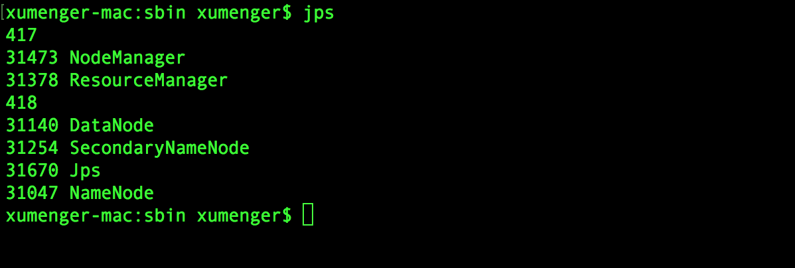
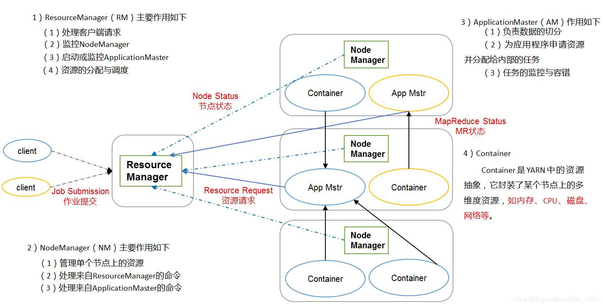
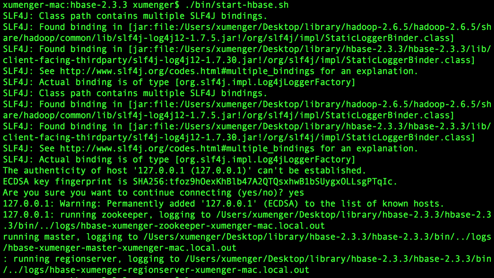
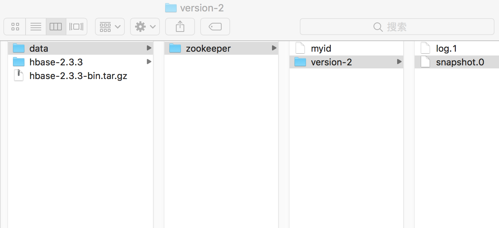
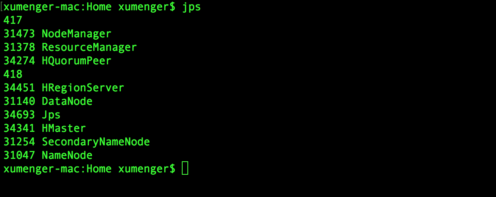
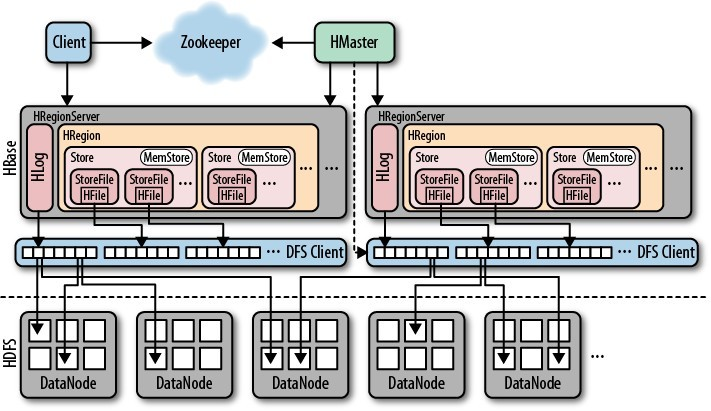

关于各种大数据的组件，之前对于Zookeeper、Kafka、ElasticSearch、Hadoop、HDFS、Spark 的环境做过整理

* [搭建Kafka运行环境](http://www.xumenger.com/kafka-zookeeper-20181117/)
* [认识Hadoop](http://www.xumenger.com/hadoop-20180731/)
* [搭建ELK环境](http://www.xumenger.com/elk-20191123/)
* [Spark 计算框架：搭建Spark 环境](http://www.xumenger.com/spark-env-20201123/)

首先需要准备好[Hadoop 环境](http://www.xumenger.com/hadoop-20180731/)，将命令和运维信息准备一下

## Hadoop 环境

详细内容参考：[认识Hadoop](http://www.xumenger.com/hadoop-20180731/)

```shell
// 启动Hadoop
cd /Users/xumenger/Desktop/library/hadoop-2.6.5/hadoop-2.6.5/sbin
sh ./start-all.sh
```

Hadoop Web 管理界面[http://localhost:8088/cluster](http://localhost:8088/cluster)

jps 显示启动的进程有这几个



* **HDFS 相关进程**
* NameNode
	* Hadoop 集群中只有一个NameNode，NameNode 是HDFS 的管理节点，负责HDFS 的目录树和相关的文件元数据的存储
	* 监控集群中DataNode 的健康状态，一旦发现某个DataNode 宕掉，则将该DataNode 从HDFS 集群移除并在其他DataNode 上重新备份该DataNode 的数据（数据重平衡，rebalance）
* SecondaryNameNode
	* NameNode 的元数据的备份，在NameNode 宕机后，SecondaryNameNode 会接替NameNode 的工作，负责整个集群的管理
* DataNode
	* 在一个Hadoop 集群中有多个DataNode，一般情况下在一个Hadoop Slave 节点上部署一个DataNode
	* DataNode 负责具体的数据存储，并将数据的元信息定期汇报给NameNode
	* DataNode 以固定大小的块（block）为基本单位组织和存储文件信息（block 大小通过dfs.blocksize 设置，默认64MB）
* **YARN 相关进程**
* ResourceManager
	* 负责集群资源的管理、监控和分配。对于所有的应用，ResourceManager 拥有绝对的控制权和对资源的分配权
* NodeManager
	* NodeManager 负责具体节点的资源管理和任务分配
	* 是ResourceManager 管理该节点的代理，负责该节点程序的运行和资源的管理与监控
	* YARN 集群的每个节点都运行一个NodeManager
	* NodeManager 定时向ResourceManager 汇报本节点的资源（CPU和内存）的使用情况和Container 的运行状态
	* 当主ResourceManager 宕机时，NodeManager 会自动连接ResourceManager 的备用节点

## YARN 资源协调

对于YARN，除了ResourceManager、NodeManager 之外，还有ApplicationMaster 的概念，用户提交的每个应用程序均包含一个ApplicationManager，它可以运行在ResourceManager 以外的机器上，其主要职责是

* 申请资源，与ResourceManager 协商来获取系统资源，ResourceManager 以Container 的形式将资源分配给ApplicationMaster
* 启停任务，与NodeManager 通信来启动或停止任务
* 监控任务，监控任务的运行状态
* 错误重试，在任务运行失败后，ApplicationMaster 会重新为任务申请资源并重启该任务，ResourceManager 只负责监控ApplicationManager，并在ApplicationMaster 运行失败后启动ApplicationMaster。ResourceManager 不负责ApplicationMaster 内部任务的容错，任务的容错由ApplicationMaster 自身完成

YARN 的任务提交由Client 向ResourceManager 发起，然后由ResourceManager 启动ApplicationMaster 并为其分配用于运行作用的Container 资源，ApplicationMaster 在收到Container 资源列表后初始化Container 再交由NodeManager 来启动Container 容器并运行具体的任务（MapReduce 任务或其他Spark、Flink 任务。在任务运行完成后，ApplicationMaster 向ResourceManager 注销自己并释放资源



## [HBase](https://hbase.apache.org/) 环境搭建

HBase 的集群管理依赖ZooKeeper，可以单独地部署ZooKeeper，也可以使用HBase 内置的ZooKeeper。HBase 可以基于简单的文件系统作为底层数据的存储，也可以基于HDFS 作为底层数据的存储

在[HBase 的官网](https://hbase.apache.org/downloads.html) 下载安装包，这里2.3.x 版本，进入对应目录，解压

```
/Users/xumenger/Desktop/library/hbase-2.3.3
tar -xzf hbase-2.3.3-bin.tar.gz
```

编辑hbase-env.sh 配置文件：vim hbase-2.3.3/conf/hbase-env.sh。在配置文件中加入JAVA_HOME 安装地址，声明HBase 所使用的Java 环境，在配置文件中加入HBASE_MANAGES_ZK=true，声明HBase 使用内置的ZooKeeper，如果使用独立的ZooKeeper，则将该属性设置为false

```
# The java implementation to use.  Java 1.8+ required.
export JAVA_HOME=/Library/Java/JavaVirtualMachines/jdk1.8.0_161.jdk/Contents/Home/


# Tell HBase whether it should manage it's own instance of ZooKeeper or not.
export HBASE_MANAGES_ZK=true
```

vim hbase-2.3.3/conf/hbase-site.xml。在配置文件中加入hbase.rootdir 属性，设置HBase 文件存储的目录，可以设置为本地目录，也可以使用HDFS 存储

在配置文件中加入hbase.zookeeper.property.dataDir 的属性，设置ZooKeeper 的数据存储地址为/Users/xumenger/Desktop/library/hbase-2.3.3/data/zookeeper，如果使用独立的ZooKeeper，则不需要设置ZooKeeper 的数据存储地址，直接设置hbase.zookeeper.quorum 的服务地址，并在hbase-env.sh 设置export HBASE_MANAGES_ZK=false

```xml
  <property>
    <name>hbase.cluster.distributed</name>
    <value>true</value>
  </property>
  <property>
    <name>hbase.rootdir</name>
    <value>hdfs://127.0.0.1:9000/hbase</value>
    <!-- <value>file:///Users/xumenger/Desktop/library/hbase-2.3.3/data/hbase -->
  </property>
  <property>
    <name>hbase.zookeeper.property.dataDir</name>
    <value>/Users/xumenger/Desktop/library/hbase-2.3.3/data/zookeeper</value>
  </property>
```

然后./bin/start-hbase.sh 启动HBase



此时去/Users/xumenger/Desktop/library/hbase-2.3.3/data/zookeeper，可以看到ZooKeeper 存储数据的目录下确实有内容了



## HBase 进程分析

继续jps 显示现在启动的进程



相比于原来的进程，多出来这几个新的Java 进程：HMaster、HRegionServer、HQuorumPeer

HMaster 是HBase 集群的主节点，负责整个集群的管理工作，主要的工作职责包括：

* 分配Region：根据用户数据分布规则为Region Server 分配Region，每个Region 对应一部分数据
* 负载均衡：HMaster 维护整个集群的负载均衡，包含
	* 数据负载均衡（将用户数据均衡分布在各Region Server，防止Region Server 数据倾斜过载）
	* 请求负载均衡（将用户请求均衡分布在各Region Server，防止Region Server 请求过热）
* 维护数据：维护集群的元数据，发现失效的Region，并将失效的Region 分配到正常的Region Server 上
	* 在Region Server 失效的时候，协调对应的HLog 进行任务的拆分

Region Server 是数据具体的存储和请求节点，它直接对接用户的读写请求，主要职责包括

* 管理HMaster 为其分配的Region
* 处理来自客户端的读写请求
* 负责与底层的HDFS 交互，存储数据到HDFS
* 负责Region 变大后的拆分
* 负责StoreFile 的合并工作
* Region Server 和HMaster 定时通信，并以租约的形式从HMaster 上更新集群的信息到本地，这样在客户端查询数据的时候，Region Server 就可以直接处理，而不用每次都去HMaster 请求集群信息，从而避免HMaster 请求过热、单点故障

一个Region Server 包含多个Region，每个Region 又都有多个Store，每个Store 都对应一个Column Family，Store 又包含MemStore 和StoreFile，这边组成了Region Server 数据存储的基本结构



>更多内容参考[https://hbase.apache.org/book.html](https://hbase.apache.org/book.html)
