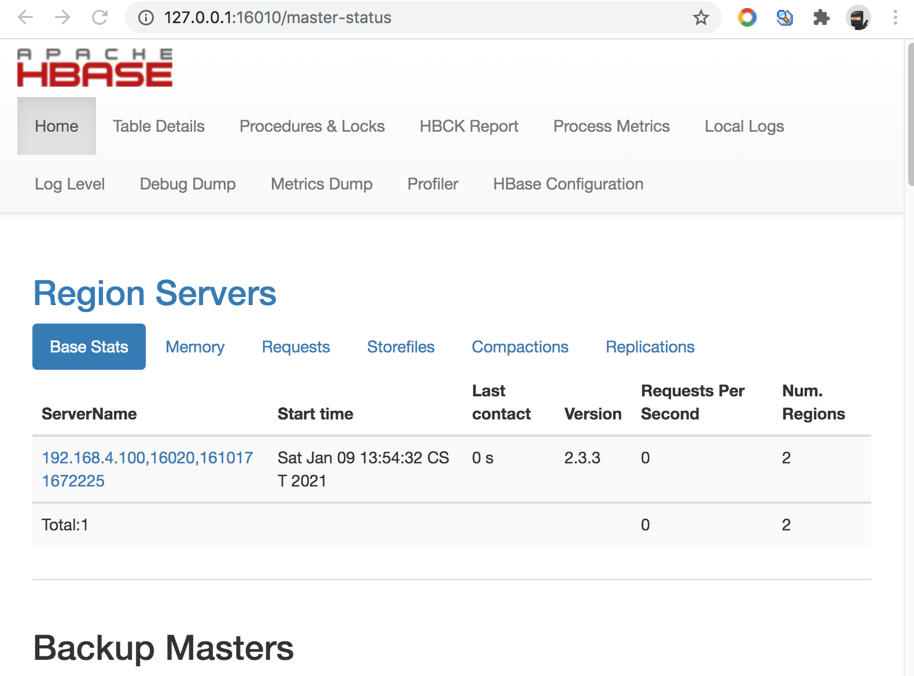
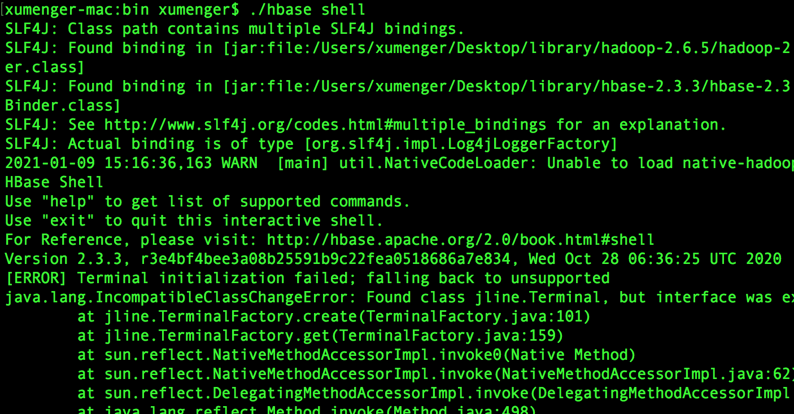
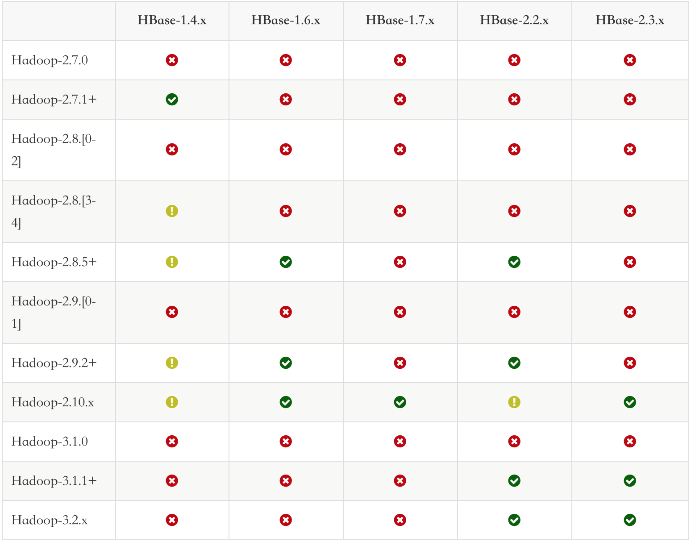
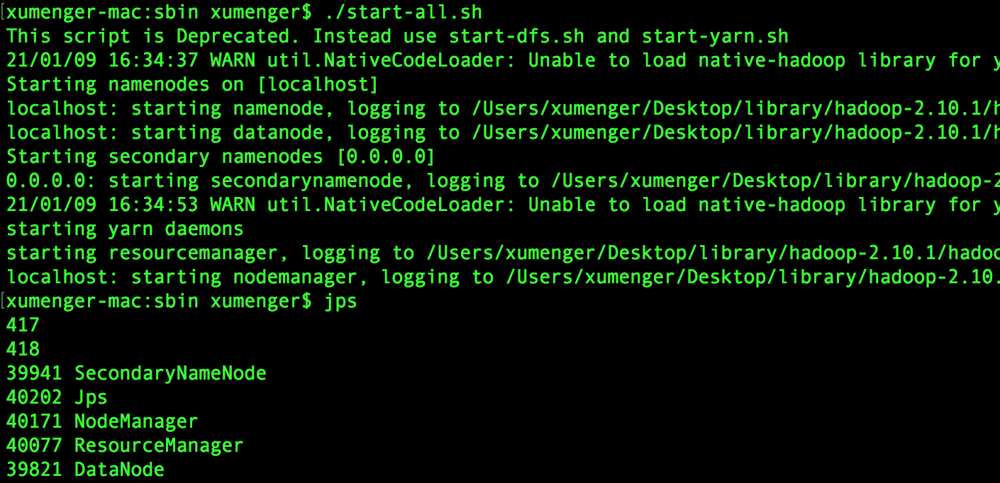

上文中搭建好HBase 的环境后，可以通过[http://127.0.0.1:16010](http://127.0.0.1:16010) 查看HBase Web Manager 页面，该页面记录了HBase 整个集群的主节点HMaster 和Region Server 的配置信息、服务状态、表信息



通过HBase Shell 访问HBase 数据库

```shell
cd /Users/xumenger/Desktop/library/hbase-2.3.3/hbase-2.3.3/bin
./hbase shell
```

但是启动的时候可能出现这样的报错



因为版本的问题导致的，当前HBase 的版本是2.3.3，Hadoop 的版本是2.6.5。/Users/xumenger/Desktop/library/hadoop-2.6.5/hadoop-2.6.5/share/hadoop/yarn/lib 下面jline-0.9.94.jar 的版本太老！

根据[http://hbase.apache.org/book.html#hadoop](http://hbase.apache.org/book.html#hadoop) 查看HBase 与Hadoop 的版本对应关系，



所以尝试安装Hadoop 2.10.x 版本。官网地址[https://hadoop.apache.org/releases.html](https://hadoop.apache.org/releases.html)，下载地址[http://mirror.bit.edu.cn/apache/hadoop/common/hadoop-2.10.1/](http://mirror.bit.edu.cn/apache/hadoop/common/hadoop-2.10.1/)

## 更新Hadoop

首先将HBase 应用，和原来的2.5.6 版本的Hadoop 应用关掉

```shell
## 关闭HBase
cd /Users/xumenger/Desktop/library/hbase-2.3.3/hbase-2.3.3/bin
./stop-hbase.sh

## 关闭Hadoop
cd /Users/xumenger/Desktop/library/hadoop-2.6.5/hadoop-2.6.5/sbin
./stop-all.sh
```

>后续的步骤都是基于本机已经安装了hadoop-2.5.6 的基础上进行的操作，单纯的安装hadoop 还请参考[http://www.xumenger.com/hadoop-20180731/](http://www.xumenger.com/hadoop-20180731/)

然后将下载的Hadoop-2.10.1 的程序解压

```shell
cd /Users/xumenger/Desktop/library/hadoop-2.10.1
tar -xzf hadoop-2.10.1.tar.gz

## 创建临时目录hadoop.tmp.dir
mkdir data/
mkdir data/tmp/

## 创建namenode、datanode 数据存储目录
mkdir data/node/
mkdir data/node/namenode/
mkdir data/node/datanode/
```

编辑/Users/xumenger/Desktop/library/hadoop-2.10.1/hadoop-2.10.1/etc/hadoop/core-site.xml，fs.default.name，否则默认是本地文件系统

```xml
<configuration>
  <property>
    <name>hadoop.tmp.dir</name>
    <value>/Users/xumenger/Desktop/library/hadoop-2.10.1/data/tmp</value>
    <description>A base for other temporary directories.</description>
  </property>
  <property>
    <name>fs.default.name</name>
    <value>hdfs://localhost:9000</value>
  </property>
</configuration>
```

编辑/Users/xumenger/Desktop/library/hadoop-2.10.1/hadoop-2.10.1/etc/hadoop/mapred-site.xml

```xml
<configuration>
<property>
  <name>mapred.job.tracker</name>
  <!-- 注意这里是对MapReduce的配置，不是HDFS，所以不要加 hdfs:// 协议约定 -->
  <value>localhost:9001</value>
</property>
</configuration>
```

编辑/Users/xumenger/Desktop/library/hadoop-2.10.1/hadoop-2.10.1/etc/hadoop/hdfs-site.xml

```xml
<configuration>
<property>
  <name>dfs.namenode.name.dir</name>
  <value>/Users/xumenger/Desktop/library/hadoop-2.10.1/data/node/namenode</value>
</property>
<property>
  <name>dfs.datanode.data.dir</name>
  <value>/Users/xumenger/Desktop/library/hadoop-2.10.1/data/node/datanode</value>
</property>
<property>
  <name>dfs.replication</name>
  <value>1</value>
</property>
</configuration>
```

接着设置环境变量，在~/.bash_profile 中添加以下环境变量配置，Hbase 使用到jline.jar 就是根据这个环境变量找到的！

```shell
export HADOOP_COMMON_LIB_NATIVE_DIR="$HADOOP_HOME/lib/native"
export HADOOP_HOME="/Users/xumenger/Desktop/library/hadoop-2.10.1/hadoop-2.10.1"
export HADOOP_OPTS="-Djava.library.path=$HADOOP_HOME/lib:$HADOOP_COMMON_LIB_NATIVE_DIR"
```

然后即可以启动Hadoop 服务

```shell
cd /Users/xumenger/Desktop/library/hadoop-2.10.1/hadoop-2.10.1/sbin
./start-all.sh
```

jps 检查Hadoop 确实已经启动程序



>相比于上文，为什么没有NameNode 节点？？？？
