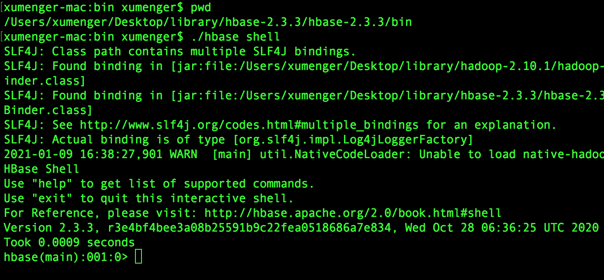
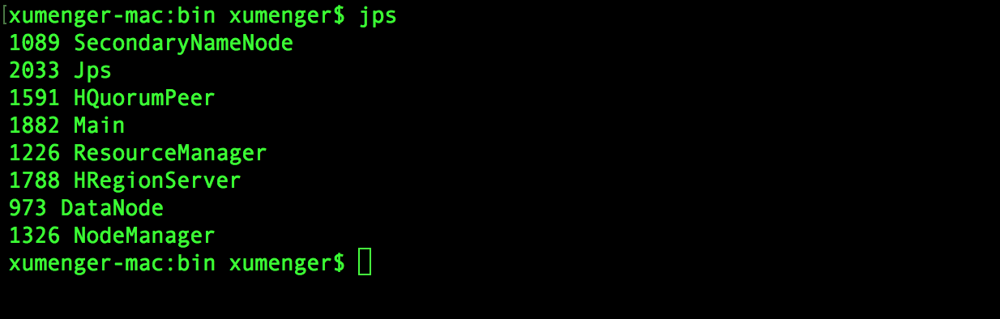
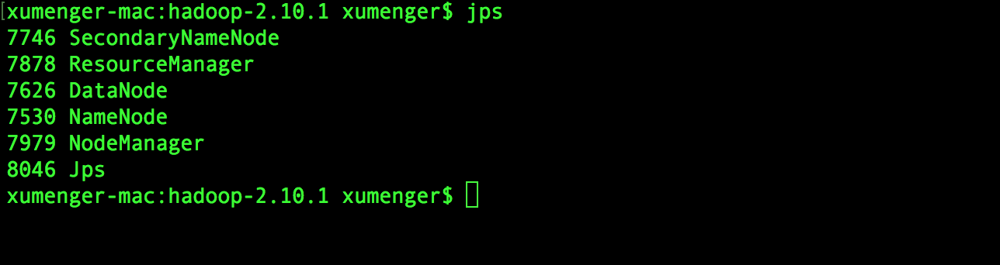
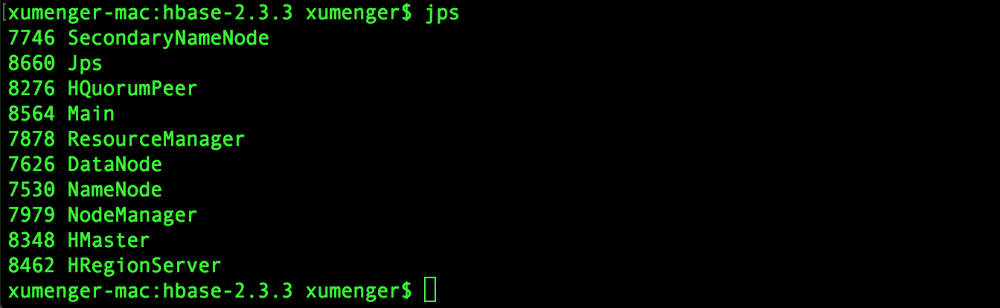
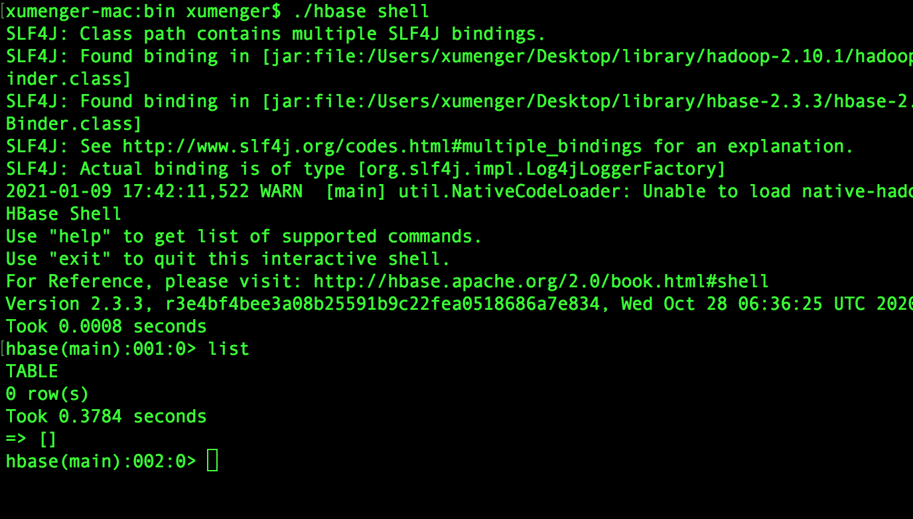
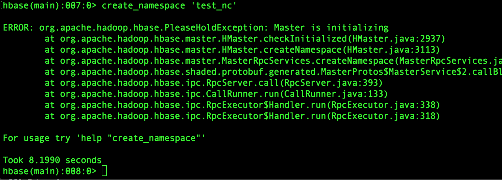
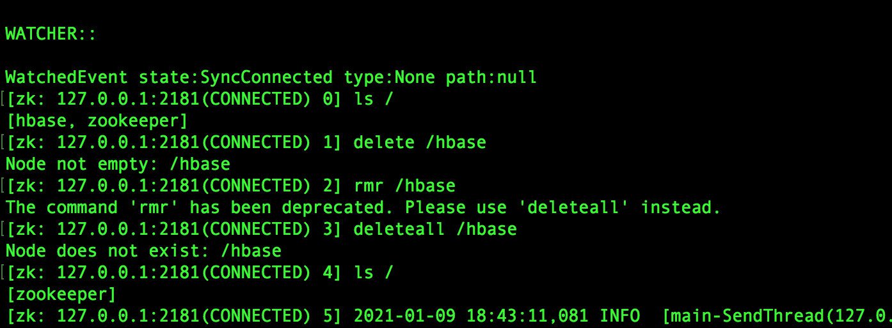

上篇解决了HBase 与Hadoop 的兼容性问题，接下来试着使用一下HBase

```shell
## 启动Hadoop
cd /Users/xumenger/Desktop/library/hadoop-2.6.5/hadoop-2.6.5/sbin
./start-all.sh

## 启动HBase
cd /Users/xumenger/Desktop/library/hbase-2.3.3/hbase-2.3.3/bin
./start-hbase.sh
```

启动hbase shell 操作HBase 数据库！

```shell
cd /Users/xumenger/Desktop/library/hbase-2.3.3/hbase-2.3.3/bin
./hbase shell
```



但是报错了，jps 命令执行查看一下当前进程，发现Hadoop 的NameNode、HBase 的HMaster 进程都不存在！！！！



>上一篇的最后，jps 也发现hadoop 启动之后，NameNode 并没有成功启动

先将Hadoop、HBase 都关掉

## 日志分析

>Hadoop、HBase 各个关键进程的日志、怎么分析日志是很重要的，本文记录下来就是为了强调这一点！

启动Hadoop，发现NameNode 还是没有成功启动，去检查一下日志：/Users/xumenger/Desktop/library/hadoop-2.10.1/hadoop-2.10.1/logs/hadoop-xumenger-namenode-xumenger-mac.local.log，发现日志的最后有报错

```
2021-01-09 17:11:02,316 INFO org.apache.hadoop.hdfs.server.common.Storage: Lock on /Users/xumenger/Desktop/library/hadoop-2.10.1/data/node/namenode/in_use.lock acquired by nodename 2984@xumenger-mac.local
2021-01-09 17:11:02,318 WARN org.apache.hadoop.hdfs.server.namenode.FSNamesystem: Encountered exception loading fsimage
java.io.IOException: NameNode is not formatted.
	at org.apache.hadoop.hdfs.server.namenode.FSImage.recoverTransitionRead(FSImage.java:249)
	at org.apache.hadoop.hdfs.server.namenode.FSNamesystem.loadFSImage(FSNamesystem.java:1073)
	at org.apache.hadoop.hdfs.server.namenode.FSNamesystem.loadFromDisk(FSNamesystem.java:695)
	at org.apache.hadoop.hdfs.server.namenode.NameNode.loadNamesystem(NameNode.java:674)
	at org.apache.hadoop.hdfs.server.namenode.NameNode.initialize(NameNode.java:736)
	at org.apache.hadoop.hdfs.server.namenode.NameNode.<init>(NameNode.java:961)
	at org.apache.hadoop.hdfs.server.namenode.NameNode.<init>(NameNode.java:940)
	at org.apache.hadoop.hdfs.server.namenode.NameNode.createNameNode(NameNode.java:1714)
	at org.apache.hadoop.hdfs.server.namenode.NameNode.main(NameNode.java:1782)
2021-01-09 17:11:02,324 INFO org.mortbay.log: Stopped HttpServer2$SelectChannelConnectorWithSafeStartup@0.0.0.0:50070
2021-01-09 17:11:02,427 INFO org.apache.hadoop.metrics2.impl.MetricsSystemImpl: Stopping NameNode metrics system...
2021-01-09 17:11:02,431 INFO org.apache.hadoop.metrics2.impl.MetricsSystemImpl: NameNode metrics system stopped.
2021-01-09 17:11:02,431 INFO org.apache.hadoop.metrics2.impl.MetricsSystemImpl: NameNode metrics system shutdown complete.
2021-01-09 17:11:02,431 ERROR org.apache.hadoop.hdfs.server.namenode.NameNode: Failed to start namenode.
java.io.IOException: NameNode is not formatted.
	at org.apache.hadoop.hdfs.server.namenode.FSImage.recoverTransitionRead(FSImage.java:249)
	at org.apache.hadoop.hdfs.server.namenode.FSNamesystem.loadFSImage(FSNamesystem.java:1073)
	at org.apache.hadoop.hdfs.server.namenode.FSNamesystem.loadFromDisk(FSNamesystem.java:695)
	at org.apache.hadoop.hdfs.server.namenode.NameNode.loadNamesystem(NameNode.java:674)
	at org.apache.hadoop.hdfs.server.namenode.NameNode.initialize(NameNode.java:736)
	at org.apache.hadoop.hdfs.server.namenode.NameNode.<init>(NameNode.java:961)
	at org.apache.hadoop.hdfs.server.namenode.NameNode.<init>(NameNode.java:940)
	at org.apache.hadoop.hdfs.server.namenode.NameNode.createNameNode(NameNode.java:1714)
	at org.apache.hadoop.hdfs.server.namenode.NameNode.main(NameNode.java:1782)
2021-01-09 17:11:02,433 INFO org.apache.hadoop.util.ExitUtil: Exiting with status 1: java.io.IOException: NameNode is not formatted.
2021-01-09 17:11:02,435 INFO org.apache.hadoop.hdfs.server.namenode.NameNode: SHUTDOWN_MSG: 
/************************************************************
SHUTDOWN_MSG: Shutting down NameNode at xumenger-mac.local/192.168.4.100
************************************************************/
```

启动HBase 后，立即jps 看到是有HMaster 进程的，但是过一会就死掉了，检查一下日志：/Users/xumenger/Desktop/library/hbase-2.3.3/hbase-2.3.3/logs/hbase-xumenger-master-xumenger-mac.local.log，发现日志最后有报错

```
2021-01-09 17:20:25,229 ERROR [main] regionserver.HRegionServer: Failed construction RegionServer
java.net.ConnectException: Call From xumenger-mac.local/192.168.4.100 to localhost:9000 failed on connection exception: java.net.ConnectException: Connection refused; For more details see:  http://wiki.apache.org/hadoop/ConnectionRefused
	at sun.reflect.NativeConstructorAccessorImpl.newInstance0(Native Method)
	at sun.reflect.NativeConstructorAccessorImpl.newInstance(NativeConstructorAccessorImpl.java:62)
	at sun.reflect.DelegatingConstructorAccessorImpl.newInstance(DelegatingConstructorAccessorImpl.java:45)
	at java.lang.reflect.Constructor.newInstance(Constructor.java:423)
	at org.apache.hadoop.net.NetUtils.wrapWithMessage(NetUtils.java:824)
	at org.apache.hadoop.net.NetUtils.wrapException(NetUtils.java:754)
	at org.apache.hadoop.ipc.Client.getRpcResponse(Client.java:1544)
	at org.apache.hadoop.ipc.Client.call(Client.java:1486)
	at org.apache.hadoop.ipc.Client.call(Client.java:1385)
	at org.apache.hadoop.ipc.ProtobufRpcEngine$Invoker.invoke(ProtobufRpcEngine.java:232)
	at org.apache.hadoop.ipc.ProtobufRpcEngine$Invoker.invoke(ProtobufRpcEngine.java:118)
	at com.sun.proxy.$Proxy19.getListing(Unknown Source)
	at org.apache.hadoop.hdfs.protocolPB.ClientNamenodeProtocolTranslatorPB.getListing(ClientNamenodeProtocolTranslatorPB.java:601)
	at sun.reflect.NativeMethodAccessorImpl.invoke0(Native Method)
	at sun.reflect.NativeMethodAccessorImpl.invoke(NativeMethodAccessorImpl.java:62)
	at sun.reflect.DelegatingMethodAccessorImpl.invoke(DelegatingMethodAccessorImpl.java:43)
	at java.lang.reflect.Method.invoke(Method.java:498)
	at org.apache.hadoop.io.retry.RetryInvocationHandler.invokeMethod(RetryInvocationHandler.java:422)
	at org.apache.hadoop.io.retry.RetryInvocationHandler$Call.invokeMethod(RetryInvocationHandler.java:165)
	at org.apache.hadoop.io.retry.RetryInvocationHandler$Call.invoke(RetryInvocationHandler.java:157)
	at org.apache.hadoop.io.retry.RetryInvocationHandler$Call.invokeOnce(RetryInvocationHandler.java:95)
	at org.apache.hadoop.io.retry.RetryInvocationHandler.invoke(RetryInvocationHandler.java:359)
	at com.sun.proxy.$Proxy20.getListing(Unknown Source)
	at sun.reflect.NativeMethodAccessorImpl.invoke0(Native Method)
	at sun.reflect.NativeMethodAccessorImpl.invoke(NativeMethodAccessorImpl.java:62)
	at sun.reflect.DelegatingMethodAccessorImpl.invoke(DelegatingMethodAccessorImpl.java:43)
	at java.lang.reflect.Method.invoke(Method.java:498)
	at org.apache.hadoop.hbase.fs.HFileSystem$1.invoke(HFileSystem.java:372)
	at com.sun.proxy.$Proxy21.getListing(Unknown Source)
	at org.apache.hadoop.hdfs.DFSClient.listPaths(DFSClient.java:1633)
	at org.apache.hadoop.hdfs.DFSClient.listPaths(DFSClient.java:1617)
	at org.apache.hadoop.hdfs.DistributedFileSystem.listStatusInternal(DistributedFileSystem.java:983)
	at org.apache.hadoop.hdfs.DistributedFileSystem.access$1000(DistributedFileSystem.java:118)
	at org.apache.hadoop.hdfs.DistributedFileSystem$24.doCall(DistributedFileSystem.java:1047)
	at org.apache.hadoop.hdfs.DistributedFileSystem$24.doCall(DistributedFileSystem.java:1044)
	at org.apache.hadoop.fs.FileSystemLinkResolver.resolve(FileSystemLinkResolver.java:81)
	at org.apache.hadoop.hdfs.DistributedFileSystem.listStatus(DistributedFileSystem.java:1044)
	at org.apache.hadoop.fs.FilterFileSystem.listStatus(FilterFileSystem.java:258)
	at org.apache.hadoop.fs.FileSystem.listStatus(FileSystem.java:1804)
	at org.apache.hadoop.fs.FileSystem.listStatus(FileSystem.java:1849)
	at org.apache.hadoop.hbase.util.CommonFSUtils.listStatus(CommonFSUtils.java:616)
	at org.apache.hadoop.hbase.util.FSTableDescriptors.getCurrentTableInfoStatus(FSTableDescriptors.java:387)
	at org.apache.hadoop.hbase.util.FSTableDescriptors.getTableInfoPath(FSTableDescriptors.java:368)
	at org.apache.hadoop.hbase.util.FSTableDescriptors.getTableDescriptorFromFs(FSTableDescriptors.java:505)
	at org.apache.hadoop.hbase.util.FSTableDescriptors.getTableDescriptorFromFs(FSTableDescriptors.java:495)
	at org.apache.hadoop.hbase.util.FSTableDescriptors.tryUpdateMetaTableDescriptor(FSTableDescriptors.java:131)
	at org.apache.hadoop.hbase.regionserver.HRegionServer.initializeFileSystem(HRegionServer.java:738)
	at org.apache.hadoop.hbase.regionserver.HRegionServer.<init>(HRegionServer.java:635)
	at org.apache.hadoop.hbase.master.HMaster.<init>(HMaster.java:523)
	at sun.reflect.NativeConstructorAccessorImpl.newInstance0(Native Method)
	at sun.reflect.NativeConstructorAccessorImpl.newInstance(NativeConstructorAccessorImpl.java:62)
	at sun.reflect.DelegatingConstructorAccessorImpl.newInstance(DelegatingConstructorAccessorImpl.java:45)
	at java.lang.reflect.Constructor.newInstance(Constructor.java:423)
	at org.apache.hadoop.hbase.master.HMaster.constructMaster(HMaster.java:3053)
	at org.apache.hadoop.hbase.master.HMasterCommandLine.startMaster(HMasterCommandLine.java:236)
	at org.apache.hadoop.hbase.master.HMasterCommandLine.run(HMasterCommandLine.java:140)
	at org.apache.hadoop.util.ToolRunner.run(ToolRunner.java:76)
	at org.apache.hadoop.hbase.util.ServerCommandLine.doMain(ServerCommandLine.java:149)
	at org.apache.hadoop.hbase.master.HMaster.main(HMaster.java:3071)
Caused by: java.net.ConnectException: Connection refused
	at sun.nio.ch.SocketChannelImpl.checkConnect(Native Method)
	at sun.nio.ch.SocketChannelImpl.finishConnect(SocketChannelImpl.java:717)
	at org.apache.hadoop.net.SocketIOWithTimeout.connect(SocketIOWithTimeout.java:206)
	at org.apache.hadoop.net.NetUtils.connect(NetUtils.java:531)
	at org.apache.hadoop.ipc.Client$Connection.setupConnection(Client.java:701)
	at org.apache.hadoop.ipc.Client$Connection.setupIOstreams(Client.java:805)
	at org.apache.hadoop.ipc.Client$Connection.access$3700(Client.java:423)
	at org.apache.hadoop.ipc.Client.getConnection(Client.java:1601)
	at org.apache.hadoop.ipc.Client.call(Client.java:1432)
	... 51 more
2021-01-09 17:20:25,231 ERROR [main] master.HMasterCommandLine: Master exiting
java.lang.RuntimeException: Failed construction of Master: class org.apache.hadoop.hbase.master.HMaster. 
	at org.apache.hadoop.hbase.master.HMaster.constructMaster(HMaster.java:3060)
	at org.apache.hadoop.hbase.master.HMasterCommandLine.startMaster(HMasterCommandLine.java:236)
	at org.apache.hadoop.hbase.master.HMasterCommandLine.run(HMasterCommandLine.java:140)
	at org.apache.hadoop.util.ToolRunner.run(ToolRunner.java:76)
	at org.apache.hadoop.hbase.util.ServerCommandLine.doMain(ServerCommandLine.java:149)
	at org.apache.hadoop.hbase.master.HMaster.main(HMaster.java:3071)
Caused by: java.net.ConnectException: Call From xumenger-mac.local/192.168.4.100 to localhost:9000 failed on connection exception: java.net.ConnectException: Connection refused; For more details see:  http://wiki.apache.org/hadoop/ConnectionRefused
	at sun.reflect.NativeConstructorAccessorImpl.newInstance0(Native Method)
	at sun.reflect.NativeConstructorAccessorImpl.newInstance(NativeConstructorAccessorImpl.java:62)
	at sun.reflect.DelegatingConstructorAccessorImpl.newInstance(DelegatingConstructorAccessorImpl.java:45)
	at java.lang.reflect.Constructor.newInstance(Constructor.java:423)
	at org.apache.hadoop.net.NetUtils.wrapWithMessage(NetUtils.java:824)
	at org.apache.hadoop.net.NetUtils.wrapException(NetUtils.java:754)
	at org.apache.hadoop.ipc.Client.getRpcResponse(Client.java:1544)
	at org.apache.hadoop.ipc.Client.call(Client.java:1486)
	at org.apache.hadoop.ipc.Client.call(Client.java:1385)
	at org.apache.hadoop.ipc.ProtobufRpcEngine$Invoker.invoke(ProtobufRpcEngine.java:232)
	at org.apache.hadoop.ipc.ProtobufRpcEngine$Invoker.invoke(ProtobufRpcEngine.java:118)
	at com.sun.proxy.$Proxy19.getListing(Unknown Source)
	at org.apache.hadoop.hdfs.protocolPB.ClientNamenodeProtocolTranslatorPB.getListing(ClientNamenodeProtocolTranslatorPB.java:601)
	at sun.reflect.NativeMethodAccessorImpl.invoke0(Native Method)
	at sun.reflect.NativeMethodAccessorImpl.invoke(NativeMethodAccessorImpl.java:62)
	at sun.reflect.DelegatingMethodAccessorImpl.invoke(DelegatingMethodAccessorImpl.java:43)
	at java.lang.reflect.Method.invoke(Method.java:498)
	at org.apache.hadoop.io.retry.RetryInvocationHandler.invokeMethod(RetryInvocationHandler.java:422)
	at org.apache.hadoop.io.retry.RetryInvocationHandler$Call.invokeMethod(RetryInvocationHandler.java:165)
	at org.apache.hadoop.io.retry.RetryInvocationHandler$Call.invoke(RetryInvocationHandler.java:157)
	at org.apache.hadoop.io.retry.RetryInvocationHandler$Call.invokeOnce(RetryInvocationHandler.java:95)
	at org.apache.hadoop.io.retry.RetryInvocationHandler.invoke(RetryInvocationHandler.java:359)
	at com.sun.proxy.$Proxy20.getListing(Unknown Source)
	at sun.reflect.NativeMethodAccessorImpl.invoke0(Native Method)
	at sun.reflect.NativeMethodAccessorImpl.invoke(NativeMethodAccessorImpl.java:62)
	at sun.reflect.DelegatingMethodAccessorImpl.invoke(DelegatingMethodAccessorImpl.java:43)
	at java.lang.reflect.Method.invoke(Method.java:498)
	at org.apache.hadoop.hbase.fs.HFileSystem$1.invoke(HFileSystem.java:372)
	at com.sun.proxy.$Proxy21.getListing(Unknown Source)
	at org.apache.hadoop.hdfs.DFSClient.listPaths(DFSClient.java:1633)
	at org.apache.hadoop.hdfs.DFSClient.listPaths(DFSClient.java:1617)
	at org.apache.hadoop.hdfs.DistributedFileSystem.listStatusInternal(DistributedFileSystem.java:983)
	at org.apache.hadoop.hdfs.DistributedFileSystem.access$1000(DistributedFileSystem.java:118)
	at org.apache.hadoop.hdfs.DistributedFileSystem$24.doCall(DistributedFileSystem.java:1047)
	at org.apache.hadoop.hdfs.DistributedFileSystem$24.doCall(DistributedFileSystem.java:1044)
	at org.apache.hadoop.fs.FileSystemLinkResolver.resolve(FileSystemLinkResolver.java:81)
	at org.apache.hadoop.hdfs.DistributedFileSystem.listStatus(DistributedFileSystem.java:1044)
	at org.apache.hadoop.fs.FilterFileSystem.listStatus(FilterFileSystem.java:258)
	at org.apache.hadoop.fs.FileSystem.listStatus(FileSystem.java:1804)
	at org.apache.hadoop.fs.FileSystem.listStatus(FileSystem.java:1849)
	at org.apache.hadoop.hbase.util.CommonFSUtils.listStatus(CommonFSUtils.java:616)
	at org.apache.hadoop.hbase.util.FSTableDescriptors.getCurrentTableInfoStatus(FSTableDescriptors.java:387)
	at org.apache.hadoop.hbase.util.FSTableDescriptors.getTableInfoPath(FSTableDescriptors.java:368)
	at org.apache.hadoop.hbase.util.FSTableDescriptors.getTableDescriptorFromFs(FSTableDescriptors.java:505)
	at org.apache.hadoop.hbase.util.FSTableDescriptors.getTableDescriptorFromFs(FSTableDescriptors.java:495)
	at org.apache.hadoop.hbase.util.FSTableDescriptors.tryUpdateMetaTableDescriptor(FSTableDescriptors.java:131)
	at org.apache.hadoop.hbase.regionserver.HRegionServer.initializeFileSystem(HRegionServer.java:738)
	at org.apache.hadoop.hbase.regionserver.HRegionServer.<init>(HRegionServer.java:635)
	at org.apache.hadoop.hbase.master.HMaster.<init>(HMaster.java:523)
	at sun.reflect.NativeConstructorAccessorImpl.newInstance0(Native Method)
	at sun.reflect.NativeConstructorAccessorImpl.newInstance(NativeConstructorAccessorImpl.java:62)
	at sun.reflect.DelegatingConstructorAccessorImpl.newInstance(DelegatingConstructorAccessorImpl.java:45)
	at java.lang.reflect.Constructor.newInstance(Constructor.java:423)
	at org.apache.hadoop.hbase.master.HMaster.constructMaster(HMaster.java:3053)
	... 5 more
Caused by: java.net.ConnectException: Connection refused
	at sun.nio.ch.SocketChannelImpl.checkConnect(Native Method)
	at sun.nio.ch.SocketChannelImpl.finishConnect(SocketChannelImpl.java:717)
	at org.apache.hadoop.net.SocketIOWithTimeout.connect(SocketIOWithTimeout.java:206)
	at org.apache.hadoop.net.NetUtils.connect(NetUtils.java:531)
	at org.apache.hadoop.ipc.Client$Connection.setupConnection(Client.java:701)
	at org.apache.hadoop.ipc.Client$Connection.setupIOstreams(Client.java:805)
	at org.apache.hadoop.ipc.Client$Connection.access$3700(Client.java:423)
	at org.apache.hadoop.ipc.Client.getConnection(Client.java:1601)
	at org.apache.hadoop.ipc.Client.call(Client.java:1432)
	... 51 more
```

OK，不出意外，就是这两个原因导致的！！

## NameNode 错误排查

很简单，将在/Users/xumenger/Desktop/library/hadoop-2.10.1/data/node 下面创建的namenode、datanode 目录删除，然后初始化namenode，提示是否重新初始化namenode，输入Y 即可

```shell
./bin/hadoop namenode -format
```

然后即可启动成功NameNode



## HMaster 错误排查

Hadoop 的问题解决了，并且重启成功，再重启HBase 看一下

果然重新启动后，HMaster 进程正常了



## HBase Shell

重新执行hbase shell，输入list 查看HBase 的表，可能第一次还是报错，可以试着再重启一下HBase，然后发现现在正常了



## 创建命名空间报错

在hbase shell 中创建命名空间可能遇到这个报错



首先把时间同步，执行如下命令

```shell
sudo ntpdate 1.cn.pool.ntp.org
```

./hbase zkcli 连接上HBase 内置的Zookeeper，然后删除/hbase 节点



kill -9 的方式将HBase 的所有进程杀掉！然后重启HBase 服务即可！
