经过以上几篇文章中的操作，版本兼容问题、启动失败问题都已经解决了，接下来真正进入正题，HBase 毕竟作为一个NoSQL 存储系统，所以存储数据以及检索数据是其核心功能，本文就简单梳理一下HBase 增删改查数据的操作及简单分析背后原理

## HDFS 验证

最开始在没有创建任何数据表的情况下，通过HDFS 的命令检查/hbase 下的文件，详细的命令参见下面的截图

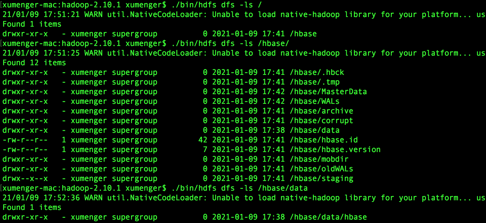

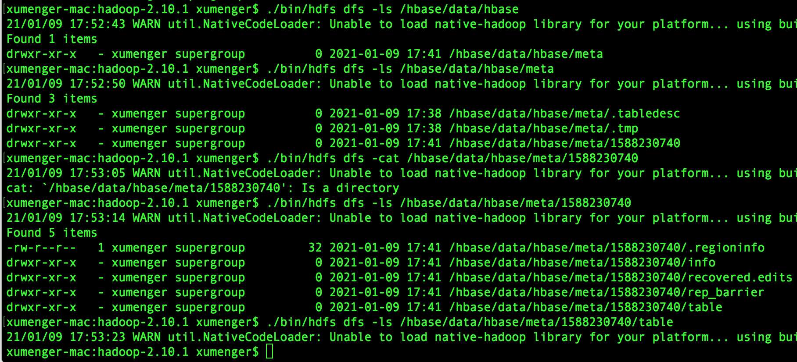

在上文中看到对hdfs-site.xml 进行了如此的配置

```xml
<configuration>
<property>
  <name>dfs.namenode.name.dir</name>
  <value>/Users/xumenger/Desktop/library/hadoop-2.10.1/data/node/namenode</value>
</property>
<property>
  <name>dfs.datanode.data.dir</name>
  <value>/Users/xumenger/Desktop/library/hadoop-2.10.1/data/node/datanode</value>
</property>
<property>
  <name>dfs.replication</name>
  <value>1</value>
</property>
</configuration>
```

所以在操作系统层面HDFS 是将文件的元信息、数据信息存储在这两个文件中的

/Users/xumenger/Desktop/library/hadoop-2.10.1/data/node/namenode

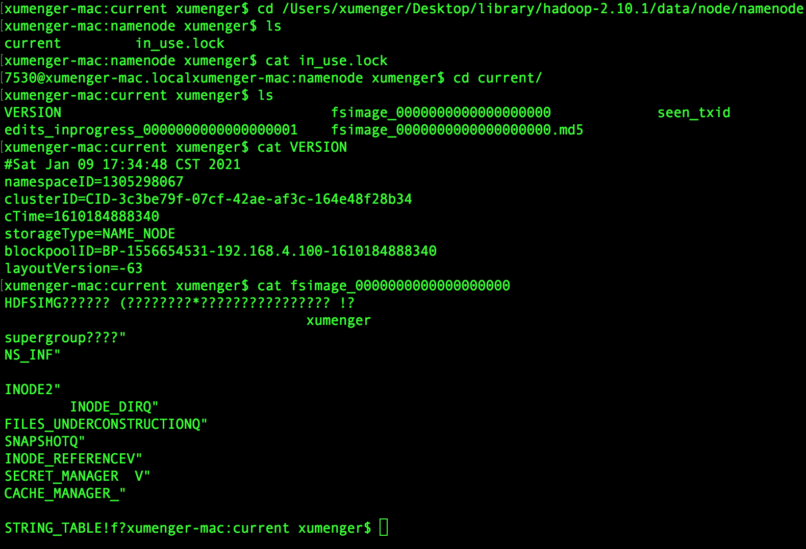

/Users/xumenger/Desktop/library/hadoop-2.10.1/data/node/datanode

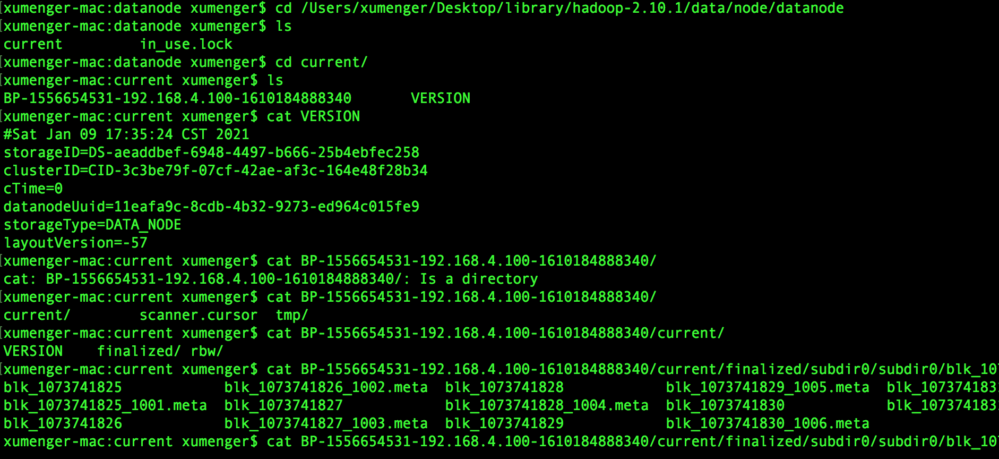

>关于HDFS 的底层文件存储的原理有必要专门开一讲！！！！！

## HBase Shell 增删改查

>[https://hbase.apache.org/book.html](https://hbase.apache.org/book.html)

创建一个数据表，user 表，有两个列族：common_info、ext_info

```sql
-- 创建命名空间
create_namespace 'test_ns'

-- 在指定命名空间创建表
-- create '表名', '列族1', '列族2', ...

create 'test_ns:user', 'common_info', 'ext_info'
```

往表中写入数据

```sql
-- put '表明', '键值', '列族: 列名', '值'

put 'test_ns:user', 'id001', 'common_info:name', 'xumenger'
put 'test_ns:user', 'id001', 'common_info:age', '25'
put 'test_ns:user', 'id001', 'common_info:addr', 'xuzhou'
```

更新表中的数据

```sql
-- 与写入数据的方式一致，将年龄从上面的25，更新为这里的18

put 'test_ns:user', 'id001', 'common_info:age', '18'
```

删除表中的数据

```sql
-- delete '表名', '键值', '列族:列名', '时间戳(非必要)'
-- 因为上面对于common_info:age put 了两次，所以这次删除只是删掉最新的put，第一次的put 没有删除
-- 这也引申出HBase 中记录的时间戳的概念
-- delete 也可以指定删除哪个时间戳

delete 'test_ns:user', 'id001', 'common_info:age'
```

查看表中的数据库

```sql
-- get '表名', '键值'
get 'test_ns:user', 'id001'

-- 读取指定列
-- get '表名', '键值', {COLUMN=>'列族:列名'}
get 'test_ns:user', 'id001', {COLUMN=>'common_info:name'}
-- 或者
get 'test_ns:user', 'id001', 'common_info:name'
```

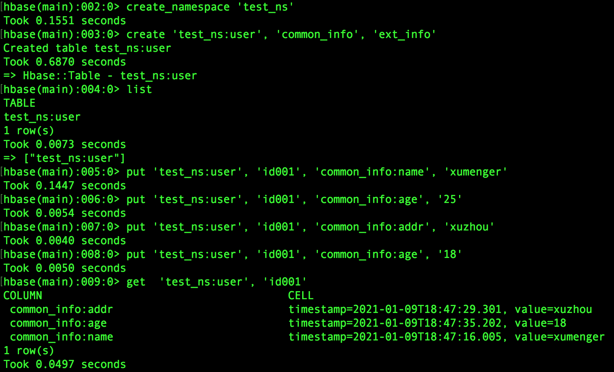

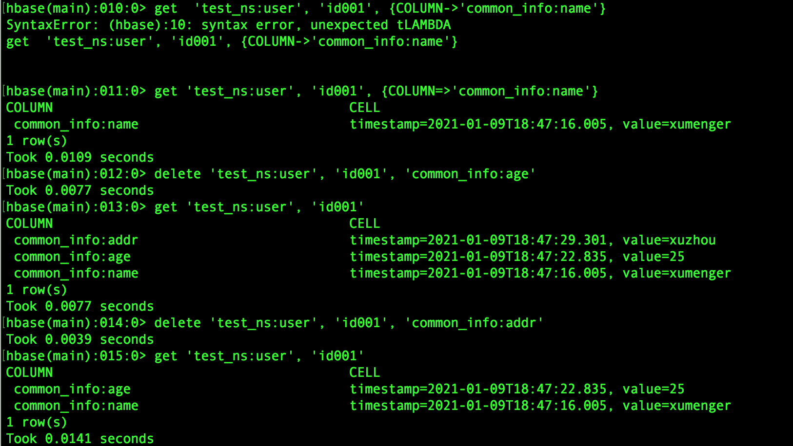

## HBase Shell 扫描表

```sql
-- scan '表名'
scan 'test_ns:user'

-- 指定要查询哪些列族或列，示例中查询列族common_info 中的的name 列、age 列,只写common_info:name 则查询common_info:name 列族中所有列
scan 'test_ns:user',{COLUMNS => ['common_info:name', 'common_info:age']}
```

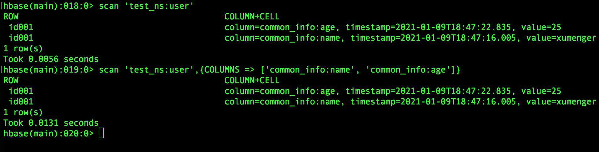

准备测试数据

```sql
put 'test_ns:user', 'id002', 'common_info:name', 'joker'
put 'test_ns:user', 'id002', 'common_info:age', '25'
put 'test_ns:user', 'id002', 'common_info:addr', 'hangzhou'

put 'test_ns:user', 'id003', 'common_info:name', 'zhangsan'
put 'test_ns:user', 'id003', 'common_info:age', '25'
put 'test_ns:user', 'id003', 'common_info:addr', 'shanghai'

put 'test_ns:user', 'id004', 'common_info:name', 'lisi'
put 'test_ns:user', 'id004', 'common_info:age', '20'

put 'test_ns:user', 'id005', 'common_info:name', 'wangwu'
put 'test_ns:user', 'id005', 'common_info:age', '30'
put 'test_ns:user', 'id005', 'common_info:addr', 'beijing'
put 'test_ns:user', 'id005', 'common_info:sex', 'male'
```

继续看scan 命令

```sql
-- 按照rowkey的范围查找数据
scan 'test_ns:user', {STARTROW=>'id002',STOPROW=>'id004'}
```

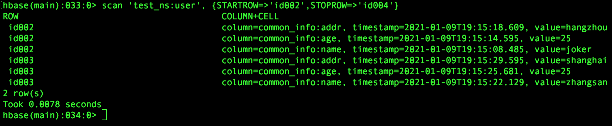

```sql
-- 查询以指定开头的rowkey数据
scan 'test_ns:user', {ROWPREFIXFILTER => 'id'}
```

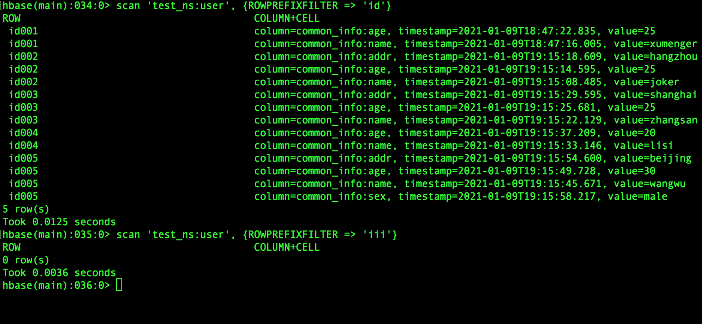

更多scan 命令不再在这里一一展示了，详情请在hbase shell 中执行`help 'scan'` 查看

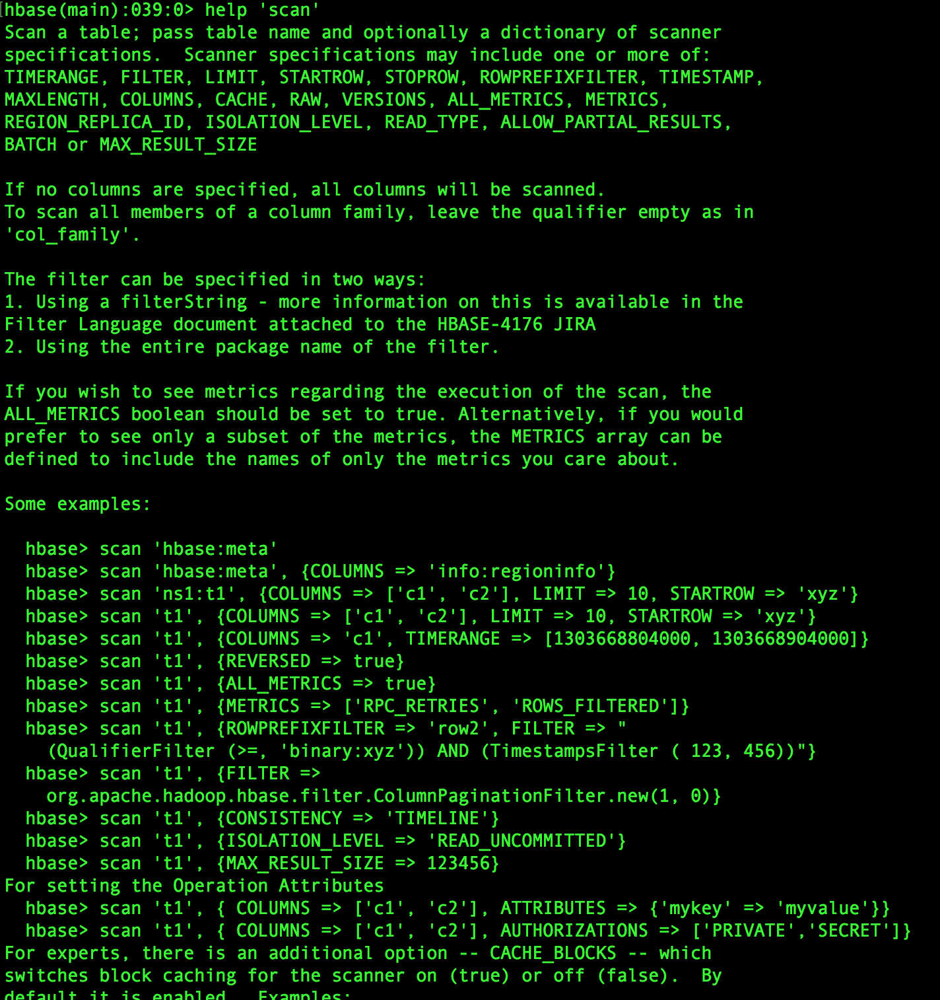

>官方文档永远值得反复看！

## 再看HDFS 的内容

现在HBase 创建了一张表，并且表中存储了一些数据，现在看一下HDFS 中是怎么存储的！

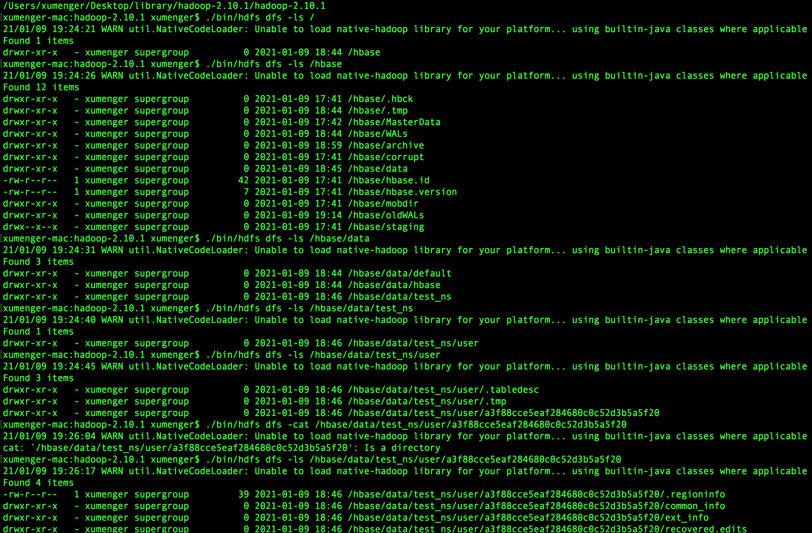

./bin/hdfs dfs -cat /hbase/data/test_ns/user/.tabledesc/.tableinfo.0000000001 可以查看表的信息

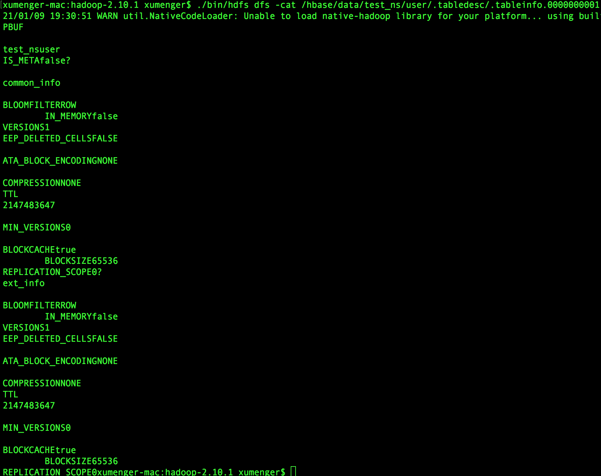

现在如果查询可能查不到数据，因为插入数据后，不会立即生成数据文件，而是保存在内存（MemStore）中，当执行stop-hbase.sh 关闭HBase 后会将数据刷新到文件中

关闭HBase 后，再去HDFS 中查看

./bin/hdfs dfs -cat /hbase/data/test_ns/user/a3f88cce5eaf284680c0c52d3b5a5f20/common_info/a455fa1d2ad04f09950a0f91de19ef31

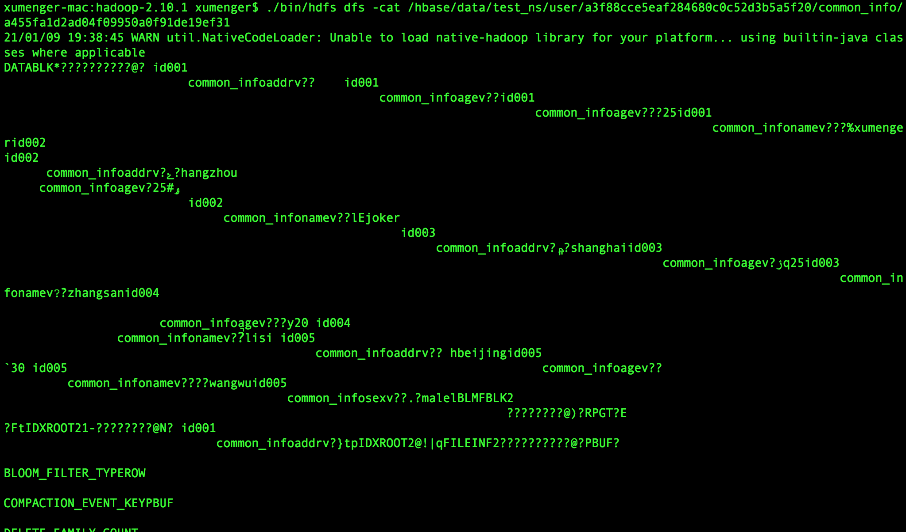

>这里是说明在HDFS 上的存储，而HDFS 本身是一个分布式文件系统，关于HDFS 的更底层文件存储的原理有必要专门开一讲！！！！！
