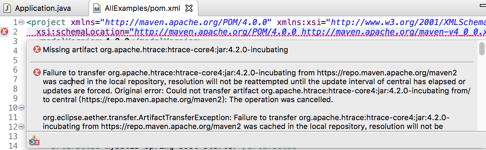
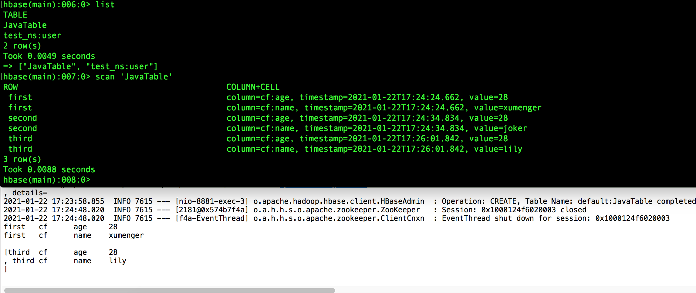
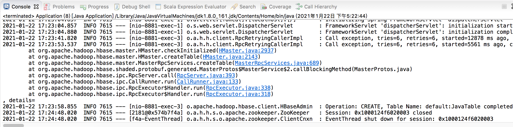

以上在机器上搭建了HDFS、HBase 的伪分布式环境，作为和MySQL、Redis 等一样的存储系统，在研究它的原理之前，还是先弄清楚怎么使用，本文研究如何基于Spring 开发程序读写HBase

>本文主要基于[https://hbase.apache.org/book.html](https://hbase.apache.org/book.html)。这个文档包括HBase 介绍、HBase 配置、hbase shell 使用、Java API 使用等说明

>[https://hbase.apache.org/book.html#hbase_apis](https://hbase.apache.org/book.html#hbase_apis)

>[https://hbase.apache.org/book.html#_using_the_java_api_all_hbase_versions](https://hbase.apache.org/book.html#_using_the_java_api_all_hbase_versions)

## 添加Maven 依赖

```xml
<dependency>
  <groupId>org.apache.hbase</groupId>
  <artifactId>hbase-shaded-client</artifactId>
  <version>2.0.0</version>
</dependency>
```

但是在下载完依赖后出现这样的错误信息



查看是哪个包的问题，例如：我的问题是org.apache.htrace:htrace-core4:jar:4.2.0-incubating 包出了问题。则找到：/Users/xumenger/.m2/repository/org/apache/htrace/htrace-core4 删除这个包

回到Eclipse右键项目选择 Maven -> Update Project

原理：Maven包出错，删了就好

依然还是报错，愚蠢，直接在pom.xml 中添加htrace-core4:jar:4.2.0-incubating 的依赖就可以了！！！

```xml
<dependency>
  <groupId>org.apache.hbase</groupId>
  <artifactId>hbase-shaded-client</artifactId>
  <version>2.0.0</version>
</dependency>
<dependency>
  <groupId>org.apache.htrace</groupId>
  <artifactId>htrace-core4</artifactId>
  <version>4.2.0-incubating</version>
</dependency>
```

如果某个jar 包下的class 文件打开报错Invalid LOC header (bad signature)，也可以在本地的Maven 仓库中先将其删除再Maven -> Update Project 试一下

## 程序逻辑实现

application.yml 配置文件中添加HBase 的ZooKeeper 集群地址

```yml
# hbase zookeeper 配置
# 2.x.y 还是配置zookeeper 的地址；3.0.0 开始客户端改成配置hbase.masters
hbase:
  conf:
    confMaps:
      'hbase.zookeeper.quorum' : 'localhost:2181'
```

新增HBaseConfig 配置类

```java
package com.xum.demo12.hbase;

import org.springframework.boot.context.properties.ConfigurationProperties;
import org.springframework.context.annotation.Configuration;
 
import java.util.Map;

@Configuration
@ConfigurationProperties(prefix = HBaseConfig.CONF_PREFIX)
public class HBaseConfig
{
    public static final String CONF_PREFIX = "hbase.conf";
    private Map<String, String> confMaps;

    public Map<String, String> getConfMaps() {
        return confMaps;
    }
    public void setConfMaps(Map<String, String> confMaps) {
        this.confMaps = confMaps;
    }
}
```

新增ApplicationContextAware 的实现用于获取Spring 容器中的Bean

```java
package com.xum.demo12.hbase;

import org.springframework.beans.BeansException;
import org.springframework.context.ApplicationContext;
import org.springframework.context.ApplicationContextAware;
import org.springframework.stereotype.Component;

@Component
public class SpringContextHolder implements ApplicationContextAware 
{ 
    private static ApplicationContext applicationContext;
 
    public void setApplicationContext(ApplicationContext applicationContext) throws BeansException {
        SpringContextHolder.applicationContext = applicationContext;
    }
 
    public static ApplicationContext getApplicationContext() {
        assertApplicationContext();
        return applicationContext;
    }
 
    @SuppressWarnings("unchecked")
    public static <T> T getBean(String beanName) {
        assertApplicationContext();
        return (T) applicationContext.getBean(beanName);
    }
 
    public static <T> T getBean(Class<T> requiredType) {
        assertApplicationContext();
        return applicationContext.getBean(requiredType);
    }
 
    private static void assertApplicationContext() {
        if (SpringContextHolder.applicationContext == null) {
            throw new RuntimeException("applicaitonContext属性为null,请检查是否注入了SpringContextHolder!");
        }
    }
}
```

新增HBaseUtils 工具类

```java
package com.xum.demo12.hbase;

import java.io.IOException;
import java.util.ArrayList;
import java.util.List;
import java.util.Map;
import java.util.NavigableMap;
import java.util.concurrent.ExecutorService;
import java.util.concurrent.Executors;

import org.apache.hadoop.conf.Configuration;
import org.apache.hadoop.hbase.Cell;
import org.apache.hadoop.hbase.HBaseConfiguration;
import org.apache.hadoop.hbase.HColumnDescriptor;
import org.apache.hadoop.hbase.HTableDescriptor;
import org.apache.hadoop.hbase.TableName;
import org.apache.hadoop.hbase.client.Admin;
import org.apache.hadoop.hbase.client.Connection;
import org.apache.hadoop.hbase.client.ConnectionFactory;
import org.apache.hadoop.hbase.client.Delete;
import org.apache.hadoop.hbase.client.Get;
import org.apache.hadoop.hbase.client.Put;
import org.apache.hadoop.hbase.client.Result;
import org.apache.hadoop.hbase.client.ResultScanner;
import org.apache.hadoop.hbase.client.Scan;
import org.apache.hadoop.hbase.client.Table;
import org.apache.hadoop.hbase.filter.CompareFilter;
import org.apache.hadoop.hbase.filter.RowFilter;
import org.apache.hadoop.hbase.filter.SubstringComparator;
import org.apache.hadoop.hbase.util.Bytes;
import org.springframework.context.annotation.DependsOn;
import org.springframework.stereotype.Component;

@SuppressWarnings("deprecation")
@DependsOn("springContextHolder")//控制依赖顺序，保证springContextHolder类在之前已经加载
@Component
public class HBaseUtils 
{
    // 手动获取HBaseConfig 配置对象
    private static HBaseConfig hBaseConf = SpringContextHolder.getBean("HBaseConfig");
    
    private static Configuration conf = HBaseConfiguration.create();
    private static ExecutorService pool = Executors.newScheduledThreadPool(20);
    private static Connection connection = null;
    private static Admin admin = null;
    
    private HBaseUtils() {
        if (connection == null) {
            try {
                // 将HBase 配置类中定义的配置加载到连接池中每个连接中
                Map<String, String> confMap = hBaseConf.getConfMaps();
                for (Map.Entry<String,String> confEntry : confMap.entrySet()) {
                    conf.set(confEntry.getKey(), confEntry.getValue());
                }
                connection = ConnectionFactory.createConnection(conf, pool);
                admin = connection.getAdmin();
            } catch (IOException e) {
                e.printStackTrace();
            }
        }
    }
    
    // 创建表
    public void createOrDeleteTable(String tableName, String[] columnFamily) throws IOException {
        TableName name = TableName.valueOf(tableName);
        // 如果存在则删除
        if (admin.tableExists(name)) {
            admin.disableTable(name);
            admin.deleteTable(name);
        } else {
            HTableDescriptor desc = new HTableDescriptor(name);
            for (String cf: columnFamily) {
                desc.addFamily(new HColumnDescriptor(cf));
            }
            admin.createTable(desc);
        }
    }
    
    // 插入记录
    public void insertRecords(String tableName, String row, String columnFamilys, String[] columns, String[] values) throws IOException {
        TableName name = TableName.valueOf(tableName);
        Table table = connection.getTable(name);
        Put put = new Put(Bytes.toBytes(row));
        for (int i=0; i<columns.length; i++) {
            put.addColumn(Bytes.toBytes(columnFamilys), Bytes.toBytes(columns[i]), Bytes.toBytes(values[i]));
            table.put(put);
        }
    }
    
    // 删除一条记录
    public void deleteRow(String tableName, String rowkey) throws IOException {
        TableName name = TableName.valueOf(tableName);
        Table table = connection.getTable(name);
        Delete d = new Delete(rowkey.getBytes());
        table.delete(d);
    }
    
    // 删除单行单列族记录
    public void deleteColumnFamily(String tablename, String rowkey, String columnFamily) throws IOException {
        TableName name = TableName.valueOf(tablename);
        Table table = connection.getTable(name);
        Delete d = new Delete(rowkey.getBytes()).addFamily(Bytes.toBytes(columnFamily));
        table.delete(d);
    }
    
    // 删除但行单列族单列记录
    public void deleteColumn(String tablename, String rowkey, String columnFamily, String column) throws IOException {
        TableName name = TableName.valueOf(tablename);
        Table table = connection.getTable(name);
        Delete d = new Delete(rowkey.getBytes()).addColumn(Bytes.toBytes(columnFamily), Bytes.toBytes(column));
        table.delete(d);
    }
    
    // 查找一条记录
    public String selectRow(String tableName, String rowkey) throws IOException {
        String records = "";
        TableName name = TableName.valueOf(tableName);
        Table table = connection.getTable(name);
        Get get = new Get(rowkey.getBytes());
        Result rs = table.get(get);
        
        @SuppressWarnings("unused")
        NavigableMap<byte[], NavigableMap<byte[], NavigableMap<Long, byte[]>>> map = rs.getMap();
        
        for (Cell cell : rs.rawCells()) {
            StringBuffer stringBuffer = new StringBuffer()
                    .append(Bytes.toString(cell.getRowArray(), cell.getRowOffset(), cell.getRowLength())).append("\t")
                    .append(Bytes.toString(cell.getFamilyArray(), cell.getFamilyOffset(), cell.getFamilyLength())).append("\t")
                    .append(Bytes.toString(cell.getQualifierArray(), cell.getQualifierOffset(), cell.getQualifierLength())).append("\t")
                    .append(Bytes.toString(cell.getValueArray(), cell.getValueOffset(), cell.getValueLength())).append("\n");
            String str = stringBuffer.toString();
            records += str;
        }
        
        return records;
    }
    
    // 查找单行单列族单列记录
    public String selectValue(String tableName, String rowKey, String columnFamily, String column) throws IOException {
        TableName name = TableName.valueOf(tableName);
        Table table = connection.getTable(name);
        Get get = new Get(rowKey.getBytes());
        get.addColumn(Bytes.toBytes(columnFamily), Bytes.toBytes(column));
        Result rs = table.get(get);
        return Bytes.toString(rs.value());
    }
    
    // 查询表中所有行
    public String scanAllRecord(String tableName) throws IOException {
        String records = "";
        TableName name = TableName.valueOf(tableName);
        Table table = connection.getTable(name);
        Scan scan = new Scan();
        ResultScanner scanner = table.getScanner(scan);
        try {
            for (Result result : scanner) {
                for (Cell cell : result.rawCells()) {
                    StringBuffer stringBuffer = new StringBuffer()
                            .append(Bytes.toString(cell.getRowArray(), cell.getRowOffset(), cell.getRowLength())).append("\t")
                            .append(Bytes.toString(cell.getFamilyArray(), cell.getFamilyOffset(), cell.getFamilyLength())).append("\t")
                            .append(Bytes.toString(cell.getQualifierArray(), cell.getQualifierOffset(), cell.getQualifierLength())).append("\t")
                            .append(Bytes.toString(cell.getValueArray(), cell.getValueOffset(), cell.getValueLength())).append("\n");
                    String str = stringBuffer.toString();
                    records += str; 
                }
            }
        } finally {
            if (scanner != null) {
                scanner.close();
            }
        }
 
        return records;
    }
    
    // 根据rowkey 关键字查询报告记录
    public List<String> scanReportDataByRowKeyword(String tableName, String rowKeyword) throws IOException {
        ArrayList<String> list = new ArrayList<String>();
        
        Table table = connection.getTable(TableName.valueOf(tableName));
        Scan scan = new Scan();
        
        // 添加行键过滤器，根据关键字匹配
        RowFilter rowFilter = new RowFilter(CompareFilter.CompareOp.EQUAL, new SubstringComparator(rowKeyword));
        scan.setFilter(rowFilter);
        
        ResultScanner scanner = table.getScanner(scan);
        try {
            for (Result result : scanner) {
                for (Cell cell : result.rawCells()) {
                    StringBuffer stringBuffer = new StringBuffer()
                            .append(Bytes.toString(cell.getRowArray(), cell.getRowOffset(), cell.getRowLength())).append("\t")
                            .append(Bytes.toString(cell.getFamilyArray(), cell.getFamilyOffset(), cell.getFamilyLength())).append("\t")
                            .append(Bytes.toString(cell.getQualifierArray(), cell.getQualifierOffset(), cell.getQualifierLength())).append("\t")
                            .append(Bytes.toString(cell.getValueArray(), cell.getValueOffset(), cell.getValueLength())).append("\n");
                    String str = stringBuffer.toString();
                    
                    list.add(str);
                }
            }
        } finally {
            if (scanner != null) {
                scanner.close();
            }
        }

        return list;
    }
    
    // 根据rowkey关键字和时间戳范围查询报告记录
    public List<String> scanReportDataByRowKeywordTimestamp(String tableName, String rowKeyword, Long minStamp, Long maxStamp) throws IOException {
        ArrayList<String> list = new ArrayList<String>();
         
        Table table = connection.getTable(TableName.valueOf(tableName));
        Scan scan = new Scan();
        //添加scan的时间范围
        scan.setTimeRange(minStamp, maxStamp);
        
        RowFilter rowFilter = new RowFilter(CompareFilter.CompareOp.EQUAL, new SubstringComparator(rowKeyword));
        scan.setFilter(rowFilter);

        ResultScanner scanner = table.getScanner(scan);
        try {
            for (Result result : scanner) {
                for (Cell cell : result.rawCells()) {
                    StringBuffer stringBuffer = new StringBuffer()
                            .append(Bytes.toString(cell.getRowArray(), cell.getRowOffset(), cell.getRowLength())).append("\t")
                            .append(Bytes.toString(cell.getFamilyArray(), cell.getFamilyOffset(), cell.getFamilyLength())).append("\t")
                            .append(Bytes.toString(cell.getQualifierArray(), cell.getQualifierOffset(), cell.getQualifierLength())).append("\t")
                            .append(Bytes.toString(cell.getValueArray(), cell.getValueOffset(), cell.getValueLength())).append("\n");
                    String str = stringBuffer.toString();
                    
                    list.add(str);
                }
            }
        } finally {
            if (scanner != null) {
                scanner.close();
            }
        }

        return list;
    }
}

```

对应添加一个Controller 用于测试

```java
package com.xum.demo12.hbase;

import java.io.IOException;

import org.springframework.beans.factory.annotation.Autowired;
import org.springframework.stereotype.Controller;
import org.springframework.web.bind.annotation.RequestMapping;

@Controller
public class TestController {

    @Autowired
    private HBaseUtils hBaseUtils;
    
    @RequestMapping(value = "/test")
    public String test() {
        try {
            // 创建表
            hBaseUtils.createOrDeleteTable("JavaTable", new String[] {"cf"});
            
            // 新增记录
            hBaseUtils.insertRecords("JavaTable", "first", "cf", new String[] {"name",  "age"}, new String[] {"xumenger", "28"} );
            hBaseUtils.insertRecords("JavaTable", "second", "cf", new String[] {"name",  "age"}, new String[] {"joker", "28"} );
            hBaseUtils.insertRecords("JavaTable", "third", "cf", new String[] {"name",  "age"}, new String[] {"lily", "28"} );
            
            // 查询记录
            System.out.println(hBaseUtils.selectRow("JavaTable", "first"));
            
            // 根据rowkey 关键字查询报告记录
            System.out.println(hBaseUtils.scanReportDataByRowKeyword("JavaTable", "third"));
            
            return hBaseUtils.selectRow("JavaTable", "first");
        } catch (IOException e) {
            e.printStackTrace();
            
            return e.getMessage();
        }
    }
}
```

SpringBoot 程序启动后，在浏览器上访问[http://localhost:8881/test/](http://localhost:8881/test/)

可以看到Spring 的运行效果，以及顺便查看一下Hbase 中对应的数据



本文只是从操作层面展示了一下HBase Java API 的用法，关于HBase 客户端、服务端更深层次的原理会在后续根据实际应用进行补充！！！

比如运行的过程中出现了这么一个报错是为什么？



```
Parsed mapper file: 'file [/Users/xumenger/Desktop/code/Eclipse/AllExamples/target/classes/demo11/TestTableMapper.xml]'
2021-01-22 17:22:50.011  INFO 7615 --- [           main] o.s.j.e.a.AnnotationMBeanExporter        : Registering beans for JMX exposure on startup
2021-01-22 17:22:50.074  INFO 7615 --- [           main] s.b.c.e.t.TomcatEmbeddedServletContainer : Tomcat started on port(s): 8881 (http)
2021-01-22 17:22:50.081  INFO 7615 --- [           main] com.xum.demo12.hbase.Application         : Started Application in 4.671 seconds (JVM running for 5.406)
2021-01-22 17:23:04.857  INFO 7615 --- [nio-8881-exec-1] o.a.c.c.C.[Tomcat].[localhost].[/]       : Initializing Spring FrameworkServlet 'dispatcherServlet'
2021-01-22 17:23:04.857  INFO 7615 --- [nio-8881-exec-1] o.s.web.servlet.DispatcherServlet        : FrameworkServlet 'dispatcherServlet': initialization started
2021-01-22 17:23:04.880  INFO 7615 --- [nio-8881-exec-1] o.s.web.servlet.DispatcherServlet        : FrameworkServlet 'dispatcherServlet': initialization completed in 23 ms
2021-01-22 17:23:41.820  INFO 7615 --- [nio-8881-exec-3] o.a.h.h.client.RpcRetryingCallerImpl     : Call exception, tries=6, retries=6, started=12878 ms ago, cancelled=false, msg=Call to /192.168.4.100:16020 failed on connection exception: org.apache.hbase.thirdparty.io.netty.channel.AbstractChannel$AnnotatedConnectException: Connection refused: /192.168.4.100:16020, details=row 'JavaTable' on table 'hbase:meta' at region=hbase:meta,,1.1588230740, hostname=192.168.4.100,16020,1611161378454, seqNum=-1
2021-01-22 17:23:53.537  INFO 7615 --- [nio-8881-exec-3] o.a.h.h.client.RpcRetryingCallerImpl     : Call exception, tries=6, retries=6, started=5561 ms ago, cancelled=false, msg=org.apache.hadoop.hbase.PleaseHoldException: Master is initializing
    at org.apache.hadoop.hbase.master.HMaster.checkInitialized(HMaster.java:2937)
    at org.apache.hadoop.hbase.master.HMaster.createTable(HMaster.java:2143)
    at org.apache.hadoop.hbase.master.MasterRpcServices.createTable(MasterRpcServices.java:689)
    at org.apache.hadoop.hbase.shaded.protobuf.generated.MasterProtos$MasterService$2.callBlockingMethod(MasterProtos.java)
    at org.apache.hadoop.hbase.ipc.RpcServer.call(RpcServer.java:393)
    at org.apache.hadoop.hbase.ipc.CallRunner.run(CallRunner.java:133)
    at org.apache.hadoop.hbase.ipc.RpcExecutor$Handler.run(RpcExecutor.java:338)
    at org.apache.hadoop.hbase.ipc.RpcExecutor$Handler.run(RpcExecutor.java:318)
, details=
2021-01-22 17:23:58.855  INFO 7615 --- [nio-8881-exec-3] o.apache.hadoop.hbase.client.HBaseAdmin  : Operation: CREATE, Table Name: default:JavaTable completed
2021-01-22 17:24:48.020  INFO 7615 --- [2181@0x574b7f4a] o.a.h.h.s.o.apache.zookeeper.ZooKeeper   : Session: 0x1000124f6020003 closed
2021-01-22 17:24:48.020  INFO 7615 --- [f4a-EventThread] o.a.h.h.s.o.apache.zookeeper.ClientCnxn  : EventThread shut down for session: 0x1000124f6020003
first   cf  age 28
first   cf  name    xumenger

[third  cf  age 28
, third cf  name    lily
]
```

## 参考资料

* [springBoot连接hbase，用java操作hbase，实现增删改查功能](https://blog.csdn.net/alan_liuyue/article/details/90268216)
* [https://hbase.apache.org/book.html](https://hbase.apache.org/book.html)
* [https://hbase.apache.org/book.html#hbase_apis](https://hbase.apache.org/book.html#hbase_apis)
* [https://hbase.apache.org/book.html#_using_the_java_api_all_hbase_versions](https://hbase.apache.org/book.html#_using_the_java_api_all_hbase_versions)
