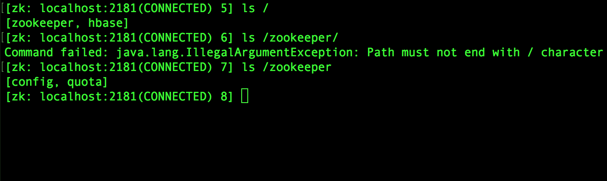
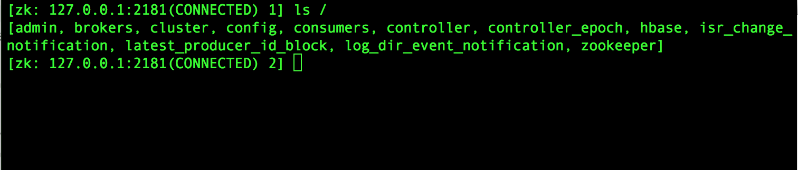
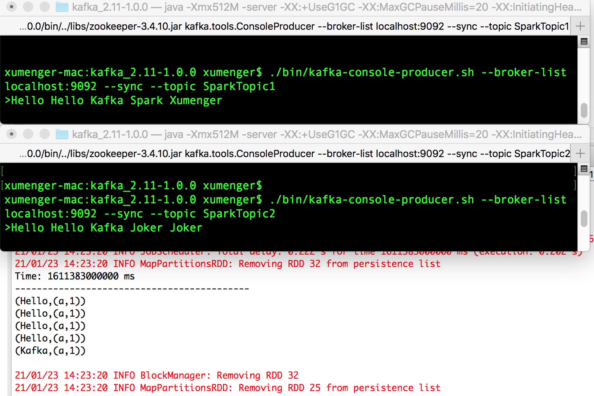
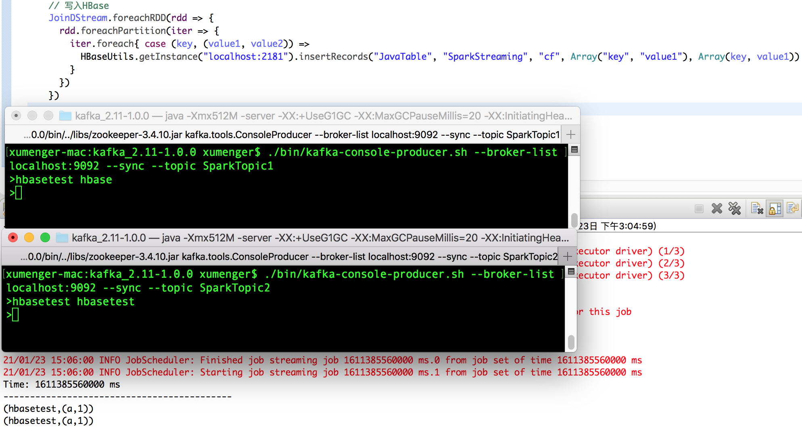
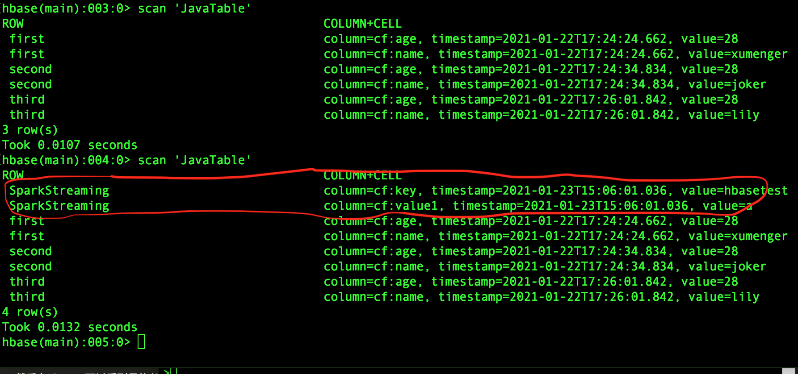

在[《Spark 计算框架：Spark Streaming》](http://www.xumenger.com/spark-3-streaming-20201126/) 中尝试对于Spark Streaming 进行总结，但是因为当时纯粹是学习笔记，所以当时没有系统的梳理出来，所以计划在后续在具体的场景需求中使用并总结Spark Streaming

本文就是这样的一个情况，计划实现这样的一个功能

* 有两个Kafka 集群，分别有一个Topic，都是相同的数据
* 但是因为生产者的原因，可能一个Topic 中的消息缺少关键字段、另一个Topic 则有这个关键字段
* 现在的业务系统选择其中一个集群的Topic 来消费处理消息，但是可能对于缺少关键字段的消息只能丢弃
* 现在希望开发一个Spark Streaming 应用，对接两个集群的Topic，发现缺少关键字段的消息就去另外一个Topic 中尝试获取对应的消息补上
* 将原来缺少关键字段的消息补上后，按照一定格式存储到HBase 中，供业务应用使用

## Kafka 作为流数据源

ReceiverAPI 需要一个专门的Executor 去接接收数据，然后发送给其他的Executor 做计算。存在的问题是接收数据的Executor 和计算的Executor 速度回有所不同，特别是在接收数据的Executor 的速度大于计算Executor 速度的情况下，会导致计算数据的节点内存溢出。早期的版本中提供此方法，当前版本不适用（所以本文不会展示）

DirectAPI 是由计算的Executor 来主动消费Kafka 的数据，速度由自身控制！

**Kafka 0-8 Receiver 模式（当前版本不适用）**


>参考[https://www.cnblogs.com/LHWorldBlog/p/8516648.html](https://www.cnblogs.com/LHWorldBlog/p/8516648.html)

```xml
<dependency>
  <groupId>org.apache.spark</groupId>
  <artifactId>spark-streaming-kafka-0-8_2.11</artifactId>
  <version>2.4.5</version>
</dependency>
```

```scala
//1.创建 SparkConf
val sparkConf: SparkConf = new SparkConf().setAppName("ReceiverWordCount").setMaster("local[*]")

//2.创建 StreamingContext
val ssc = new StreamingContext(sparkConf, Seconds(3))

//3.读取 Kafka 数据创建 DStream(基于 Receive 方式)
val kafkaDStream: ReceiverInputDStream[(String, String)] = 
    KafkaUtils.createStream(ssc, "zookeeper1:2181,zookeeper2:2181,zookeeper3:2181", "MyTopic", Map[String, Int]("MyTopic" -> 1))
```

**Kafka 0-8 Direct 模式（当前版本不适用）**


没有Receiver，无需额外的Core 用于不停地接收数据，而是定期查询Kafka 中的每个Partition 的最新的Offset，每个批次拉取上次处理的Offset 和当前查询的Offset 的范围的数据进行处理

为了不丢数据，无需将数据备份落地，而只需要手动保存Offset 即可；内部使用Kafka Simple Level API 去消费数据, 需要手动维护Offset，Kafka Zookeeper上不会自动更新Offset

```xml
<dependency>
  <groupId>org.apache.spark</groupId>
  <artifactId>spark-streaming-kafka-0-8_2.11</artifactId>
  <version>2.4.5</version>
</dependency>
```

```scala
//1.创建 SparkConf
val sparkConf: SparkConf = new SparkConf().setAppName("ReceiverWordCount").setMaster("local[*]")

//2.创建 StreamingContext
val ssc = new StreamingContext(sparkConf, Seconds(3))

//设置 CheckPoint
ssc.checkpoint("./ck2")

//3.定义 Kafka 参数
val kafkaPara: Map[String, String] = Map[String, String](
  ConsumerConfig.BOOTSTRAP_SERVERS_CONFIG -> "kafka1:9092,kafka2:9092,kafka3:9092", 
  ConsumerConfig.GROUP_ID_CONFIG -> "MyTopic")

//4.读取 Kafka 数据
val kafkaDStream: InputDStream[(String, String)] = 
    KafkaUtils.createDirectStream[String, String, StringDecoder, StringDecoder](ssc, kafkaPara, Set("MyTopic"))
```

## 准备测试环境

参考[搭建Kafka运行环境](http://www.xumenger.com/kafka-zookeeper-20181117/)

因为之前搭建过HBase 环境，HBase 内置的Zookeeper 将2181 这个端口占用了，所以修改这个Zookeeper 的端口为2189

```shell
vim /Users/xumenger/Desktop/library/zookeeper/zookeeper-3.4.12/conf/zoo.cfg

# the port at which the clients will connect
clientPort=2189
```

但是因为HBase 内置的Zookeeper 已经启动了，所以这里无法启动，那么将端口改回2081，接下来Kafka 就还是和HBase 共用一个ZooKeeper 吧（目录结构分析下来没有冲突！）！

然后使用下面任意两个命令可以连接到Zookeeper，查看Zookeeper 服务端的数据信息

```shell
# 使用Zookeeper 自己的客户端
cd /Users/xumenger/Desktop/library/zookeeper/zookeeper-3.4.12/bin
./zkCli.sh


# 使用HBase 的Zookeeper 客户端
cd /Users/xumenger/Desktop/library/hbase-2.3.3/hbase-2.3.3/bin
./hbase zkcli
```



在上面的文章中是通过ScalaIDE 中源码调试的方式将Kafka Server 启动起来的，下面我使用Kafka 可执行程序的脚本启动Kafka 服务

```shell
cd /Users/xumenger/Desktop/library/kafka/kafka_2.11-1.0.0/
./bin/kafka-server-start.sh ./config/server.properties
```

再去查看Zookeeper 中的节点，发现多了很多Kafka 相关的信息！



为了测试，接下来创建两个Topic

```shell
cd /Users/xumenger/Desktop/library/kafka/kafka_2.11-1.0.0/
./bin/kafka-topics.sh --create --zookeeper localhost:2181 --replication-factor 1 --partitions 1 --topic SparkTopic1
./bin/kafka-topics.sh --create --zookeeper localhost:2181 --replication-factor 1 --partitions 1 --topic SparkTopic2
```

## Kafka 0-10 Direct 模式

以上展示的两种方式在当前版本中不适用，所以接下来对接Kafka 基于Kafka 0-10 Direct 模式

>更详细的参考：[http://spark.apache.org/docs/latest/streaming-programming-guide.html](http://spark.apache.org/docs/latest/streaming-programming-guide.html)

```xml
<dependency>
  <groupId>org.apache.spark</groupId>
  <artifactId>spark-streaming_2.12</artifactId>
  <version>3.0.0</version>
</dependency>
<dependency>
  <groupId>org.apache.spark</groupId>
  <artifactId>spark-streaming-kafka-0-10_2.12</artifactId>
  <version>3.0.0</version>
</dependency>
```

接下来针对以上的Topic 编写Spark Streaming 应用程序

```scala
package com.xum.demo01.SparkKafka

import org.apache.kafka.clients.consumer.ConsumerConfig
import org.apache.kafka.clients.consumer.ConsumerRecord
import org.apache.spark.SparkConf
import org.apache.spark.streaming.Seconds
import org.apache.spark.streaming.StreamingContext
import org.apache.spark.streaming.dstream.DStream
import org.apache.spark.streaming.dstream.InputDStream
import org.apache.spark.streaming.kafka010.ConsumerStrategies
import org.apache.spark.streaming.kafka010.KafkaUtils
import org.apache.spark.streaming.kafka010.LocationStrategies

object Application {
  def main(args: Array[String]): Unit = {
    //1.创建 SparkConf
    val sparkConf: SparkConf = new SparkConf().setAppName("StreamingExample").setMaster("local[*]")

    //2.创建 StreamingContext
    val ssc = new StreamingContext(sparkConf, Seconds(10))

    //3.定义 Kafka 参数
    val kafkaPara: Map[String, Object] = Map[String, Object](
      ConsumerConfig.BOOTSTRAP_SERVERS_CONFIG -> "localhost:9092", 
      ConsumerConfig.GROUP_ID_CONFIG -> "GroupExample",
      "key.deserializer" -> "org.apache.kafka.common.serialization.StringDeserializer",
      "value.deserializer" -> "org.apache.kafka.common.serialization.StringDeserializer"
    )

    //4.1.读取 Kafka SparkTopic1 数据创建 DStream
    val SparkTopic1KafkaDStream: InputDStream[ConsumerRecord[String, String]] = KafkaUtils.createDirectStream[String, String](ssc, LocationStrategies.PreferConsistent, ConsumerStrategies.Subscribe[String, String](Set("SparkTopic1"), kafkaPara))

    //4.2.读取 Kafka SparkTopic2 数据创建 DStream
    val SparkTopic2KafkaDStream: InputDStream[ConsumerRecord[String, String]] = KafkaUtils.createDirectStream[String, String](ssc, LocationStrategies.PreferConsistent, ConsumerStrategies.Subscribe[String, String](Set("SparkTopic2"), kafkaPara))

    // 5.将每条消息的 Value 取出
    val Topic1ValueDStream: DStream[String] = SparkTopic1KafkaDStream.map(record => record.value())
    val Topic2ValueDStream: DStream[String] = SparkTopic2KafkaDStream.map(record => record.value())
    
    // 6. 转换成KV
    val KV1ToADStream: DStream[(String, String)] = Topic1ValueDStream.flatMap(_.split(" ")).map((_, "a"))
    val KV2ToADStream: DStream[(String, Int)] = Topic2ValueDStream.flatMap(_.split(" ")).map((_, 1))

    // 两个流之间的 join 需要两个流的批次大小一致，这样才能做到同时触发计算。计算过程就是
    // 对当前批次的两个流中各自的 RDD 进行 join，与两个 RDD 的 join 效果相同
    val JoinDStream: DStream[(String, (String, Int))] = KV1ToADStream.join(KV2ToADStream)
    JoinDStream.print()

    //7.开启任务
    ssc.start()
    ssc.awaitTermination()
  }
}
```

启动程序，然后分别为两个Topic 生产测试数据

```shell
cd /Users/xumenger/Desktop/library/kafka/kafka_2.11-1.0.0/

./bin/kafka-console-producer.sh --broker-list localhost:9092 --sync --topic SparkTopic1
./bin/kafka-console-producer.sh --broker-list localhost:9092 --sync --topic SparkTopic2
```

运行效果如下！



>Spark Streaming 中关于窗口等的概念，这里没有进行演示，作为后续的测试内容

## Spark 对接HBase

>[https://hbase.apache.org/book.html#_example_scala_code](https://hbase.apache.org/book.html#_example_scala_code)

>[https://hbase.apache.org/book.html#_basic_spark](https://hbase.apache.org/book.html#_basic_spark)

>[https://hbase.apache.org/book.html#_spark_streaming](https://hbase.apache.org/book.html#_spark_streaming)

>[https://hbase.apache.org/book.html#_sparksqldataframes](https://hbase.apache.org/book.html#_sparksqldataframes)

添加依赖

```xml
<dependency>
  <groupId>org.apache.hbase</groupId>
  <artifactId>hbase-shaded-client</artifactId>
  <version>2.0.0</version>
</dependency>
<dependency>
  <groupId>org.apache.htrace</groupId>
  <artifactId>htrace-core4</artifactId>
  <version>4.2.0-incubating</version>
</dependency>
```

编写HBase 读写工具类，使用Java 类实现。更详细的内容参考[HBase 应用：Spring 应用读写HBase](http://www.xumenger.com/spring-hbase-20210112/)

```java
package com.xum.demo01.SparkKafka;

import java.io.IOException;
import java.util.concurrent.ExecutorService;
import java.util.concurrent.Executors;

import org.apache.hadoop.conf.Configuration;
import org.apache.hadoop.hbase.HBaseConfiguration;
import org.apache.hadoop.hbase.TableName;
import org.apache.hadoop.hbase.client.Connection;
import org.apache.hadoop.hbase.client.ConnectionFactory;
import org.apache.hadoop.hbase.client.Put;
import org.apache.hadoop.hbase.client.Table;
import org.apache.hadoop.hbase.util.Bytes;

public class HBaseUtils {
  
    private static HBaseUtils instance;
    private Connection connection;
  
    public static HBaseUtils getInstance(String zookeeper) throws IOException {
        if (instance == null) {
            instance = new HBaseUtils(zookeeper);
        }
    
        return instance;
    }
  
    private HBaseUtils(String zookeeper) throws IOException
    {
        ExecutorService pool = Executors.newScheduledThreadPool(10);
        Configuration conf = HBaseConfiguration.create();
        conf.set("hbase.zookeeper.quorum", zookeeper);
        this.connection = ConnectionFactory.createConnection(conf, pool);
    }
  
    //插入记录
    public void insertRecords(String tableName, String row, String columnFamilys, String[] columns, String[] values) throws IOException {
        TableName name = TableName.valueOf(tableName);
        Table table = connection.getTable(name);
        Put put = new Put(Bytes.toBytes(row));
        for (int i=0; i<columns.length; i++) {
            put.addColumn(Bytes.toBytes(columnFamilys), Bytes.toBytes(columns[i]), Bytes.toBytes(values[i]));
            table.put(put);
        }
    }
}
```

在上面的流处理程序中，对于JoinDStream 的结果写入HBase（Scala 程序可以调用Java API）

```scala
    ...


    // 两个流之间的 join 需要两个流的批次大小一致，这样才能做到同时触发计算。计算过程就是
    // 对当前批次的两个流中各自的 RDD 进行 join，与两个 RDD 的 join 效果相同
    val JoinDStream: DStream[(String, (String, Int))] = KV1ToADStream.join(KV2ToADStream)
    JoinDStream.print()
    
    // 写入HBase
    JoinDStream.foreachRDD(rdd => {
      rdd.foreachPartition(iter => {
        iter.foreach{ case (key, (value1, value2)) =>
          // 写入JavaTable 表，SparkStreaming 作为rowkey，添加对应的值信息！！
          // 这里仅仅是测试，所以rowKey 等值都是写死的！
          HBaseUtils.getInstance("localhost:2181").insertRecords("JavaTable", "SparkStreaming", "cf", Array("key", "value1"), Array(key, value1)) 
        }
      })
    })

    ...
```

运行后，分别往两个Topic 中写入如下数据



然后在Hbase 可以看到最终确实插入了对应的数据！



以上对于Spark Streaming、HBase 的相关用法进行了梳理，具体项目中可以参考。当然这里依然忽略掉很多内容，比如Spark Streaming 的性能、HBase 的读写性能、Spark Streaming 的窗口的概念等等！

## 参考资料

* [Spark Streaming的优化之路——从Receiver到Direct模式](https://my.oschina.net/u/1782938/blog/3062690)
* [http://spark.apache.org/docs/latest/streaming-programming-guide.html](http://spark.apache.org/docs/latest/streaming-programming-guide.html)
* [https://hbase.apache.org/book.html#_example_scala_code](https://hbase.apache.org/book.html#_example_scala_code)
* [https://hbase.apache.org/book.html#_basic_spark](https://hbase.apache.org/book.html#_basic_spark)
* [https://hbase.apache.org/book.html#_spark_streaming](https://hbase.apache.org/book.html#_spark_streaming)
* [https://hbase.apache.org/book.html#_sparksqldataframes](https://hbase.apache.org/book.html#_sparksqldataframes)
