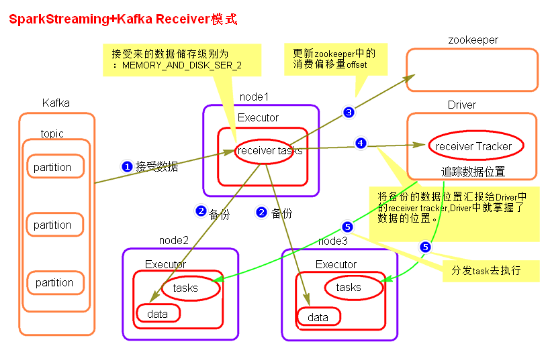
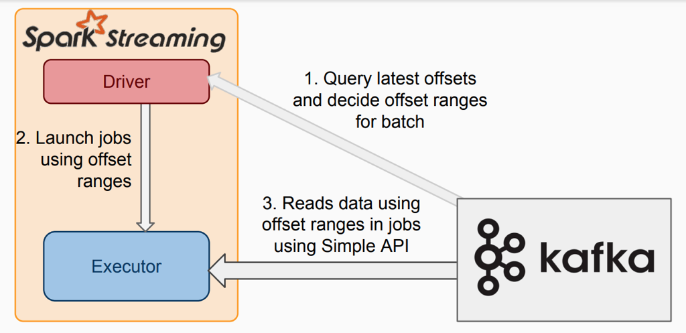

在[《Spark 计算框架：Spark Streaming》](http://www.xumenger.com/spark-3-streaming-20201126/) 中尝试对于Spark Streaming 进行总结，但是因为当时纯粹是学习笔记，所以当时没有系统的梳理出来，所以计划在后续在具体的场景需求中使用并总结Spark Streaming

本文就是这样的一个情况，计划实现这样的一个功能

* 有两个Kafka 集群，分别有一个Topic，都是相同的数据
* 但是因为生产者的原因，可能一个Topic 中的消息缺少关键字段、另一个Topic 则有这个关键字段
* 现在的业务系统选择其中一个集群的Topic 来消费处理消息，但是可能对于缺少关键字段的消息只能丢弃
* 现在希望开发一个Spark Streaming 应用，对接两个集群的Topic，发现缺少关键字段的消息就去另外一个Topic 中尝试获取对应的消息补上
* 将原来缺少关键字段的消息补上后，按照一定格式存储到HBase 中，供业务应用使用

## Kafka 作为流数据源

ReceiverAPI 需要一个专门的Executor 去接接收数据，然后发送给其他的Executor 做计算。存在的问题是接收数据的Executor 和计算的Executor 速度回有所不同，特别是在接收数据的Executor 的速度大于计算Executor 速度的情况下，会导致计算数据的节点内存溢出。早期的版本中提供此方法，当前版本不适用（所以本文不会展示）

DirectAPI 是由计算的Executor 来主动消费Kafka 的数据，速度由自身控制！

**Kafka 0-8 Receiver 模式（当前版本不适用）**



>参考[https://www.cnblogs.com/LHWorldBlog/p/8516648.html](https://www.cnblogs.com/LHWorldBlog/p/8516648.html)

```xml
<dependency>
  <groupId>org.apache.spark</groupId>
  <artifactId>spark-streaming-kafka-0-8_2.11</artifactId>
  <version>2.4.5</version>
</dependency>
```

```scala
//1.创建 SparkConf
val sparkConf: SparkConf = new SparkConf().setAppName("ReceiverWordCount").setMaster("local[*]")

//2.创建 StreamingContext
val ssc = new StreamingContext(sparkConf, Seconds(3))

//3.读取 Kafka 数据创建 DStream(基于 Receive 方式)
val kafkaDStream: ReceiverInputDStream[(String, String)] = 
    KafkaUtils.createStream(ssc, "zookeeper1:2181,zookeepe2:2181,zookeepe3:2181", "MyTopic", Map[String, Int]("MyTopic" -> 1))
```

**Kafka 0-8 Direct 模式（当前版本不适用）**



没有Receiver，无需额外的Core 用于不停地接收数据，而是定期查询Kafka 中的每个Partition 的最新的Offset，每个批次拉取上次处理的Offset 和当前查询的Offset 的范围的数据进行处理

为了不丢数据，无需将数据备份落地，而只需要手动保存Offset 即可；内部使用Kafka Simple Level API 去消费数据, 需要手动维护Offset，Kafka Zookeeper上不会自动更新Offset

```xml
<dependency>
  <groupId>org.apache.spark</groupId>
  <artifactId>spark-streaming-kafka-0-8_2.11</artifactId>
  <version>2.4.5</version>
</dependency>
```

```scala
//1.创建 SparkConf
val sparkConf: SparkConf = new SparkConf().setAppName("ReceiverWordCount").setMaster("local[*]")

//2.创建 StreamingContext
val ssc = new StreamingContext(sparkConf, Seconds(3))

//设置 CheckPoint
ssc.checkpoint("./ck2")

//3.定义 Kafka 参数
val kafkaPara: Map[String, String] = Map[String, String](
  ConsumerConfig.BOOTSTRAP_SERVERS_CONFIG -> "kafka1:9092,kafka2:9092,kafka3:9092", 
  ConsumerConfig.GROUP_ID_CONFIG -> "MyTopic")

//4.读取 Kafka 数据
val kafkaDStream: InputDStream[(String, String)] = 
    KafkaUtils.createDirectStream[String, String, StringDecoder, StringDecoder](ssc, kafkaPara, Set("MyTopic"))
```

## 准备测试环境


## Kafka 0-10 Direct 模式

以上展示的两种方式在当前版本中不适用，所以接下来对接Kafka 基于Kafka 0-10 Direct 模式

>更详细的参考：[http://spark.apache.org/docs/latest/streaming-programming-guide.html](http://spark.apache.org/docs/latest/streaming-programming-guide.html)

```xml
<dependency>
  <groupId>org.apache.spark</groupId>
  <artifactId>spark-streaming_2.12</artifactId>
  <version>3.0.0</version>
</dependency>
<dependency>
  <groupId>org.apache.spark</groupId>
  <artifactId>spark-streaming-kafka-0-10_2.12</artifactId>
  <version>3.0.0</version>
</dependency>
```

接下来针对以上的Topic 编写Spark Streaming 应用程序

```scala
//1.创建 SparkConf
val sparkConf: SparkConf = new SparkConf().setAppName("ReceiverWordCount").setMaster("local[*]")

//2.创建 StreamingContext
val ssc = new StreamingContext(sparkConf, Seconds(3))

//3.定义 Kafka 参数
val kafkaPara: Map[String, Object] = Map[String, Object](
  ConsumerConfig.BOOTSTRAP_SERVERS_CONFIG -> "kafka1:9092,kafka2:9092,kafka3:9092", 
  ConsumerConfig.GROUP_ID_CONFIG -> "MyTopic",
  "key.deserializer" -> "org.apache.kafka.common.serialization.StringDeserializer",
  "value.deserializer" -> "org.apache.kafka.common.serialization.StringDeserializer"
)

//4.读取 Kafka 数据创建 DStream
val kafkaDStream: InputDStream[ConsumerRecord[String, String]] = KafkaUtils.createDirectStream[String, String](ssc, LocationStrategies.PreferConsistent, ConsumerStrategies.Subscribe[String, String](Set("MyTopic"), kafkaPara))

//5.将每条消息的 KV 取出
val valueDStream: DStream[String] = kafkaDStream.map(record => record.value())

...
```


## Spark 对接HBase

>[https://hbase.apache.org/book.html#_example_scala_code](https://hbase.apache.org/book.html#_example_scala_code)

>[https://hbase.apache.org/book.html#_basic_spark](https://hbase.apache.org/book.html#_basic_spark)

>[https://hbase.apache.org/book.html#_spark_streaming](https://hbase.apache.org/book.html#_spark_streaming)

>[https://hbase.apache.org/book.html#_sparksqldataframes](https://hbase.apache.org/book.html#_sparksqldataframes)

添加依赖

```xml
<dependency>
  <groupId>org.apache.hbase</groupId>
  <artifactId>hbase-shaded-client</artifactId>
  <version>2.0.0</version>
</dependency>
```

## 参考资料

* [Spark Streaming的优化之路——从Receiver到Direct模式](https://my.oschina.net/u/1782938/blog/3062690)
* [http://spark.apache.org/docs/latest/streaming-programming-guide.html](http://spark.apache.org/docs/latest/streaming-programming-guide.html)
* [https://hbase.apache.org/book.html#_example_scala_code](https://hbase.apache.org/book.html#_example_scala_code)
* [https://hbase.apache.org/book.html#_basic_spark](https://hbase.apache.org/book.html#_basic_spark)
* [https://hbase.apache.org/book.html#_spark_streaming](https://hbase.apache.org/book.html#_spark_streaming)
* [https://hbase.apache.org/book.html#_sparksqldataframes](https://hbase.apache.org/book.html#_sparksqldataframes)
