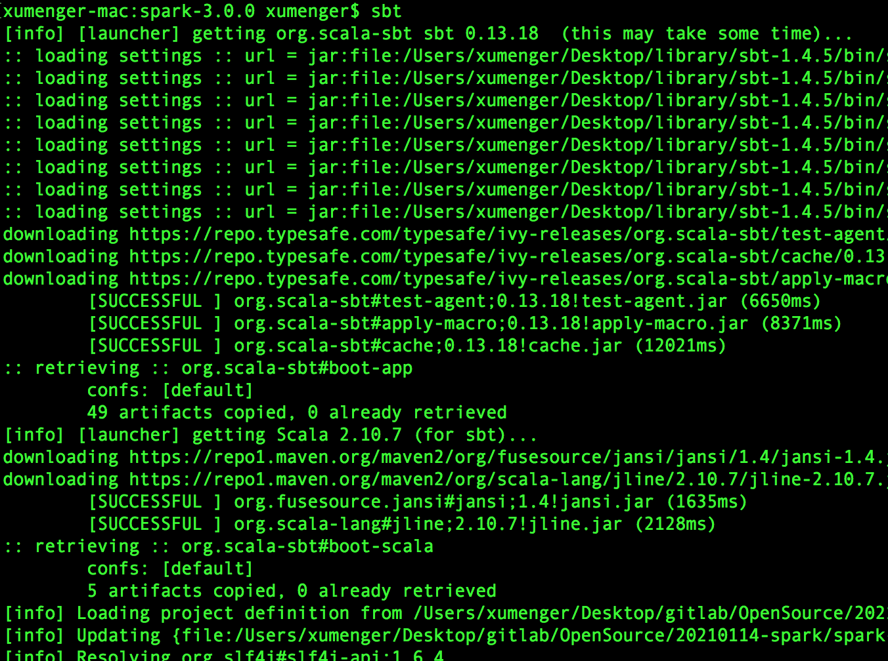
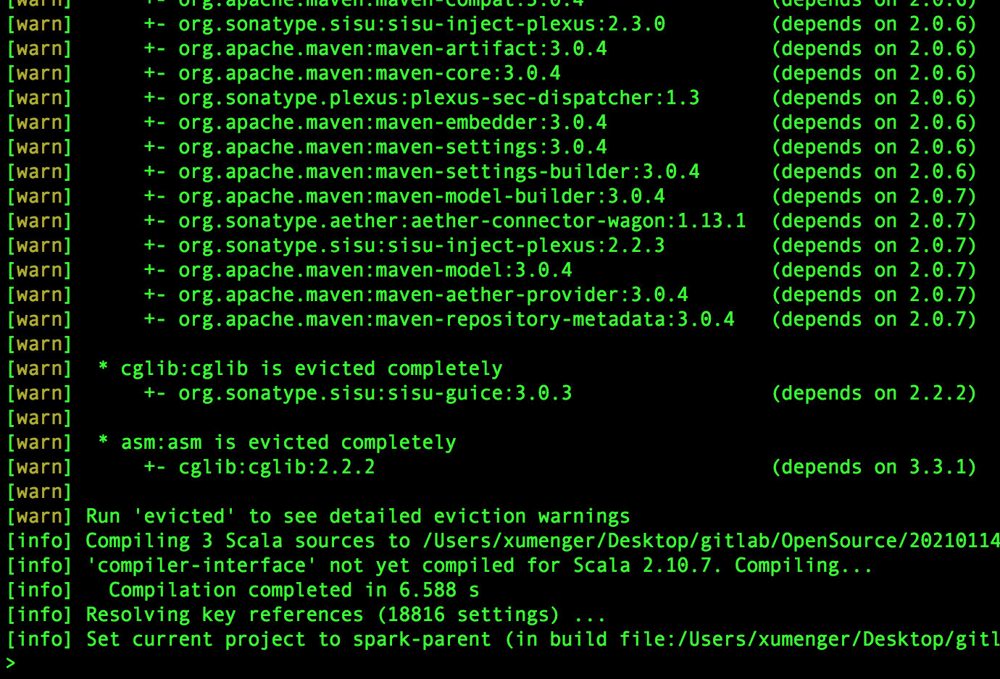
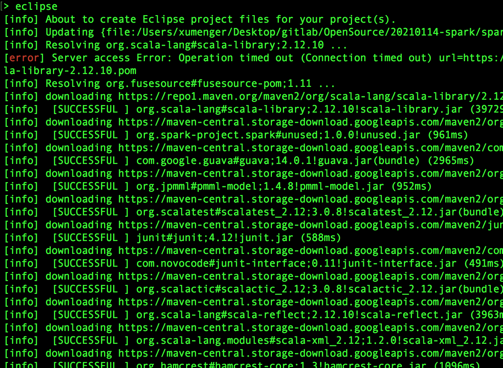
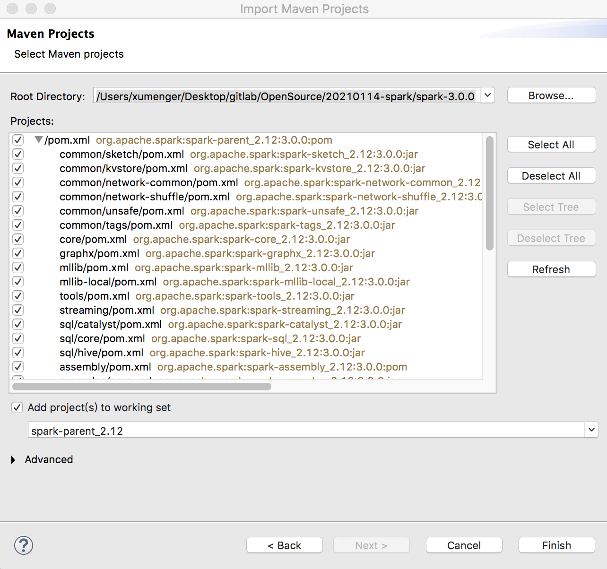
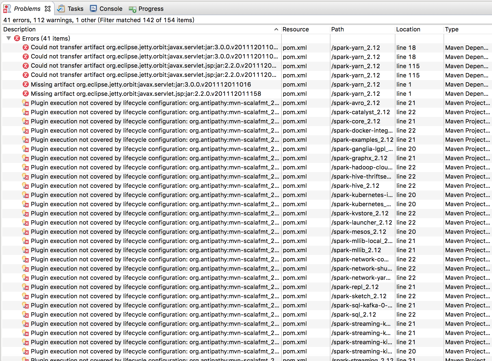
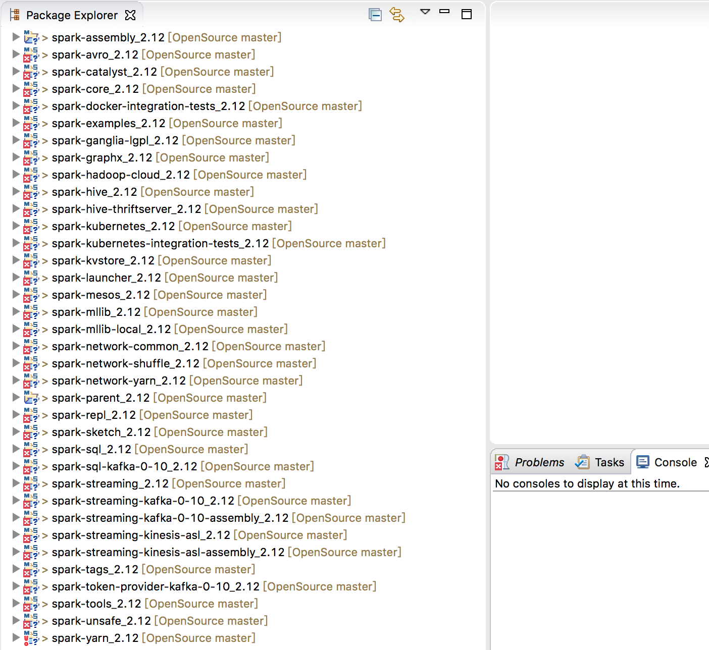
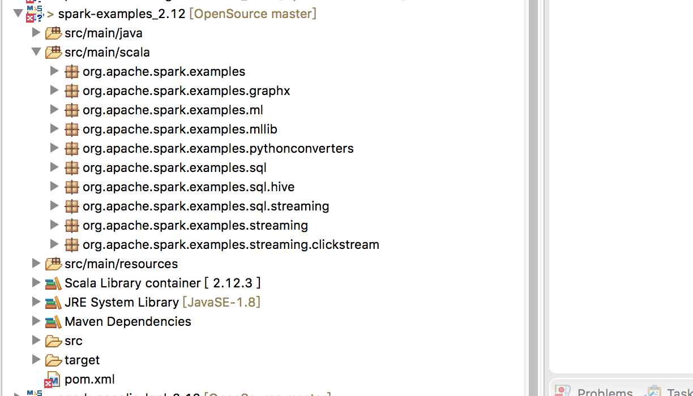
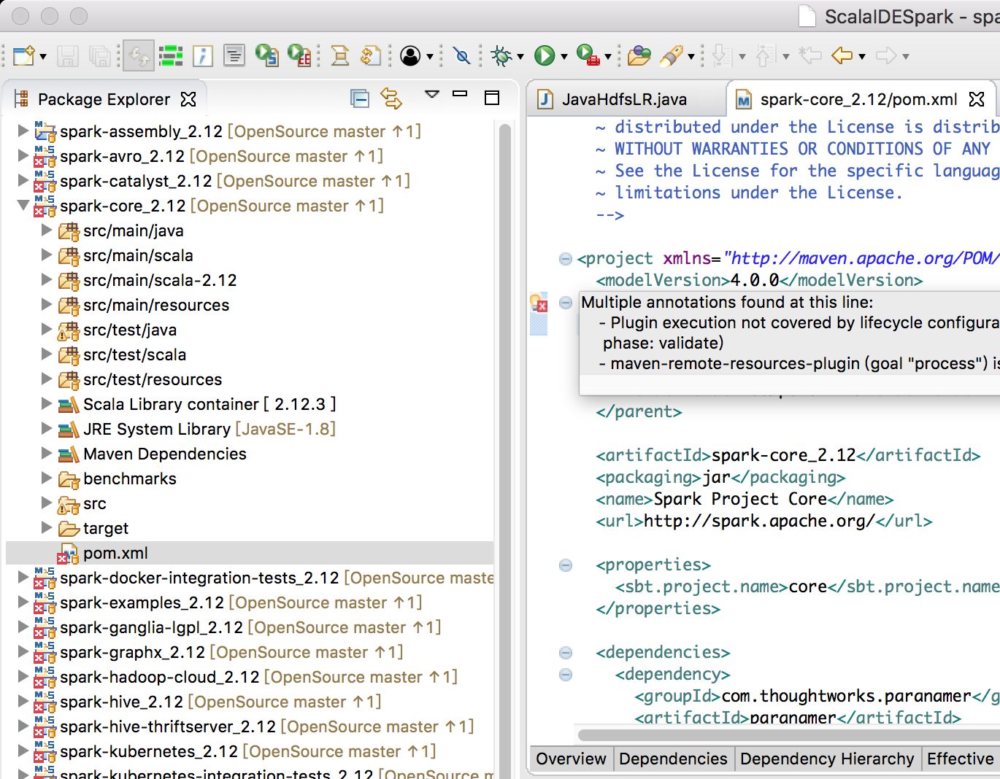
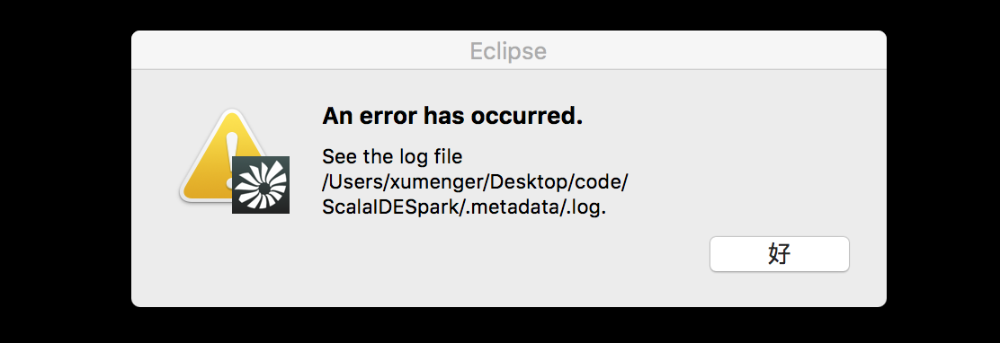

>[搭建Kafka 源码环境](http://www.xumenger.com/eclipse-kafka-20181113/)

>[搭建Spring Boot 源码环境](http://www.xumenger.com/spring-boot-eclipse-maven-20181201/)

>[搭建Flask 源码环境](http://www.xumenger.com/pycharm-flask-20181202/)

本文在MacOS 的Scala IDE 下构建Spark 的源码环境，方便后续持续阅读Spark 的源代码，以深入研究Spark！！！！因为之前学习Spark 应用开发的时候选择的是3.0.0 版本，所以本次依然下载3.0.0 版本的源码[https://github.com/apache/spark/tree/v3.0.0](https://github.com/apache/spark/tree/v3.0.0)

虽然Spark 和Kafka 都是基于Scala 开发的，Kafka 使用gradle 构建，不过Spark 需要的构架工具是sbt，首先需要先安装sbt：brew install sbt

但是这种方式可能会安装失败，那么可以尝试用sbt.zip 安装，参考[https://www.scala-sbt.org/1.x/docs/zh-cn/Installing-sbt-on-Mac.html](https://www.scala-sbt.org/1.x/docs/zh-cn/Installing-sbt-on-Mac.html)

首先下载zip 包，解压到特定目录后，然后修改环境变量：vim ~/.bash_profile，添加以下内容

```
SBT_HOME=/Users/xumenger/Desktop/library/sbt-1.4.5/
PATH=$PATH:$SBT_HOME/bin
export SBT_HOME PATH
```

然后执行source ~/.bash_profile 使其生效！

接下来进入Spark 的源码目录，执行sbt

>sbt 执行期间会下载Spark 所需要的所有jar 包，因此该步骤会花费很长的时间。其中有一些jar 包需要使用网络代理等方法才能下载



运行sbt 命令之后，解析编译相关的jar 包，并出现sbt 命令界面窗口，出现的效果图如下所示



之后运行eclipse 命令，sbt 对这个工程进行编译，构建Eclipse 项目，效果图如下所示




但是可能遇到这样的报错


```
[error] [launcher] download failed: org.scala-sbt#cache;0.13.18!cache.jar
[error] [launcher] download failed: org.scala-sbt#test-agent;0.13.18!test-agent.jar
[error] [launcher] download failed: org.scala-sbt#apply-macro;0.13.18!apply-macro.jar
[error] [launcher] error during sbt launcher: error retrieving required libraries
```

等待完成之后，直接通过ScalaIDE 的【导入已存在的Eclipse 项目】即可将所有的项目导入

>参考[《用Eclipse构建Spark源代码调试阅读环境》](https://blog.csdn.net/zhongwen7710/article/details/42400967)


## 直接导入Maven 程序

>为了防止项目名可能和后续需要研究的其他开源项目冲突，所以我专门新建了一个ScalaIDE Workspace 工作空间用来管理Spark 的所有子项目！ScalaIDE 导入其他Scala 开源项目、Eclipse 导入其他Java 开源项目的时候，都可以采用这样的策略！

我没有使用上面的sbt 的方式，而是直接在源码下载成功之后，在ScalaIDE 下【导入已经存在的Maven 项目】，将Spark 的所有子项目导入即可



注意，导入之后，因为要下载很多jar 包依赖，所以需要等待很长的时间（我是等待了约2、3 小时时间）！

导入的过程中可能会出现这些错误



将Spark 导入到ScalaIDE 之后，可以看到其包含的所有子项目：spark-core、spark-sql、spark-sql-kafka、spark-streaming、spark-streaming-kafka、spark-yarn、spark-hive、spark-mlib、spark-graphx……



其中spark-examples 下面是Spark 官方提供的各种案例程序，在前期学习Spark 应用程序开发阶段，研究这部分官方的案例绝对比在网上随便搜到的杂七杂八的文章好得多



## 遗留内容

现在这种导入ScalaIDE 的方式，在构建好之后，pom.xml 还是会报错！这个是为什么？



另外现在源码环境搭建起来了，如何在ScalaIDE 中将Spark 运行起来，然后提交一个Spark 程序之后去在ScalaIDE 中调试整个Spark 的运行流程？

另外ScalaIDE 启动的时候可能遇到这样的报错，去.log 中也没有看到什么头绪



目前的方案是将这个WorkSpace 直接删除掉，然后重新导入Spark 各子项目。😓
