本系列的思路和插件来自[《利用GPU实现大规模动画角色的渲染》](https://www.cnblogs.com/murongxiaopifu/p/7250772.html)，只是记录一下操作的流程

简单来说，我们按照固定的频率对角色动画取样并记录取样点时刻角色网格上各个顶点的位置信息，并利用贴图的纹素的颜色属性（Color(float r, float g, float b, float a)）保存对应顶点的位置（Vector3(float x, float y, float z)）

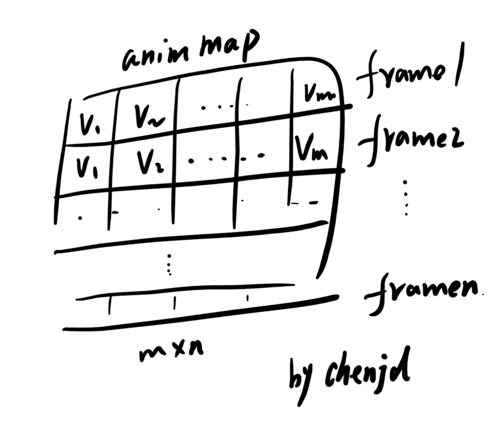

在之前的文章中有讲到基于DOTS 技术可以实现海量游戏物体的渲染

* [Unity DOTS 技术：HybridECS](http://www.xumenger.com/unity-dots-ecs-20201128/)
* [Unity DOTS 技术：C# Job System](http://www.xumenger.com/unity-dots-csharp-job-20201129/)
* [Unity DOTS 技术：Burst Compiler](http://www.xumenger.com/unity-dots-burst-20201130/)
* [Unity DOTS 技术：Physics](http://www.xumenger.com/unity-dots-physics-20201201/)
* [Unity 可编程渲染管线](http://www.xumenger.com/unity-render-pipeline-20201207/)

但是经过测试使用DOTS 之后，原来的Animation、Animator 组件无法正常工作，当然Unity 官方可能会出基于DOTS 的动画解决方案，但是找了资料后发现这种基于GPU Shader 顶点变换实现的动画效果反而是更通用的一种方式，值得研究一下，当然都是基于[陈嘉栋](https://home.cnblogs.com/u/murongxiaopifu/) 这位博主的思路和插件

本次使用的插件来自[Mini Legion Footman PBR HP Polyart](https://assetstore.unity.com/packages/3d/characters/humanoids/fantasy/mini-legion-footman-pbr-hp-polyart-86576)

## 了解Unity 性能分析

比如将一个Footman_Default 模型拖入到场景中，并且添加PBR 材质，该模型的结构是这样的

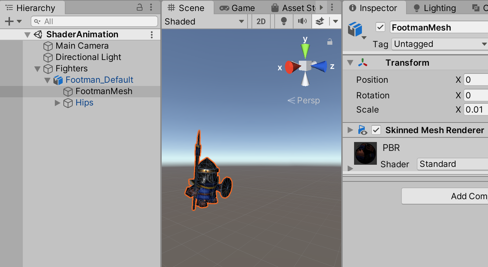

游戏运行起来后，在Game 界面可以看到游戏运行起来的性能参数，这里针对这些参数逐个讲解

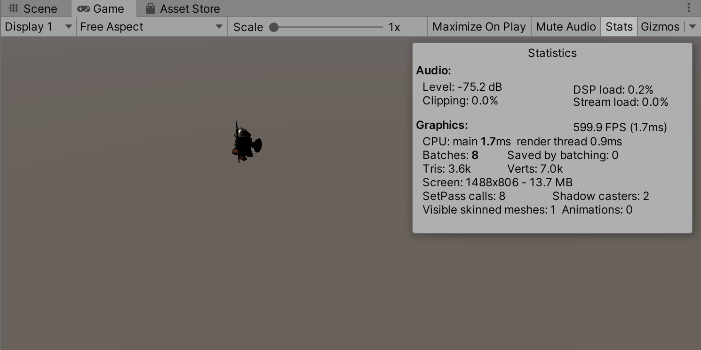

* FPS：游戏的帧数。FPS = 1000 / max(main, render thread)
* main：主线程每一帧的耗时，MonoBehaviour 都是运行在这个线程上的
* render thread：渲染线程每一帧的耗时，专门的一个线程来控制CPU
* Batches：这个场景的物体分了多少个批次提交给GPU 进行绘制/渲染
* Saved by batching：被合批处理的物体数目
* Tris：场景中的面数
* Verts：场景中的顶点数
* Screen：游戏场景的分辨率
* SetPass calls：每次绘制的时候，将Shader 等参数设置到渲染管道
	* 如果模型A 使用Shader A，模型B 使用Shader B
	* 那么先绘制A，再绘制B 的话，需要由Shader A 切换到Shader B，那么就会有2 次SetPass calls
	* 该指标越大，说明越消耗性能
* Shadow casters：阴影消耗
* Visible skinned meshes：蒙皮Mesh Render 的个数，因为这个模型中带有一个Skinned Mesh Renderer 组件，所以这个值是1
* Animations：动画的个数，因为现在没有动画，所以是0

>了解各个指标的含义才能有助于我们后续的性能调优！

可以看到当前场景中的Batches 数是8；SetPass calls 是8；Shadow casters 是2，场景中只有一个Directional Light，将其Shadow Type 从原来的Soft Shadows 改为No Shadows

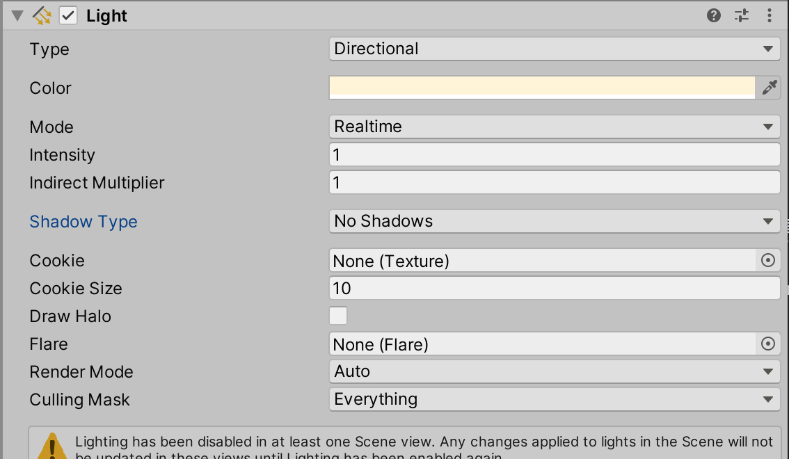

在此启动程序，可以看到性能指标变成这样了。Batches 数降到4；SetPass calls 降为4；Shadow casters 也变成了0。这基本就理解了阴影的作用了，阴影在游戏中往往是一个比较消耗性能的点（详细可以自己了解光照模型、渲染的知识）

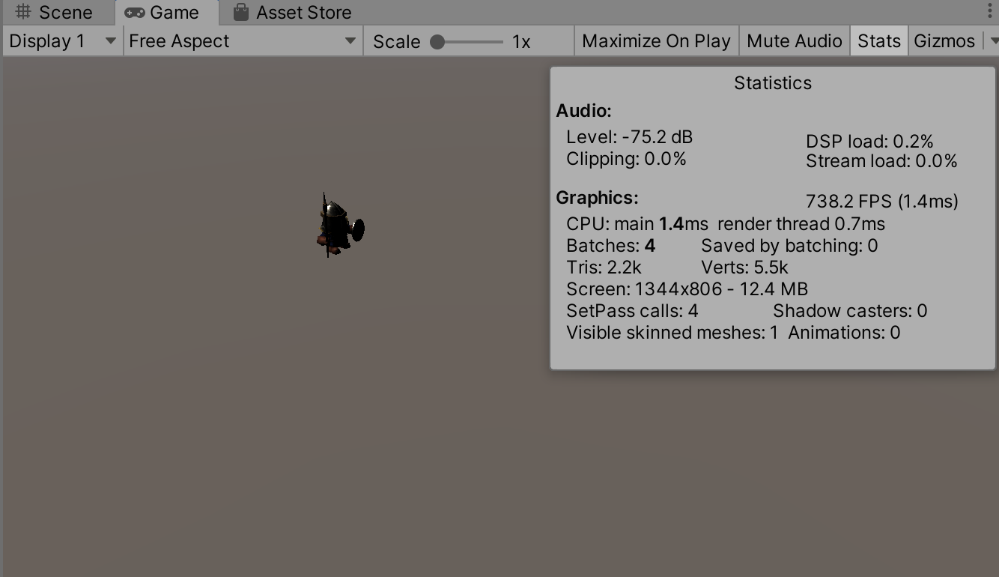

除了Light 维度的Shadow Type 设置光照的阴影类型，在模型上的Skinned Mesh Renderer 组件上还有一个Cast Shadows、Receive Shadows 属性表示是否投射光照的阴影！

接下来的验证中，都是将Directional Light 的Shadow Type 设置为No Shadows 来进行测试的

## 传统动画设置

将Footman_Default 从场景中删除，在Project 资源管理器中，分别为Mesh/Footman_Default、Animation/Footman_Attack02 设置为Legacy

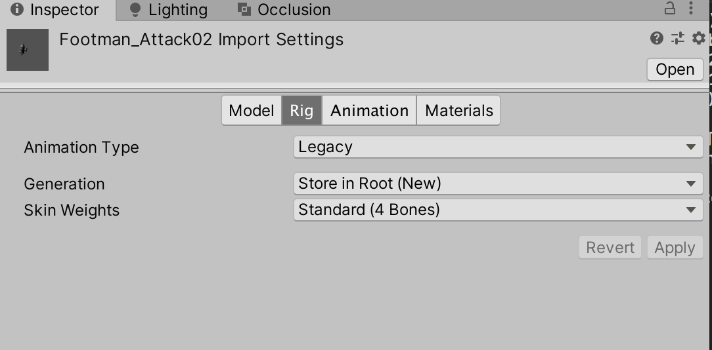

然后为了动画循环播放，将Animation/Footman_Attack02 设置为循环播放

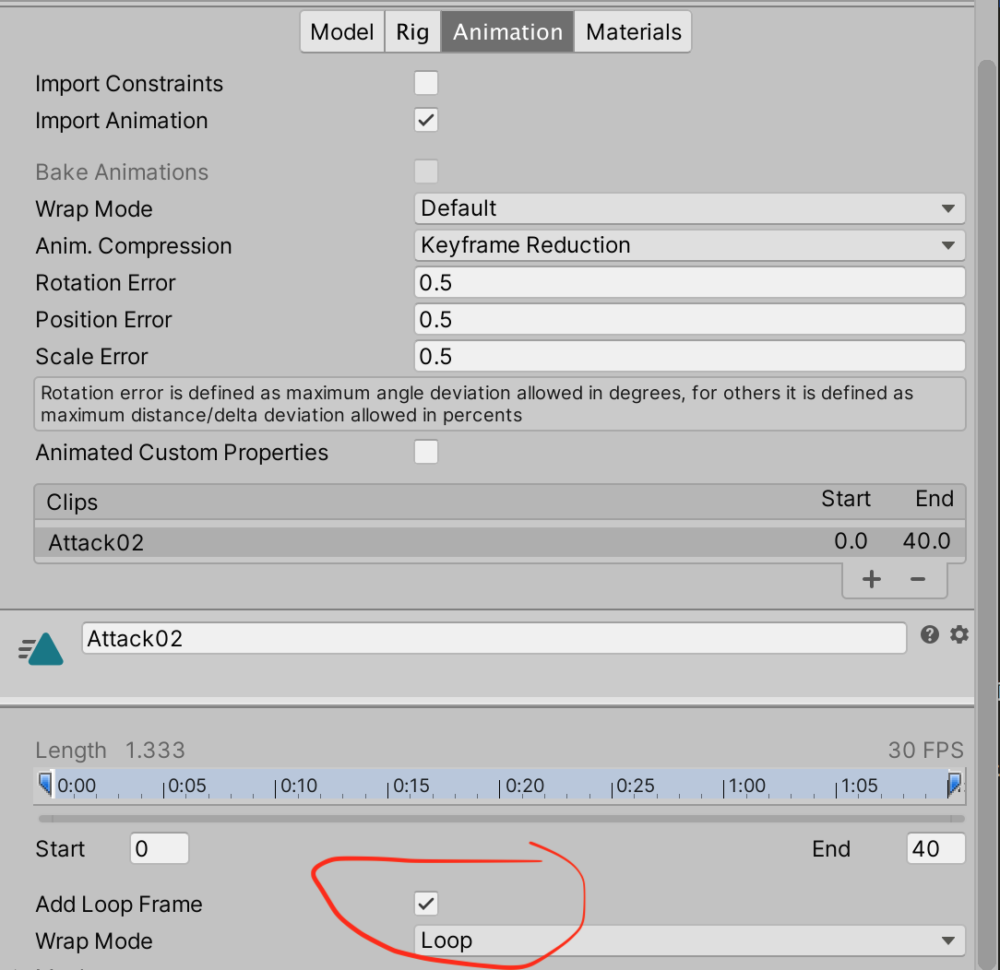

然后将Footman_Default 拖入到场景中，为其Animation 组件设置Footman_Attack02 动画

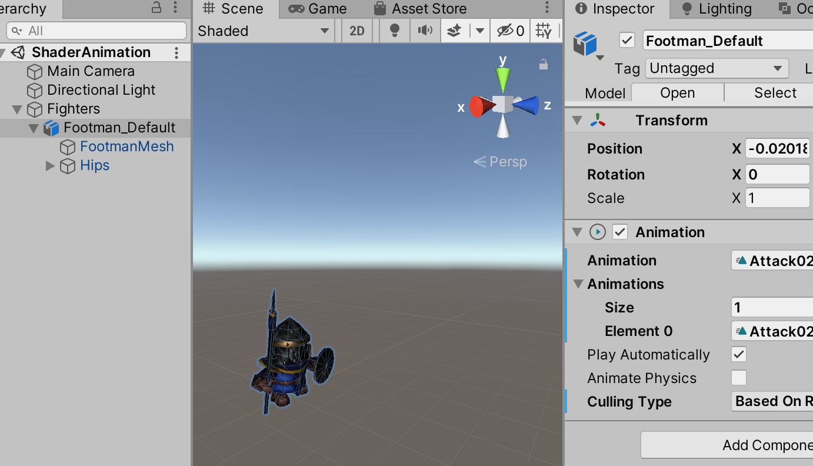

再次运行游戏，可以看到现在的性能参数

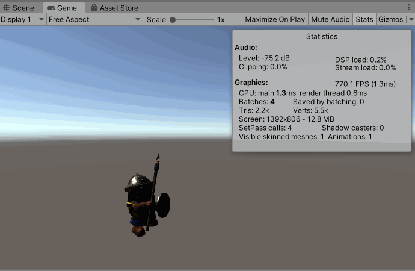

因为设置了动画，所以现在Animations 值是1 了

## “万人动画”测试

简单地，在场景中直接Ctrl-D 快捷键，为模型复制出400 个，然后运行游戏

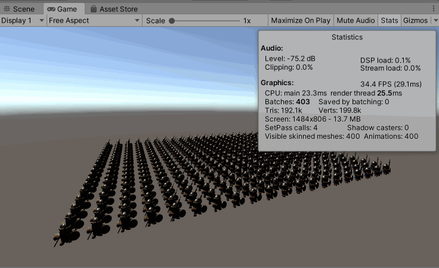

很明显，性能指标发送了变化，下面简单分析一下：

* FPS 下降到30 左右
* 每个角色的Batches 是1，原来场景中一个角色是3 + 1，现在3 + 400 = 403
* SetPass calls，渲染一个角色的时候是4，现在还是4，因为所有角色的Shader 是一样的
	* 单个角色渲染是Batches 为4，SetPass calls 也是4
	* 400 个角色渲染时，Batches 为403，SetPass calls 还是4
	* 所以另外的3 是什么？
* Visible skinned meshes 对应变大为400
* Animations 也对应变大为400

此时，如果设置Directional Light 为Soft Shadows，再次运行游戏，可以看到Batches、SetPass calls、Shadow casters 都发生了较大的增长，**所以阴影的开销很大！**

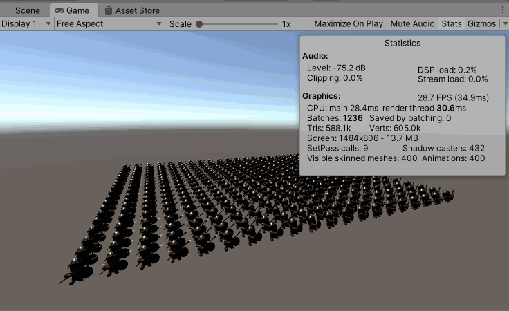

再回到上面的问题，剩下的3 个Batches 是什么，假如将场景中的所有角色模型都去除掉，看到Batches 果然是3。这3 个是用于绘制天空盒、屏幕的底……

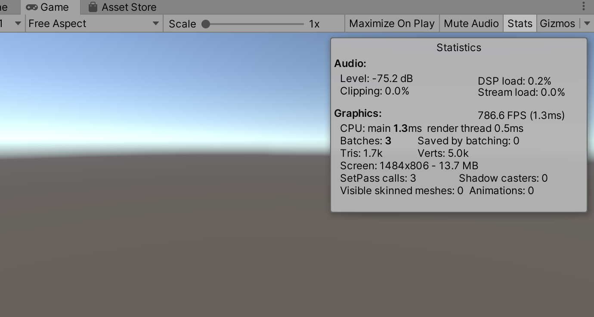

接下来继续整理两篇文章，分别讲解如何基于Shader 实现动画，以优化游戏性能，以及在DOTS 开发的游戏中使用Shader 动画
