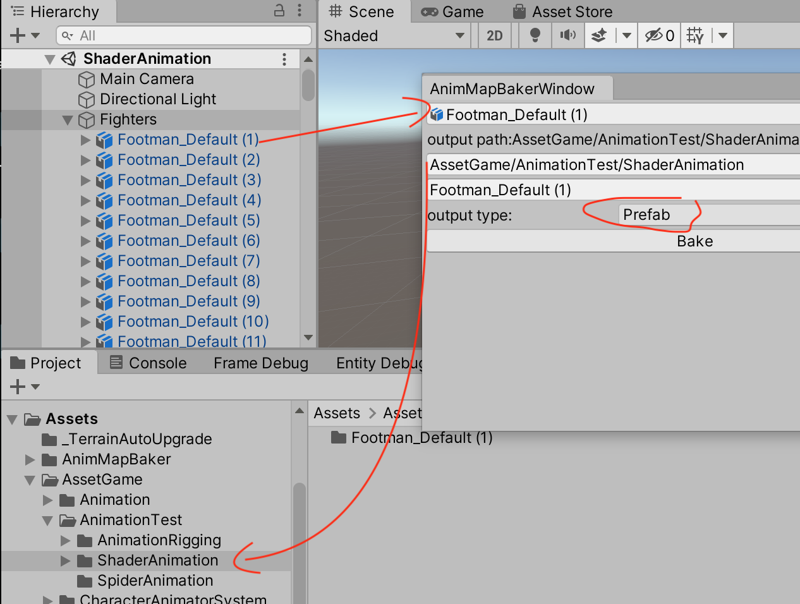
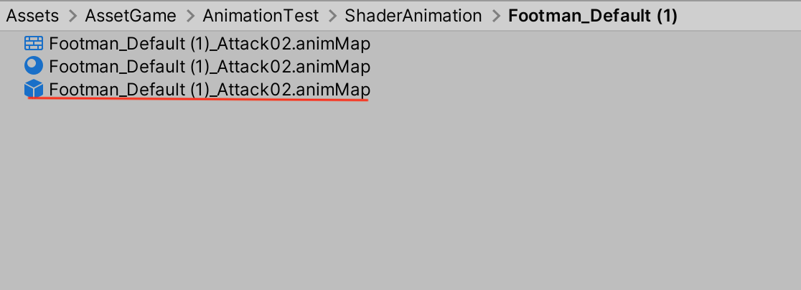
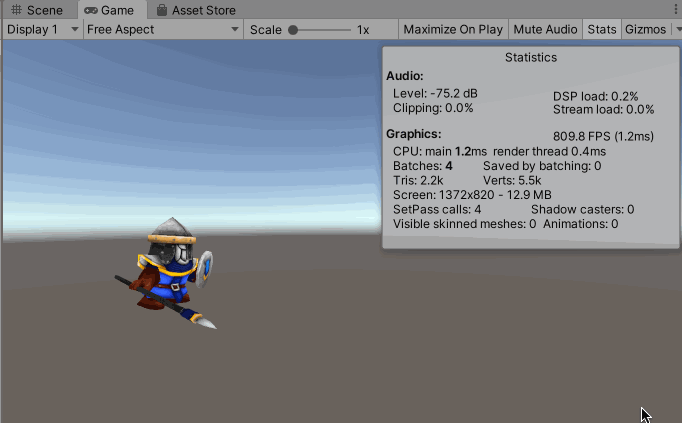
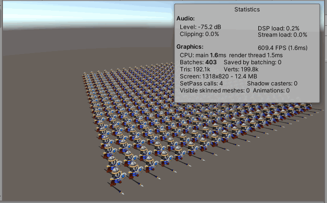
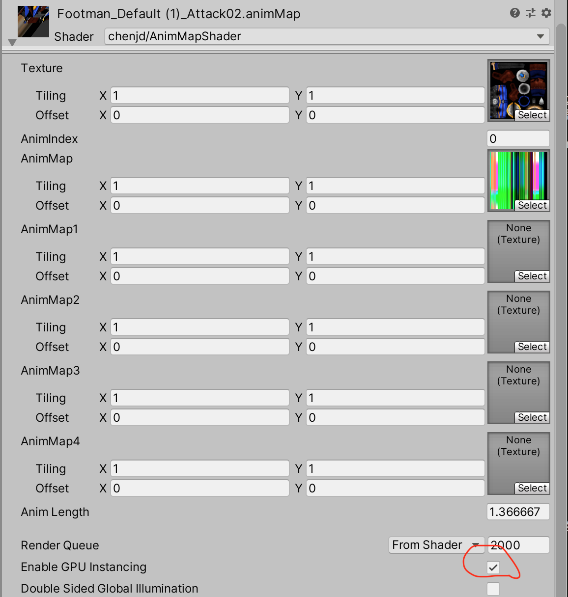
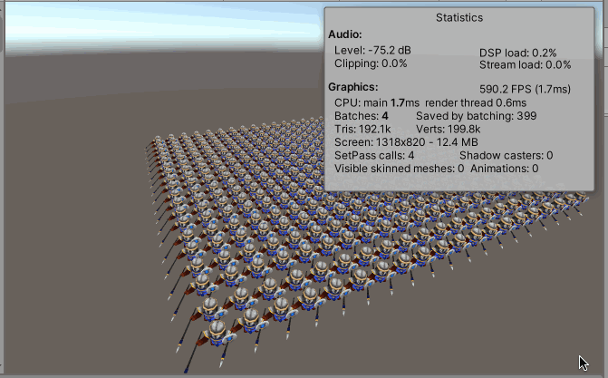

本系列的思路和插件来自[《利用GPU实现大规模动画角色的渲染》](https://www.cnblogs.com/murongxiaopifu/p/7250772.html)，只是记录一下操作的流程

简单来说，我们按照固定的频率对角色动画取样并记录取样点时刻角色网格上各个顶点的位置信息，并利用贴图的纹素的颜色属性（Color(float r, float g, float b, float a)）保存对应顶点的位置（Vector3(float x, float y, float z)）

在之前的文章中有讲到基于DOTS 技术可以实现海量游戏物体的渲染

* [Unity DOTS 技术：HybridECS](http://www.xumenger.com/unity-dots-ecs-20201128/)
* [Unity DOTS 技术：C# Job System](http://www.xumenger.com/unity-dots-csharp-job-20201129/)
* [Unity DOTS 技术：Burst Compiler](http://www.xumenger.com/unity-dots-burst-20201130/)
* [Unity DOTS 技术：Physics](http://www.xumenger.com/unity-dots-physics-20201201/)
* [Unity 可编程渲染管线](http://www.xumenger.com/unity-render-pipeline-20201207/)

但是经过测试使用DOTS 之后，原来的Animation、Animator 组件无法正常工作，当然Unity 官方可能会出基于DOTS 的动画解决方案，但是找了资料后发现这种基于GPU Shader 顶点变换实现的动画效果反而是更通用的一种方式，值得研究一下，当然都是基于[陈嘉栋](https://home.cnblogs.com/u/murongxiaopifu/) 这位博主的思路和插件

本次使用的插件来自[Mini Legion Footman PBR HP Polyart](https://assetstore.unity.com/packages/3d/characters/humanoids/fantasy/mini-legion-footman-pbr-hp-polyart-86576)

----

在上一篇文章中，400 个游戏物体为什么不能合批？因为每个游戏物体都是动的，所以需要针对每个游戏物体根据Animation 计算出当前的顶点变化，才能形成一个个的动作，所以这也是为什么要将Animations 列到Statics 中的原因，当然也是本文针对动画调优的思路！

## AnimMapBaker 插件

安装好AnimMapBaker 插件（直接将AnimMapBaker 文件夹拖到Assets 目录即可）后，【Window】->【AnimMapBaker】 打开窗口进行如下配置

将上文中的动画游戏物体烘培得到基于Shader 的动画预制件，在对应的目录下可以看到，第三个就是得到的预制件

将原来场景中传统动画模型隐藏掉，将生成的新的预制件拖到场景中，运行后看到的效果是这样的

可以看到Visible skinned meshes、Animations 现在都是0，试着将游戏物体的数量也增大为400

简单分析一下：Batches 数量虽然没变，但 Visible skinned meshes、Animations 现在都是0，且FPS 现在已经明显提升了很多，原来的30 FPS 到现在的600 FPS！

还可以进一步优化，选择任意个游戏物体，在Inspector 面板上，勾选Shader 上的【Enable GPU Instancing】选项

然后运行，发现Batches 这个指标也从原来的403 降到了4！

## AnimMapBaker 源码分析

经过