之前研究了DOTS，看到使用了ECS、C# Job、Burst 之后，性能简直起飞，上一篇中看到使用Shader 优化动画之后，性能也是起飞，那两者结合起来，岂不是“芜湖起飞”！！！

>[Unity DOTS 技术：HybridECS](http://www.xumenger.com/unity-dots-ecs-20201128/)

>[Unity DOTS 技术：C# Job System](http://www.xumenger.com/unity-dots-csharp-job-20201129/)

>[Unity DOTS 技术：Burst Compiler](http://www.xumenger.com/unity-dots-burst-20201130/)

>[Unity DOTS 技术：Physics](http://www.xumenger.com/unity-dots-physics-20201201/)

本文将这两种性能优化的大杀器结合在一起，看一下运行起来后的性能指标是什么样的？很多操作会重复之前文章中已经说过的，不过这里为了全流程展示，就再来一遍

## AnimMapBaker 准备

在Project 资源管理器中，分别为Mini Legion Footman PBR HP Polyart/Meshes/Footman_Default、Mini Legion Footman PBR HP Polyart/Animations/Footman_Attack02

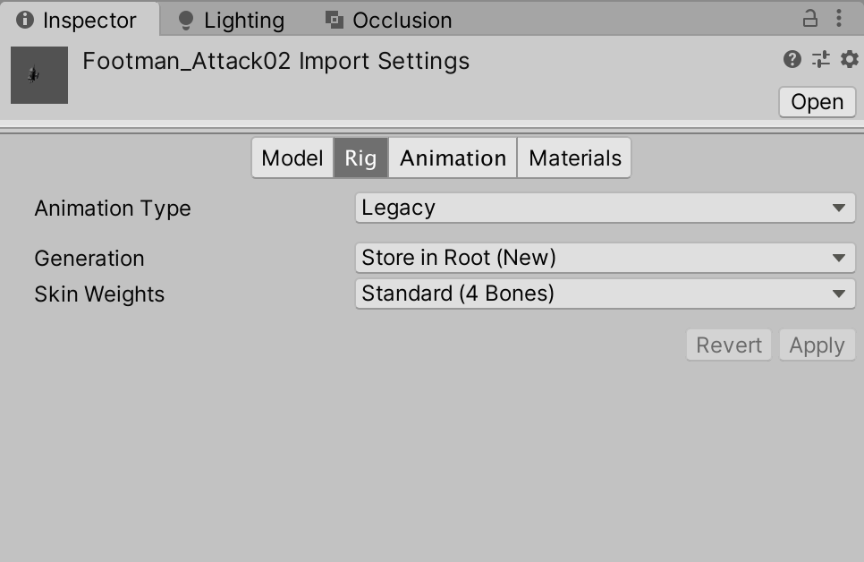

为了动画循环播放，将Animation/Footman_Attack02 设置为循环播放


新建一个测试场景，接着将Mini Legion Footman PBR HP Polyart/Meshes 下的角色模型Footman_Default 放到场景中，并且添加PBR 材质

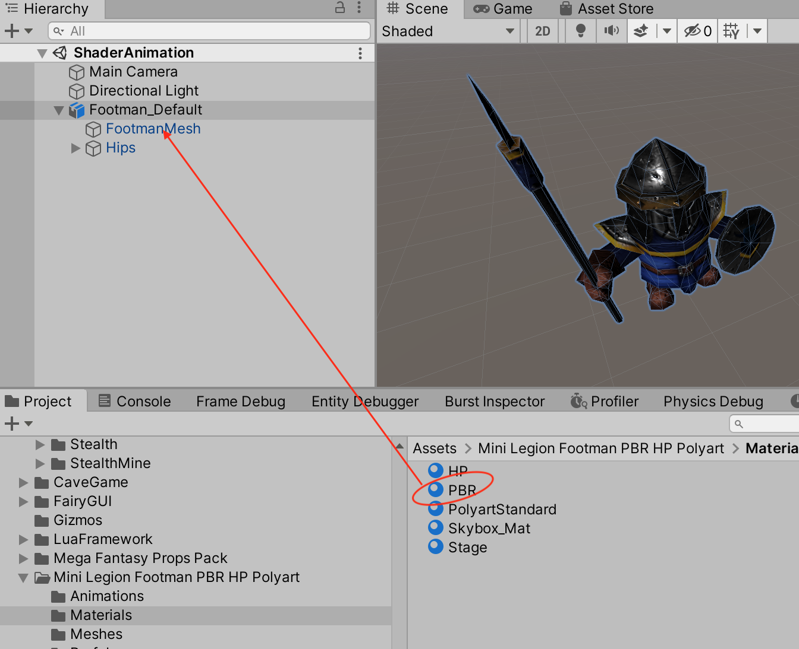

并且为Footman_Default 添加Animation 组件，将其设置为Footman_Attack02

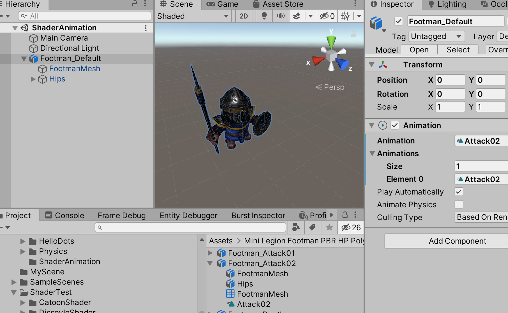

然后使用AnimMapBaker 烘培出一个基于GPU 的动画预制件

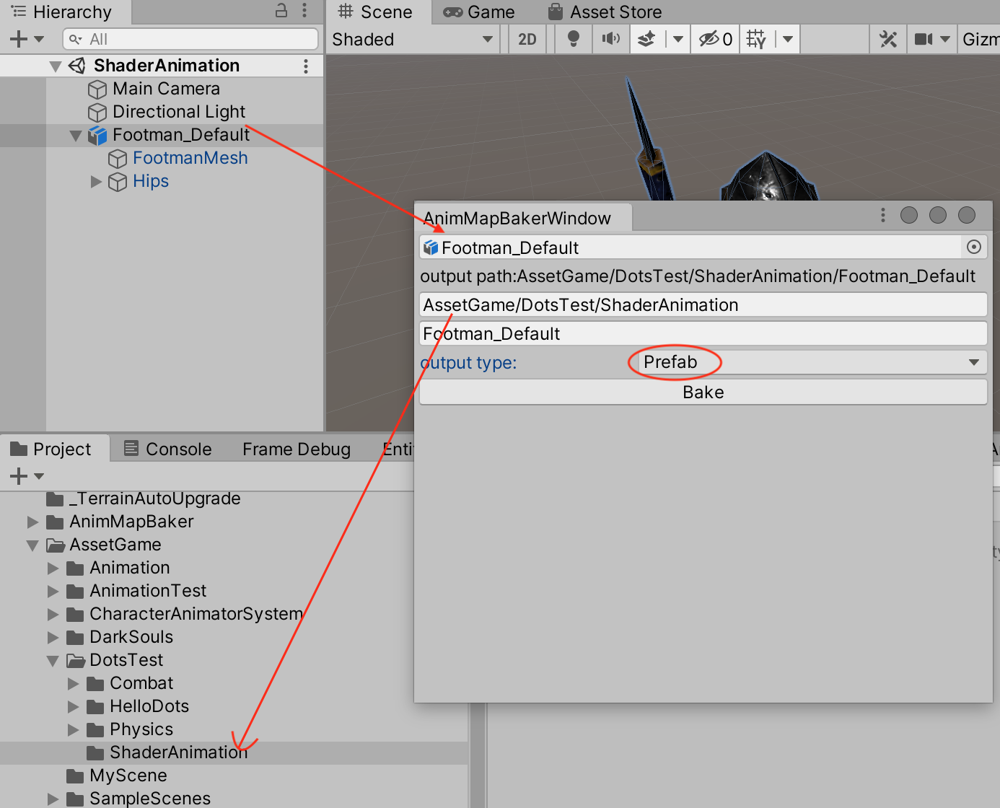

## DOTS 工作流

上面的流程会创建出一个Shader 动画的GameObject，并放在Hierachy 下，将其重命名为Footman_Default_Bak，并为其添加HybridECS 自带的ConvertToEntity.cs 脚本，然后拖动到Project 的某个目录下，将其做成一个预制件

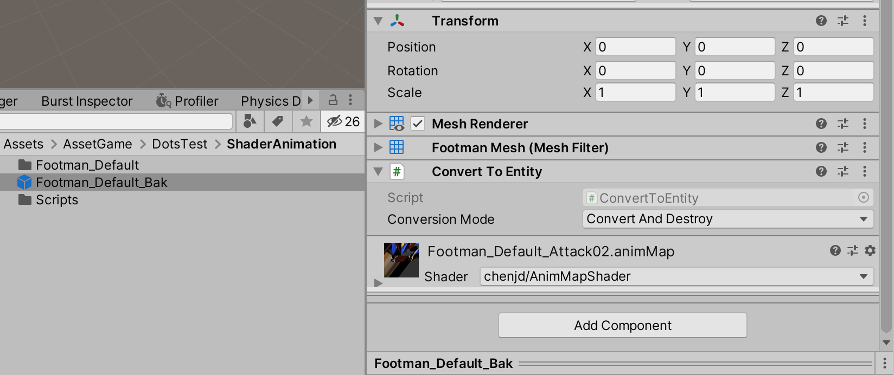

新增MoveSpeedData 脚本，将其添加到Footman_Default_Bak 预制件上

```c#
using System.Collections;
using System.Collections.Generic;
using UnityEngine;

using Unity.Entities;

// 加了[GenerateAuthoringComponent] 之后，这个脚本就可以直接拖到游戏对象中了
[GenerateAuthoringComponent]
public struct MoveSpeedDataBak : IComponentData
{
    public float Value;
}
```

下面为其添加一个新的Component 用于控制Entity 的振幅、偏移等信息，用于实现整体的波动效果。同样将这个Component 放到预制件上。比如设置Amplitute 为5、XOffset 为0.25、YOffset 为0.25，将其添加到Footman_Default_Bak 预制件上

```c#
using System.Collections;
using System.Collections.Generic;
using UnityEngine;

using Unity.Entities;
using Unity.Mathematics;

// 加了[GenerateAuthoringComponent] 之后，这个脚本就可以直接拖到游戏对象中了
[GenerateAuthoringComponent]
public struct WaveDataBak : IComponentData
{
    public float Amplitute;   // 振幅
    public float XOffset;
    public float ZOffset;
}
```

然后定义运行的逻辑，WaveSystemBak.cs。注意这个脚本不需要拖放到任何游戏物体上，运行时，Unity 引擎会自动处理System 脚本！

```c#
using System.Collections;
using System.Collections.Generic;
using UnityEngine;

using Unity.Entities;
using Unity.Transforms;
using Unity.Mathematics;

public class WaveSystemBak : ComponentSystem
{
    // 和MonoBehaviour Update() 类似，每帧执行
    protected override void OnUpdate()
    {
        // 遍历所有有Translation、MoveSpeedData 组件的实体，通过Lambda 表达式编写逻辑
        // ref 是读写变量
        Entities.ForEach((ref Translation trans, ref MoveSpeedDataBak speed, ref WaveDataBak wave) =>
        {
            // math.sin() 也是Unity.Mathematics 提供的方法
            // y(t) = Asin(wt + q)
            // A: 振幅
            // w: 角频率
            // q: 相移
            float yPosition = wave.Amplitute * math.sin((float)Time.ElapsedTime * speed.Value + trans.Value.x * wave.XOffset + trans.Value.z * wave.ZOffset);

            // 在OnUpdate 方法中更新实体的Translation 组件
            trans.Value = new float3(trans.Value.x, yPosition, trans.Value.z);
        });
    }
}
```

为预制件各个脚本参数进行如下的设置

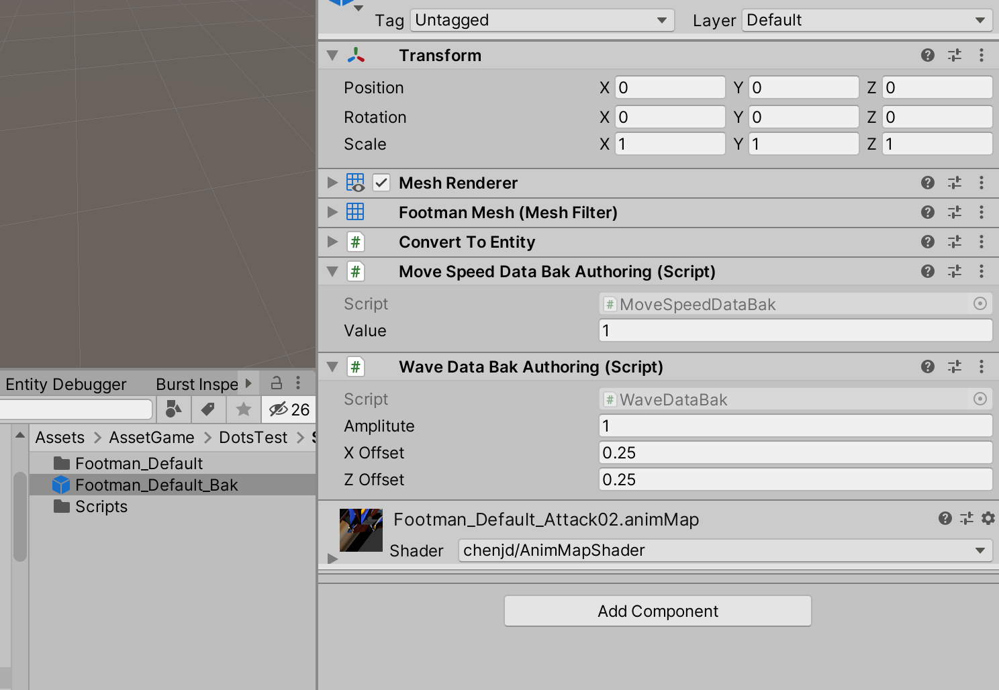

在Hierarchy 中新增一个空物体，为其创建一个CreateObjectManager.cs 脚本，在Start() 方法中新增创建“百万”游戏对象的逻辑

```c#
using System.Collections;
using System.Collections.Generic;
using UnityEngine;

using Unity.Entities;
using Unity.Transforms;
using Unity.Rendering;
using Unity.Mathematics;

public class CreateObjectManager : MonoBehaviour
{
    // 同样的，要在运行前，先把 Prefab 拖到这个属性上
    [SerializeField] private GameObject gameObjectPrefab;

    // 用于设置Entity在各个方向的数量
    public int xNum = 40;
    public int zNum = 40;

    // Entity的间隔
    [Range(0f, 4f)]
    public float spacing = 3.5f;

    private Entity entityPrefab;
    private World defaultWorld;
    private EntityManager entityManager;

    // Start is called before the first frame update
    void Start()
    {
        defaultWorld = World.DefaultGameObjectInjectionWorld;
        entityManager = defaultWorld.EntityManager;

        GameObjectConversionSettings settings = GameObjectConversionSettings.FromWorld(defaultWorld, null);

        // 预制件转换成Entity
        entityPrefab = GameObjectConversionUtility.ConvertGameObjectHierarchy(gameObjectPrefab, settings);

        // 循环创建指定数量的实体
        for (int x = 0; x < xNum; x++)
        {
            for (int z = 0; z < zNum; z++)
            {
                // 实例化Entity
                Entity myEntity = entityManager.Instantiate(entityPrefab);

                // 为Entity设置位置组件信息
                entityManager.SetComponentData(myEntity, new Translation
                {
                    Value = new float3(x * spacing, 0f, z * spacing)
                });
            }
        }
    }
}
```

将上面的Footman_Default_Bak 预制件设置到gameObjectPrefab 上

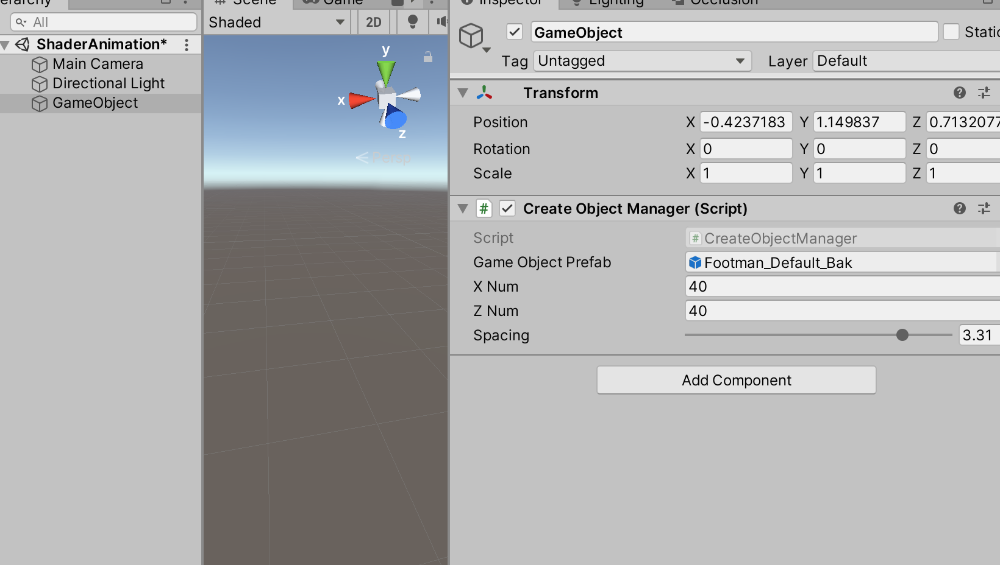

设置角色一共有40 x 40 个，Jobs -> Burst -> Enable Compilation 先不打开！运行游戏，可以看到其性能指标如下

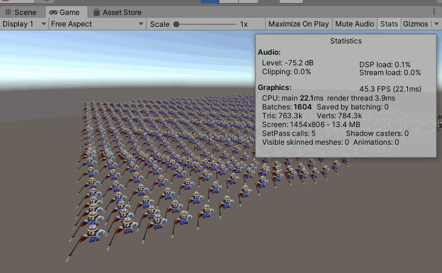

设置角色一共有40 x 40 个，接着Jobs -> Burst -> Enable Compilation 打开后！运行游戏，可以看到其性能指标如下

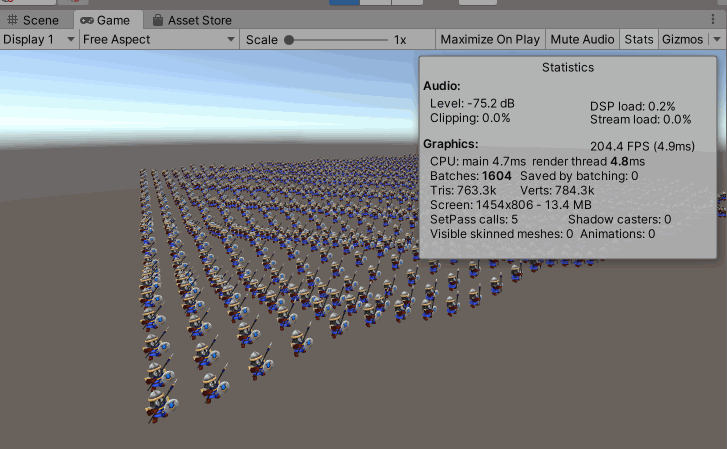

设置角色一共有100 x 100 个，接着Jobs -> Burst -> Enable Compilation 打开后！运行游戏，可以看到其性能指标如下

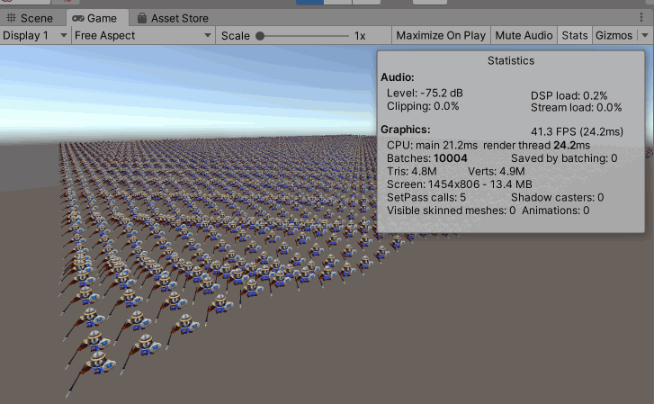

因为所有的角色的材质是一样的，所以在Footman_Default_Bak 预制件的材质上勾选Enable GPU Instancing，重新运行，FPS 又有了一些提升

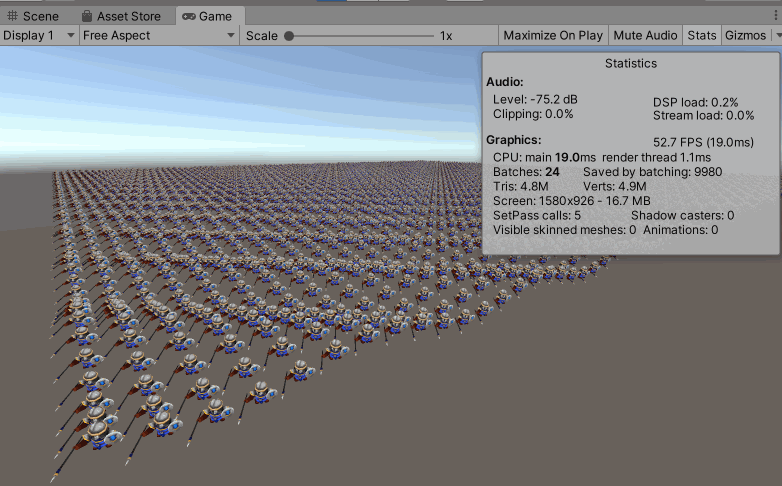
