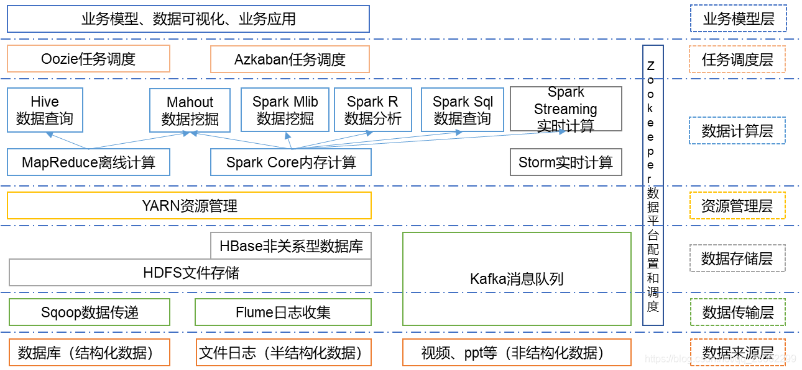
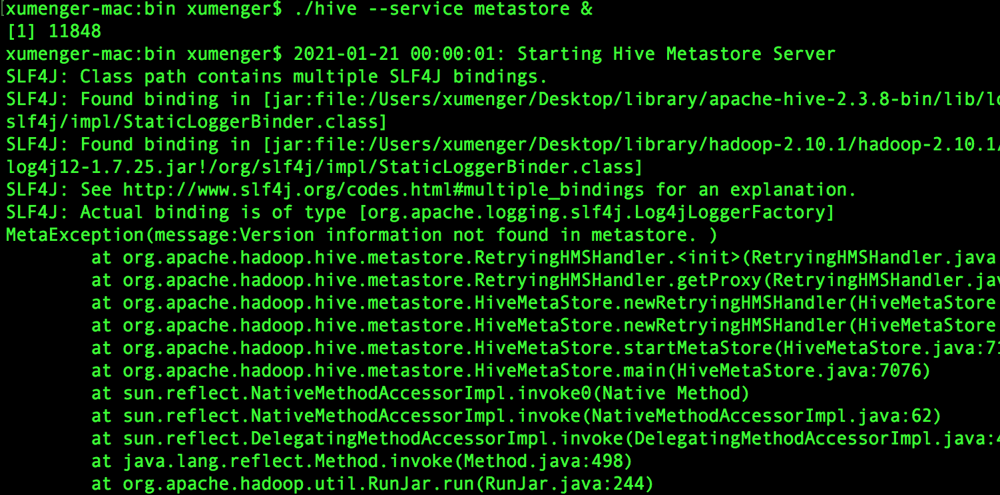
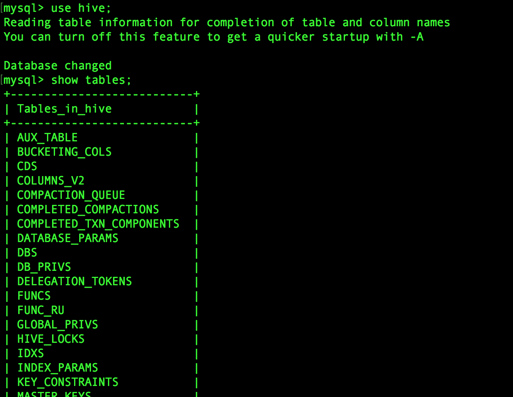
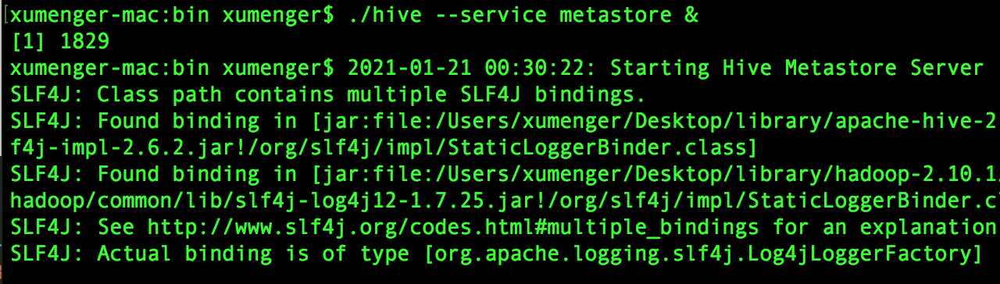
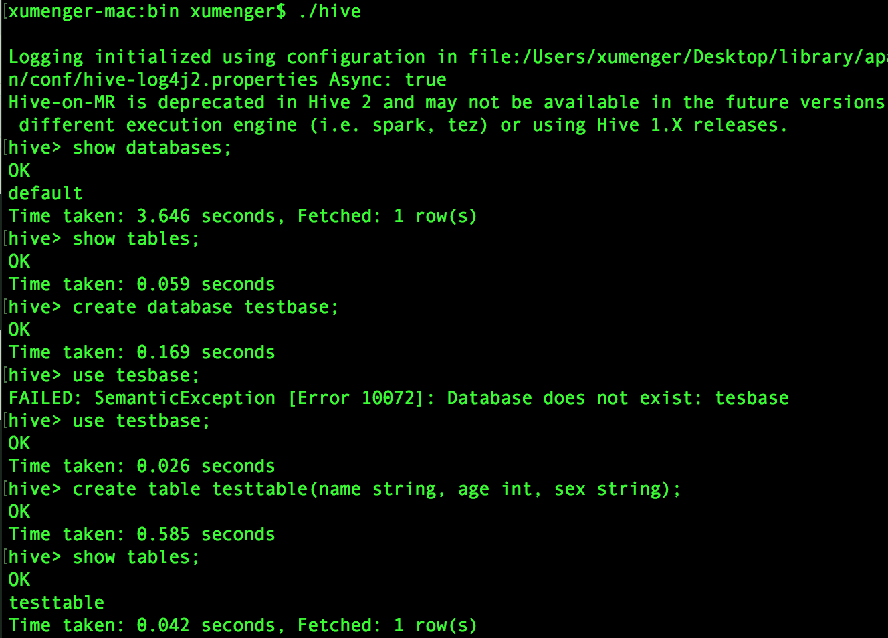
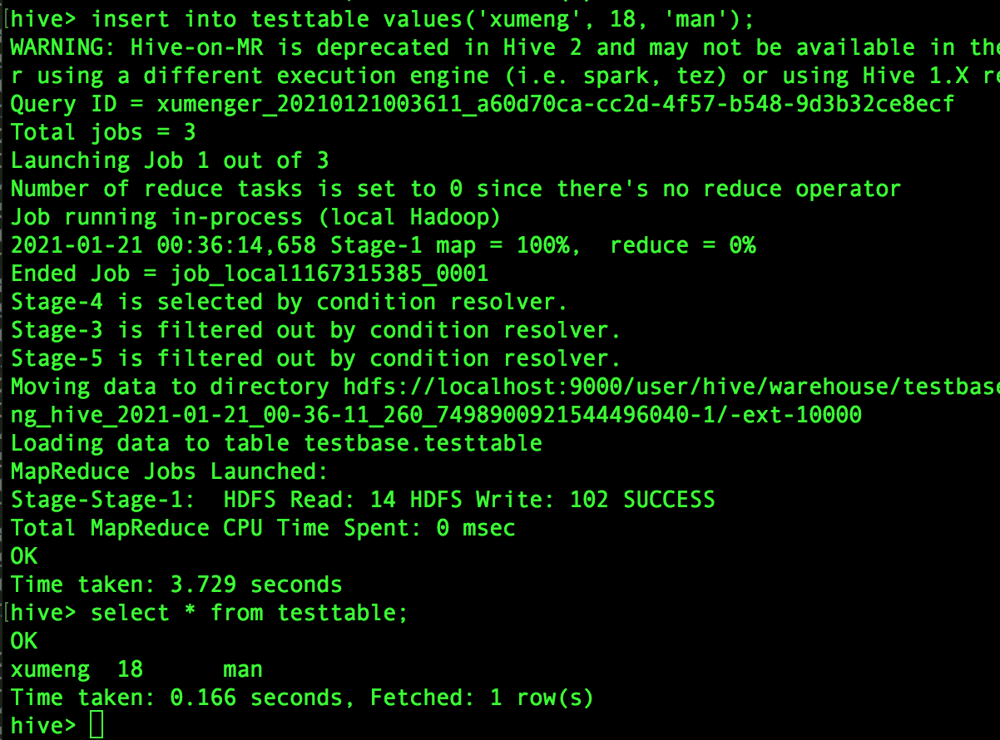
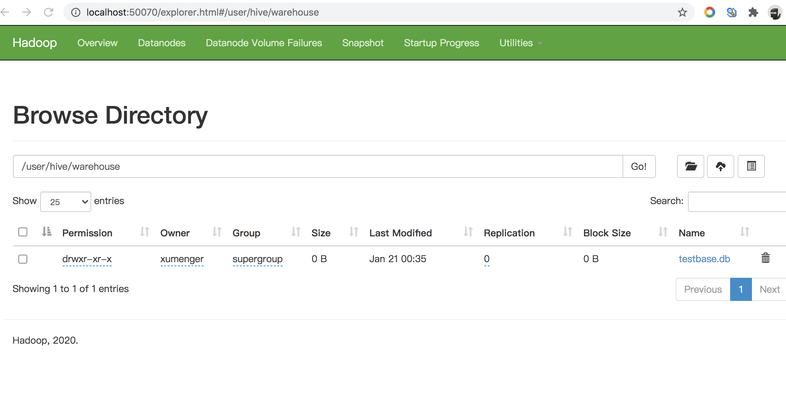
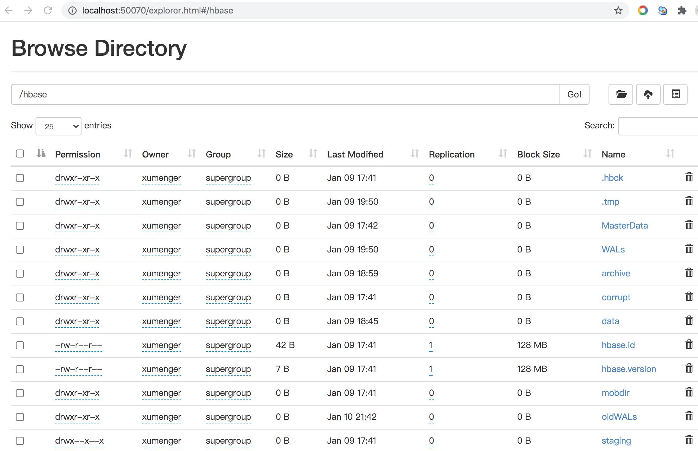
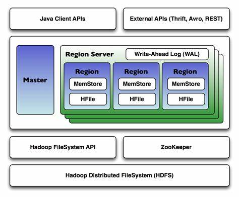
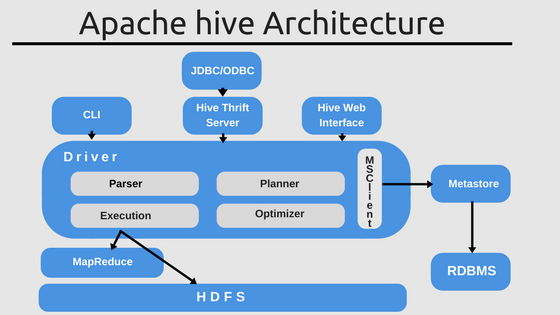

>[https://cwiki.apache.org/confluence/display/Hive/GettingStarted](https://cwiki.apache.org/confluence/display/Hive/GettingStarted)

>[https://cwiki.apache.org/confluence/display/Hive/Home#Home-UserDocumentation](https://cwiki.apache.org/confluence/display/Hive/Home#Home-UserDocumentation)

>[https://cwiki.apache.org/confluence/display/Hive/LanguageManual](https://cwiki.apache.org/confluence/display/Hive/LanguageManual)

>[http://hive.apache.org/javadoc.html](http://hive.apache.org/javadoc.html)

之前的文章分别研究了Spark、HDFS、HBase，从环境搭建，到简单原理介绍，到简单案例展示，今天开始研究Hive，关于Hive，首先通过[这张图](https://blog.csdn.net/qq_25062299/article/details/95592877)了解其在大数据技术体系中的位置



>[https://blog.csdn.net/qq_25062299/article/details/95592877](https://blog.csdn.net/qq_25062299/article/details/95592877)

本文搭建Hive 环境的流程完全参考[https://cwiki.apache.org/confluence/display/Hive/GettingStarted](https://cwiki.apache.org/confluence/display/Hive/GettingStarted)

## 搭建Hive 环境

当前机器上安装的Hadoop 的版本是2.10.1，Hive 的版本选择[Hive-2.3.8](https://mirror.bit.edu.cn/apache/hive/hive-2.3.8/)

另外Hive 的元数据是存储在MySQL 中的，所以也要首先准备好MySQL 5.7.17 的环境

```shell
## 启动Hadoop 服务
cd /Users/xumenger/Desktop/library/hadoop-2.10.1/hadoop-2.10.1/sbin
./start-all.sh


## MySQL
mysql.server start

## 登录MySQL
mysql -u root -p
# 删除用户hive
mysql> DROP USER hive;
# 创建hive 用户，密码是hive
mysql> CREATE USER 'hive' IDENTIFIED BY 'hive';
# 赋予足够权限
mysql> GRANT ALL PRIVILEGES ON *.* TO 'hive'@'%' WITH GRANT OPTION;
# flush privileges刷新MySQL的系统权限相关表
mysql> flush privileges;
# 退出mysql 客户端
mysql> quit


## 重启MySQL 服务
mysql.server restart


## 使用hive 用户登录
mysql -u hive -p
# 创建数据库
mysql> create database hive;
```

Hive 下载后，解压到某个目录，然后配置Hive 环境变量。添加下面的内容

```shell
vim ~/.bash_profile

# Hive Env
export HIVE_HOME="/Users/xumenger/Desktop/library/apache-hive-2.3.8-bin"
PATH=$PATH:$HIVE_HOME/bin
export HIVE_HOME PATH

source ~/.bash_profile
```

下载[mysql-connector-java-x.x.x.jar](https://mvnrepository.com/artifact/mysql/mysql-connector-java)，选择5.1.20 版本，与MySQL 5.7.17 兼容！

```shell
cp mysql-connector-java-5.1.20.jar /Users/xumenger/Desktop/library/apache-hive-2.3.8-bin/lib/
```

修改hive-log4j2.properties，配置hive 的log

```shell
cd /Users/xumenger/Desktop/library/apache-hive-2.3.8-bin/conf/
cp hive-log4j2.properties.template hive-log4j2.properties
vim hive-log4j2.properties

## 修改如下配置
property.hive.log.dir = /Users/xumenger/Desktop/library/apache-hive-2.3.8-bin/log/
```

修改hive 的配置文件

```shell
cd /Users/xumenger/Desktop/library/apache-hive-2.3.8-bin/conf/
cp hive-default.xml.template hive-site.xml
vim hive-site.xml
```

将hive-site.xml文件中

* 凡是 ${system:java.io.tmpdir} 都替换成: /Users/xumenger/Desktop/library/apache-hive-2.3.8-bin/tmp
* 凡是 ${system:user.name} 都替换为 hive。你的主节点名

在hive-site.xml 中配置MySQL 连接信息

```xml
  <!-- MySQL 连接 JDBC -->
  <property>
    <name>javax.jdo.option.ConnectionDriverName</name>
    <value>com.mysql.jdbc.Driver</value>
    <description>Driver class name for a JDBC metastore</description>
  </property>
  <!-- MySQL 连接 -->
  <property>
    <name>javax.jdo.option.ConnectionURL</name>
    <value>jdbc:mysql://localhost:3306/hive?createDatabaseIfNotExist=true</value>
    <description>
      JDBC connect string for a JDBC metastore.
      To use SSL to encrypt/authenticate the connection, provide database-specific SSL flag in the connection URL.
      For example, jdbc:postgresql://myhost/db?ssl=true for postgres database.
    </description>
  </property>
  <!-- MySQL 用户名 -->
  <property>
    <name>javax.jdo.option.ConnectionUserName</name>
    <value>hive</value>
    <description>Username to use against metastore database</description>
  </property>
  <!-- MySQL 密码 -->
  <property>
    <name>javax.jdo.option.ConnectionPassword</name>
    <value>hive</value>
    <description>password to use against metastore database</description>
  </property>
```

>这个配置文件中还有诸多的配置项，分别表示什么含义？？？？

启动Hive 服务端

```shell
cd /Users/xumenger/Desktop/library/apache-hive-2.3.8-bin/bin
./hive --service metastore &
```

可能遇到这样的报错



Hive 自带了schematool 用于初始化metastore，命令如下

```shell
cd /Users/xumenger/Desktop/library/apache-hive-2.3.8-bin/bin
./schematool -dbType mysql -initSchema
```

然后在MySQL 的hive 数据库下就可以看到新增了这些表，Hive 的元数据就是存储在这里的



然后再尝试启动Hive 服务端，因为SLF4J 多重绑定，一直卡在这里



上述jar 包有重复绑定Logger 类，删除较旧版本即可

```shell
/Users/xumenger/Desktop/library/hadoop-2.10.1/hadoop-2.10.1/share/hadoop/common/lib
mv slf4j-log4j12-1.7.25.jar slf4j-log4j12-1.7.25.jar.tmp
```

这次启动成功，然后执行./hive 登录到hive，可以执行一些命令

## Hive 操作手册

查看数据库、表信息，新建一张测试表（基础操作和MySQL 类似）



然后往表中新增一些数据，并进行查询（同时可以看到有MapReduce 任务执行）



然后在HDFS 的Web 端可以看到对应的数据表，[http://localhost:50070/explorer.html](http://localhost:50070/explorer.html)



回到HBase 的章节，在这里也可以看到HBase 相关的文件



## Hive V.S. HBase

>[https://www.jianshu.com/p/776802db315e](https://www.jianshu.com/p/776802db315e)

Hive 中的表是纯逻辑表，就只是表的定义等，即表的元数据。Hive 本身不存储数据，它完全依赖HDFS 和MapReduce。这样就可以将结构化的数据文件映射为一张数据库表，并提供完整的SQL 查询功能，并将SQL 语句最终转换为MapReduce 任务进行运行；而HBase 表是物理表，是和存放非结构化的数据

Hive 是基于MapReduce 来处理数据，而MapReduce 处理数据是基于行的模式；HBase 处理数据是基于列的而不是基于行的模式，适合海量数据的随机访问

HBase 的表是疏松存储的，因此用户可以给行定义各种不同的列；而Hive 表是稠密型，即定义多少列，每一行有存储固定列数的数据

Hive 使用Hadoop 来分析处理数据，而Hadoop 系统是批处理系统，因此不能保证处理的低延迟问题；而HBase 是近实时系统，支持实时查询

Hive 不提供row-level 的更新，它适用于大量append-only 数据集（如日志）的批任务处理；而基于HBase 的查询，支持和row-level 的更新

Hive 提供完整的SQL 实现，通常用来做一些基于历史数据的挖掘、分析。而HBase 不适用于有join、多级索引、表关系复杂的应用场景！

最后列一些问题：

1. Hive 怎么整合HBase？
2. Hive 如何使用Spark 引擎替换MapReduce？
3. SparkSQL 与Hive On Spark 的区别？

HBase 架构



Hive 架构



## 参考资料

* [HBase 和 Hive 的差别是什么，各自适用在什么场景中？](https://www.zhihu.com/question/21677041)
* [Hive环境搭建](https://www.jianshu.com/p/776802db315e)
* [Hive整合Hbase详解](https://blog.csdn.net/linxiyimeng007/article/details/80969151)
* [Hive，Hive on Spark和SparkSQL区别](https://www.cnblogs.com/lixiaochun/p/9446350.html)
