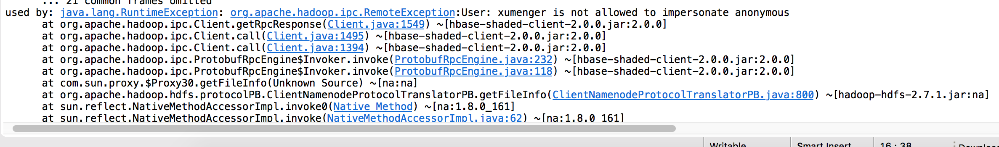
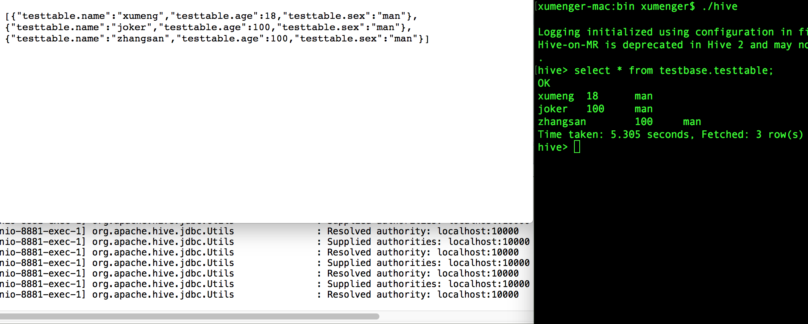
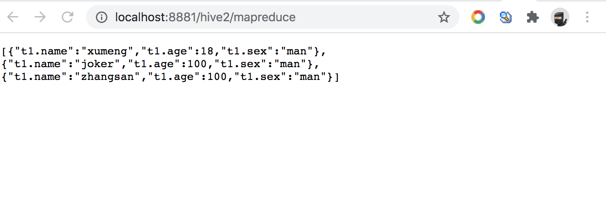
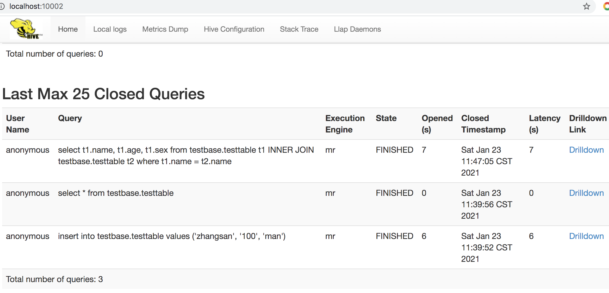
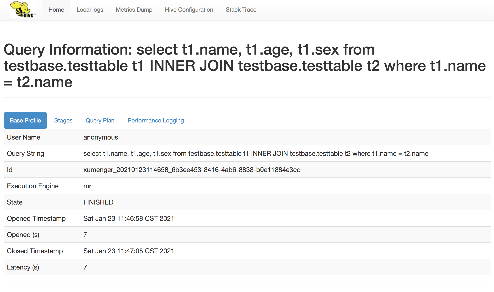

>[https://cwiki.apache.org/confluence/display/Hive/HiveServer2+Clients](https://cwiki.apache.org/confluence/display/Hive/HiveServer2+Clients)

首先添加Maven 依赖

```xml
<dependency>
  <groupId>org.apache.hive</groupId>
  <artifactId>hive-jdbc</artifactId>
  <version>2.3.3</version>
  <exclusions>
    <exclusion>
      <groupId>org.eclipse.jetty.aggregate</groupId>
      <artifactId>*</artifactId>
    </exclusion>
    <exclusion>
      <groupId>jdk.tools</groupId>
      <artifactId>jdk.tools</artifactId>
    </exclusion>
  </exclusions>
</dependency>
```

HiveServer 默认端口是10000，可以在/etc/hive/conf/hive-env.sh 中 export HIVE_SERVER2_THRIFT_PORT=<port> 来更新默认端口

在application.yml 中添加配置信息

```yml
hive:
  url: jdbc:hive2://localhost:10000/testbase
  driver-class-name: org.apache.hive.jdbc.HiveDriver
  # 当前我的环境没有为Hive 设置密码，所以这里填空
  user: 
  password: 
```

配置数据源

```java
package com.xum.demo13.hive;


import org.apache.tomcat.jdbc.pool.DataSource;
import org.springframework.beans.factory.annotation.Value;
import org.springframework.context.annotation.Bean;
import org.springframework.context.annotation.Configuration;
import org.springframework.jdbc.core.JdbcTemplate;

@Configuration
public class HiveJdbcConfig {

    @Value("${hive.url}")
    private String url;

    @Value("${hive.driver-class-name}")
    private String driver;

    @Value("${hive.user}")
    private String user;

    @Value("${hive.password}")
    private String password;

    @Bean
    public DataSource dataSource(){
        DataSource dataSource = new DataSource();
        dataSource.setUrl(url);
        dataSource.setDriverClassName(driver);
        dataSource.setUsername(user);
        dataSource.setPassword(password);
        return dataSource;
    }

    @Bean
    public JdbcTemplate jdbcTemplate(DataSource dataSource){
        return new JdbcTemplate(dataSource);
    }
}
```

实现一个简单的查询

```java
package com.xum.demo13.hive;

import java.util.List;
import java.util.Map;

import org.springframework.beans.factory.annotation.Autowired;
import org.springframework.beans.factory.annotation.Qualifier;
import org.springframework.jdbc.core.JdbcTemplate;
import org.springframework.web.bind.annotation.RequestMapping;
import org.springframework.web.bind.annotation.RestController;

@RestController
@RequestMapping("/hive2")
public class TestController 
{
	@Autowired
    @Qualifier("jdbcTemplate")
    private JdbcTemplate jdbcTemplate;

    @RequestMapping("/testtable")
    public List<Map<String, Object>> list() {
    	String sql1 = "insert into testbase.testtable values ('zhangsan', '100', 'man')";
    	jdbcTemplate.update(sql1);
    	
        String sql2 = "select * from testbase.testtable";
        List<Map<String, Object>> list = jdbcTemplate.queryForList(sql2);
        return list;
    }
}
```

在浏览器输入[http://localhost:8881/hive2/testtable](http://localhost:8881/hive2/testtable)。运行的时候可能出现如下报错



方案是修改Hadoop 的配置，/Users/xumenger/Desktop/library/hadoop-2.10.1/hadoop-2.10.1/etc/hadoop/core-site.xml，添加如下配置

```xml
<property>
    <name>hadoop.proxyuser.root.hosts</name>
    <value>*</value>
</property>
<property>
    <name>hadoop.proxyuser.root.groups</name>
    <value>*</value>
</property>
<property>
    <name>hadoop.proxyuser.xumenger.hosts</name>
    <value>*</value>
</property>
<property>
    <name>hadoop.proxyuser.xumenger.groups</name>
    <value>*</value>
</property>
```

修改HDFS 的配置，/Users/xumenger/Desktop/library/hadoop-2.10.1/hadoop-2.10.1/etc/hadoop/hdfs-site.xml，添加如下配置

```xml
<property>
  <name>dfs.permissions.enabled</name>
  <value>false</value>
</property>
```

然后重启HDFS、Hive！重新执行测试，结果如下



## Hive 执行计划分析

再添加一个测试用的Controller，用这个SQL 测试一下Hive 的执行计划

```java
@RequestMapping("/mapreduce")
public List<Map<String, Object>> mapreduce() {
    String sql2 = "select t1.name, t1.age, t1.sex from testbase.testtable t1 INNER JOIN testbase.testtable t2 where t1.name = t2.name ";
    List<Map<String, Object>> list = jdbcTemplate.queryForList(sql2);
    return list;
}
```

在浏览器输入[http://localhost:8881/hive2/mapreduce](http://localhost:8881/hive2/mapreduce)，输出结果如下



去HiveServer2 的Web UI [http://localhost:10002/](http://localhost:10002/) 可以看到这个SQL 的执行情况，包括之前执行过的SQL



点击上面对应SQL 后面的 Drilldown 链接，可以查看这个SQL 的执行情况：基本性能（Base Profile）、执行阶段（Stages）、执行计划（Query Plan）、详细的性能日志（Performance Logging）



在只有3 条数据的情况下，这个SQL 执行耗时了6、7 秒的时间，那么就引申出一些问题

* 如果使用Hive On Spark，那么执行时间会有多少的提升
* 怎么将Hive 的引擎替换为Spark？
* 如果有千万级别的数据量，两个表需要关联查询，这个耗时大概会有多久
* 如何对Hive 的SQL 进行分析和调优？
