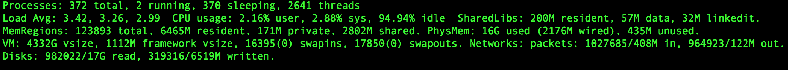
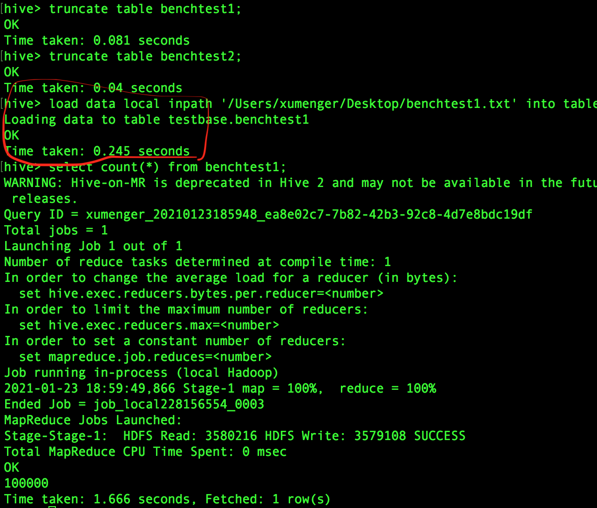
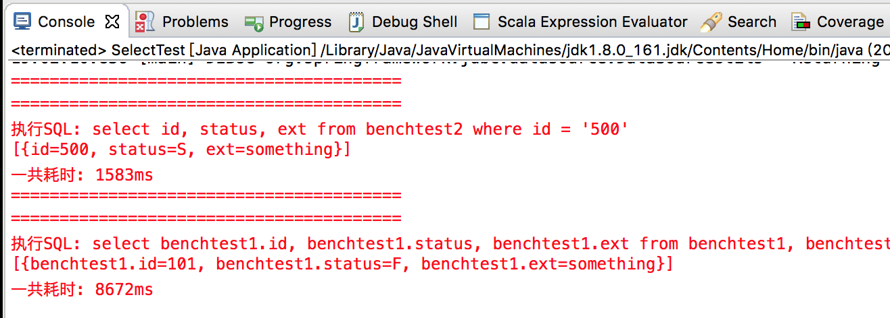
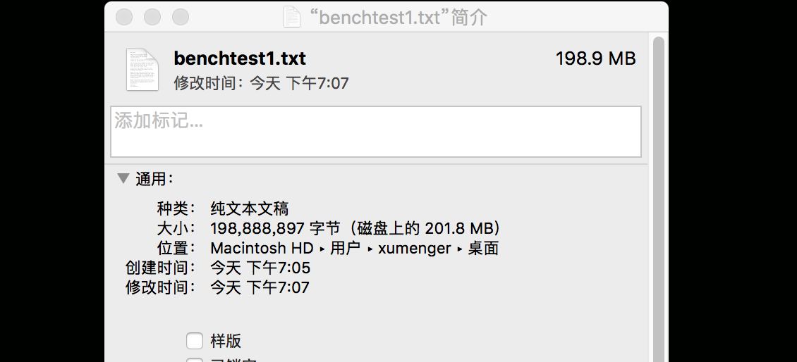
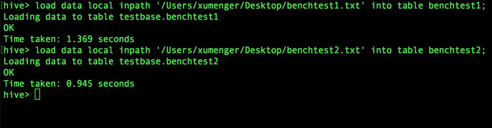
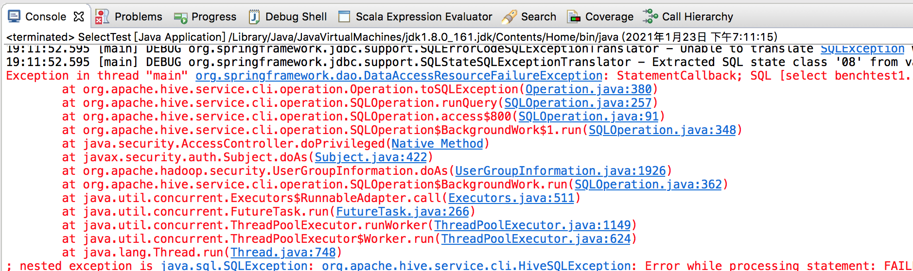
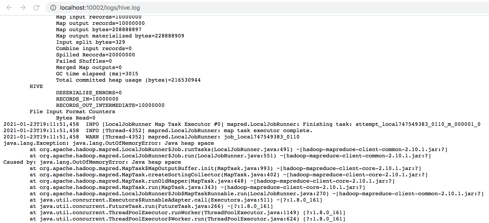
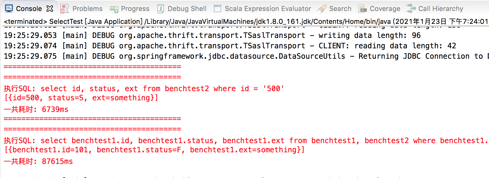

Hive 默认是将SQL 编译为MapReduce 任务然后执行的，那么这里简单测试在百万级别的数据量的情况下，Hive 聚合统计、单笔查询的性能

在单机上进行如下测试，正常情况下机器的内存、CPU 占用如下（top 命令查看）



当前机器的剩余存储空间是42.45 G


首先在Hive 的testbase 数据库下创建测试需要的数据库

```sql
use testbase;
create table benchtest1(id string, status string, ext string);
create table benchtest2(id string, status string, ext string);
```

insert into benchtest1 values ('1', 'S', 'something')

补充，可以用下面的SQL 删除数据，并保存表结构

```sql
truncate table benchtest1;
truncate table benchtest2;
```

然后使用Java 编写测试程序，构造100 万条测试数据

```java
package com.xum.demo14.hive.bench;

import java.util.List;
import java.util.Map;

import org.apache.tomcat.jdbc.pool.DataSource;
import org.springframework.jdbc.core.JdbcTemplate;

public class Application {

    public static void main(String args[])
    {
        DataSource dataSource = new DataSource();
        dataSource.setUrl("jdbc:hive2://localhost:10000/testbase");
        dataSource.setDriverClassName("org.apache.hive.jdbc.HiveDriver");
        dataSource.setUsername("");
        dataSource.setPassword("");
        
        JdbcTemplate jdbcTemplate = new JdbcTemplate(dataSource);
        
        // 一共构造total 条测试数据，第diff 条的的status 字段的值不一致
        int total = 10000;
        int diff = 500;
        
        Long mark1 = System.currentTimeMillis();
        System.err.println(String.format("准备%d 条测试数据 ==> benchtest1", total));
        for (int i = 1; i<= total; i++) {
            String sql = "";
            if (i != diff) {
                sql = String.format("insert into benchtest1 values ('%d', 'S', 'something')", i);
            } else {
                sql = String.format("insert into benchtest1 values ('%d', 'F', 'something')", i);
            }
            jdbcTemplate.update(sql);
        }
        Long mark2 = System.currentTimeMillis();
        System.err.println("一共耗时: " + (mark2 - mark1) + "ms");
    }
}
```

这种方案不考虑，每个insert 的耗时都要几秒钟的时间，如果想要构造几万、几十万、几百万条数据，用这种方式，要到天荒地老去了！

必须明确的是，把每条数据处理成insert 语句的方式，肯定是最低效的，不管是在MySQL 中，还是在分布式组件Hive 中。这种方式的资源消耗，更多的花在了连接、SQL 语句的解析、执行计划生成上，实际插入数据的开销还是相对较少的

## 文件批量导入数据

删除上面的数据表指定用下面的格式创建数据表，表在HDFS 中会以文本文件的形式存储，列之间用, 分割

```sql
use testbase;
drop table benchtest1;
drop table benchtest2;


create table benchtest1(id string, status string, ext string) 
ROW FORMAT DELIMITED 
FIELDS TERMINATED BY ','
STORED AS TEXTFILE;

create table benchtest2(id string, status string, ext string)
ROW FORMAT DELIMITED 
FIELDS TERMINATED BY ','
STORED AS TEXTFILE;
```

关于Hive 中表的存储格式，这个可以作为一个好好扩展的研究方向，不过使用文本形式的表格式，insert 的耗时依然是在秒级别的！

编写程序生成测试数据

```java
package com.xum.demo14.hive.bench;

import java.io.FileOutputStream;
import java.io.IOException;

public class BatchImport {

    public static void main(String args[]) throws IOException
    {
        // 构造数据放到文件中，用于后续批量导入
        FileOutputStream fos1 = new FileOutputStream("/Users/xumenger/Desktop/benchtest1.txt");
        FileOutputStream fos2 = new FileOutputStream("/Users/xumenger/Desktop/benchtest2.txt");
        
        // 一共构造total 条测试数据，第diff 条的的status 字段的值不一致
        int total = 100000;
        int diff = 101;
        
        StringBuilder sb = new StringBuilder();   // 线程不安全
        
        sb.append(String.format("准备%d 条测试数据 ==> benchtest1\n", total));
        for (int i = 1; i<= total; i++) {
            if (i != diff) {
                String s = String.format("%d,S,something\n", i);
                fos1.write(s.getBytes());
            } else {
                String s = String.format("%d,F,something\n", i);
                fos1.write(s.getBytes());
            }
        }
        
        for (int i = 1; i<= total; i++) {
            String s = String.format("%d,S,something\n", i);
            fos2.write(s.getBytes());
        }
        
        // 关闭文件
        fos1.close();
        fos2.close();
        
        System.out.println("执行完成");
    }
}
```

在hive 环境下将文件导入到数据表

```sql
load data local inpath '/Users/xumenger/Desktop/benchtest1.txt' into table benchtest1;
load data local inpath '/Users/xumenger/Desktop/benchtest2.txt' into table benchtest2;
```

经过测试导入10 万条数据大概耗时0.245 秒，显然这种方式新增数据的性能快得多！



>[hive的数据导入与数据导出：（本地，云hdfs，hbase），列分隔符的设置，以及hdfs上传给pig如何处理](https://www.cnblogs.com/cl1024cl/p/6205403.html)

>[hive: 创建内部表外部表，导入数据几种方式。](https://blog.csdn.net/lucklilili/article/details/94719811)

>[hive ,从hdfs把数据文件load导入到表](https://blog.csdn.net/u010002184/article/details/89605368)

>能不能按照文本文件的形式存储Hive 的内部表？

>Hive 内部表？Hive 外部表？

## 查询性能测试

基于上面的数据进行如下测试

```java
package com.xum.demo14.hive.bench;

import java.util.List;
import java.util.Map;

import org.apache.tomcat.jdbc.pool.DataSource;
import org.springframework.jdbc.core.JdbcTemplate;

public class SelectTest {
    public static void main(String args[])
    {
        DataSource dataSource = new DataSource();
        dataSource.setUrl("jdbc:hive2://localhost:10000/testbase");
        dataSource.setDriverClassName("org.apache.hive.jdbc.HiveDriver");
        dataSource.setUsername("");
        dataSource.setPassword("");
        
        JdbcTemplate jdbcTemplate = new JdbcTemplate(dataSource);
        
        int index = 500;
        
        StringBuilder sb = new StringBuilder();   // 线程不安全
        
        Long mark1 = System.currentTimeMillis();
        sb.append("========================================\n");
        sb.append("========================================\n");
        sb.append(String.format("执行SQL: select id, status, ext from benchtest2 where id = '%d' \n", index));
        String sql1 = String.format("select id, status, ext from benchtest2 where id = '%d' ", index);
        List<Map<String, Object>> list1 = jdbcTemplate.queryForList(sql1);
        sb.append(list1 + "\n");
        Long mark2 = System.currentTimeMillis();
        sb.append("一共耗时: " + (mark2 - mark1) + "ms\n");
        
        
        sb.append("========================================\n");
        sb.append("========================================\n");
        sb.append("执行SQL: select benchtest1.id, benchtest1.status, benchtest1.ext from benchtest1, benchtest2 where benchtest1.id = benchtest2.id and benchtest1.status != benchtest2.status\n");
        String sql2 = "select benchtest1.id, benchtest1.status, benchtest1.ext from benchtest1, benchtest2 where benchtest1.id = benchtest2.id and benchtest1.status != benchtest2.status ";
        List<Map<String, Object>> list2 = jdbcTemplate.queryForList(sql2);
        sb.append(list2 + "\n");
        Long mark3 = System.currentTimeMillis();
        sb.append("一共耗时: " + (mark3 - mark1) + "ms\n");
        
        // 输出测试结果
        System.err.println(sb.toString());
        
        dataSource.close();
    }
}
```

执行的结果如下，单条查询耗时1.5 秒，两张表关联查询耗时8.6 秒（当然这个是在没有做过针对性调优的单机上！）



## 1000 万条数据呢

删除表，构建1000 万条数据，这1000 万条的数据量在磁盘上是198.9 MB



导入这1000 万条数据，耗时在1 秒左右



然后测试一下两种查询的性能，但是执行的过程中抛出异常



```
Exception in thread "main" org.springframework.dao.DataAccessResourceFailureException: StatementCallback; SQL [select benchtest1.id, benchtest1.status, benchtest1.ext from benchtest1, benchtest2 where benchtest1.id = benchtest2.id and benchtest1.status != benchtest2.status ]; org.apache.hive.service.cli.HiveSQLException: Error while processing statement: FAILED: Execution Error, return code 2 from org.apache.hadoop.hive.ql.exec.mr.MapRedTask
    at org.apache.hive.service.cli.operation.Operation.toSQLException(Operation.java:380)
    at org.apache.hive.service.cli.operation.SQLOperation.runQuery(SQLOperation.java:257)
    at org.apache.hive.service.cli.operation.SQLOperation.access$800(SQLOperation.java:91)
    at org.apache.hive.service.cli.operation.SQLOperation$BackgroundWork$1.run(SQLOperation.java:348)
    at java.security.AccessController.doPrivileged(Native Method)
    at javax.security.auth.Subject.doAs(Subject.java:422)
    at org.apache.hadoop.security.UserGroupInformation.doAs(UserGroupInformation.java:1926)
    at org.apache.hive.service.cli.operation.SQLOperation$BackgroundWork.run(SQLOperation.java:362)
    at java.util.concurrent.Executors$RunnableAdapter.call(Executors.java:511)
    at java.util.concurrent.FutureTask.run(FutureTask.java:266)
    at java.util.concurrent.ThreadPoolExecutor.runWorker(ThreadPoolExecutor.java:1149)
    at java.util.concurrent.ThreadPoolExecutor$Worker.run(ThreadPoolExecutor.java:624)
    at java.lang.Thread.run(Thread.java:748)
```

具体是在执行这个SQL: select benchtest1.id, benchtest1.status, benchtest1.ext from benchtest1, benchtest2 where benchtest1.id = benchtest2.id and benchtest1.status != benchtest2.status

错误信息是: org.apache.hive.service.cli.HiveSQLException: Error while processing statement: FAILED: Execution Error, return code 2 from org.apache.hadoop.hive.ql.exec.mr.MapRedTask

具体去[http://localhost:10002/logs/hive.log](http://localhost:10002/logs/hive.log) 查看响应的异常日志



```
2021-01-23T19:11:51,458  WARN [Thread-4352] mapred.LocalJobRunner: job_local747549383_0110
java.lang.Exception: java.lang.OutOfMemoryError: Java heap space
    at org.apache.hadoop.mapred.LocalJobRunner$Job.runTasks(LocalJobRunner.java:491) ~[hadoop-mapreduce-client-common-2.10.1.jar:?]
    at org.apache.hadoop.mapred.LocalJobRunner$Job.run(LocalJobRunner.java:551) ~[hadoop-mapreduce-client-common-2.10.1.jar:?]
Caused by: java.lang.OutOfMemoryError: Java heap space
    at org.apache.hadoop.mapred.MapTask$MapOutputBuffer.init(MapTask.java:993) ~[hadoop-mapreduce-client-core-2.10.1.jar:?]
    at org.apache.hadoop.mapred.MapTask.createSortingCollector(MapTask.java:402) ~[hadoop-mapreduce-client-core-2.10.1.jar:?]
    at org.apache.hadoop.mapred.MapTask.runOldMapper(MapTask.java:448) ~[hadoop-mapreduce-client-core-2.10.1.jar:?]
    at org.apache.hadoop.mapred.MapTask.run(MapTask.java:343) ~[hadoop-mapreduce-client-core-2.10.1.jar:?]
    at org.apache.hadoop.mapred.LocalJobRunner$Job$MapTaskRunnable.run(LocalJobRunner.java:270) ~[hadoop-mapreduce-client-common-2.10.1.jar:?]
    at java.util.concurrent.Executors$RunnableAdapter.call(Executors.java:511) ~[?:1.8.0_161]
    at java.util.concurrent.FutureTask.run(FutureTask.java:266) ~[?:1.8.0_161]
    at java.util.concurrent.ThreadPoolExecutor.runWorker(ThreadPoolExecutor.java:1149) [?:1.8.0_161]
    at java.util.concurrent.ThreadPoolExecutor$Worker.run(ThreadPoolExecutor.java:624) [?:1.8.0_161]
    at java.lang.Thread.run(Thread.java:748) [?:1.8.0_161]
```

发现是在执行MapTask 的时候出现了JVM 堆内存溢出，而且HiveServer2 也挂了

接下来先重启HiveServer2，然后在hive 命令环境设置Map 阶段的JVM 堆内存！

```
hive> set mapreduce.map.memory.mb=10150;
hive> set mapreduce.map.java.opts=-Xmx6144m;
```

当然JVM 堆内存溢出也有可能发生在Reduce 阶段，类似的设置堆内存参数的方法如下

```
hive> set mapreduce.reduce.memory.mb=10150; 
hive> set mapreduce.reduce.java.opts=-Xmx8120m;
```

然后重新运行上面的测试程序，单条查询耗时6.7 秒，两表关联查询的耗时是87.6 秒！



>以上对于单机情况下的Hive 性能有了一个感性的认知，但是怎么调优？为什么会有Map 阶段的堆内存溢出？SQL 是怎么转换成Map Reduce 任务的？Hive、YARN 调优？如果Hive 使用Spark 引擎会怎么样？这些问题还没有一个系统化的研究

>当然一切都基于对于Hadoop、Hive、YARN、Spark 底层原理的深究！！！

>调优是接下来的一个重点（Hive 参数、YARN 参数、Spark 参数、HDFS 参数）！！！因为在实际的生产环境中，我们的数据量远不止千万级别！

>Hive 表分区？Hive 表格式？Hive 与关系型数据库对比？

## analyze 表信息分析

>[Hive性能调优工具](https://zhuanlan.zhihu.com/p/334438403)

analyze 语句可以收集一些详细的统计信息，比如表的行数、文件数、数据的大小等信息。这些统计信息作为元数据存储在hive 的元数据库中

收集表的统计信息(非分区表)，当指定NOSCAN关键字时，会忽略扫描文件内容，仅仅统计文件的数量与大小，速度会比较快

```sql
ANALYZE TABLE 表名 COMPUTE STATISTICS; 
ANALYZE TABLE 表名 COMPUTE STATISTICS NOSCAN;
```

收集分区表的统计信息

```sql
ANALYZE TABLE 表名 PARTITION(分区1，分区2) COMPUTE STATISTICS;
```

收集指定分区信息

```sql
ANALYZE TABLE 表名 PARTITION(分区1='xxx'，分区2='yyy') COMPUTE STATISTICS;
```

收集表的某个字段的统计信息

```sql
ANALYZE TABLE 表名 COMPUTE STATISTICS FOR COLUMNS 字段名 ; 
```

## explain 执行计划分析

在hive 命令行中可以通过explain 命令分析SQL 的执行计划（和MySQL 的explain 类似！）

```sql
hive > explain select benchtest1.id, benchtest1.status, benchtest1.ext from benchtest1, benchtest2 where benchtest1.id = benchtest2.id and benchtest1.status != benchtest2.status;
OK
STAGE DEPENDENCIES:
  Stage-4 is a root stage
  Stage-3 depends on stages: Stage-4
  Stage-0 depends on stages: Stage-3

STAGE PLANS:
  Stage: Stage-4
    Map Reduce Local Work
      Alias -> Map Local Tables:
        $hdt$_0:benchtest1 
          Fetch Operator
            limit: -1
      Alias -> Map Local Operator Tree:
        $hdt$_0:benchtest1 
          TableScan
            alias: benchtest1
            Statistics: Num rows: 4 Data size: 1206 Basic stats: COMPLETE Column stats: NONE
            Filter Operator
              predicate: id is not null (type: boolean)
              Statistics: Num rows: 4 Data size: 1206 Basic stats: COMPLETE Column stats: NONE
              Select Operator
                expressions: id (type: string), status (type: string), ext (type: string)
                outputColumnNames: _col0, _col1, _col2
                Statistics: Num rows: 4 Data size: 1206 Basic stats: COMPLETE Column stats: NONE
                HashTable Sink Operator
                  keys:
                    0 _col0 (type: string)
                    1 _col0 (type: string)

  Stage: Stage-3
    Map Reduce
      Map Operator Tree:
          TableScan
            alias: benchtest2
            Statistics: Num rows: 1 Data size: 0 Basic stats: PARTIAL Column stats: NONE
            Filter Operator
              predicate: id is not null (type: boolean)
              Statistics: Num rows: 1 Data size: 0 Basic stats: PARTIAL Column stats: NONE
              Select Operator
                expressions: id (type: string), status (type: string)
                outputColumnNames: _col0, _col1
                Statistics: Num rows: 1 Data size: 0 Basic stats: PARTIAL Column stats: NONE
                Map Join Operator
                  condition map:
                       Inner Join 0 to 1
                  keys:
                    0 _col0 (type: string)
                    1 _col0 (type: string)
                  outputColumnNames: _col0, _col1, _col2, _col4
                  Statistics: Num rows: 4 Data size: 1326 Basic stats: COMPLETE Column stats: NONE
                  Filter Operator
                    predicate: (_col1 <> _col4) (type: boolean)
                    Statistics: Num rows: 4 Data size: 1326 Basic stats: COMPLETE Column stats: NONE
                    Select Operator
                      expressions: _col0 (type: string), _col1 (type: string), _col2 (type: string)
                      outputColumnNames: _col0, _col1, _col2
                      Statistics: Num rows: 4 Data size: 1326 Basic stats: COMPLETE Column stats: NONE
                      File Output Operator
                        compressed: false
                        Statistics: Num rows: 4 Data size: 1326 Basic stats: COMPLETE Column stats: NONE
                        table:
                            input format: org.apache.hadoop.mapred.SequenceFileInputFormat
                            output format: org.apache.hadoop.hive.ql.io.HiveSequenceFileOutputFormat
                            serde: org.apache.hadoop.hive.serde2.lazy.LazySimpleSerDe
      Local Work:
        Map Reduce Local Work

  Stage: Stage-0
    Fetch Operator
      limit: -1
      Processor Tree:
        ListSink
```

>如果使用Spark 作为执行引擎呢，SQL 的执行性能会快多少？

>[https://amplab.cs.berkeley.edu/benchmark/](https://amplab.cs.berkeley.edu/benchmark/)
