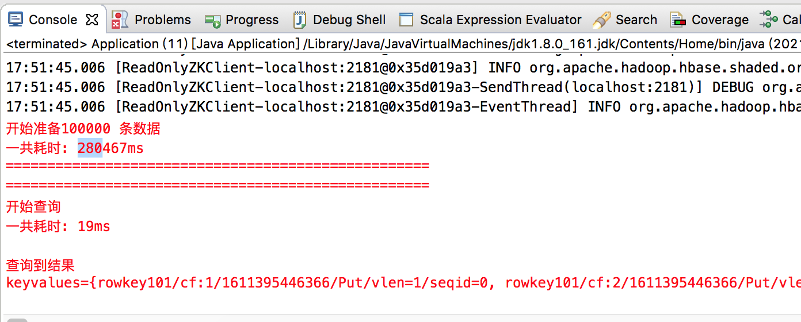
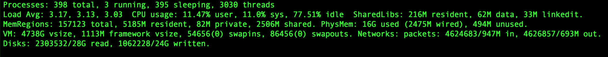

上一篇中对于Hive 进行简单的性能测试，本文对于HBase 的读写性能进行简单测试

首先准备测试用的表

```sql
# 建表
create 'testbench1', 'cf'

# 删除表
disable 'testbench1'
drop 'testbench1'
```

编写测试程序如下

```java
package com.xum.demo15.hbase.bench;

import java.io.IOException;
import java.util.concurrent.ExecutorService;
import java.util.concurrent.Executors;

import org.apache.hadoop.conf.Configuration;
import org.apache.hadoop.hbase.HBaseConfiguration;
import org.apache.hadoop.hbase.TableName;
import org.apache.hadoop.hbase.client.Connection;
import org.apache.hadoop.hbase.client.ConnectionFactory;
import org.apache.hadoop.hbase.client.Get;
import org.apache.hadoop.hbase.client.Put;
import org.apache.hadoop.hbase.client.Result;
import org.apache.hadoop.hbase.client.Table;
import org.apache.hadoop.hbase.util.Bytes;

public class Application 
{
    public static void main(String args[]) throws IOException 
    {
        ExecutorService pool = Executors.newScheduledThreadPool(10);
        Configuration conf = HBaseConfiguration.create();
        conf.set("hbase.zookeeper.quorum", "localhost:2181");
        Connection connection = ConnectionFactory.createConnection(conf, pool);
        
        StringBuilder sb = new StringBuilder();   // 线程不安全
        
        // 构造total 条数据，search 用于查询
        int total = 100000;
        int search = 101;
        
        TableName name = TableName.valueOf("testbench1");
        Table table = connection.getTable(name);
        
        sb.append(String.format("开始准备%d 条数据\n", total));
        Long mark1 = System.currentTimeMillis();
        for (int i=1; i<=total; i++) {
            Put put = new Put(Bytes.toBytes("rowkey" + i));
            // 每个rowkey 插入9 个键值对
            for (int j=1; j<10; j++) {
                put.addColumn(Bytes.toBytes("cf"), Bytes.toBytes(String.valueOf(j)), Bytes.toBytes(String.valueOf(j)));
                table.put(put);
            }
        }
        Long mark2 = System.currentTimeMillis();
        sb.append("一共耗时: " + (mark2 - mark1) + "ms\n");
        
        
        
        sb.append("===================================================\n");
        sb.append("===================================================\n");
        sb.append("开始查询\n");
        Get get = new Get(("rowkey" + search).getBytes());
        // 开始查询
        Result rs = table.get(get);
        Long mark3 = System.currentTimeMillis();
        sb.append("一共耗时: " + (mark3 - mark2) + "ms\n");
        
        System.err.println(sb.toString());
        
        System.err.println("查询到结果");
        System.err.println(rs);
    }
}
```

运行过程中CPU、内存占用情况如下



构造10 万条数据，运行效果如下



当然这是单机，在[《腾讯专家讲解：微信支付HBase实践与创新》](https://cloud.tencent.com/developer/news/321044) 中通过优化，可以达到这样的性能

* 优化之后，每秒150 万+次写入
* 优化之后，查询时耗从开始的260毫秒下降到60毫秒

>针对HBase 的读写性能该从哪些方面入手进行调优？？？！！！

>分区？

>HDFS 层面调优？

>集群配置调优？
