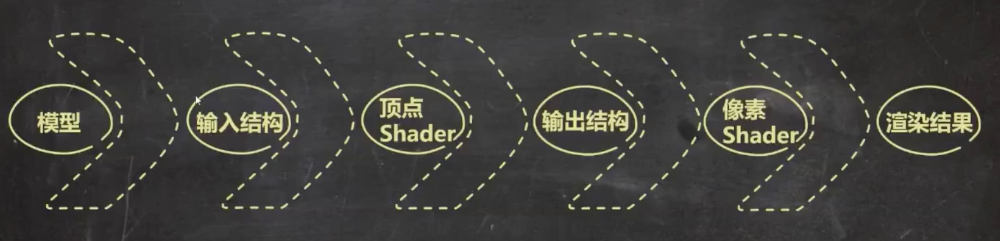
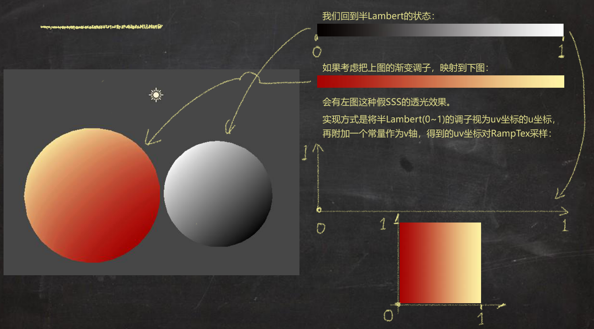
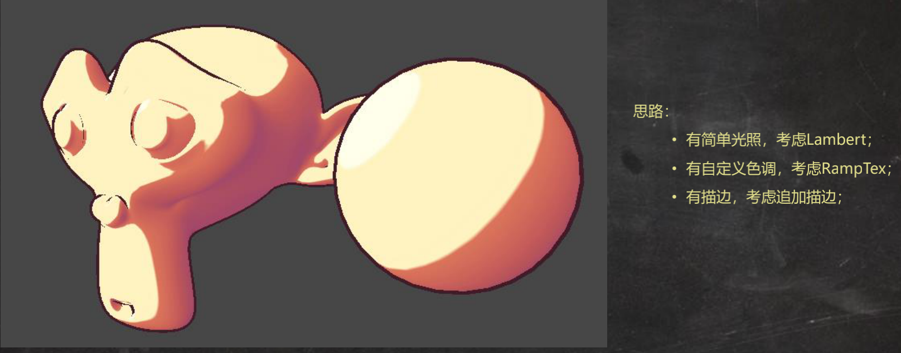
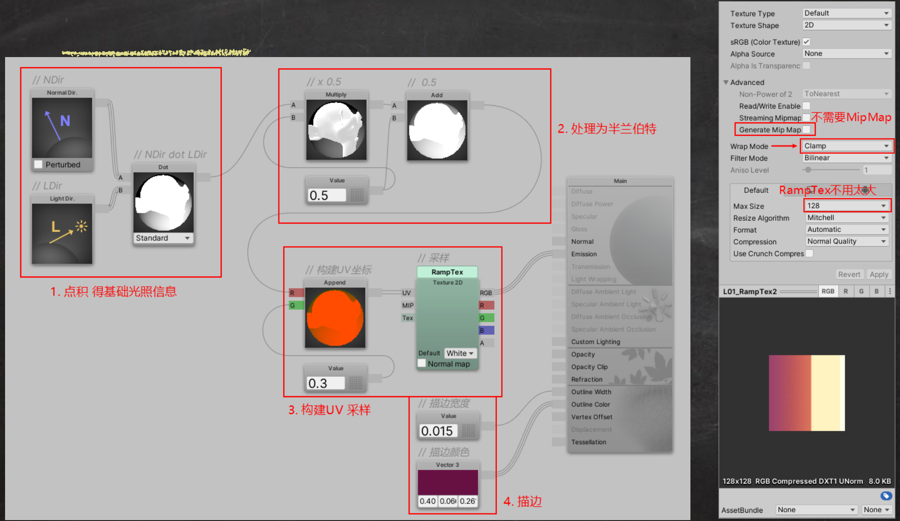
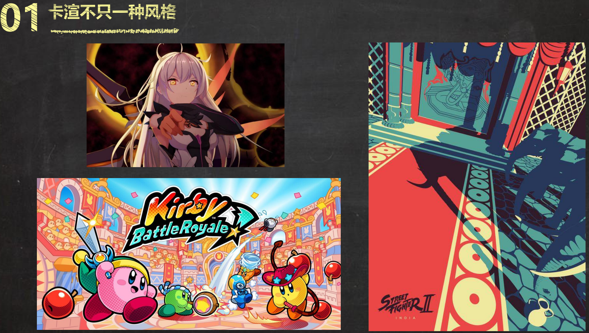
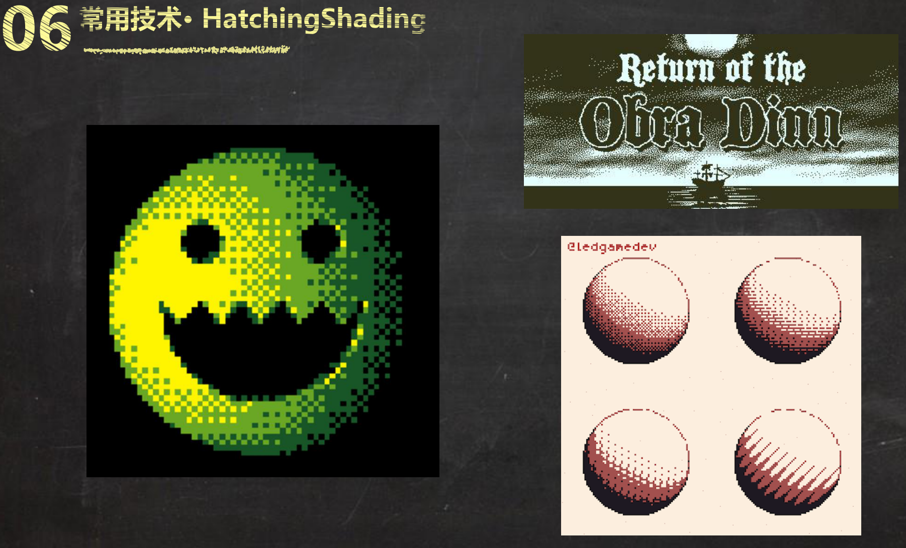
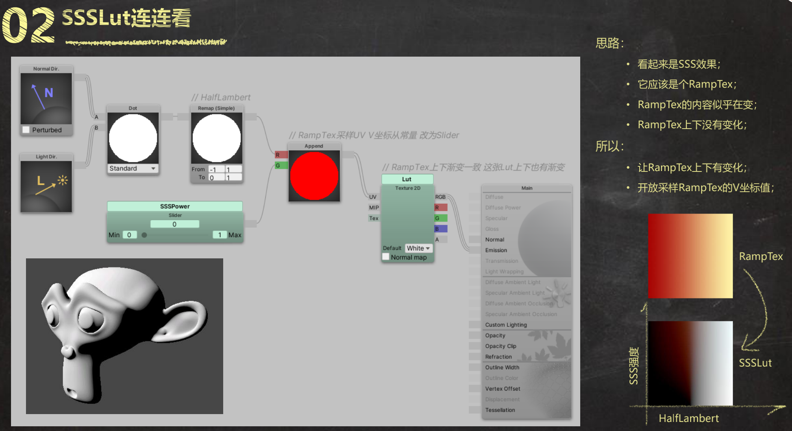
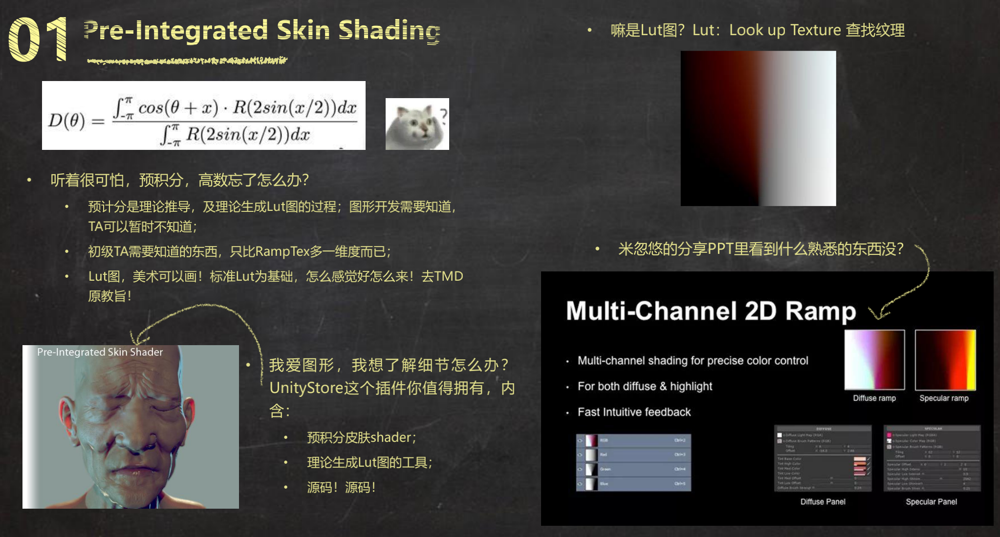
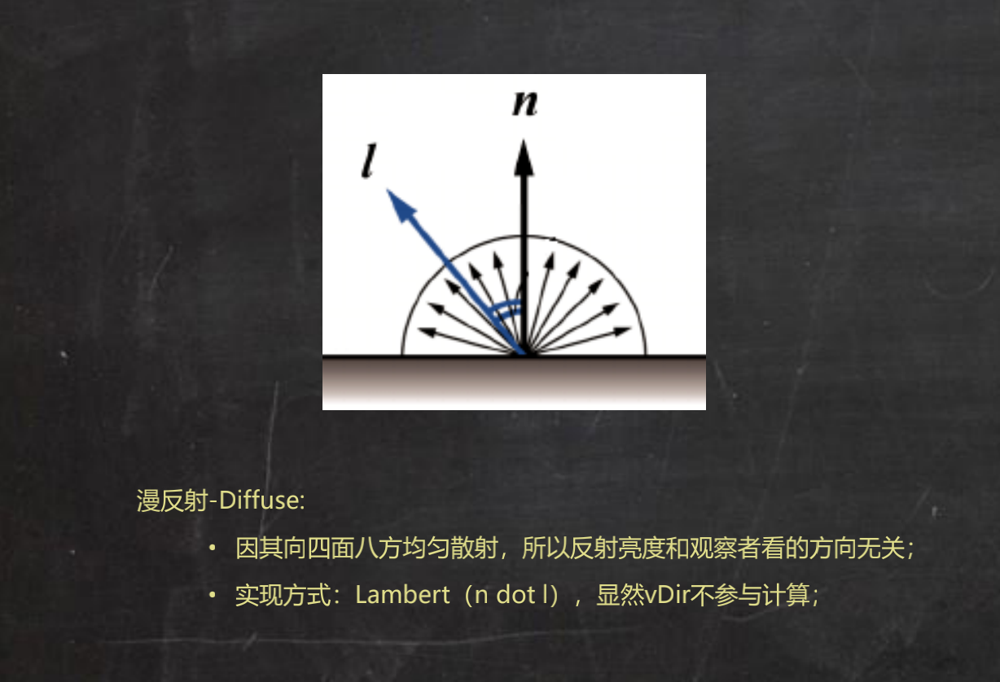
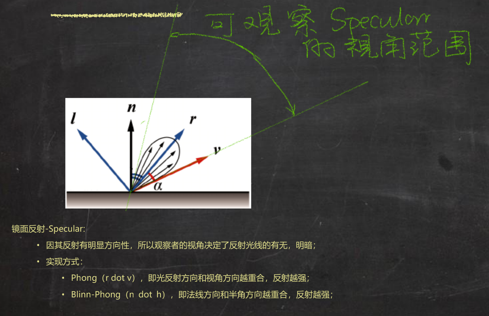

>来自[庄懂-BoyanTata](https://space.bilibili.com/6373917) 的学习笔记，随看随整理，可能会比较乱

>[https://github.com/BoyanTata/AP01](https://github.com/BoyanTata/AP01)

## [技术美术入门课-1](https://www.bilibili.com/video/BV1BE411N74b)

一般的渲染过程是这样的



渲染的输入信息包括：3D 模型带有的信息（顶点、法线、面……）、光照信息（游戏引擎传入，注意可能有多个光源）、Shader 中定义的各种类型参数（数值、颜色、贴图等）……


UV 贴图有U、V 两个分量，所以必须要有两个值才能在贴图（RampTex）上采样到某个点！



## [技术美术入门课-2](https://www.bilibili.com/video/BV1f7411f7Vj)

实现下面这个简单的卡通渲染的效果（补充：一般做卡渲的标准流程都会加上后处理去抗锯齿，下面没有涉及）



补充：绿色的节点是可以在材质面板上调节的



>使用到的技术包括：法线向量与光照向量点乘、半兰伯特光照模型、通过UV 坐标对RampTex 采样

扩展：怎么实现下面这种渲染效果？


>使用到的技术包括：法线向量与光照向量点乘、半兰伯特光照模型、高光、通过UV 坐标对RampTex 采样、菲涅尔效应、Lerp

卡通渲染不只一种风格，技术也不止一种……






## [技术美术入门课-3](https://www.bilibili.com/video/BV13E411F7Lc)

重新复习一下渲染流程


直接通过Shader 编码的方式实现兰伯特光照模型

```shader
Shader "AP01/L03/Lambert" {
    Properties {
    }
    SubShader {
        Tags {
            "RenderType"="Opaque"
        }
        Pass {
            Name "FORWARD"
            Tags {
                "LightMode"="ForwardBase"
            }

            CGPROGRAM
            #pragma vertex vert
            #pragma fragment frag
            #include "UnityCG.cginc"
            #pragma multi_compile_fwdbase_fullshadows
            #pragma target 3.0

            // 输入结构
            struct VertexInput {
                float4 vertex : POSITION;   // 将模型顶点信息输入进来
                float4 normal : NORMAL;     // 将模型法线信息输入进来
            };
            // 输出结构
            struct VertexOutput {
                float4 pos : SV_POSITION;   // 由模型顶点信息换算而来的顶点屏幕位置
                float3 nDirWS : TEXCOORD0;  // 由模型法线信息换算来的世界空间法线信息
            };

            // 输入结构>>>顶点Shader>>>输出结构
            VertexOutput vert (VertexInput v) {
                VertexOutput o = (VertexOutput)0;               // 新建一个输出结构

                // 将顶点坐标从模型空间转换为裁剪空间（屏幕空间）
                o.pos = UnityObjectToClipPos( v.vertex );       // 变换顶点信息 并将其塞给输出结构

                // 将法线方向从模型空间转换为世界空间
                o.nDirWS = UnityObjectToWorldNormal(v.normal);  // 变换法线信息 并将其塞给输出结构

                return o;                                       // 将输出结构 输出
            }

            // 输出结构>>>像素
            float4 frag(VertexOutput i) : COLOR {
                float3 nDir = i.nDirWS;                         // 获取nDir，法线向量
                float3 lDir = _WorldSpaceLightPos0.xyz;         // 获取lDir，光照向量

                // 法线向量与光照向量点积运算
                float nDotl = dot(i.nDirWS, lDir);              // nDir点积lDir

                // 因为点积运算的值可能是-1，但颜色的范围是0～1，所以对于小于0 的都转为0（黑色）
                float lambert = max(0.0, nDotl);                // 截断负值

                // 输出的结果是这个像素在屏幕上显示的颜色（RGBA四个通道）
                return float4(lambert, lambert, lambert, 1.0);  // 输出最终颜色


                // 简单展示一下怎么改成半兰伯特光照模型，修改最后两行代码
                // float halfLambert = nDotl * 0.5 + 0.5;
                // return float4(halfLambert, halfLambert, halfLambert, 1.0);
            }
            ENDCG
        }
    }
    FallBack "Diffuse"
}
```

## [技术美术入门课-4](https://www.bilibili.com/video/BV1J7411m76v)

SSSLut 效果的实现（SSS 效果，比如用灯光照手指，透过手指可以看到冒出来的偏红色的光），其中Lut 节点是在材质配置面板输入的贴图信息。这次使用的RampTex 是右下角偏下面的图，在U、V 方向颜色都有变化



>SSS 技术是在游戏开发中非常常用的技术！！

预积分皮肤技术



>高数的知识是不是忘得差不多了？这个公式是不是基本看不懂？

## [技术美术入门课-5](https://www.bilibili.com/video/BV1J7411m7ro)

>漫反射、镜面反射。兰伯特光照模型是实现漫反射的一种方式

漫反射-Diffuse，因其向四面八方均匀散射，所以反射亮度和观察者看的方向无关，一种实现方式是Lambert，即n dot l，显然与vDir 无关



镜面反射-Specular，因其反射有明显方向性，所以观察者的视角决定了反射光线的有无、明暗。实现方式有两种

* Phong，即r dot v，反射光方向和视角方向越重合，反射越强
* Blinn-Phong，即n dot h，法线方向和半角方向越重合（lDir 和vDir 中间角方向），反射越强



>从计算成本上来说，Blinn-Phong 的计算成本更低！不过对于现在机器的算力来说，应该是没有必要节省这点性能了，Phong 的视觉效果是更好的

下面将Lambert 和Blinn-Phong 模型结合实现漫反射和高光反射（这个其实是一个比较“老派”的光照模型）

```shader
Shader "AP01/L05/OldSchool" {
    Properties {
        _MainCol ("颜色", color) = (1.0, 1.0, 1.0, 1.0)
        _SpecularPow ("高光次幂", range(1, 90)) = 30
    }
    SubShader {
        Tags {
            "RenderType"="Opaque"
        }
        Pass {
            Name "FORWARD"
            Tags {
                "LightMode"="ForwardBase"
            }

            CGPROGRAM
            #pragma vertex vert
            #pragma fragment frag
            #include "UnityCG.cginc"
            #pragma multi_compile_fwdbase_fullshadows
            #pragma target 3.0

            // 输入参数
            // 修饰字（满足小朋友太多的问好, 想保发量的大家看热闹）
                // uniform  共享于vert,frag
                // attibute 仅用于vert
                // varying  用于vert,frag传数据
            uniform float3 _MainCol;     // RGB够了 float3
            uniform float _SpecularPow;  // 标量 float
            // 输入结构
            struct VertexInput {
                float4 vertex : POSITION;   // 顶点信息 Get✔
                float4 normal : NORMAL;     // 法线信息 Get✔
            };

            // 输出结构
            struct VertexOutput {
                float4 posCS : SV_POSITION;     // 裁剪空间（暂理解为屏幕空间吧）顶点位置
                float4 posWS : TEXCOORD0;       // 世界空间顶点位置
                float3 nDirWS : TEXCOORD1;      // 世界空间法线方向
            };

            // 输入结构>>>顶点Shader>>>输出结构
            VertexOutput vert (VertexInput v) {
                VertexOutput o = (VertexOutput)0;                   // 新建输出结构
                    o.posCS = UnityObjectToClipPos( v.vertex );     // 变换顶点位置 OS>CS
                    o.posWS = mul(unity_ObjectToWorld, v.vertex);   // 变换顶点位置 OS>WS
                    o.nDirWS = UnityObjectToWorldNormal(v.normal);  // 变换法线方向 OS>WS
                return o;                                           // 返回输出结构
            }

            // 输出结构>>>像素
            float4 frag(VertexOutput i) : COLOR {
                // 准备向量
                float3 nDir = normalize(i.nDirWS);
                float3 lDir = _WorldSpaceLightPos0.xyz;
                float3 vDir = normalize(_WorldSpaceCameraPos.xyz - i.posWS.xyz);

                // 两个向量相加的结果就是向量夹角中间向量
                float3 hDir = normalize(vDir + lDir);

                // 准备点积结果
                float ndotl = dot(nDir, lDir);
                float ndoth = dot(nDir, hDir);

                // 光照模型
                float lambert = max(0.0, ndotl);
                float blinnPhong = pow(max(0.0, ndoth), _SpecularPow);

                // 将lambert 求出的漫反射结果和blinnPhong 求出的高光反射结果相加作为结果
                float3 finalRGB = _MainCol * lambert + blinnPhong;

                // 返回结果
                return float4(finalRGB, 1.0);
            }
            ENDCG
        }
    }
    FallBack "Diffuse"
}
```

## [技术美术入门课-6](https://www.bilibili.com/video/BV15Z4y1j78V)

