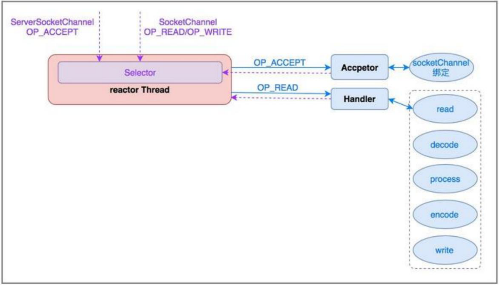
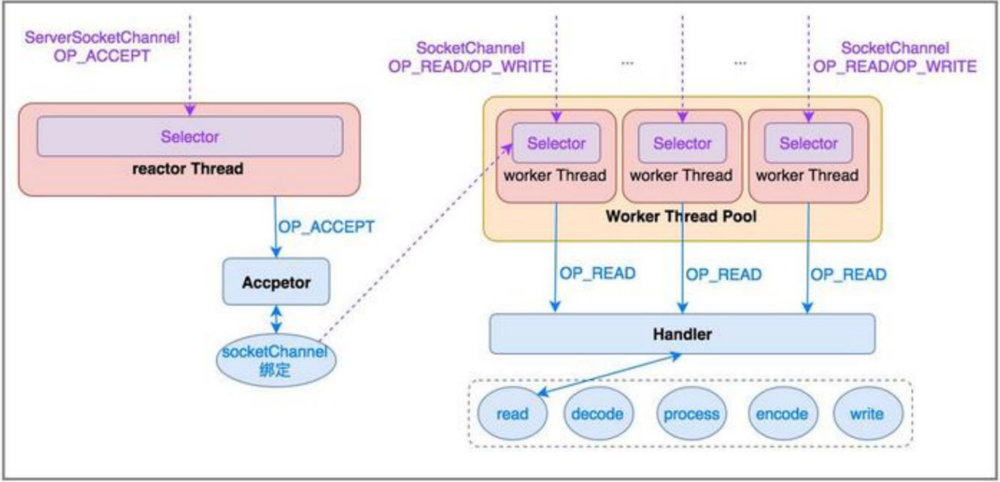

>[分布式消息队列Kafka](http://www.xumenger.com/eclipse-kafka-20181113/)

## Reactor 线程模型

在[《源码面前了无秘密【Redis】：Redis-3.0.0 源码切入点》](http://www.xumenger.com/redis-source-20210126/) 中对于Redis 的主流程进行了简单的梳理，Redis 其实就是单线程Reactor 服务端模型



而Kafka 的服务端实现则是基于Reactor 多线程模型



接下来通过源码来进入KafkaServer 的世界！

## Kafka 服务端启动类

Kafka.scala 是Kafka 服务端的启动类，main() 方法定义在这里

```scala
def main(args: Array[String]): Unit = {
  try {
    val serverProps = getPropsFromArgs(args)
    val kafkaServerStartable = KafkaServerStartable.fromProps(serverProps)

    // register signal handler to log termination due to SIGTERM, SIGHUP and SIGINT (control-c)
    registerLoggingSignalHandler()

    // attach shutdown handler to catch terminating signals as well as normal termination
    Runtime.getRuntime().addShutdownHook(new Thread("kafka-shutdown-hook") {
      override def run(): Unit = kafkaServerStartable.shutdown()
    })

    kafkaServerStartable.startup()
    kafkaServerStartable.awaitShutdown()
  }
  catch {
    case e: Throwable =>
      fatal(e)
      Exit.exit(1)
  }
  Exit.exit(0)
}
```

可以看到是通过调用KafkaServerStartable.startup() 启动Kafka 服务的，进入KafkaServerStartable 的实现中，可以看到其又是对KafkaServer 的一层封装，通过KafkaServer 启动Kafka 服务

接下来继续看KafkaServer 的源码！下面对应有我补充的注释：

```scala
/**
 * Start up API for bringing up a single instance of the Kafka server.
 * Instantiates the LogManager, the SocketServer and the request handlers - KafkaRequestHandlers
 */
def startup() {
  try {
    info("starting")

    if(isShuttingDown.get)
      throw new IllegalStateException("Kafka server is still shutting down, cannot re-start!")

    if(startupComplete.get)
      return

    val canStartup = isStartingUp.compareAndSet(false, true)
    if (canStartup) {
      // 设置Broker 的状态是正在启动
      brokerState.newState(Starting)

      /* start scheduler => 启动Kafka 调度器 */
      kafkaScheduler.startup()

      /* setup zookeeper => Kafka 是通过Zookeeper 管理元数据的 */
      zkUtils = initZk()

      /* Get or create cluster_id */
      _clusterId = getOrGenerateClusterId(zkUtils)
      info(s"Cluster ID = $clusterId")

      /* generate brokerId */
      val (brokerId, initialOfflineDirs) = getBrokerIdAndOfflineDirs
      config.brokerId = brokerId
      logContext = new LogContext(s"[KafkaServer id=${config.brokerId}] ")
      this.logIdent = logContext.logPrefix

      /* create and configure metrics */
      val reporters = config.getConfiguredInstances(KafkaConfig.MetricReporterClassesProp, classOf[MetricsReporter],
          Map[String, AnyRef](KafkaConfig.BrokerIdProp -> (config.brokerId.toString)).asJava)
      reporters.add(new JmxReporter(jmxPrefix))
      val metricConfig = KafkaServer.metricConfig(config)
      metrics = new Metrics(metricConfig, reporters, time, true)

      /* register broker metrics */
      _brokerTopicStats = new BrokerTopicStats

      quotaManagers = QuotaFactory.instantiate(config, metrics, time)
      notifyClusterListeners(kafkaMetricsReporters ++ reporters.asScala)

      logDirFailureChannel = new LogDirFailureChannel(config.logDirs.size)

      /* start log manager => 启动日志管理器 */
      logManager = LogManager(config, initialOfflineDirs, zkUtils, brokerState, kafkaScheduler, time, brokerTopicStats, logDirFailureChannel)
      logManager.startup()

      metadataCache = new MetadataCache(config.brokerId)
      credentialProvider = new CredentialProvider(config.saslEnabledMechanisms)

      // 这个类是Kafka 服务端与网络编程相关的核心类，也是后续分析的重点！
      socketServer = new SocketServer(config, metrics, time, credentialProvider)
      socketServer.startup()

      /* start replica manager => 启动副本管理器 */
      replicaManager = createReplicaManager(isShuttingDown)
      replicaManager.startup()

      /* start kafka controller */
      kafkaController = new KafkaController(config, zkUtils, time, metrics, threadNamePrefix)
      kafkaController.startup()

      adminManager = new AdminManager(config, metrics, metadataCache, zkUtils)

      /* start group coordinator */
      // Hardcode Time.SYSTEM for now as some Streams tests fail otherwise, it would be good to fix the underlying issue
      groupCoordinator = GroupCoordinator(config, zkUtils, replicaManager, Time.SYSTEM)
      groupCoordinator.startup()

      /* start transaction coordinator, with a separate background thread scheduler for transaction expiration and log loading */
      // Hardcode Time.SYSTEM for now as some Streams tests fail otherwise, it would be good to fix the underlying issue
      transactionCoordinator = TransactionCoordinator(config, replicaManager, new KafkaScheduler(threads = 1, threadNamePrefix = "transaction-log-manager-"), zkUtils, metrics, metadataCache, Time.SYSTEM)
      transactionCoordinator.startup()

      /* Get the authorizer and initialize it if one is specified.*/
      authorizer = Option(config.authorizerClassName).filter(_.nonEmpty).map { authorizerClassName =>
        val authZ = CoreUtils.createObject[Authorizer](authorizerClassName)
        authZ.configure(config.originals())
        authZ
      }

      /* start processing requests => KafkaApis 类似Redis 中的命令字典，封装了实际处理TCP 请求的逻辑
       * 可以看到初始化KafkaApis 的时候，将replicaManager、adminManager、groupCoordinator、transactionCoordinator、kafkaController、zkUtils 等传入
       * 实际KafkaApis 内部关于副本、消费组等的逻辑，也就是对应调用这些对象的API
       */
      apis = new KafkaApis(socketServer.requestChannel, replicaManager, adminManager, groupCoordinator, transactionCoordinator,
        kafkaController, zkUtils, config.brokerId, config, metadataCache, metrics, authorizer, quotaManagers,
        brokerTopicStats, clusterId, time)

      requestHandlerPool = new KafkaRequestHandlerPool(config.brokerId, socketServer.requestChannel, apis, time,
        config.numIoThreads)

      Mx4jLoader.maybeLoad()

      /* start dynamic config manager */
      dynamicConfigHandlers = Map[String, ConfigHandler](ConfigType.Topic -> new TopicConfigHandler(logManager, config, quotaManagers),
                                                         ConfigType.Client -> new ClientIdConfigHandler(quotaManagers),
                                                         ConfigType.User -> new UserConfigHandler(quotaManagers, credentialProvider),
                                                         ConfigType.Broker -> new BrokerConfigHandler(config, quotaManagers))

      // Create the config manager. start listening to notifications
      dynamicConfigManager = new DynamicConfigManager(zkUtils, dynamicConfigHandlers)
      dynamicConfigManager.startup()

      /* tell everyone we are alive */
      val listeners = config.advertisedListeners.map { endpoint =>
        if (endpoint.port == 0)
          endpoint.copy(port = socketServer.boundPort(endpoint.listenerName))
        else
          endpoint
      }
      kafkaHealthcheck = new KafkaHealthcheck(config.brokerId, listeners, zkUtils, config.rack,
        config.interBrokerProtocolVersion)
      kafkaHealthcheck.startup()

      // Now that the broker id is successfully registered via KafkaHealthcheck, checkpoint it
      checkpointBrokerId(config.brokerId)

      brokerState.newState(RunningAsBroker)
      shutdownLatch = new CountDownLatch(1)
      startupComplete.set(true)
      isStartingUp.set(false)
      AppInfoParser.registerAppInfo(jmxPrefix, config.brokerId.toString, metrics)
      info("started")
    }
  }
  catch {
    case e: Throwable =>
      fatal("Fatal error during KafkaServer startup. Prepare to shutdown", e)
      isStartingUp.set(false)
      shutdown()
      throw e
  }
}
```

本文的重点是分析Kafka 的网络编程，所以接下来分析SocketServer！另外KafkaApis 这个核心类会在后续专么讲解！

## SocketServer 

