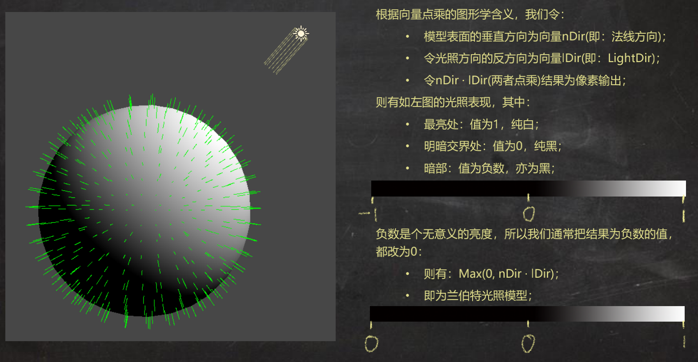
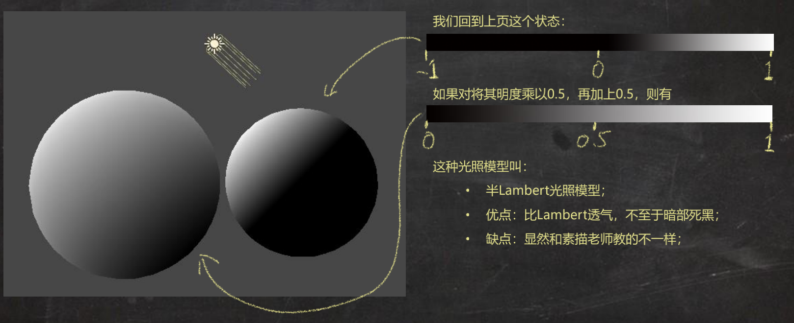
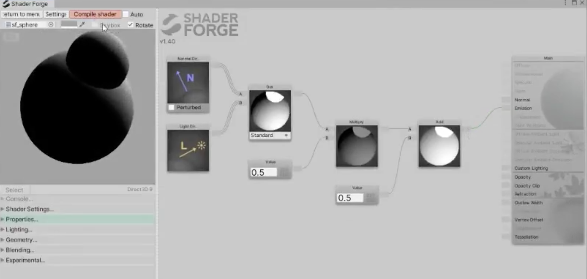
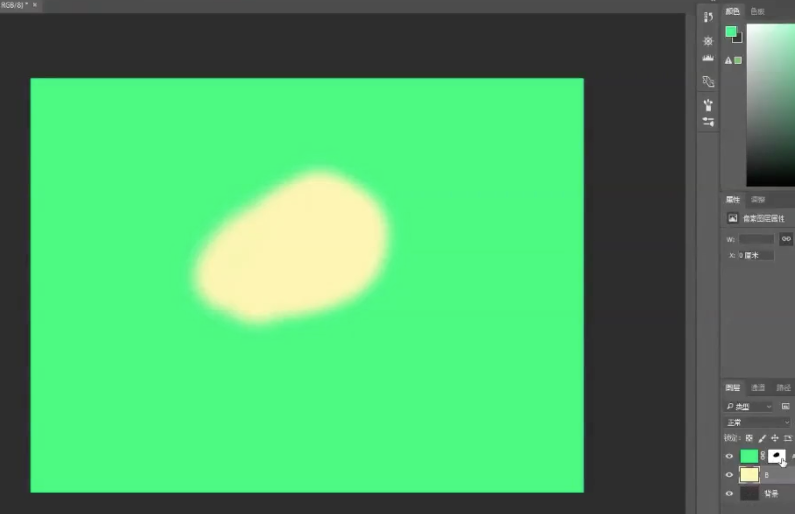
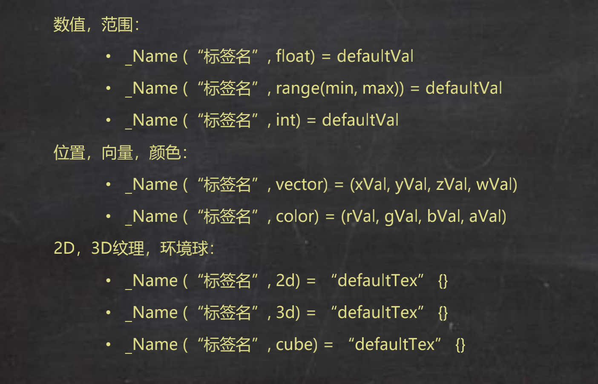
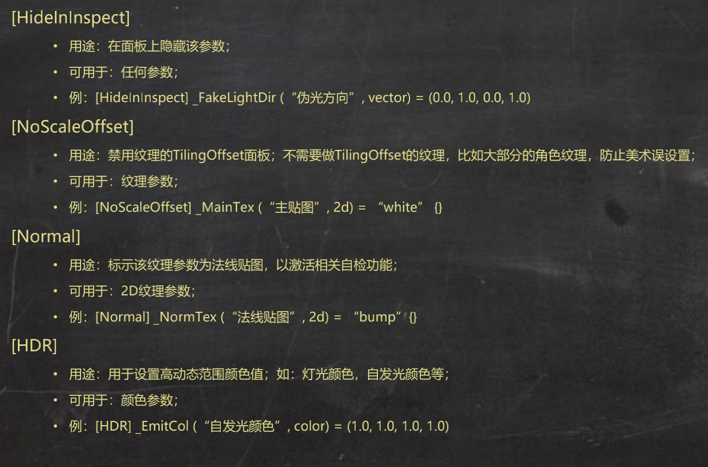
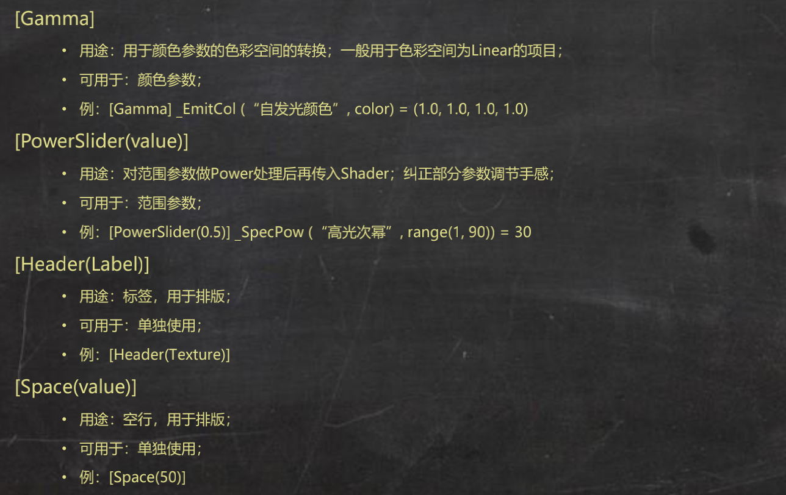
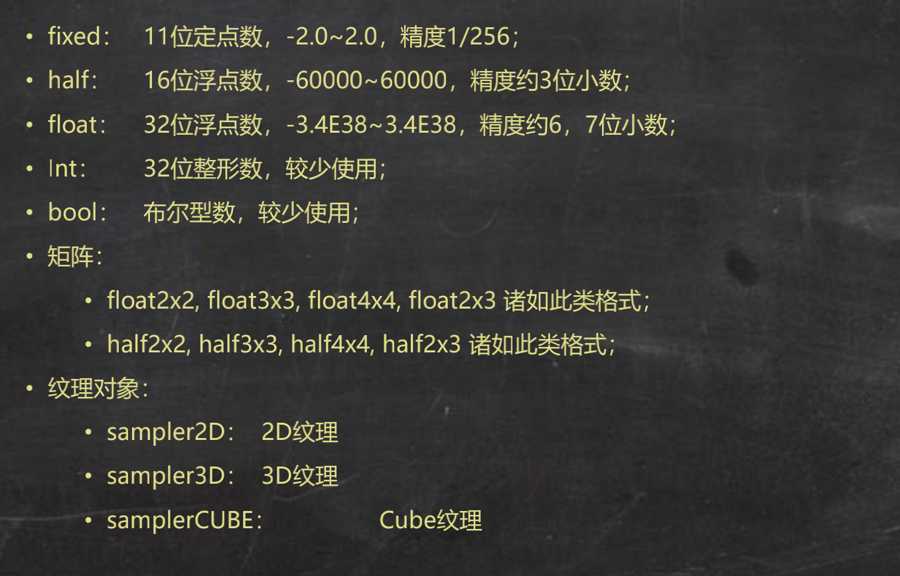
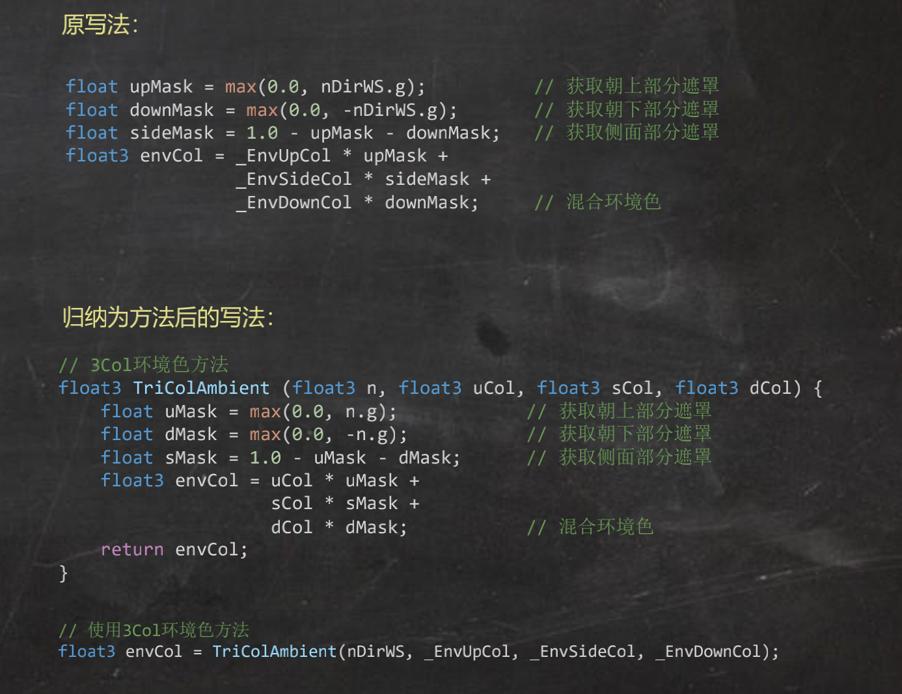
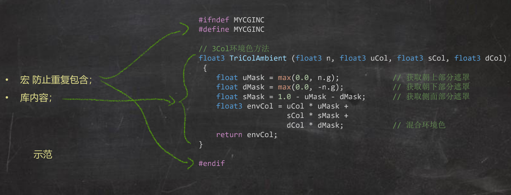

>[GAMES101-现代计算机图形学入门-闫令琪](https://www.bilibili.com/video/BV1X7411F744)

>[《线性代数》高清教学视频 “惊叹号”系列 宋浩老师](https://www.bilibili.com/video/BV1aW411Q7x1)

>[《微积分》《高等数学》全程教学视频--宋浩老师](https://www.bilibili.com/video/BV1UW411k7Jv)

>[《高等数学》同济版 全程教学视频（宋浩老师）](https://www.bilibili.com/video/BV1Eb411u7Fw)

>[《概率论与数理统计》教学视频全集（宋浩）](https://www.bilibili.com/video/BV1ot411y7mU)

>ShaderForge、ShaderGraph 中节点的方式是不是就是DAG，这个和Spark 的RDD 是不是有点类似的地方，所以更深层次，在编译原理层面是不是也有共通的地方？！

## 向量点积(dot)与兰伯特光照模型

点乘（点积、Dot）是两个向量之间的一种运算方式，结果为一个标量，其几何意义是：一个向量在另一个向量上的投影长度

结果的图形学表现为：两向量，方向相同时，结果为1（白色）；方向相反时，结果为-1（黑色）；方向垂直时，结果为0（黑色）

比如下面可以看到根据光照方向反方向和物体表面法向量的点积运算效果



上面这种其实就是所谓的兰伯特光照模型，但是明暗过度地太“突然”了，所以也就有了半兰伯特光照模型



对应在Shader Forge 中对于半兰伯特的实现很简单



>[技术美术入门课-1: https://www.bilibili.com/video/BV1BE411N74b](https://www.bilibili.com/video/BV1BE411N74b)

>游戏场景中涉及到的向量包括：模型表面法向量、光照向量、视向量

## 叉乘(mul)与空间转换

一般向量与矩阵相乘使用mul，比如在Shader 中经常看到某种向量值与一个空间转换矩阵相乘，比如将物体空间的位置坐标转换成世界空间的位置坐标、将物体空间的法线向量转换成世界空间的法线向量……

>[庄懂技术美术笔记：组合兰伯特、冯、三面环境光、菲涅尔、Cubemap](http://www.xumenger.com/ta-6-20210214/)

>[技术美术入门课-10: https://www.bilibili.com/video/BV1ue4114769](https://www.bilibili.com/video/BV1ue4114769)

```cg
o.posWS = mul(unity_ObjectToWorld, v.vertex);   // 顶点位置 OS>WS
o.nDirWS = UnityObjectToWorldNormal(v.normal);  // 法线方向 OS>WS
o.tDirWS = normalize(mul(unity_ObjectToWorld, float4(v.tangent.xyz, 0.0)).xyz); // 切线方向 OS>WS
```

在Shader 的编写中，mul() 主要是用于空间转换！

## 常用函数梳理

#### lerp

可以简单这么理解，其有三个输入，分别是一个图层A、一个图层B、一个非黑即白的**遮罩**

类比于PS 中的两个图层加一个遮罩



比如绿色的图层是RampTex 的结果，黄色的图层是高光的结果，然后在给一个遮罩（右下角，绿色图层旁边的黑白遮罩）

#### step(a, x)

如果x 小于a，则返回0；如果x 大于等于a，则返回1

可以取代if 判断语句逻辑，这个也是优化Shader 性能的一个手段

#### tex2D() 贴图采样

比如，tex2D(_Occlusion, i.uv)

第一个参数是贴图、第二个参数是模型的UV 信息

参考上一篇文章的《技术美术入门课-7》部分，一般贴图通过材质面板参数获取，UV 信息则是顶点Shader 的输入参数由Unity 传入

## 常用向量/空间说明

常用向量：

* nDir：法线向量，常简称为n
* lDir：光照方向，常简称为l
* vDir：观察方向，常简称为v
* rDir：光反射方向，常简称为r
* hDir：半角方向（Halfway），lDir 和vDir 中间角方向，常简称h

所有空间：

* OS：ObjectSpace 物体空间，本地空间
* WS：WorldSpace 世界空间
* VS：ViewSpace 观察空间
* CS：HomogenousClipSpace 齐次裁剪空间
* TS：TangentSpace 切线空间
* TXS：TextureSpace 纹理空间

建议这样的命名规范，比如nDirWS 表示世界空间下的法线向量

>[技术美术入门课-5: https://www.bilibili.com/video/BV1J7411m7ro](https://www.bilibili.com/video/BV1J7411m7ro)

## 第0～10课基础知识复习

>[技术美术入门课-11: https://www.bilibili.com/video/BV1Yp4y1C7df](https://www.bilibili.com/video/BV1Yp4y1C7df)

面板参数声明格式



参数属性（其他：\[Toggle\] \[Enum\] \[Keyword\] 配合宏使用，暂时不用知道；自定义Drawer需要一定C#能力，暂时不用知道；）





ShaderLab 中的参数类型

* 原则上优先使用精度最低的数据类型
* 世界空间位置和UV 坐标使用float
* 向量、HDR 颜色，使用half；根据情况升到float
* LDR 颜色、简单乘子可使用fixed
* 不同平台对数据类型的支持情况不同，一般会自动转换，极少数情况自动转换会带来问题
* 部分平台上，数据类型精度转换消耗也不小，所以fixed 也是慎用
* 多和图形开发商量！



可访问的顶点Input 数据

* POSITION 顶点位置 float3 float4
* TEXCOORD0 UV通道1 float2 float3 float4
* TEXCOORD1 UV通道2 float2 float3 float4
* TEXCOORD2 UV通道3 float2 float3 float4
* TEXCOORD3 UV通道4 float2 float3 float4
* NORMAL 法线方向 float3
* TANGENT 切线方向 float4
* COLOR 顶点色 float4

常用的顶点Output 数据

* pos 顶点位置CS float4
* uv0 一般纹理UV float2
* uv1 LighmapUV float2
* posWS 顶点位置WS float3
* nDirWS 法线方向WS half3
* tDirWS 切线方向WS half3
* bDirWS 副切线方向WS half3
* color 顶点色 fixed4

常用顶点Shader 操作（Unity2019.3.2f1版本，其他版本可能不适用，Unity 经常改名字）

* pos o.pos = UnityObjectToClipPos(v.vertex);
* uv0 o.uv0 = TRANSFORM_TEX(v.uv0, _MainTex);
* uv1 o.uv1 = v.uv1 \* unity_LightmapST.xy + unity_LightmapST.zw;
* posWS o.posWS = mul(unity_ObjectToWorld, v.vertex);
* nDirWS o.nDirWS = UnityObjectToWorldNormal(v.normal);
* tDirWS o.tDirWS = normalize(mul(unity_ObjectToWorld, float4(v.tangent.xyz, 0.0)).xyz);
* bDirWS o.bDirWS = normalize(cross(o.nDirWS, o.tDirWS) \* v.tangent.w);
* color o.color = v.color;

函数封装，比如对3ColAmbient 中重复逻辑的封装



3ColAmbient 方法归库



## 实战/经验/技巧总结

一般想让一个向量的角度产生改变，使用**向量的加法**会比较多，两个向量相加得到一个新的向量，新的向量的指向是这两个向量的夹角中间（具体朝向与两个原始向量的大小也有关）

一般制作角色的材质Shader 都会限制小于零、大于一的输出

可以这么简单的理解**菲涅尔效应**：比如你在湖边，如果你垂直看岸边的水，可以看到水底的水草、石子等。但如果你平视看远方的湖面，那么可能看到的是湖面反射的天空，而看不到湖水下面的东西。菲涅尔效应在Shader 中可以用于制作在物体的边缘有一层亮亮的视觉效果材质，比如玉石材质等可以使用菲涅尔效应配合实现；也可以用于给角色模型加一个边缘光的效果

在美术领域，白色是1，黑色是0，零点几则是灰色，在Shader 中可能会看到对颜色通道求平方，一般是对于灰色求，零点几乘以零点几得到更小的值，也就更偏向黑色。你也可以这么理解pow()，比如做3 次方运算，就类似在PS 中对一个现有的图层再拷贝两次（3-1），然后叠加看到的视觉效果！

在Shader 开发中，如果是RGB 三个通道的颜色可以使用三维向量表示；如果是RGBA 四个通道的颜色可以使用四维向量（float4）表示

可以这么简单抽象一个光源：三维向量表示光照方向、三维向量表示光源颜色、一个普通数值光源强度、光源类型（平行光、点光），那么可以通过材质的参数去伪造一个光源

写Shader 最害怕的是很多次采样，有一堆的贴图，一次采样的耗时如果和向量计算比较的话，算力消耗大的多得多！

顶点着色器是逐顶点执行的；片元着色器是逐像素执行的。一般像素的数量是远大于顶点数量的

一般卡通渲染的项目都会配上后处理、抗锯齿，以及Bloom 辉光效果

做特效的起手套路是先用AB 打一层底，在用AD 去提亮一下！

## 好资源仓库

庄懂的技术美术课程对应的github 项目地址: [https://github.com/BoyanTata/AP01](https://github.com/BoyanTata/AP01)

[https://github.com/wdas/brdf/downloads](https://github.com/wdas/brdf/downloads)，运行在Windows 上的BRDF 浏览器，可以查看各种BRDF 光照模型的效果！在其brdf-1.0.0-win32\brdfs 目录下是各种BRDF 的实现源码，是很好的学习资料！！！！

[https://catlikecoding.com/unity/tutorials/](https://catlikecoding.com/unity/tutorials/)


## 问题汇总

深度，这个名词是什么意思？有什么影响？

对法线取绿通道，其实就是取朝上的方向，因为发现是(x, y, z)，去RGB 的Green 通道，其实取的是(x, y, z) 中的y？

什么是线性空间？