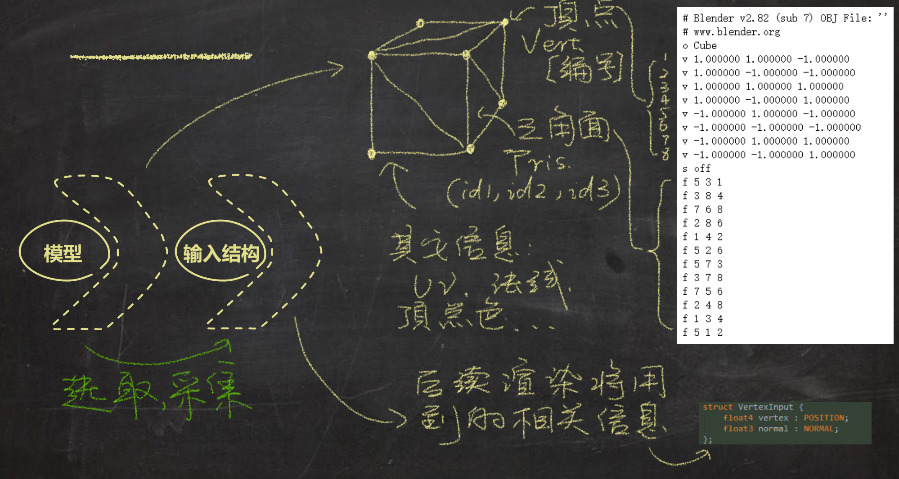
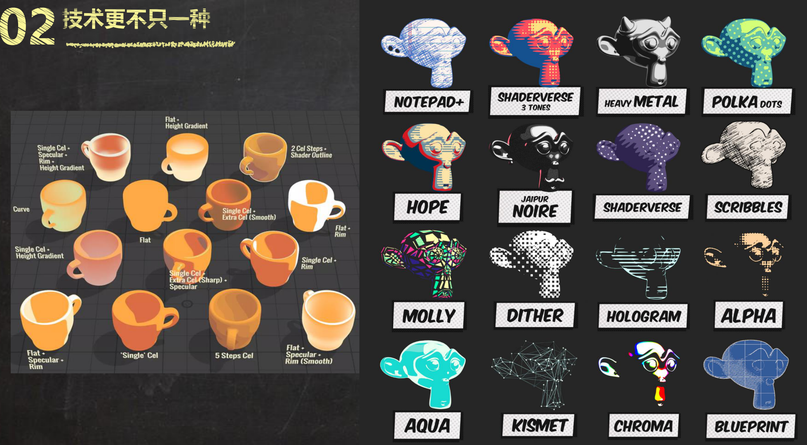
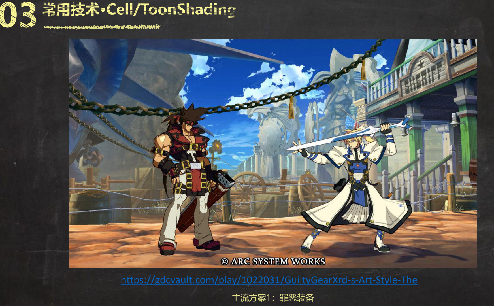
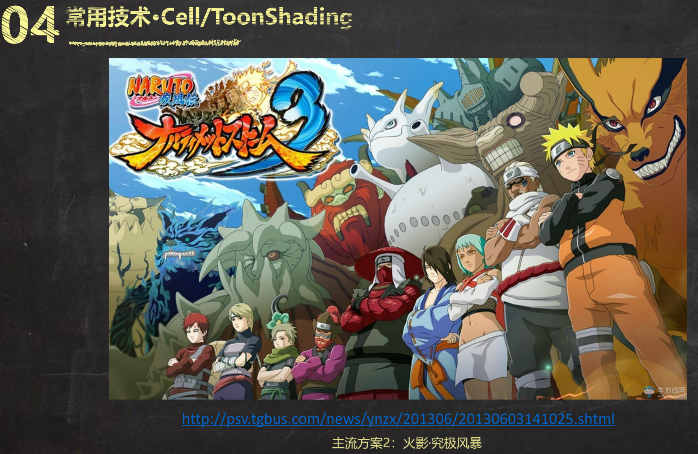
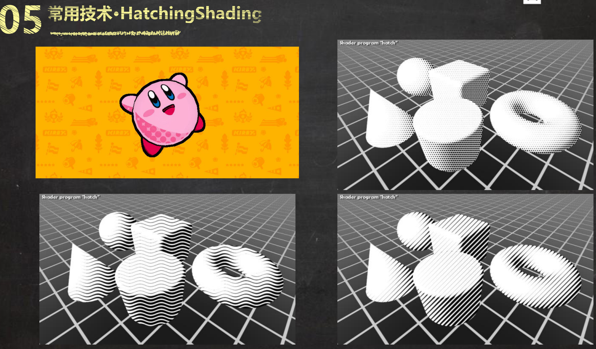

>来自[庄懂-BoyanTata](https://space.bilibili.com/6373917) 的学习笔记，随看随整理，可能会比较乱

>[https://github.com/BoyanTata/AP01](https://github.com/BoyanTata/AP01)

## 渲染流水线

>[技术美术入门课-1: https://www.bilibili.com/video/BV1BE411N74b](https://www.bilibili.com/video/BV1BE411N74b)

一般的渲染过程是这样的

渲染的输入信息包括：3D 模型带有的信息（顶点、法线、面……）、光照信息（游戏引擎传入，注意可能有多个光源）、Shader 中定义的各种类型参数（数值、颜色、贴图等）……

UV 贴图有U、V 两个分量，所以必须要有两个值才能在贴图（RampTex）上采样到某个点！

## 卡通渲染

>[技术美术入门课-2: https://www.bilibili.com/video/BV1f7411f7Vj](https://www.bilibili.com/video/BV1f7411f7Vj)

实现下面这个简单的卡通渲染的效果（补充：一般做卡渲的标准流程都会加上后处理去抗锯齿，下面没有涉及）

补充：绿色的节点是可以在材质面板上调节的

>使用到的技术包括：法线向量与光照向量点乘、半兰伯特光照模型、通过UV 坐标对RampTex 采样

扩展：怎么实现下面这种渲染效果？

>使用到的技术包括：法线向量与光照向量点乘、半兰伯特光照模型、高光、通过UV 坐标对RampTex 采样、菲涅尔效应、Lerp

卡通渲染不只一种风格，技术也不止一种……

