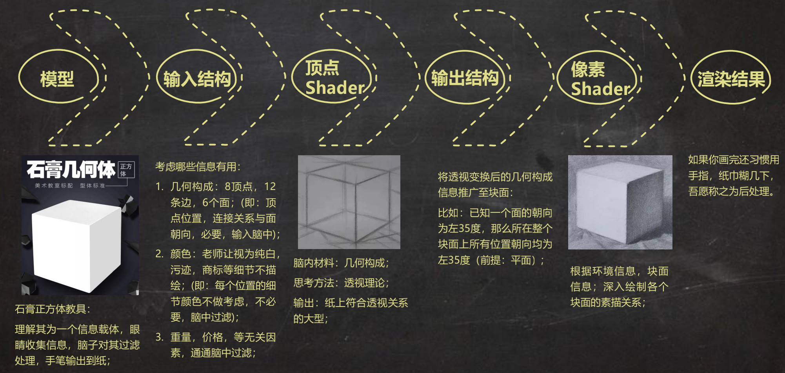

## [技术美术入门课-3](https://www.bilibili.com/video/BV13E411F7Lc): 兰伯特光照模型

重新复习一下渲染流程



直接通过Shader 编码的方式实现兰伯特光照模型

```shader
Shader "AP01/L03/Lambert" {
    Properties {
    }
    SubShader {
        Tags {
            "RenderType"="Opaque"
        }
        Pass {
            Name "FORWARD"
            Tags {
                "LightMode"="ForwardBase"
            }

            CGPROGRAM
            #pragma vertex vert
            #pragma fragment frag
            #include "UnityCG.cginc"
            #pragma multi_compile_fwdbase_fullshadows
            #pragma target 3.0

            // 输入结构
            struct VertexInput {
                float4 vertex : POSITION;   // 将模型顶点信息输入进来
                float4 normal : NORMAL;     // 将模型法线信息输入进来
            };
            // 输出结构
            struct VertexOutput {
                float4 pos : SV_POSITION;   // 由模型顶点信息换算而来的顶点屏幕位置
                float3 nDirWS : TEXCOORD0;  // 由模型法线信息换算来的世界空间法线信息
            };

            // 输入结构>>>顶点Shader>>>输出结构
            VertexOutput vert (VertexInput v) {
                VertexOutput o = (VertexOutput)0;               // 新建一个输出结构

                // 将顶点坐标从模型空间转换为裁剪空间（屏幕空间）
                o.pos = UnityObjectToClipPos( v.vertex );       // 变换顶点信息 并将其塞给输出结构

                // 将法线方向从模型空间转换为世界空间
                o.nDirWS = UnityObjectToWorldNormal(v.normal);  // 变换法线信息 并将其塞给输出结构

                return o;                                       // 将输出结构 输出
            }

            // 输出结构>>>像素
            float4 frag(VertexOutput i) : COLOR {
                float3 nDir = i.nDirWS;                         // 获取nDir，法线向量
                float3 lDir = _WorldSpaceLightPos0.xyz;         // 获取lDir，光照向量

                // 法线向量与光照向量点积运算
                float nDotl = dot(i.nDirWS, lDir);              // nDir点积lDir

                // 因为点积运算的值可能是-1，但颜色的范围是0～1，所以对于小于0 的都转为0（黑色）
                float lambert = max(0.0, nDotl);                // 截断负值

                // 输出的结果是这个像素在屏幕上显示的颜色（RGBA四个通道）
                return float4(lambert, lambert, lambert, 1.0);  // 输出最终颜色


                // 简单展示一下怎么改成半兰伯特光照模型，修改最后两行代码
                // float halfLambert = nDotl * 0.5 + 0.5;
                // return float4(halfLambert, halfLambert, halfLambert, 1.0);
            }
            ENDCG
        }
    }
    FallBack "Diffuse"
}
```

## [技术美术入门课-4](https://www.bilibili.com/video/BV1J7411m76v): SSS 技术

SSSLut 效果的实现（SSS 效果，比如用灯光照手指，透过手指可以看到冒出来的偏红色的光），其中Lut 节点是在材质配置面板输入的贴图信息。这次使用的RampTex 是右下角偏下面的图，在U、V 方向颜色都有变化


>SSS 技术是在游戏开发中非常常用的技术！！

预积分皮肤技术


>高数的知识是不是忘得差不多了？这个公式是不是基本看不懂？