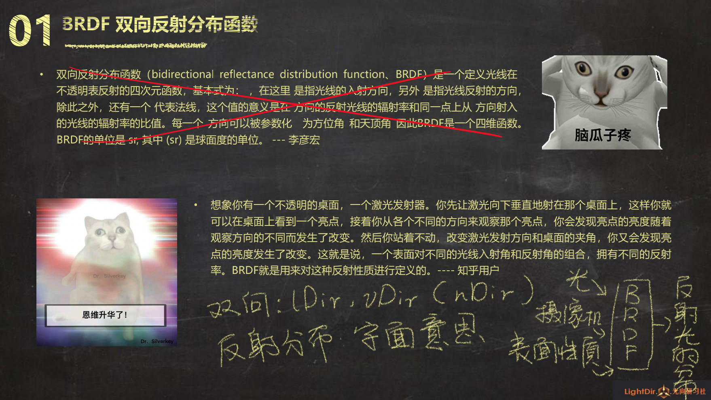
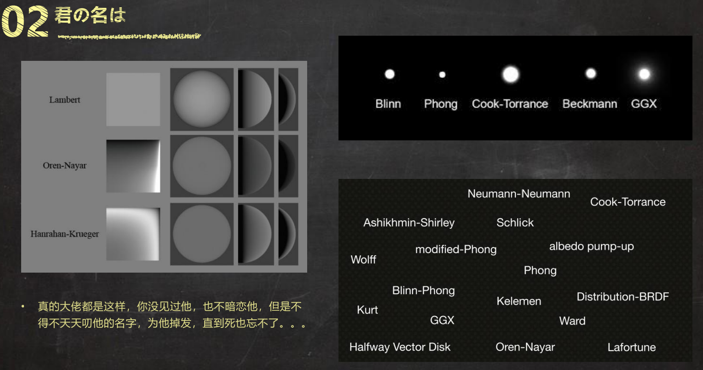
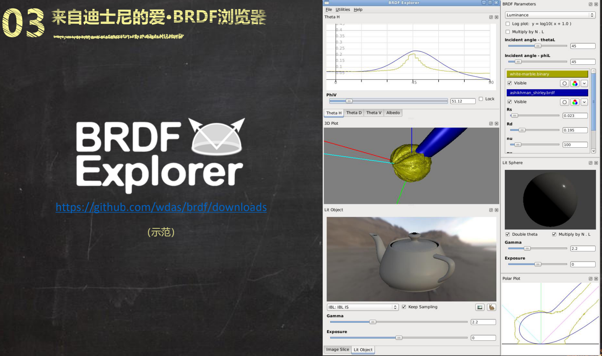

## 漫反射与镜面反射

>[技术美术入门课-5: https://www.bilibili.com/video/BV1J7411m7ro](https://www.bilibili.com/video/BV1J7411m7ro)

>漫反射、镜面反射。兰伯特光照模型是实现漫反射的一种方式

漫反射-Diffuse，因其向四面八方均匀散射，所以反射亮度和观察者看的方向无关，一种实现方式是Lambert，即n dot l，显然与vDir 无关


镜面反射-Specular，因其反射有明显方向性，所以观察者的视角决定了反射光线的有无、明暗。实现方式有两种

* Phong，即r dot v，反射光方向和视角方向越重合，反射越强
* Blinn-Phong，即n dot h，法线方向和半角方向越重合（lDir 和vDir 中间角方向），反射越强


>从计算成本上来说，Blinn-Phong 的计算成本更低！不过对于现在机器的算力来说，应该是没有必要节省这点性能了，Phong 的视觉效果是更好的

下面将Lambert 和Blinn-Phong 模型结合实现漫反射和高光反射（这个其实是一个比较“老派”的光照模型）

```shader
Shader "AP01/L05/OldSchool" {
    Properties {
        _MainCol ("颜色", color) = (1.0, 1.0, 1.0, 1.0)
        _SpecularPow ("高光次幂", range(1, 90)) = 30
    }
    SubShader {
        Tags {
            "RenderType"="Opaque"
        }
        Pass {
            Name "FORWARD"
            Tags {
                "LightMode"="ForwardBase"
            }

            CGPROGRAM
            #pragma vertex vert
            #pragma fragment frag
            #include "UnityCG.cginc"
            #pragma multi_compile_fwdbase_fullshadows
            #pragma target 3.0

            // 输入参数
            // 修饰字（满足小朋友太多的问好, 想保发量的大家看热闹）
                // uniform  共享于vert,frag
                // attibute 仅用于vert
                // varying  用于vert,frag传数据
            uniform float3 _MainCol;     // RGB够了 float3
            uniform float _SpecularPow;  // 标量 float
            // 输入结构
            struct VertexInput {
                float4 vertex : POSITION;   // 顶点信息 Get✔
                float4 normal : NORMAL;     // 法线信息 Get✔
            };

            // 输出结构
            struct VertexOutput {
                float4 posCS : SV_POSITION;     // 裁剪空间（暂理解为屏幕空间吧）顶点位置
                float4 posWS : TEXCOORD0;       // 世界空间顶点位置
                float3 nDirWS : TEXCOORD1;      // 世界空间法线方向
            };

            // 输入结构>>>顶点Shader>>>输出结构
            VertexOutput vert (VertexInput v) {
                VertexOutput o = (VertexOutput)0;                   // 新建输出结构
                    o.posCS = UnityObjectToClipPos( v.vertex );     // 变换顶点位置 OS>CS
                    o.posWS = mul(unity_ObjectToWorld, v.vertex);   // 变换顶点位置 OS>WS
                    o.nDirWS = UnityObjectToWorldNormal(v.normal);  // 变换法线方向 OS>WS
                return o;                                           // 返回输出结构
            }

            // 输出结构>>>像素
            float4 frag(VertexOutput i) : COLOR {
                // 准备向量
                float3 nDir = normalize(i.nDirWS);
                float3 lDir = _WorldSpaceLightPos0.xyz;
                float3 vDir = normalize(_WorldSpaceCameraPos.xyz - i.posWS.xyz);

                // 两个向量相加的结果就是向量夹角中间向量
                float3 hDir = normalize(vDir + lDir);

                // 准备点积结果
                float ndotl = dot(nDir, lDir);
                float ndoth = dot(nDir, hDir);

                // 光照模型
                float lambert = max(0.0, ndotl);
                float blinnPhong = pow(max(0.0, ndoth), _SpecularPow);

                // 将lambert 求出的漫反射结果和blinnPhong 求出的高光反射结果相加作为结果
                float3 finalRGB = _MainCol * lambert + blinnPhong;

                // 返回结果
                return float4(finalRGB, 1.0);
            }
            ENDCG
        }
    }
    FallBack "Diffuse"
}
```

## BRDF

>[技术美术入门课-6: https://www.bilibili.com/video/BV15Z4y1j78V](https://www.bilibili.com/video/BV15Z4y1j78V)



除了Phong、BlinnPhong、Lambert，还有更多的光照模型！



[https://github.com/wdas/brdf/downloads](https://github.com/wdas/brdf/downloads)，运行在Windows 上的BRDF 浏览器，可以查看各种BRDF 光照模型的效果！

>在其brdf-1.0.0-win32\brdfs 目录下是各种BRDF 的实现源码，是很好的学习资料！！！！


