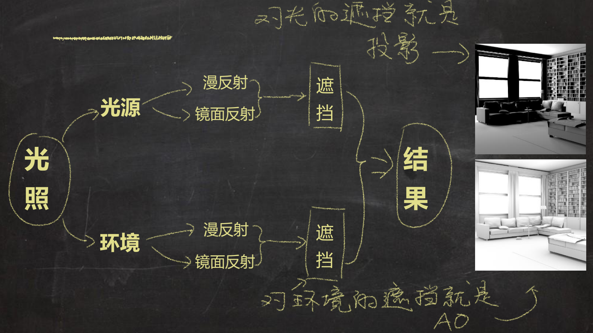
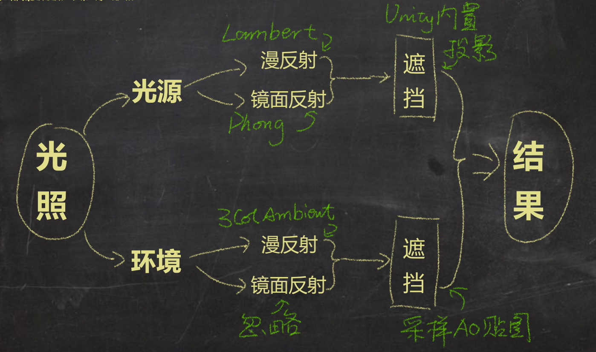
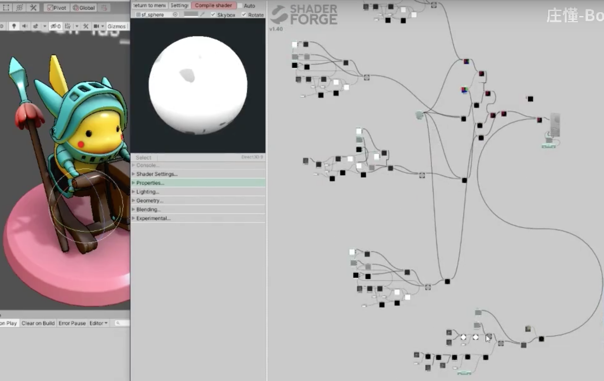
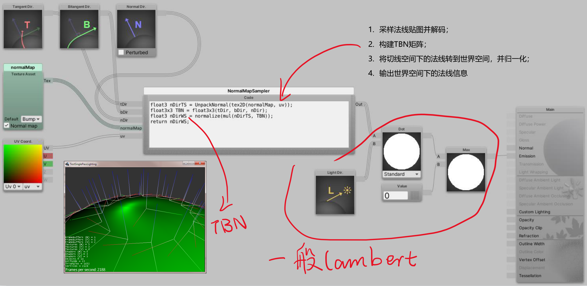

## [技术美术入门课-7](https://www.bilibili.com/video/BV1Vz411b7K9): 环境光

主要讲解环境光对光照的影响，涉及单色环境光和三色环境光（环境光上部颜色、环境光下部颜色、环境光侧面颜色）的演示

对环境光最简单的一种近似和抽象是，把环境光理解为四面八方映射过来的单一颜色、单一强度的光

三色环境光对应的Shader 的实现是下面这样的，其中三种颜色作为暴露出来的三个参数可以供美术人员设置

```shader
Shader "AP01/L07/3ColAmbient" {
    Properties {
        _Occlusion  ("环境遮挡图", 2d)      = "white" {}
        _EnvUpCol   ("朝上环境色", color)   = (1.0, 1.0, 1.0, 1.0)
        _EnvSideCol ("侧面环境色", color)   = (0.5, 0.5, 0.5, 1.0)
        _EnvDownCol ("朝下环境色", color)   = (0.0, 0.0, 0.0, 1.0)
    }
    SubShader {
        Tags {
            "RenderType"="Opaque"
        }
        Pass {
            Name "FORWARD"
            Tags {
                "LightMode"="ForwardBase"
            }
            CGPROGRAM
            #pragma vertex vert
            #pragma fragment frag
            #include "UnityCG.cginc"
            #pragma multi_compile_fwdbase_fullshadows
            #pragma target 3.0

            // 输入参数与面板参数一一对应
            uniform float3 _EnvUpCol;
            uniform float3 _EnvSideCol;
            uniform float3 _EnvDownCol;
            uniform sampler2D _Occlusion;    // AO图

            // 输入结构
            struct VertexInput {
                float4 vertex : POSITION;   // 将模型顶点信息输入进来
                float4 normal : NORMAL;     // 将模型法线信息输入进来
                float2 uv0 : TEXCOORD0;     // 将模型UV信息输入进来 0通道 共4通道
            };

            // 输出结构
            struct VertexOutput {
                float4 pos : SV_POSITION;   // 由模型顶点信息换算而来的顶点屏幕位置
                float3 nDirWS : TEXCOORD0;  // 由模型法线信息换算来的世界空间法线信息
                float2 uv : TEXCOORD1;      // 追加UV信息用于像素Shader采样贴图
            };

            // 输入结构 >>> 顶点Shader >>> 输出结构
            VertexOutput vert (VertexInput v) {
                VertexOutput o = (VertexOutput)0;               // 新建一个输出结构
                o.pos = UnityObjectToClipPos( v.vertex );       // 变换顶点信息 并将其塞给输出结构
                o.nDirWS = UnityObjectToWorldNormal(v.normal);  // 变换法线信息 并将其塞给输出结构
                o.uv = v.uv0;                                   // 图森破
                return o;                                       // 将输出结构 输出
            }

            // 输出结构 >>> 像素
            float4 frag(VertexOutput i) : COLOR {
                // 准备向量（法线向量）
                float3 nDir = i.nDirWS;                         // 获取nDir
                // 计算各部位遮罩。nDir.g 表示取法线的绿通道
                float upMask = max(0.0, nDir.g);                // 获取朝上部分遮罩
                float downMask = max(0.0, -nDir.g);             // 获取朝下部分遮罩
                float sideMask = 1.0 - upMask - downMask;       // 获取侧面部分遮罩
                // 混合环境色。上部颜色乘以上部遮罩、侧部颜色乘以侧部遮罩、下部颜色乘以下部遮罩，相加得到环境光
                float3 envCol = _EnvUpCol * upMask + _EnvSideCol * sideMask + _EnvDownCol * downMask;
                // 采样Occlusion 贴图。tex2D() 第一个参数是贴图、第二个参数是uv
                float occlusion = tex2D(_Occlusion, i.uv);
                // 计算环境光照
                float3 envLighting = envCol * occlusion;
                // 返回最终颜色
                return float4(envLighting, 1.0);
            }

            ENDCG
        }
    }
    FallBack "Diffuse"
}
```

>AO 贴图（Occlusion）的作用就是对环境光的阻挡！这个贴图可以找美术同事来制作！

接下来，在Shader 代码中实现投影：

```shader
Shader "AP01/L07/Shadow" {
    Properties {
    }
    SubShader {
        Tags {
            "RenderType"="Opaque"
        }
        Pass {
            Name "FORWARD"
            Tags {
                "LightMode"="ForwardBase"
            }

            CGPROGRAM
            #pragma vertex vert
            #pragma fragment frag
            #include "UnityCG.cginc"
            #include "AutoLight.cginc"      // 使用Unity投影必须包含这两个库文件
            #include "Lighting.cginc"       // 同上
            #pragma multi_compile_fwdbase_fullshadows
            #pragma target 3.0

            // 输入结构
            struct VertexInput {
                float4 vertex : POSITION;   // 将模型的顶点信息输入进来
            };

            // 输出结构
            struct VertexOutput {
                float4 pos : SV_POSITION;   // 由模型顶点信息换算而来的顶点屏幕位置

                // 括号中的参数，如(0,1)，分别表示TEXCOORD1 和TEXCOORD2
                LIGHTING_COORDS(0,1)        // 投影用坐标信息 Unity已封装 不用管细节
            };

            // 输入结构 >>> 顶点Shader >>> 输出结构
            VertexOutput vert (VertexInput v) {
                VertexOutput o = (VertexOutput)0;           // 新建一个输出结构
                o.pos = UnityObjectToClipPos( v.vertex );   // 变换顶点信息 并将其塞给输出结构
                TRANSFER_VERTEX_TO_FRAGMENT(o)              // Unity封装 不用管细节
                return o;                                   // 将输出结构 输出
            }

            // 输出结构 >>> 像素
            float4 frag(VertexOutput i) : COLOR {
                float shadow = LIGHT_ATTENUATION(i);        // 同样Unity封装好的函数 可取出投影
                return float4(shadow, shadow, shadow, 1.0);
            }
            ENDCG
        }
    }
    FallBack "Diffuse"
}
```

## [技术美术入门课-8](https://www.bilibili.com/video/BV1Ut4y1m776): 混合漫反射、镜面反射、环境光

简化理解光照构成



将以上的漫反射、镜面反射、环境光、投影等光照模型结合起来



```shader
Shader "AP01/L08/OldSchoolPlus" {
    Properties {
        _BaseCol    ("基本色",      Color)          = (0.5, 0.5, 0.5, 1.0)
        _LightCol   ("光颜色",      Color)          = (1.0, 1.0, 1.0, 1.0)
        _SpecPow    ("高光次幂",    Range(1, 90))   = 30
        _Occlusion  ("AO图",        2D)             = "white" {}
        _EnvInt     ("环境光强度",  Range(0, 1))    = 0.2
        _EnvUpCol   ("环境天顶颜色", Color)          = (1.0, 1.0, 1.0, 1.0)
        _EnvSideCol ("环境水平颜色", Color)          = (0.5, 0.5, 0.5, 1.0)
        _EnvDownCol ("环境地表颜色", Color)          = (0.0, 0.0, 0.0, 0.0)
    }
    SubShader {
        Tags {
            "RenderType"="Opaque"
        }
        Pass {
            Name "FORWARD"
            Tags {
                "LightMode"="ForwardBase"
            }


            CGPROGRAM
            #pragma vertex vert
            #pragma fragment frag
            #include "UnityCG.cginc"

            // 追加投影相关包含文件
            #include "AutoLight.cginc"
            #include "Lighting.cginc"
            #pragma multi_compile_fwdbase_fullshadows
            #pragma target 3.0

            // 输入参数
            uniform float3 _BaseCol;
            uniform float3 _LightCol;
            uniform float _SpecPow;
            uniform sampler2D _Occlusion;
            uniform float _EnvInt;
            uniform float3 _EnvUpCol;
            uniform float3 _EnvSideCol;
            uniform float3 _EnvDownCol;

            // 输入结构
            struct VertexInput {
                float4 vertex   : POSITION;   // 顶点信息 Get✔
                float4 normal   : NORMAL;     // 法线信息 Get✔
                float2 uv0      : TEXCOORD0;  // UV信息 Get✔
            };

            // 输出结构
            struct VertexOutput {
                float4 pos    : SV_POSITION;  // 裁剪空间（暂理解为屏幕空间吧）顶点位置
                float2 uv0      : TEXCOORD0;    // UV0
                float4 posWS    : TEXCOORD1;    // 世界空间顶点位置
                float3 nDirWS   : TEXCOORD2;    // 世界空间法线方向
                LIGHTING_COORDS(3,4)            // 投影相关
            };

            // 输入结构 >>> 顶点Shader >>> 输出结构
            VertexOutput vert (VertexInput v) {
                VertexOutput o = (VertexOutput)0;                   // 新建输出结构
                    o.pos = UnityObjectToClipPos( v.vertex );       // 变换顶点位置 OS>CS
                    o.uv0 = v.uv0;                                  // 传递UV
                    o.posWS = mul(unity_ObjectToWorld, v.vertex);   // 变换顶点位置 OS>WS
                    o.nDirWS = UnityObjectToWorldNormal(v.normal);  // 变换法线方向 OS>WS
                    TRANSFER_VERTEX_TO_FRAGMENT(o)                  // 投影相关
                return o;                                           // 返回输出结构
            }

            // 输出结构 >>> 像素
            float4 frag(VertexOutput i) : COLOR {
                // 准备向量
                float3 nDir = normalize(i.nDirWS);
                float3 lDir = _WorldSpaceLightPos0.xyz;
                float3 vDir = normalize(_WorldSpaceCameraPos.xyz - i.posWS.xyz);
                float3 rDir = reflect(-lDir, nDir);

                // 准备点积结果
                float ndotl = dot(nDir, lDir);
                float vdotr = dot(vDir, rDir);

                // 光照模型(直接光照部分)
                float shadow = LIGHT_ATTENUATION(i);        // 获取投影
                float lambert = max(0.0, ndotl);
                float phong = pow(max(0.0, vdotr), _SpecPow);
                float3 dirLighting = (_BaseCol * lambert + phong) * _LightCol * shadow;

                // 光照模型(环境光照部分)
                float upMask = max(0.0, nDir.g);                // 获取朝上部分遮罩
                float downMask = max(0.0, -nDir.g);             // 获取朝下部分遮罩
                float sideMask = 1.0 - upMask - downMask;       // 获取侧面部分遮罩
                // 混合环境色
                float3 envCol = _EnvUpCol * upMask + _EnvSideCol * sideMask + _EnvDownCol * downMask;
                float occlusion = tex2D(_Occlusion, i.uv0);         // 采样Occlusion贴图
                float3 envLighting = envCol * _EnvInt * occlusion;  // 计算环境光照

                // 返回结果（直接光照 + 环境光照）
                float3 finalRGB = dirLighting + envLighting;
                return float4(finalRGB, 1.0);
            }
            ENDCG
        }
    }
    FallBack "Diffuse"
}
```

平时企业中的工作内容会是什么样的？首先有一个基础的模板，比如就是上面这个OldSchoolPlus 的光照模型，而项目可能有自己的具体要求，用项目的美术资源去套用这个模板的时候可能有不合适的地方，那么就需要TA 去调整这个光照模型Shader、或者美术……

下面是一个制作的很好的材质效果！



法线贴图的处理（Substance Painter 是可以烘培出切线空间的法线贴图的）



```shader
Shader "AP01/L08/NormalMap" {
    Properties {
        _NormalMap ("法线贴图", 2D) = "bump" {}
    }
    SubShader {
        Tags {
            "RenderType"="Opaque"
        }
        Pass {
            Name "FORWARD"
            Tags {
                "LightMode"="ForwardBase"
            }
            CGPROGRAM
            #pragma vertex vert
            #pragma fragment frag
            #include "UnityCG.cginc"
            #pragma multi_compile_fwdbase_fullshadows
            #pragma target 3.0

            // 输入参数
            uniform sampler2D _NormalMap;

            // 输入结构
            struct VertexInput {
                float4 vertex : POSITION;   // 顶点信息
                float2 uv0 : TEXCOORD0;     // 需要UV坐标 采样法线贴图
                float4 normal : NORMAL;     // 法线信息
                float4 tangent : TANGENT;   // 构建TBN矩阵 需要模型切线信息
            };

            // 输出结构
            struct VertexOutput {
                float4 pos : SV_POSITION;
                float2 uv0 : TEXCOORD0;     // UV信息
                float3 nDirWS : TEXCOORD1;  // 世界空间法线信息
                float3 tDirWS : TEXCOORD2;  // 世界空间切线信息
                float3 bDirWS : TEXCOORD3;  // 世界空间切线信息
            };

            // 输入结构 >>> 顶点Shader >>> 输出结构
            VertexOutput vert (VertexInput v) {
                VertexOutput o = (VertexOutput)0;               // 新建一个输出结构
                o.pos = UnityObjectToClipPos( v.vertex );       // 变换顶点信息 并将其塞给输出结构
                o.uv0 = v.uv0;                                  // 传递UV信息
                o.nDirWS = UnityObjectToWorldNormal(v.normal);  // 世界空间法线信息
                o.tDirWS = normalize(mul( unity_ObjectToWorld, float4(v.tangent.xyz, 0.0)).xyz);    // 世界空间切线信息
                o.bDirWS = normalize(cross(o.nDirWS, o.tDirWS) * v.tangent.w);   // 世界空间切线信息
                return o;                                       // 将输出结构 输出
            }

            // 输出结构 >>> 像素
            float4 frag(VertexOutput i) : COLOR {
                // 获取nDir
                float3 var_NormalMap = UnpackNormal(tex2D(_NormalMap, i.uv0)).rgb;  // 采样法线纹理并解码 切线空间nDir
                float3x3 TBN = float3x3(i.tDirWS, i.bDirWS, i.nDirWS);              // 构建TBN矩阵
                float3 nDir = normalize(mul(var_NormalMap, TBN));                   // 世界空间nDir
                // 获取lDir
                float3 lDir = _WorldSpaceLightPos0.xyz;
                // 一般Lambert
                float nDotl = dot(nDir, lDir);                  // nDir点积lDir
                float lambert = max(0.0, nDotl);                // 截断负值
                return float4(lambert, lambert, lambert, 1.0);  // 输出最终颜色
            }
            ENDCG
        }
    }
    FallBack "Diffuse"
}
```