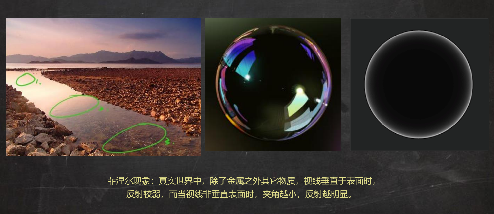
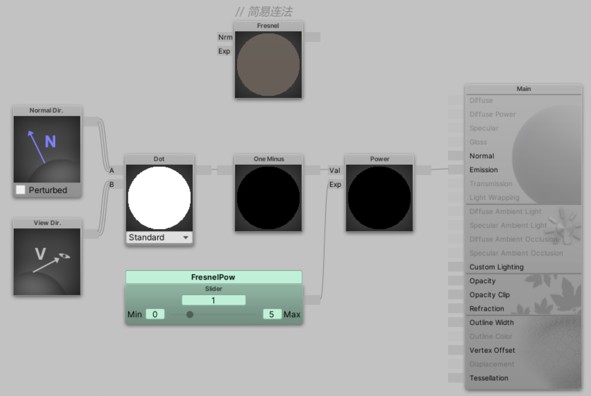
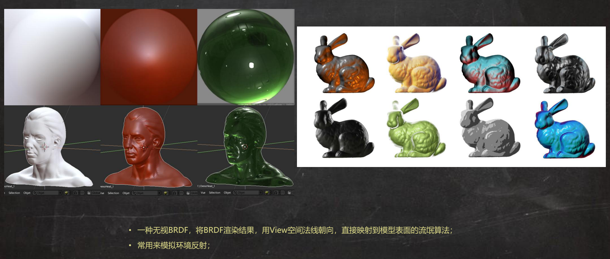
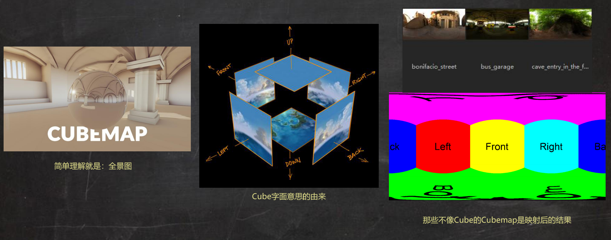

环境反射的做法一般有Matcap、Cubemap，并且不得不说菲涅尔！

>[技术美术入门课-9: https://www.bilibili.com/video/BV1oe411x7Gn](https://www.bilibili.com/video/BV1oe411x7Gn)

## 菲涅尔

菲涅尔现象：真实世界中，除了金属之外其他物质，视线垂直于表面时，反射较弱，而当视线非垂直表面时，夹角越小，反射越明显



抽象一下，vDir 和nDir 越接近垂直，反射会越多！这个又是比较两个向量的夹角，所以又可以用向量的点积去做！

算法：Fresnel = pow(1-ndotv, powVal)

* ndotv: 法线向量点乘观察方向，理解为光从眼睛发出时的Lambert；中间亮，边缘暗
* 1-ndotv: 黑白反相，中间暗，边缘亮
* power: 套一个power 控制边缘亮的范围



```cg
Shader "AP01/L09/Fresnel" {
    Properties {
        _FresnelPow ("FresnelPow", Range(0, 5)) = 1
    }
    SubShader {
        Tags {
            "RenderType"="Opaque"
        }
        Pass {
            Name "FORWARD"
            Tags {
                "LightMode"="ForwardBase"
            }
            
            CGPROGRAM
            #pragma vertex vert
            #pragma fragment frag
            #pragma multi_compile_instancing
            #include "UnityCG.cginc"
            #pragma multi_compile_fwdbase_fullshadows
            #pragma target 3.0
            UNITY_INSTANCING_BUFFER_START( Props )
                UNITY_DEFINE_INSTANCED_PROP( float, _FresnelPow)
            UNITY_INSTANCING_BUFFER_END( Props )


            struct VertexInput {
                float4 vertex : POSITION;
                float3 normal : NORMAL;
            };

            struct VertexOutput {
                float4 pos : SV_POSITION;
                UNITY_VERTEX_INPUT_INSTANCE_ID
                float4 posWorld : TEXCOORD0;
                float3 normalDir : TEXCOORD1;
            };

            VertexOutput vert (VertexInput v) {
                VertexOutput o = (VertexOutput)0;
                UNITY_SETUP_INSTANCE_ID( v );
                UNITY_TRANSFER_INSTANCE_ID( v, o );
                o.normalDir = UnityObjectToWorldNormal(v.normal);
                o.posWorld = mul(unity_ObjectToWorld, v.vertex);
                o.pos = UnityObjectToClipPos( v.vertex );
                return o;
            }

            float4 frag(VertexOutput i) : COLOR {
                UNITY_SETUP_INSTANCE_ID( i );
                i.normalDir = normalize(i.normalDir);
                float3 viewDirection = normalize(_WorldSpaceCameraPos.xyz - i.posWorld.xyz);
                float3 normalDirection = i.normalDir;
////// Lighting:
////// Emissive:
                float node_4279 = (1.0 - dot(i.normalDir,viewDirection));
                float _FresnelPow_var = UNITY_ACCESS_INSTANCED_PROP( Props, _FresnelPow );
                float node_2917 = pow(node_4279,_FresnelPow_var);
                float3 emissive = float3(node_2917,node_2917,node_2917);
                float3 finalColor = emissive;
                return fixed4(finalColor,1);
            }
            ENDCG
        }
    }
    FallBack "Diffuse"
}
```

>菲涅尔次幂的作用？金属的整个表面都是像镜子一样反射的、非金属只在边缘有反射效果，所以需要一个菲涅尔次幂的参数来进行控制！

## Matcap

ZBush 中的材质球就是Matcap，应用到模型上就是这样的一个视觉效果



Matcap 无视BRDF，不计算光照，将BRDF 渲染结果，用View 空间法线朝向，直接映射到模型表现的流氓算法。静止的效果看起来可以，但是动起来之后就穿帮了

一般Matcap 用在商城、选择界面等摄像头不动、只模型动的场景下，其算法思路如下

* 将nDir 从切线空间转到观察空间
* 取RG 通道Remap 到(0~1)，作为UV 对Matcap 图采样
* 叠加菲涅尔效果，以模拟金属和非金属不同质感

Matcap 图可以在Google 搜索引擎中使用关键字`Matcap Zbush` 搜索到！所以这样就可以把ZBush 的各种材质球用到游戏中了！

```cg
Shader "AP01/L09/Matcap" {
    Properties {
        _NormalMap  ("法线贴图", 2D) = "bump" {}
        _Matcap     ("Matcap", 2D) = "gray" {}
        _FresnelPow ("菲涅尔次幂", Range(0, 10)) = 1
        _EnvSpecInt ("环境镜面反射强度", Range(0, 5)) = 1
    }
    SubShader {
        Tags {
            "RenderType"="Opaque"
        }
        Pass {
            Name "FORWARD"
            Tags {
                "LightMode"="ForwardBase"
            }
            CGPROGRAM
            #pragma vertex vert
            #pragma fragment frag
            #include "UnityCG.cginc"
            #pragma multi_compile_fwdbase_fullshadows
            #pragma target 3.0

            // 输入参数
            uniform sampler2D _NormalMap;
            uniform sampler2D _Matcap;
            uniform float _FresnelPow;
            uniform float _EnvSpecInt;
            
            // 输入结构
            struct VertexInput {
                float4 vertex   : POSITION;     // 顶点信息
                float2 uv0      : TEXCOORD0;    // uv信息
                float3 normal   : NORMAL;       // 法线信息
                float4 tangent  : TANGENT;      // 切线信息
            };
            
            // 输出结构
            struct VertexOutput {
                float4 pos : SV_POSITION;       // 屏幕顶点位置
                float2 uv0 : TEXCOORD0;         // uv信息
                float4 posWS : TEXCOORD1;       // 世界顶点位置
                float3 nDirWS : TEXCOORD2;      // 世界法线方向
                float3 tDirWS : TEXCOORD3;      // 世界切线方向
                float3 bDirWS : TEXCOORD4;      // 世界副切线方向
            };
            
            // 输入结构 >>> 顶点Shader >>> 输出结构
            VertexOutput vert (VertexInput v) {
                VertexOutput o = (VertexOutput)0;           // 新建一个输出结构
                o.pos = UnityObjectToClipPos( v.vertex );
                o.uv0 = v.uv0;                                  // 传递uv信息
                o.posWS = mul(unity_ObjectToWorld, v.vertex);   // 顶点位置 OS>WS
                o.nDirWS = UnityObjectToWorldNormal(v.normal);  // 法线方向 OS>WS
                o.tDirWS = normalize(mul(unity_ObjectToWorld, float4(v.tangent.xyz, 0.0)).xyz); // 切线方向 OS>WS
                o.bDirWS = normalize(cross(o.nDirWS, o.tDirWS) * v.tangent.w);  // 根据nDir tDir求bDir
                return o;                                   // 将输出结构 输出
            }

            // 输出结构 >>> 像素
            float4 frag(VertexOutput i) : COLOR {
                // 准备向量
                float3 nDirTS = UnpackNormal(tex2D(_NormalMap, i.uv0)).rgb;   // 切线空间下的法线向量，通过采样法线贴图获取
                float3x3 TBN = float3x3(i.tDirWS, i.bDirWS, i.nDirWS);
                float3 nDirWS = normalize(mul(nDirTS, TBN));        // 计算nDirVS 计算Fresnel
                float3 nDirVS = mul(UNITY_MATRIX_V, nDirWS);        // 计算MatcapUV，从世界空间转换到观察空间
                float3 vDirWS = normalize(_WorldSpaceCameraPos.xyz - i.posWS.xyz); // 计算Fresnel

                // 准备中间变量
                float vdotn = dot(vDirWS, nDirWS);
                float2 matcapUV = nDirVS.rg * 0.5 + 0.5;

                // 光照模型
                float3 matcap = tex2D(_Matcap, matcapUV);    // 采样matcap
                float fresnel = pow(max(0.0, 1.0 - vdotn), _FresnelPow);
                float3 envSpecLighting = matcap * fresnel * _EnvSpecInt;

                // 返回值
                return float4(envSpecLighting, 1.0);
            }
            ENDCG
        }
    }
    FallBack "Diffuse"
}
```

## Cubemap

Cubemap 可以理解为一个全景图，如下所示，Cubemap 包含环境信息



```cg
Shader "AP01/L09/Cubemap" {
    Properties {
        _Cubemap    ("环境球", Cube) = "_Skybox" {}
        _NormalMap  ("法线贴图", 2D) = "bump" {}
        _CubemapMip ("环境球Mip", Range(0, 7)) = 0
        _FresnelPow ("菲涅尔次幂", Range(0, 5)) = 1
        _EnvSpecInt ("环境镜面反射强度", Range(0, 5)) = 0.2
    }
    SubShader {
        Tags {
            "RenderType"="Opaque"
        }
        Pass {
            Name "FORWARD"
            Tags {
                "LightMode"="ForwardBase"
            }
            CGPROGRAM
            #pragma vertex vert
            #pragma fragment frag
            #include "UnityCG.cginc"
            #pragma multi_compile_fwdbase_fullshadows
            #pragma target 3.0

            // 输入参数
            uniform samplerCUBE _Cubemap;
            uniform sampler2D _NormalMap;
            uniform float _CubemapMip;     // _CubemapMip 可以理解为Cubemap 的精度级别，类似于LOD 的概念
            uniform float _FresnelPow;
            uniform float _EnvSpecInt;

            // 输入结构
            struct VertexInput {
                float4 vertex   : POSITION;     // 顶点信息
                float2 uv0      : TEXCOORD0;    // uv信息
                float3 normal   : NORMAL;       // 法线信息
                float4 tangent  : TANGENT;      // 切线信息
            };

            // 输出结构
            struct VertexOutput {
                float4 pos : SV_POSITION;       // 屏幕顶点位置
                float2 uv0 : TEXCOORD0;         // uv信息
                float4 posWS : TEXCOORD1;       // 世界顶点位置
                float3 nDirWS : TEXCOORD2;      // 世界法线方向
                float3 tDirWS : TEXCOORD3;      // 世界切线方向
                float3 bDirWS : TEXCOORD4;      // 世界副切线方向
            };

            // 输入结构 >>> 顶点Shader >>> 输出结构
            VertexOutput vert (VertexInput v) {
                VertexOutput o = (VertexOutput)0;           // 新建一个输出结构
                o.pos = UnityObjectToClipPos( v.vertex );
                o.uv0 = v.uv0;                                  // 传递uv信息
                o.posWS = mul(unity_ObjectToWorld, v.vertex);   // 顶点位置 OS>WS
                o.nDirWS = UnityObjectToWorldNormal(v.normal);  // 法线方向 OS>WS
                o.tDirWS = normalize(mul(unity_ObjectToWorld, float4(v.tangent.xyz, 0.0)).xyz); // 切线方向 OS>WS
                o.bDirWS = normalize(cross(o.nDirWS, o.tDirWS) * v.tangent.w);  // 根据nDir tDir求bDir
                return o;                                   // 将输出结构 输出
            }

            // 输出结构 >>> 像素
            float4 frag(VertexOutput i) : COLOR {
                // 准备向量
                float3 nDirTS = UnpackNormal(tex2D(_NormalMap, i.uv0)).rgb;    // 切线空间法向量，通过采样法线贴图获取
                float3x3 TBN = float3x3(i.tDirWS, i.bDirWS, i.nDirWS);
                float3 nDirWS = normalize(mul(nDirTS, TBN));   // 计算Fresnel 计算vrDirWS
                float3 vDirWS = normalize(_WorldSpaceCameraPos.xyz - i.posWS.xyz);  // 计算Fresnel
                float3 vrDirWS = reflect(-vDirWS, nDirWS);     // 采样Cubemap

                // 准备中间变量
                float vdotn = dot(vDirWS, nDirWS);

                // 光照模型
                float3 var_Cubemap = texCUBElod(_Cubemap, float4(vrDirWS, _CubemapMip)).rgb;   // 使用texCUBElod() 对Cubemap 采样
                float fresnel = pow(max(0.0, 1.0 - vdotn), _FresnelPow);
                float3 envSpecLighting = var_Cubemap * fresnel * _EnvSpecInt;

                // 返回值
                return float4(envSpecLighting, 1.0);
            }
            ENDCG
        }
    }
    FallBack "Diffuse"
}
```