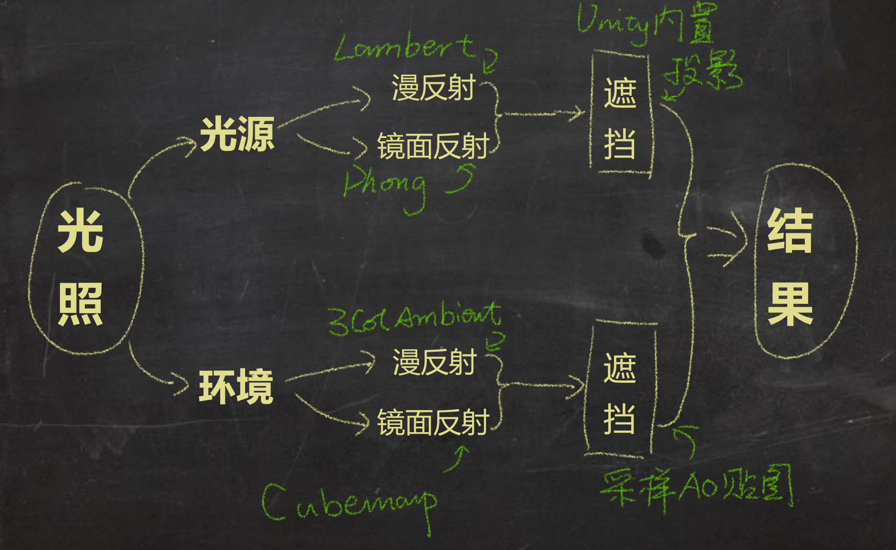
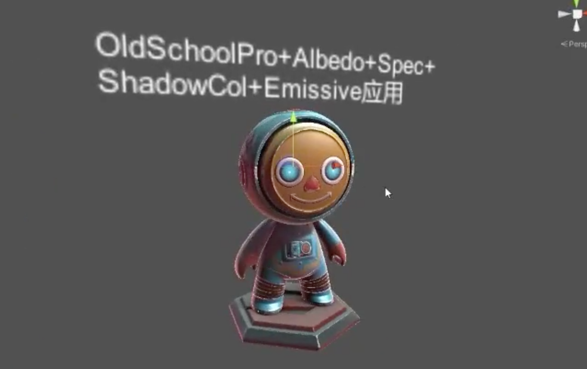

>[技术美术入门课-10: https://www.bilibili.com/video/BV1ue4114769](https://www.bilibili.com/video/BV1ue4114769)

做游戏的话，Shader 是一方面，美术资源是另一方面，同样一个Shader，给这个人做美术资源的规范，和给另外一个人做美术资源的规范，出来的效果可能完全不一样。所以技术、美术都需要具备

经过上面的一步步的学习，整个场景中对于一个模型产生光的影响包括下面这些



下面是组合和兰伯特光照模型（漫反射）、冯光照模型（高光反射）、三面环境光、菲涅尔效应、Cubemap 的Shader 实现

* 向量准备：nDir、lDir、vDir、rDir、vrDir
* 中间量准备：ndotl、rdotv
* Lambert 光源漫反射
* Phong 光源镜面反射
* 光源反射混合
* 3Color 环境漫反射
* Cubemap 环境镜面反射
* 环境反射混合
* 光源、环境反射叠加

```cg
Shader "AP01/L10/OldSchoolPro" {
    Properties {
        [Header(Texture)]
            _MainTex    ("RGB:基础颜色 A:环境遮罩", 2D)     = "white" {}
            _NormTex	("RGB:法线贴图", 2D)                = "bump" {}
            _SpecTex    ("RGB:高光颜色 A:高光次幂", 2D)     = "gray" {}
            _EmitTex    ("RGB:环境贴图", 2d)                = "black" {}
            _Cubemap    ("RGB:环境贴图", cube)              = "_Skybox" {}
        [Header(Diffuse)]
            _MainCol    ("基本色",      Color)              = (0.5, 0.5, 0.5, 1.0)
            _EnvDiffInt ("环境漫反射强度",  Range(0, 1))    = 0.2
            _EnvUpCol   ("环境天顶颜色", Color)             = (1.0, 1.0, 1.0, 1.0)
            _EnvSideCol ("环境水平颜色", Color)             = (0.5, 0.5, 0.5, 1.0)
            _EnvDownCol ("环境地表颜色", Color)             = (0.0, 0.0, 0.0, 0.0)
        [Header(Specular)]
            _SpecPow    ("高光次幂",    Range(1, 90))       = 30
            _EnvSpecInt ("环境镜面反射强度", Range(0, 5))   = 0.2
            _FresnelPow ("菲涅尔次幂", Range(0, 5))         = 1
            _CubemapMip ("环境球Mip", Range(0, 7))          = 0
        [Header(Emission)]
            _EmitInt    ("自发光强度", range(1, 10))         = 1
    }
    SubShader {
        Tags {
            "RenderType"="Opaque"
        }
        Pass {
            Name "FORWARD"
            Tags {
                "LightMode"="ForwardBase"
            }
            CGPROGRAM

            #pragma vertex vert
            #pragma fragment frag
            #include "UnityCG.cginc"

            // 追加投影相关包含文件
            #include "AutoLight.cginc"
            #include "Lighting.cginc"
            #pragma multi_compile_fwdbase_fullshadows
            #pragma target 3.0

            // 输入参数
            // Texture
            uniform sampler2D _MainTex;
            uniform sampler2D _NormTex;
            uniform sampler2D _SpecTex;
            uniform sampler2D _EmitTex;
            uniform samplerCUBE _Cubemap;
            // Diffuse
            uniform float3 _MainCol;
            uniform float _EnvDiffInt;
            uniform float3 _EnvUpCol;
            uniform float3 _EnvSideCol;
            uniform float3 _EnvDownCol;
            // Specular
            uniform float _SpecPow;
            uniform float _FresnelPow;
            uniform float _EnvSpecInt;
            uniform float _CubemapMip;
            // Emission
            uniform float _EmitInt;

            // 输入结构
            struct VertexInput {
                float4 vertex   : POSITION;   // 顶点信息 Get✔
                float2 uv0      : TEXCOORD0;  // UV信息 Get✔
                float4 normal   : NORMAL;     // 法线信息 Get✔
                float4 tangent  : TANGENT;    // 切线信息 Get✔
            };

            // 输出结构
            struct VertexOutput {
                float4 pos    : SV_POSITION;  // 屏幕顶点位置
                float2 uv0      : TEXCOORD0;  // UV0
                float4 posWS    : TEXCOORD1;  // 世界空间顶点位置
                float3 nDirWS   : TEXCOORD2;  // 世界空间法线方向
                float3 tDirWS   : TEXCOORD3;  // 世界空间切线方向
                float3 bDirWS   : TEXCOORD4;  // 世界空间副切线方向
                LIGHTING_COORDS(5,6)          // 投影相关
            };

            // 输入结构 >>> 顶点Shader >>> 输出结构
            VertexOutput vert (VertexInput v) {
                VertexOutput o = (VertexOutput)0;                   // 新建输出结构
                    o.pos = UnityObjectToClipPos( v.vertex );       // 顶点位置 OS>CS
                    o.uv0 = v.uv0;                                  // 传递UV
                    o.posWS = mul(unity_ObjectToWorld, v.vertex);   // 顶点位置 OS>WS
                    o.nDirWS = UnityObjectToWorldNormal(v.normal);  // 法线方向 OS>WS
                    o.tDirWS = normalize(mul(unity_ObjectToWorld, float4(v.tangent.xyz, 0.0)).xyz); // 切线方向 OS>WS
                    o.bDirWS = normalize(cross(o.nDirWS, o.tDirWS) * v.tangent.w);  // 副切线方向
                    TRANSFER_VERTEX_TO_FRAGMENT(o)                  // 投影相关
                return o;                                           // 返回输出结构
            }

            // 输出结构 >>> 像素
            float4 frag(VertexOutput i) : COLOR {
                // 准备向量
                float3 nDirTS = UnpackNormal(tex2D(_NormTex, i.uv0)).rgb;
                float3x3 TBN = float3x3(i.tDirWS, i.bDirWS, i.nDirWS);
                float3 nDirWS = normalize(mul(nDirTS, TBN));
                float3 vDirWS = normalize(_WorldSpaceCameraPos.xyz - i.posWS.xyz);
                float3 vrDirWS = reflect(-vDirWS, nDirWS);
                float3 lDirWS = _WorldSpaceLightPos0.xyz;
                float3 lrDirWS = reflect(-lDirWS, nDirWS);

                // 准备点积结果
                float ndotl = dot(nDirWS, lDirWS);
                float vdotr = dot(vDirWS, lrDirWS);
                float vdotn = dot(vDirWS, nDirWS);

                // 采样纹理
                float4 var_MainTex = tex2D(_MainTex, i.uv0);
                float4 var_SpecTex = tex2D(_SpecTex, i.uv0);
                float3 var_EmitTex = tex2D(_EmitTex, i.uv0).rgb;
                float3 var_Cubemap = texCUBElod(_Cubemap, float4(vrDirWS, lerp(_CubemapMip, 0.0, var_SpecTex.a))).rgb;

                // 光照模型(直接光照部分)
                float3 baseCol = var_MainTex.rgb * _MainCol;
                float lambert = max(0.0, ndotl);

                float specCol = var_SpecTex.rgb;
                float specPow = lerp(1, _SpecPow, var_SpecTex.a);
                float phong = pow(max(0.0, vdotr), specPow);
                
                float shadow = LIGHT_ATTENUATION(i);

                float3 dirLighting = (baseCol * lambert + specCol * phong) * _LightColor0 * shadow;

                // 光照模型(环境光照部分)
                float upMask = max(0.0, nDirWS.g);          // 获取朝上部分遮罩
                float downMask = max(0.0, -nDirWS.g);       // 获取朝下部分遮罩
                float sideMask = 1.0 - upMask - downMask;   // 获取侧面部分遮罩
                float3 envCol = _EnvUpCol * upMask +
                                _EnvSideCol * sideMask +
                                _EnvDownCol * downMask;     // 混合环境色

                float fresnel = pow(max(0.0, 1.0 - vdotn), _FresnelPow);    // 菲涅尔

                float occlusion = var_MainTex.a;

                float3 envLighting = (baseCol * envCol * _EnvDiffInt + var_Cubemap * fresnel * _EnvSpecInt * var_SpecTex.a) * occlusion;

                // 光照模型(自发光部分)
                float emitInt = _EmitInt * (sin(frac(_Time.z)) * 0.5 + 0.5);
                float3 emission = var_EmitTex * emitInt;

                // 返回结果
                float3 finalRGB = dirLighting + envLighting + emission;
                return float4(finalRGB, 1.0);
            }
            ENDCG
        }
    }
    FallBack "Diffuse"
}
```

技术就是这些技术，怎么能够做出来好的视觉效果，这个还是靠使用技术的人去组合、应用，比如怎么做出来这样的一种效果？


