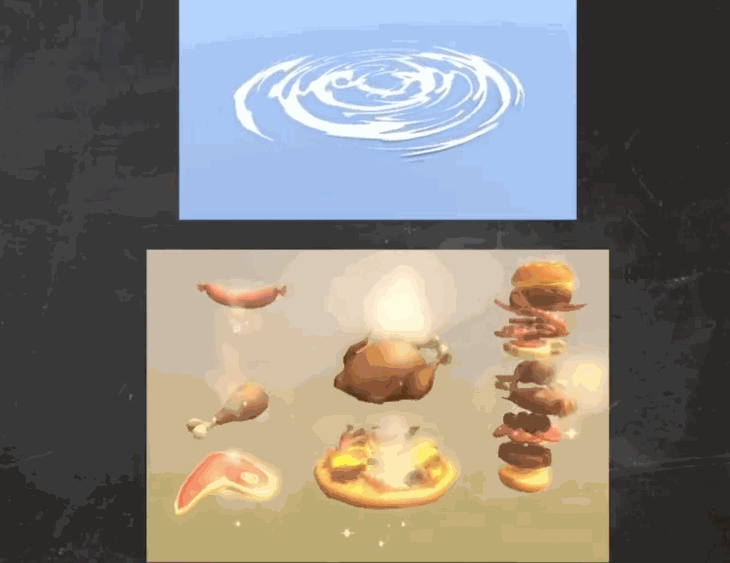
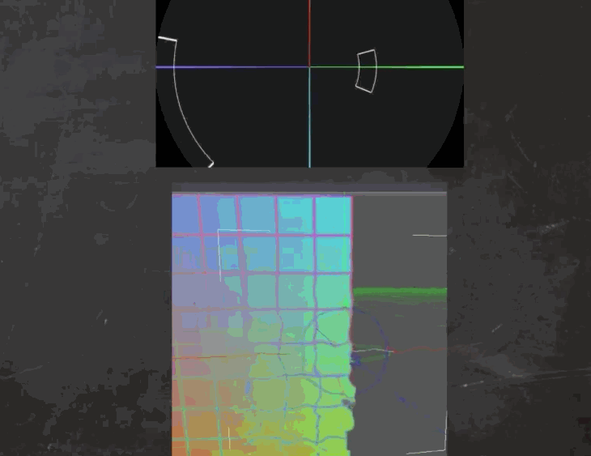
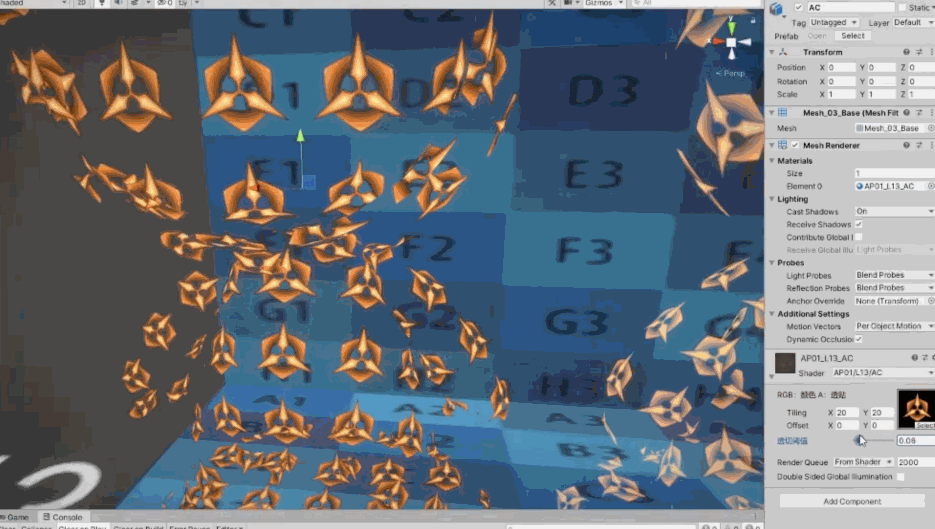
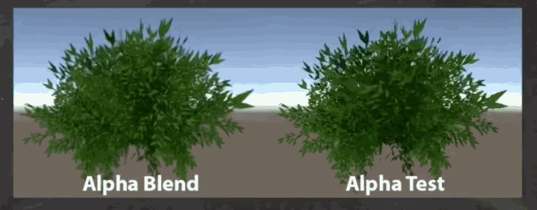
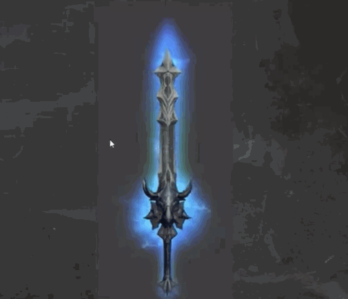
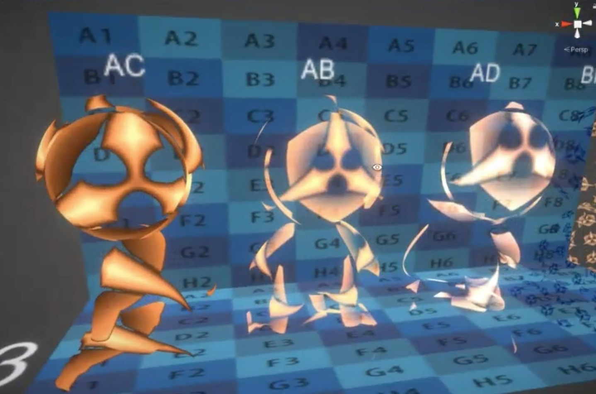
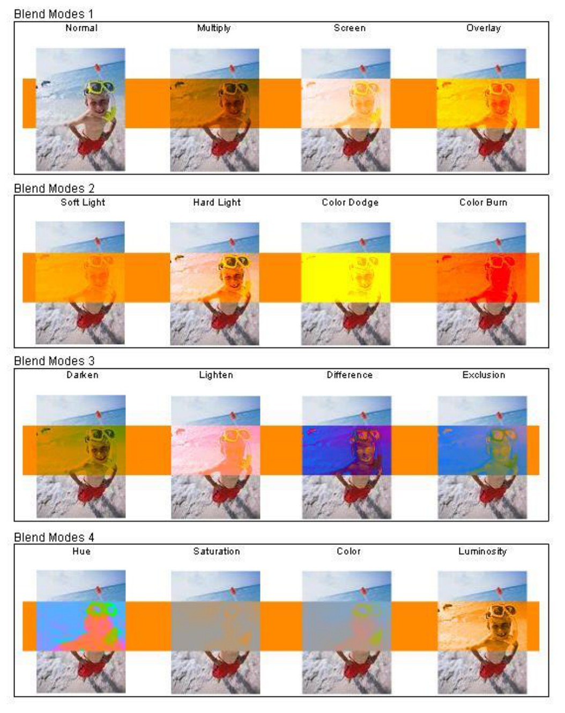
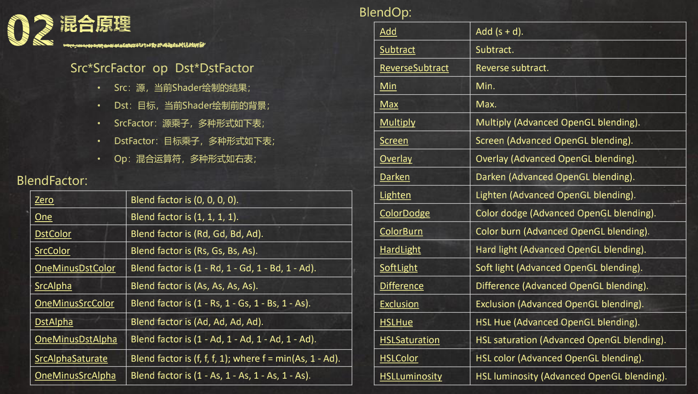
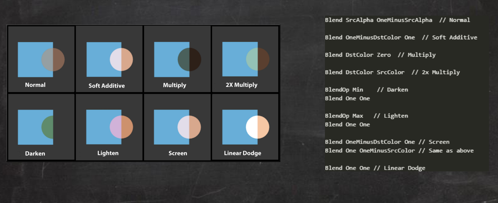

>以上的课程对于角色的Shader、材质做了全部的讲解了，接下来是关于特效的Shader 知识的学习笔记总结！！！！

>[技术美术入门课-13: https://www.bilibili.com/video/BV1gi4y1t75B](https://www.bilibili.com/video/BV1gi4y1t75B)

特效类的Shader 一个特点就是“透”，特效大部分都是透明、边缘模糊等效果：AB、AD、AC、自动义混合方式


第二个特点就是“动”：参数动画、UV 动画（UV 流动、UV 扰动、序列帧动画）、顶点动画（顶点位置动画、顶点颜色动画）



还有一个特点是“映”：极坐标、屏幕坐标UV、透明扭曲



## 透切 · AlphaCutout（AC） 与透混 · ·AlphaBlend（AB）

透切常用于复杂轮廓，明确边缘的物体表现，比如：镂空金属、裙摆边缘、特定风格下的头发、树叶等

优点是没有排序问题；缺点是边缘效果太实、移动端性能较差

```cg
Shader "AP01/L13/AC" {
    Properties {
        // RGB 通道、A通道包含不同的信息
        _MainTex ("RGB：颜色 A：透贴", 2d) = "gray"{}
        // 透切可能是一个从白到黑的过度，那从哪个灰度开始算是透的，哪个灰度不是透的？这就是_Cutoff 的作用
        _Cutoff ("透明剪切阈值", range(0.0, 1.0)) = 0.5
    }
    SubShader {
        Tags {
            "RenderType"="TransparentCutout"    // 对应改为Cutout
            "ForceNoShadowCasting"="True"       // 设置为True，关闭阴影投射，特效Shader 一般不投影
            "IgnoreProjector"="True"            // 设置为True，不响应投射器
        }

        Pass {
            Name "FORWARD"
            Tags {
                "LightMode"="ForwardBase"
            }

            CGPROGRAM
            #pragma vertex vert
            #pragma fragment frag
            #include "UnityCG.cginc"
            #pragma multi_compile_fwdbase_fullshadows
            #pragma target 3.0

            // 输入参数
            uniform sampler2D _MainTex; uniform float4 _MainTex_ST;
            uniform half _Cutoff;
            
            // 输入结构
            struct VertexInput {
                float4 vertex : POSITION;       // 顶点位置 总是必要
                float2 uv : TEXCOORD0;          // UV信息 采样贴图用
            };
            
            // 输出结构
            struct VertexOutput {
                float4 pos : SV_POSITION;       // 顶点位置 总是必要
                float2 uv : TEXCOORD0;          // UV信息 采样贴图用
            };
            
            // 输入结构 >>> 顶点Shader >>> 输出结构
            VertexOutput vert (VertexInput v) {
                VertexOutput o = (VertexOutput)0;
                o.pos = UnityObjectToClipPos( v.vertex);    // 顶点位置坐标转换 OS>CS
                o.uv = TRANSFORM_TEX(v.uv, _MainTex);       // UV信息 支持TilingOffset
                return o;
            }
            
            // 输出结构 >>> 像素
            // 1. 对主纹理采样，RGB颜色、A透贴
            // 2. 基于透贴灰度和透贴阈值，产生透明效果
            // 3. 返回值
            half4 frag(VertexOutput i) : COLOR {
                half4 var_MainTex = tex2D(_MainTex, i.uv);      // 采样贴图 RGB颜色 A透贴

                // clip() 函数
                clip(var_MainTex.a - _Cutoff);                  // 透明剪切

                return var_MainTex;             // 返回值
            }
            ENDCG
        }
    }
}
```

实现的效果大概是这个样子





透混常用于复杂轮廓，无明确边缘的物体表现，常用于半透明的物体表现，一般的特效表现、打底用

优点是移动端性能较好，边缘效果较好；但是有排序问题，不适合应用于空间关系比较复杂的效果

```cg
Shader "AP01/L13/AB" {
    Properties {
        _MainTex ("RGB：颜色 A：透贴", 2d) = "gray"{}
        _Opacity ("透明度", range(0, 1)) = 0.5
    }
    SubShader {
        Tags {
            // 渲染队列
            "Queue"="Transparent"               // 调整渲染顺序，相比于AC 多了这个Tag

            "RenderType"="Transparent"          // 对应改为Cutout
            "ForceNoShadowCasting"="True"       // 关闭阴影投射
            "IgnoreProjector"="True"            // 不响应投射器
        }
        Pass {
            Name "FORWARD"
            Tags {
                "LightMode"="ForwardBase"
            }

            Blend One OneMinusSrcAlpha          // 修改混合方式One/SrcAlpha OneMinusSrcAlpha
            
            CGPROGRAM
            #pragma vertex vert
            #pragma fragment frag
            #include "UnityCG.cginc"
            #pragma multi_compile_fwdbase_fullshadows
            #pragma target 3.0

            // 输入参数
            uniform sampler2D _MainTex; uniform float4 _MainTex_ST;
            uniform half _Opacity;
            
            // 输入结构
            struct VertexInput {
                float4 vertex : POSITION;       // 顶点位置 总是必要
                float2 uv : TEXCOORD0;          // UV信息 采样贴图用
            };
            
            // 输出结构
            struct VertexOutput {
                float4 pos : SV_POSITION;       // 顶点位置 总是必要
                float2 uv : TEXCOORD0;          // UV信息 采样贴图用
            };
            
            // 输入结构 >>> 顶点Shader >>> 输出结构
            VertexOutput vert (VertexInput v) {
                VertexOutput o = (VertexOutput)0;
                    o.pos = UnityObjectToClipPos( v.vertex);    // 顶点位置 OS>CS
                    o.uv = TRANSFORM_TEX(v.uv, _MainTex);       // UV信息 支持TilingOffset
                return o;
            }
            
            // 输出结构 >>> 像素
            half4 frag(VertexOutput i) : COLOR {
                half4 var_MainTex = tex2D(_MainTex, i.uv);      // 采样贴图 RGB颜色 A透贴
                half3 finalRGB = var_MainTex.rgb;
                half opacity = var_MainTex.a * _Opacity;
                return half4(finalRGB * opacity, opacity);      // 返回值
            }
            ENDCG
        }
    }
}
```

渲染队列用于控制它在什么时候被渲染，一般Unity 渲染不透明的物体是从前往后做一个渲染，渲染透明物体的时候再从后往前，这样就可以保证不出问题。AB 是一个透明的物体，所以需要知道透过去的是什么，所以要让不透明的物体先渲染掉，才能知道它被透掉的东西和半透明的东西。渲染队列就是Unity 将物体按照某种优先级排队，规划哪些先渲染、哪些后渲染

## 透叠 · Addtive（AD）

AD 可以说是特效的灵魂，常用于发光体、辉光的表现，一般的特效表现、提亮用。也存在排序问题，多层叠加容易堆爆性能（OverDraw）；作为辉光效果，通常用后处理替代



比如上面的效果，首先有一层是剑的模糊的轮廓，还有刀刃一层是发射的粒子，刀柄一层是雷电粒子，可以想象有多少透明的片叠在一起，把透明片一层叠一层的情况叫做OverDraw，就是在这个地方的像素要计算多次，对性能很不友好！

```cg
Shader "AP01/L13/AD" {
    Properties {
        _MainTex ("RGB：颜色 A：透贴", 2d) = "gray"{}
        _Opacity ("透明度", range(0, 1)) = 0.5
    }
    SubShader {
        Tags {
            "Queue"="Transparent"               // 调整渲染顺序
            "RenderType"="Transparent"          // 对应改为Cutout
            "ForceNoShadowCasting"="True"       // 关闭阴影投射
            "IgnoreProjector"="True"            // 不响应投射器
        }
        Pass {
            Name "FORWARD"
            Tags {
                "LightMode"="ForwardBase"
            }

            // 混合模式是不同于AB 的一个地方
            Blend One One                       // 修改混合方式
            
            CGPROGRAM
            #pragma vertex vert
            #pragma fragment frag
            #include "UnityCG.cginc"
            #pragma multi_compile_fwdbase_fullshadows
            #pragma target 3.0
            
            // 输入参数
            uniform sampler2D _MainTex; uniform float4 _MainTex_ST;
            uniform half _Opacity;
            
            // 输入结构
            struct VertexInput {
                float4 vertex : POSITION;       // 顶点位置 总是必要
                float2 uv : TEXCOORD0;          // UV信息 采样贴图用
            };

            // 输出结构
            struct VertexOutput {
                float4 pos : SV_POSITION;       // 顶点位置 总是必要
                float2 uv : TEXCOORD0;          // UV信息 采样贴图用
            };
            
            // 输入结构 >>> 顶点Shader >>> 输出结构
            VertexOutput vert (VertexInput v) {
                VertexOutput o = (VertexOutput)0;
                    o.pos = UnityObjectToClipPos( v.vertex);    // 顶点位置 OS>CS
                    o.uv = TRANSFORM_TEX(v.uv, _MainTex);       // UV信息 支持TilingOffset
                return o;
            }
            
            // 输出结构 >>> 像素
            half4 frag(VertexOutput i) : COLOR {
                half4 var_MainTex = tex2D(_MainTex, i.uv);      // 采样贴图 RGB颜色 A透贴不必须
                half3 finalRGB = var_MainTex.rgb;
                half opacity = var_MainTex.a * _Opacity;
                return half4(finalRGB * opacity, opacity);      // 返回值
            }
            ENDCG
        }
    }
}
```



## 更多混合模式

AB、AC、AD 知识非常多中混合模式中常用的几种，足够应付一般项目的特效需求。不排除某些风格特殊，或者特殊用途的场景需要用到其他混合模式





常用混合模式



```cg
Shader "AP01/L13/BlendMode" {
    Properties {
        _MainTex ("RGB：颜色 A：透贴", 2d) = "gray"{}
        _Opacity ("透明度", range(0, 1)) = 0.5
        [Enum(UnityEngine.Rendering.BlendMode)]
        _BlendSrc ("混合源乘子", int) = 0
        [Enum(UnityEngine.Rendering.BlendMode)]
        _BlendDst ("混合目标乘子", int) = 0
        [Enum(UnityEngine.Rendering.BlendOp)]
        _BlendOp ("混合算符", int) = 0
    }
    SubShader {
        Tags {
            "Queue"="Transparent"               // 调整渲染顺序
            "RenderType"="Transparent"          // 对应改为Cutout
            "ForceNoShadowCasting"="True"       // 关闭阴影投射
            "IgnoreProjector"="True"            // 不响应投射器
        }
        Pass {
            Name "FORWARD"
            Tags {
                "LightMode"="ForwardBase"
            }
            BlendOp [_BlendOp]                  // 可自定义混合算符
            Blend [_BlendSrc] [_BlendDst]       // 可自定义混合模式

            CGPROGRAM
            #pragma vertex vert
            #pragma fragment frag
            #include "UnityCG.cginc"
            #pragma multi_compile_fwdbase_fullshadows
            #pragma target 3.0

            // 输入参数
            uniform sampler2D _MainTex; uniform float4 _MainTex_ST;
            uniform half _Opacity;

            // 输入结构
            struct VertexInput {
                float4 vertex : POSITION;       // 顶点位置 总是必要
                float2 uv : TEXCOORD0;          // UV信息 采样贴图用
            };

            // 输出结构
            struct VertexOutput {
                float4 pos : SV_POSITION;       // 顶点位置 总是必要
                float2 uv : TEXCOORD0;          // UV信息 采样贴图用
            };

            // 输入结构 >>> 顶点Shader >>> 输出结构
            VertexOutput vert (VertexInput v) {
                VertexOutput o = (VertexOutput)0;
                    o.pos = UnityObjectToClipPos( v.vertex);    // 顶点位置 OS>CS
                    o.uv = TRANSFORM_TEX(v.uv, _MainTex);       // UV信息 支持TilingOffset
                return o;
            }
            
            // 输出结构 >>> 像素
            half4 frag(VertexOutput i) : COLOR {
                half4 var_MainTex = tex2D(_MainTex, i.uv);      // 采样贴图 RGB颜色 A透贴不必须
                half3 finalRGB = var_MainTex.rgb;
                half opacity = var_MainTex.a * _Opacity;
                return half4(finalRGB * opacity, opacity);                // 返回值
            }
            ENDCG
        }
    }
}
```