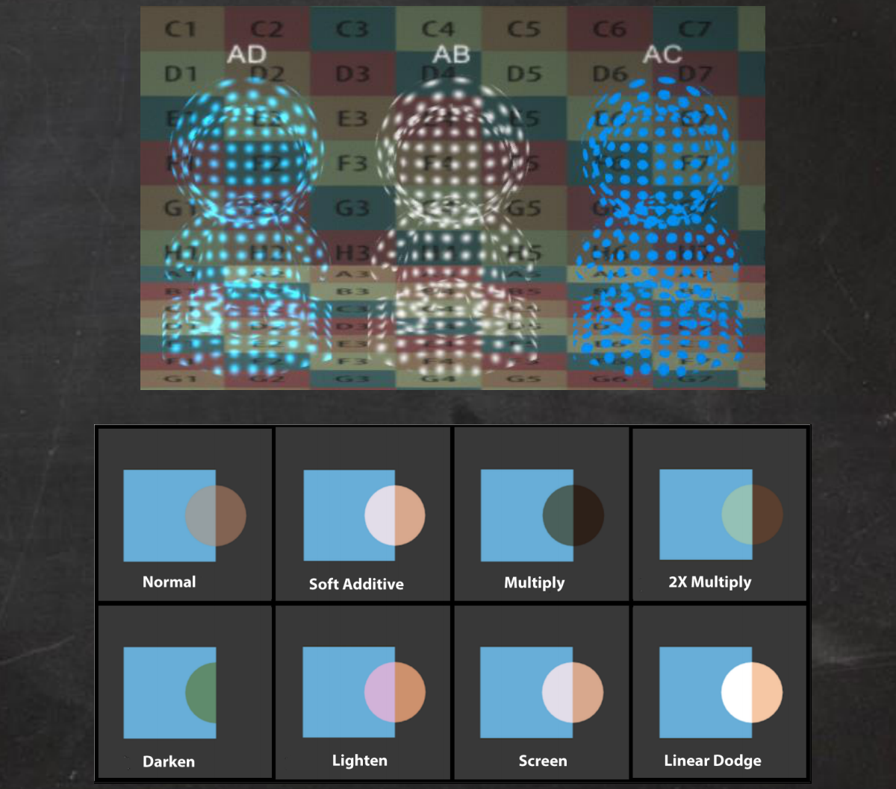
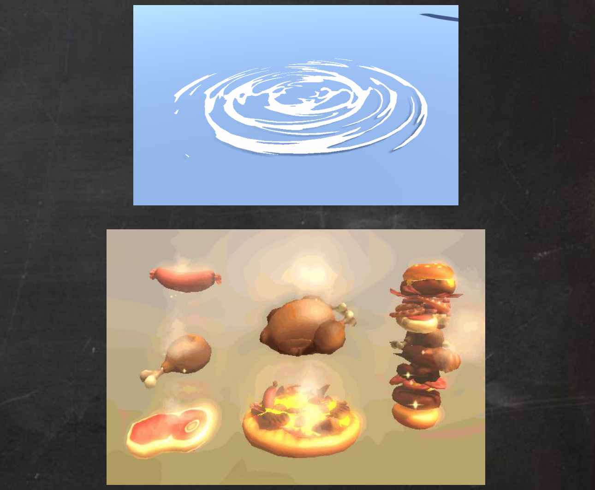
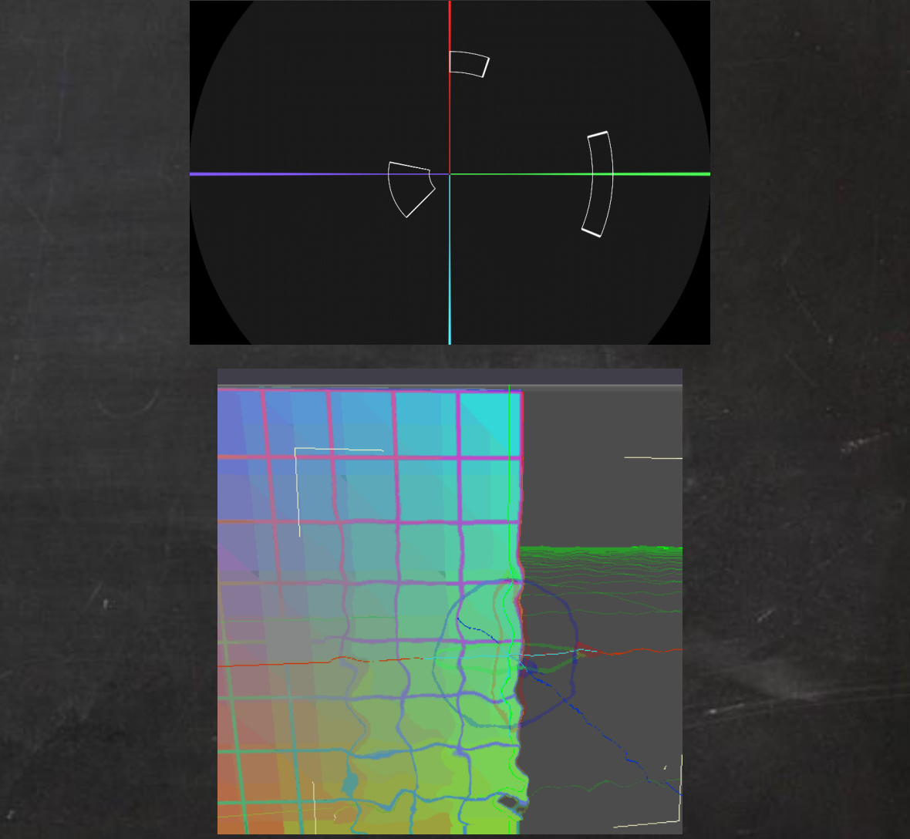

>[技术美术入门课-13: https://www.bilibili.com/video/BV1gi4y1t75B](https://www.bilibili.com/video/BV1gi4y1t75B)

以上的课程对于角色的Shader、材质做了全部的讲解了，接下来是关于特效的Shader 知识的学习笔记总结！！！！

特效类的Shader 一个特点就是“透”，特效大部分都是透明、边缘模糊等效果：AB、AD、AC、自动义混合方式

第二个特点就是“动”：参数动画、UV 动画（UV 流动、UV 扰动、序列帧动画）、顶点动画（顶点位置动画、顶点颜色动画）

还有一个特点是“映”：极坐标、屏幕坐标UV、透明扭曲

## 透明效果

