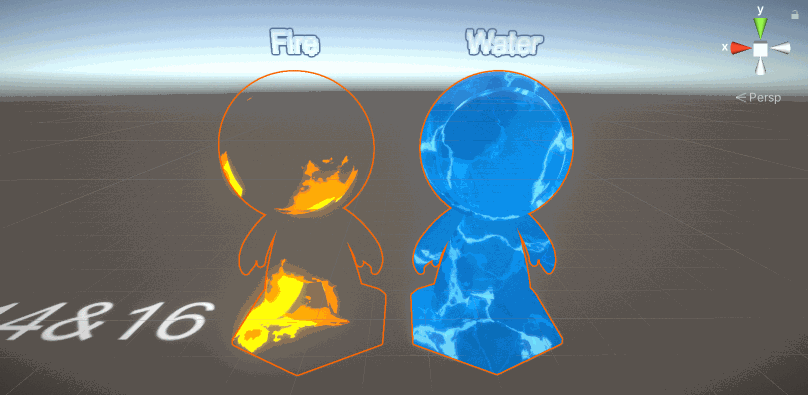

>[技术美术入门课-114 & 16: https://www.bilibili.com/video/BV1tK4y1t7Sa](https://www.bilibili.com/video/BV1tK4y1t7Sa)



首先看一下实现火的特效的Shader 源码

```GLSL
Shader "AP01/L16/Fire" {
    Properties {
        // 从贴图的不同通道获取不同的信息，红通道作为外焰、绿通道作为内焰、蓝通道作为透贴
        _Mask           ("R:外焰 G:内焰 B:透贴", 2d) = "blue"{}
        // 从噪声贴图的不同通道获取不同的信息
        _Noise          ("R:噪声1 G:噪声2", 2d) = "gray"{}
        _Noise1Params   ("噪声1 X:大小 Y:流速 Z:强度", vector) = (1.0, 0.2, 0.2, 1.0)
        _Noise2Params   ("噪声2 X:大小 Y:流速 Z:强度", vector) = (1.0, 0.2, 0.2, 1.0)
        [HDR]_Color1    ("外焰颜色", color) = (1,1,1,1)
        [HDR]_Color2    ("内焰颜色", color) = (1,1,1,1)
    }
    SubShader {
        Tags {
            "Queue"="Transparent"               // 调整渲染顺序
            "RenderType"="Transparent"          // 对应改为Cutout
            "ForceNoShadowCasting"="True"       // 关闭阴影投射
            "IgnoreProjector"="True"            // 不响应投射器
        }
        Pass {
            Name "FORWARD"
            Tags {
                "LightMode"="ForwardBase"
            }
            Blend One OneMinusSrcAlpha          // 修改混合方式One/SrcAlpha OneMinusSrcAlpha
            
            CGPROGRAM
            #pragma vertex vert
            #pragma fragment frag
            #include "UnityCG.cginc"
            #pragma multi_compile_fwdbase_fullshadows
            #pragma target 3.0

            // 输入参数
            uniform sampler2D _Mask;    uniform float4 _Mask_ST;
            uniform sampler2D _Noise;
            uniform half3 _Noise1Params;
            uniform half3 _Noise2Params;
            uniform half3 _Color1;
            uniform half3 _Color2;

            // 输入结构
            struct VertexInput {
                float4 vertex : POSITION;       // 顶点位置 总是必要
                float2 uv : TEXCOORD0;          // UV信息 采样贴图用
            };

            // 输出结构
            struct VertexOutput {
                float4 pos : SV_POSITION;       // 顶点位置 总是必要
                float2 uv0 : TEXCOORD0;         // UV信息 采样Mask
                float2 uv1 : TEXCOORD1;         // UV信息 采样Noise1
                float2 uv2 : TEXCOORD2;         // UV信息 采样Noise2
            };

            // 输入结构 >>> 顶点Shader >>> 输出结构
            VertexOutput vert (VertexInput v) {
                VertexOutput o = (VertexOutput)0;
                    o.pos = UnityObjectToClipPos( v.vertex);    // 顶点位置 OS>CS
                    o.uv0 = TRANSFORM_TEX(v.uv, _Mask);
                    o.uv1 = o.uv0 * _Noise1Params.x - float2(0.0, frac(_Time.x * _Noise1Params.y));
                    o.uv2 = o.uv0 * _Noise2Params.x - float2(0.0, frac(_Time.x * _Noise2Params.y));
                return o;
            }

            // 输出结构 >>> 像素
            half4 frag(VertexOutput i) : COLOR {
                // 扰动遮罩
                half warpMask = tex2D(_Mask, i.uv0).b;
                // 噪声1
                half var_Noise1 = tex2D(_Noise, i.uv1).r;
                // 噪声2
                half var_Noise2 = tex2D(_Noise, i.uv2).g;
                // 噪声混合
                half noise = var_Noise1 * _Noise1Params.z + var_Noise2 * _Noise2Params.z;
                // 扰动UV
                float2 warpUV = i.uv0 - float2(0.0, noise) * warpMask;
                // 采样Mask
                half3 var_Mask = tex2D(_Mask, warpUV);
                // 计算FinalRGB 不透明度
                half3 finalRGB = _Color1 * var_Mask.r + _Color2 * var_Mask.g;
                half opacity = var_Mask.r + var_Mask.g;
                return half4(finalRGB, opacity);                // 返回值
            }
            ENDCG
        }
    }
}
```

再看一下实现水的特效的Shader 源码

```cg
Shader "AP01/L16/Water" {
    Properties {
        _MainTex        ("颜色贴图", 2d) = "white"{}
        _WarpTex        ("扰动图", 2d) = "gray"{}
        _Speed          ("X：流速X Y：流速Y", vector) = (1.0, 1.0, 0.5, 1.0)
        _Warp1Params    ("X：大小 Y：流速X Z：流速Y W：强度", vector) = (1.0, 1.0, 0.5, 1.0)
        _Warp2Params    ("X：大小 Y：流速X Z：流速Y W：强度", vector) = (2.0, 0.5, 0.5, 1.0)
    }
    SubShader {
        Tags {
            "RenderType"="Opaque"
        }
        Pass {
            Name "FORWARD"
            Tags {
                "LightMode"="ForwardBase"
            }

            CGPROGRAM
            #pragma vertex vert
            #pragma fragment frag
            #include "UnityCG.cginc"
            #pragma multi_compile_fwdbase_fullshadows
            #pragma target 3.0

            // 输入参数
            uniform sampler2D _MainTex; uniform float4 _MainTex_ST;
            uniform sampler2D _WarpTex;
            uniform half2 _Speed;
            uniform half4 _Warp1Params;
            uniform half4 _Warp2Params;

            // 输入结构
            struct VertexInput {
                float4 vertex : POSITION;       // 顶点位置 总是必要
                float2 uv : TEXCOORD0;          // UV信息 采样贴图用
            };

            // 输出结构
            struct VertexOutput {
                float4 pos : SV_POSITION;       // 顶点位置 总是必要
                float2 uv0 : TEXCOORD0;         // UV信息 采样Mask
                float2 uv1 : TEXCOORD1;         // UV信息 采样Noise1
                float2 uv2 : TEXCOORD2;         // UV信息 采样Noise2
            };

            // 输入结构 >>> 顶点Shader >>> 输出结构
            VertexOutput vert (VertexInput v) {
                VertexOutput o = (VertexOutput)0;
                    o.pos = UnityObjectToClipPos( v.vertex);    // 顶点位置 OS>CS
                    o.uv0 = v.uv - frac(_Time.x * _Speed);
                    o.uv1 = v.uv * _Warp1Params.x - frac(_Time.x * _Warp1Params.yz);
                    o.uv2 = v.uv * _Warp2Params.x - frac(_Time.x * _Warp2Params.yz);
                return o;
            }

            // 输出结构 >>> 像素
            float4 frag(VertexOutput i) : COLOR {
                half3 var_Warp1 = tex2D(_WarpTex, i.uv1).rgb;      // 扰动1
                half3 var_Warp2 = tex2D(_WarpTex, i.uv2).rgb;      // 扰动2
                // 扰动混合
                half2 warp = (var_Warp1.xy - 0.5) * _Warp1Params.w +
                             (var_Warp2.xy - 0.5) * _Warp2Params.w;
                // 扰动UV
                float2 warpUV = i.uv0 + warp;
                // 采样MainTex
                half4 var_MainTex = tex2D(_MainTex, warpUV);

                return float4(var_MainTex.xyz, 1.0);
            }
            ENDCG
        }
    }
    FallBack "Diffuse"
}
```
