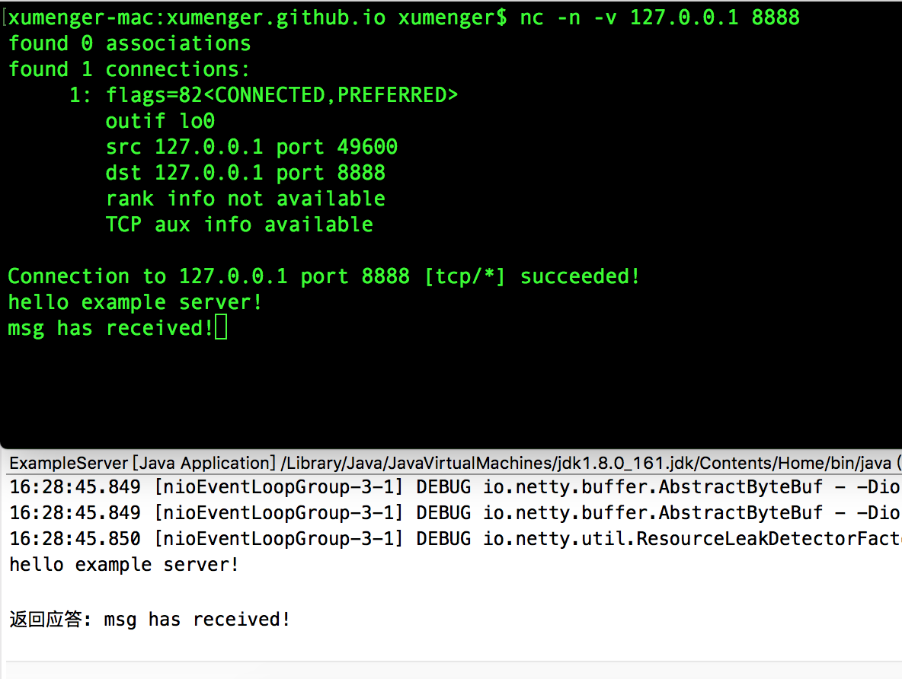
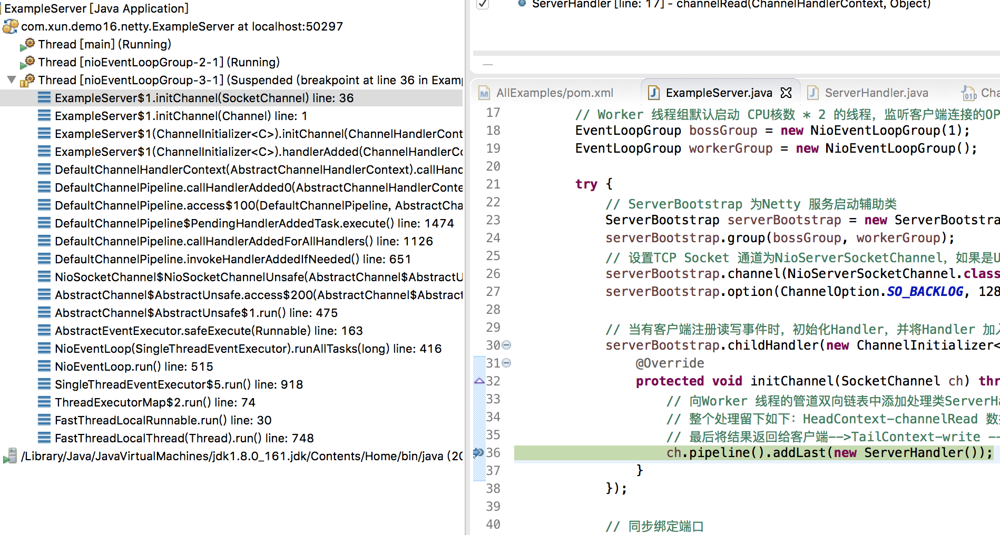
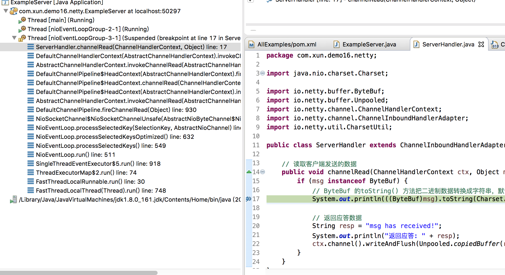

接下来源码研究的重头戏，在一段时间内会主要投入到Netty 上，原因是多方面的，比如Netty 涉及多线程技术、复杂数据结构和内存管理模型，它运用了各种设计模式以及一些TCP 的底层技术；Netty 作为一个网络库和Kafka、Redis 的网络编程的实现是可以作为很好的比较和互相补充的点；Netty 也是Spark、ElasticSearch 等大数据框架的底层通信框架，研究清楚Netty 后，对于后续研究基于它的相关项目源码也是很好的技术储备！

Maven 引入依赖

```xml
<dependency>
  <groupId>io.netty</groupId>
  <artifactId>netty-all</artifactId>
  <version>4.1.38.Final</version>
</dependency>
```
## 服务端程序

创建两个线程组，分别是Boss 线程组和Worker 线程组，Boss 线程专门用于接收来自客户端的连接，Worker 线程用于处理已经被Boss 线程接收的连接

服务端程序的实现源码如下

```java
package com.xum.demo16.netty;

import io.netty.bootstrap.ServerBootstrap;
import io.netty.channel.ChannelFuture;
import io.netty.channel.ChannelInitializer;
import io.netty.channel.ChannelOption;
import io.netty.channel.EventLoopGroup;
import io.netty.channel.nio.NioEventLoopGroup;
import io.netty.channel.socket.SocketChannel;
import io.netty.channel.socket.nio.NioServerSocketChannel;

public class ExampleServer 
{    
    public static void main(String[] args) throws Exception
    {
        // 新建两个线程组，Boss线程组启动一个线程，监听OP_ACCEPT事件
        // Worker 线程组默认启动 CPU核数 * 2 的线程，监听客户端连接的OP_READ、OP_WRITE事件，处理IO
        EventLoopGroup bossGroup = new NioEventLoopGroup(1);
        EventLoopGroup workerGroup = new NioEventLoopGroup();
        
        try {
            // ServerBootstrap 为Netty 服务启动辅助类
            ServerBootstrap serverBootstrap = new ServerBootstrap();
            serverBootstrap.group(bossGroup, workerGroup);
            // 设置TCP Socket 通道为NioServerSocketChannel，如果是UDP，则为DatagramChannel
            serverBootstrap.channel(NioServerSocketChannel.class);
            serverBootstrap.option(ChannelOption.SO_BACKLOG, 128);
            
            // 当有客户端注册读写事件时，初始化Handler，并将Handler 加入管道中
            serverBootstrap.childHandler(new ChannelInitializer<SocketChannel>() {
                @Override
                protected void initChannel(SocketChannel ch) throws Exception {
                    // 向Worker 线程的管道双向链表中添加处理类ServerHandler
                    // 整个处理留下如下：HeadContext-channelRead 数据 --> ServerHandler-channelRead 读取数据进行业务逻辑判断
                    // 最后将结果返回给客户端-->TailContext-write --> HeadContext-write
                    ch.pipeline().addLast(new ServerHandler());
                }
            });
            
            // 同步绑定端口
            System.out.println("服务启动: 8888");
            ChannelFuture future = serverBootstrap.bind(8888).sync();
            // 阻塞主线程，直到Socket通道被关闭
            future.channel().closeFuture().sync();
        } catch (Exception e) {
            e.printStackTrace();
        } finally {
            workerGroup.shutdownGracefully();
            bossGroup.shutdownGracefully();
        }
    }
}
```

服务端还需要编写一个业务逻辑处理Handler，在这里读取客户端数据，并返回应答。其继承自ChannelInboundHandlerAdapter（实现了ChannelInboundHandler 接口），当NioEventLoop 线程从Channel 读取数据时，执行绑定在Channel 的ChannelInboundHandler 对象上，并执行其channelRead() 方法

```java
package com.xum.demo16.netty;

import java.nio.charset.Charset;

import io.netty.buffer.ByteBuf;
import io.netty.buffer.Unpooled;
import io.netty.channel.ChannelHandlerContext;
import io.netty.channel.ChannelInboundHandlerAdapter;
import io.netty.util.CharsetUtil;

public class ServerHandler extends ChannelInboundHandlerAdapter {

    // 读取客户端发送的数据
    public void channelRead(ChannelHandlerContext ctx, Object msg) {
        if (msg instanceof ByteBuf) {
            // ByteBuf 的toString() 方法把二进制数据转换成字符串，默认编码是UTF-8
            System.out.println(((ByteBuf)msg).toString(Charset.defaultCharset()));
            
            // 返回应答数据
            String resp = "msg has received!";
            System.out.println("返回应答: " + resp);
            ctx.channel().writeAndFlush(Unpooled.copiedBuffer(resp, CharsetUtil.UTF_8));
        }
    }
}
```

启动服务端后，使用nc 工具连接到服务端，发送一些信息进行测试



## 基于调用栈简单分析

分别在ExampleServer 源码中的initChannel() 方法、ServerHandler 的channelRead() 方法中加断点

启动服务端程序后，使用nc 工具发起连接，这个时候触发命中initChannel() 中的断点！对应的截图如下



对应此时的调用栈是这样的，基于这个调用栈可以看到一些关键类：FastThreadLocalThread、FastThreadLocalRunnable、NioEventLoop、AbstractEventExecutor、AbstractChannel、DefaultChannelPipeline，这些也是后续深入研究Netty 架构的核心类

```
at ExampleServer$1.initChannel(SocketChannel) line: 36    
at ExampleServer$1.initChannel(Channel) line: 1    
at ExampleServer$1(ChannelInitializer<C>).initChannel(ChannelHandlerContext) line: 129    
at ExampleServer$1(ChannelInitializer<C>).handlerAdded(ChannelHandlerContext) line: 112    
at DefaultChannelHandlerContext(AbstractChannelHandlerContext).callHandlerAdded() line: 964    
at DefaultChannelPipeline.callHandlerAdded0(AbstractChannelHandlerContext) line: 610    
at DefaultChannelPipeline.access$100(DefaultChannelPipeline, AbstractChannelHandlerContext) line: 46    
at DefaultChannelPipeline$PendingHandlerAddedTask.execute() line: 1474    
at DefaultChannelPipeline.callHandlerAddedForAllHandlers() line: 1126    
at DefaultChannelPipeline.invokeHandlerAddedIfNeeded() line: 651    
at NioSocketChannel$NioSocketChannelUnsafe(AbstractChannel$AbstractUnsafe).register0(ChannelPromise) line: 503    
at AbstractChannel$AbstractUnsafe.access$200(AbstractChannel$AbstractUnsafe, ChannelPromise) line: 416    
at AbstractChannel$AbstractUnsafe$1.run() line: 475    
at AbstractEventExecutor.safeExecute(Runnable) line: 163    
at NioEventLoop(SingleThreadEventExecutor).runAllTasks(long) line: 416    
at NioEventLoop.run() line: 515    
at SingleThreadEventExecutor$5.run() line: 918    
at ThreadExecutorMap$2.run() line: 74    
at FastThreadLocalRunnable.run() line: 30    
at FastThreadLocalThread(Thread).run() line: 748    
```

nc 发送随便一些消息后，触发ServerHandler 的channelRead() 中的断点命中！截图如下



对应此时的调用栈是这样的，基于这个调用栈可以看到一些关键类：FastThreadLocalThread、FastThreadLocalRunnable、NioEventLoop、NioSocketChannel、DefaultChannelPipeline、AbstractChannelHandlerContext

```
at ServerHandler.channelRead(ChannelHandlerContext, Object) line: 17    
at DefaultChannelHandlerContext(AbstractChannelHandlerContext).invokeChannelRead(Object) line: 374    
at AbstractChannelHandlerContext.invokeChannelRead(AbstractChannelHandlerContext, Object) line: 360    
at DefaultChannelPipeline$HeadContext(AbstractChannelHandlerContext).fireChannelRead(Object) line: 352    
at DefaultChannelPipeline$HeadContext.channelRead(ChannelHandlerContext, Object) line: 1421    
at DefaultChannelPipeline$HeadContext(AbstractChannelHandlerContext).invokeChannelRead(Object) line: 374    
at AbstractChannelHandlerContext.invokeChannelRead(AbstractChannelHandlerContext, Object) line: 360    
at DefaultChannelPipeline.fireChannelRead(Object) line: 930    
at NioSocketChannel$NioSocketChannelUnsafe(AbstractNioByteChannel$NioByteUnsafe).read() line: 163    
at NioEventLoop.processSelectedKey(SelectionKey, AbstractNioChannel) line: 697    
at NioEventLoop.processSelectedKeysOptimized() line: 632    
at NioEventLoop.processSelectedKeys() line: 549    
at NioEventLoop.run() line: 511    
at SingleThreadEventExecutor$5.run() line: 918    
at ThreadExecutorMap$2.run() line: 74    
at FastThreadLocalRunnable.run() line: 30    
at FastThreadLocalThread(Thread).run() line: 748    
```

