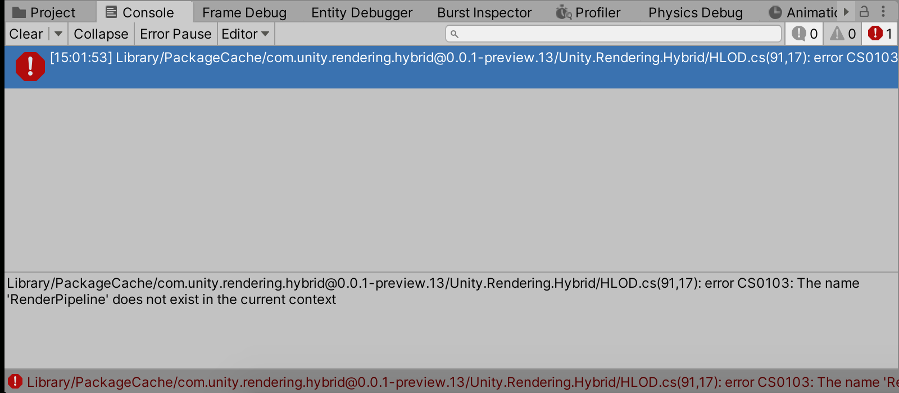
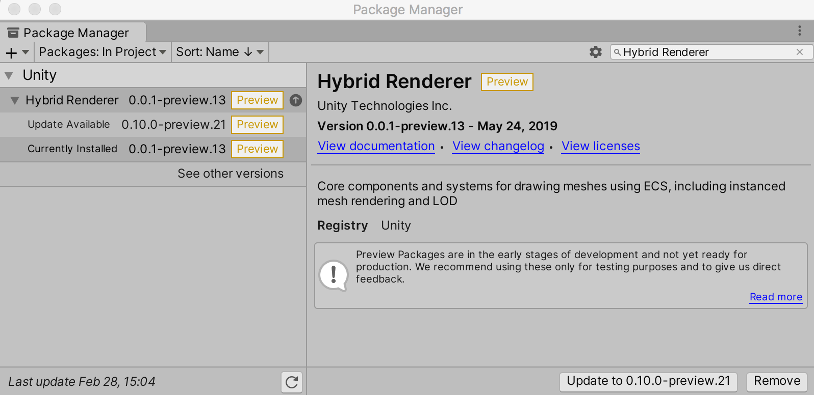
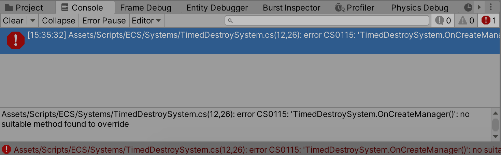
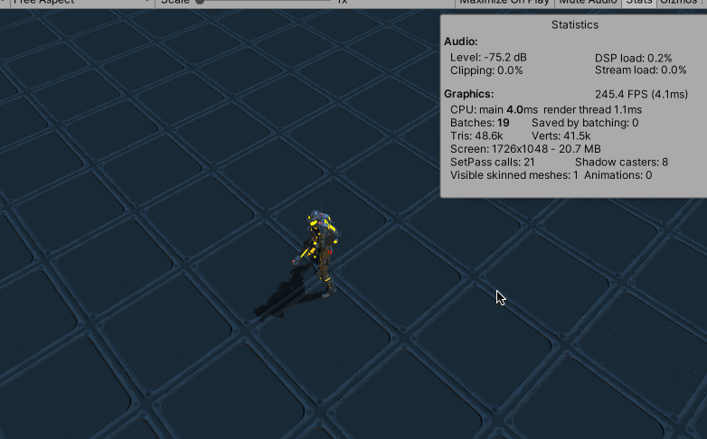

>[https://github.com/Unity-Technologies/AngryBots_ECS](https://github.com/Unity-Technologies/AngryBots_ECS)

下载之后，使用Unity-2020.1.1f1c1 版本尝试运行ECS Shooter 场景，但是出现报错



>Library/PackageCache/com.unity.rendering.hybrid@0.0.1-preview.13/Unity.Rendering.Hybrid/HLOD.cs(91,17): error CS0103: The name 'RenderPipeline' does not exist in the current context

尝试把Hybrid Renderer 更新到最新的版本，于是第一个报错就消失了



## 修改代码兼容新接口

但是出现一个新的报错



>Assets/Scripts/ECS/Systems/TimedDestroySystem.cs(12,26): error CS0115: 'TimedDestroySystem.OnCreateManager()': no suitable method found to override

Job System不存在OnCreateManager接口，可以进入到基类ComponentSystemBase里，发现了OnCreate() 生命周期函数，可以重写它来代替报错函数，另外

* World.Active 更改为World.DefaultGameObjectInjectionWorld，可能Active 是老版本的命名方式
* Time.deltaTime 更改为Time.DeltaTime，全部改为大写
* GameObjectConversionUtility.ConvertGameObjectHierarchy 接口所需参数也不一致，参考EnemySpawner.cs

比如TimedDestroySystem.cs

```c#
using Unity.Entities;
using Unity.Jobs;
using Unity.Transforms;
using UnityEngine;


[UpdateAfter(typeof(MoveForwardSystem))]
public class TimedDestroySystem : JobComponentSystem
{
    EndSimulationEntityCommandBufferSystem buffer;

    protected override void OnCreate()
    {
        // World.Active 修改为World.DefaultGameObjectInjectionWorld
        buffer = World.DefaultGameObjectInjectionWorld.GetOrCreateSystem<EndSimulationEntityCommandBufferSystem>();
    }

    struct CullingJob : IJobForEachWithEntity<TimeToLive>
    {
        public EntityCommandBuffer.ParallelWriter commands;
        public float dt;

        public void Execute(Entity entity, int jobIndex, ref TimeToLive timeToLive)
        {
            timeToLive.Value -= dt;
            if (timeToLive.Value <= 0f)
                commands.DestroyEntity(jobIndex, entity);
        }
    }

    protected override JobHandle OnUpdate(JobHandle inputDeps)
    {
        var job = new CullingJob
        {
            commands = buffer.CreateCommandBuffer().AsParallelWriter(),
            // Time.deltaTime 修改为Time.DeltaTime
            dt = Time.DeltaTime
        };

        var handle = job.Schedule(this, inputDeps);
        buffer.AddJobHandleForProducer(handle);

        return handle;
    }
}
```

EnemySpawner.cs 修改为

```c#
using Unity.Entities;
using Unity.Transforms;
using UnityEngine;

public class EnemySpawner : MonoBehaviour
{
    [Header("Enemy Spawn Info")]
    public bool spawnEnemies = true;
    public bool useECS = false;
    public float enemySpawnRadius = 10f;
    public GameObject enemyPrefab;

    [Header("Enemy Spawn Timing")]
    [Range(1, 100)] public int spawnsPerInterval = 1;
    [Range(.1f, 2f)] public float spawnInterval = 1f;
    
    EntityManager manager;
    Entity enemyEntityPrefab;

    float cooldown;


    void Start()
    {
        if (useECS)
        {
            // ConvertGameObjectHierarchy() 调用方式也得修改
            var settings = GameObjectConversionSettings.FromWorld(World.DefaultGameObjectInjectionWorld, null);
            manager = World.DefaultGameObjectInjectionWorld.EntityManager;
            enemyEntityPrefab = GameObjectConversionUtility.ConvertGameObjectHierarchy(enemyPrefab, settings);
        }
    }

    void Update()
    {
        if (!spawnEnemies || Settings.IsPlayerDead())
            return;

        cooldown -= Time.deltaTime;

        if (cooldown <= 0f)
        {
            cooldown += spawnInterval;
            Spawn();
        }
    }

    void Spawn()
    {
        for (int i = 0; i < spawnsPerInterval; i++)
        {
            Vector3 pos = Settings.GetPositionAroundPlayer(enemySpawnRadius);

            if (!useECS)
            {
                Instantiate(enemyPrefab, pos, Quaternion.identity);
            }
            else
            {
                Entity enemy = manager.Instantiate(enemyEntityPrefab);
                manager.SetComponentData(enemy, new Translation { Value = pos });
            }
        }
    }
}
```

修改完成后，注意要重启一下Unity，否则运行的时候还是会有报错，并且可能看不到子弹和敌人（可能是Burst Compiler的问题）

## 运行游戏

最后运行游戏的效果是这样的，可以看到在有大量子弹的情况下，游戏的帧率还是挺高的！



## 参考资料

* [https://unity.com/cn/dots](https://unity.com/cn/dots)
* [Unity的Dots技术入门](https://daveant.gitee.io/posts/Unity%E7%9A%84Dots%E6%8A%80%E6%9C%AF%E5%85%A5%E9%97%A8/)
* [https://github.com/Unity-Technologies/AngryBots_ECS](https://github.com/Unity-Technologies/AngryBots_ECS)
* [UUG Online直播回放：DOTS从原理到应用-雨松MOMO](https://www.bilibili.com/video/BV1sD4y1Q7an)
