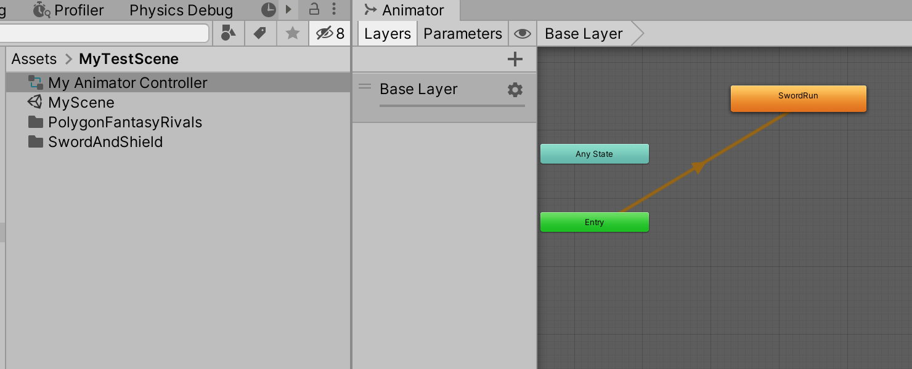
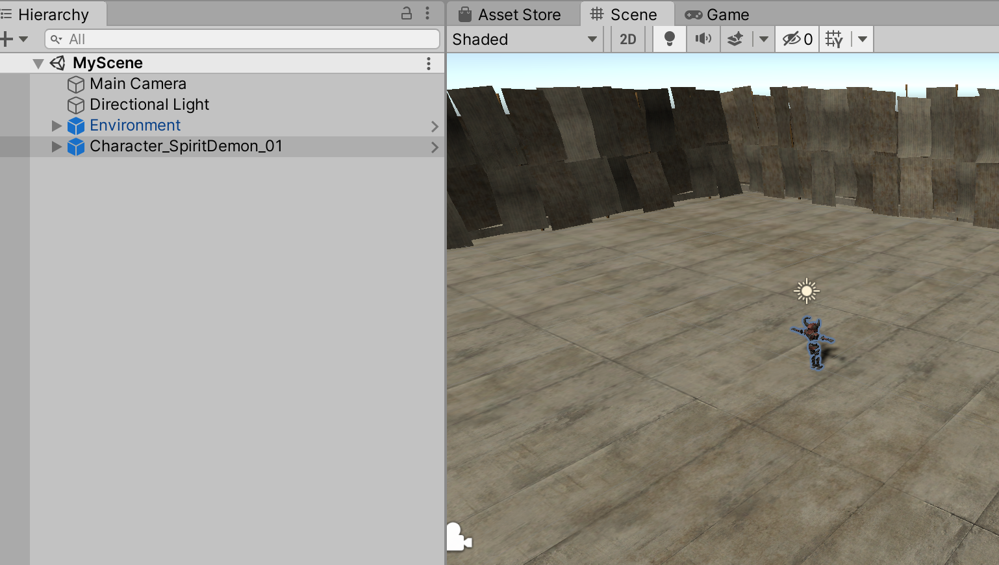
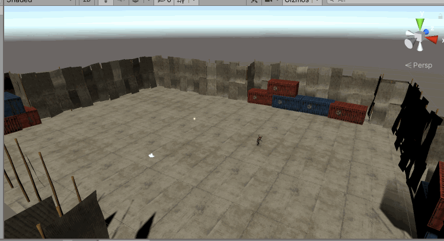
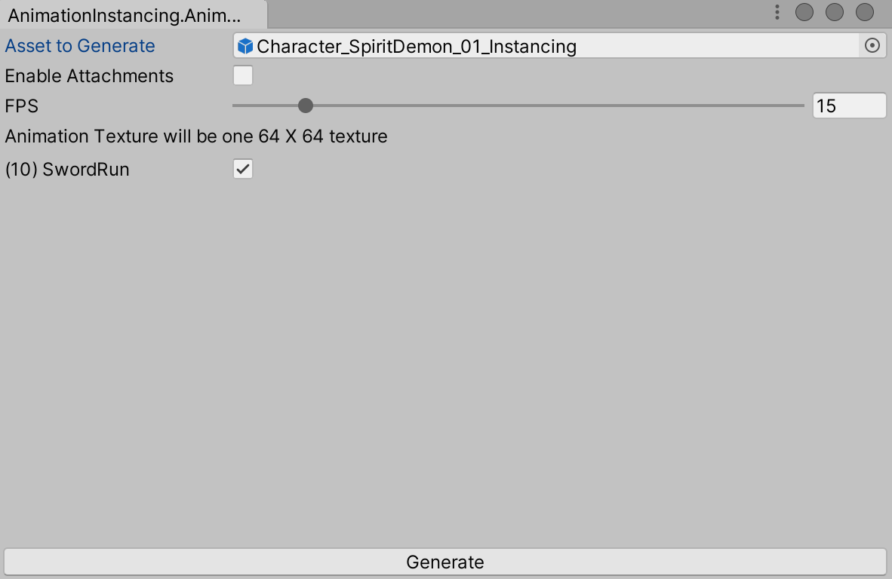
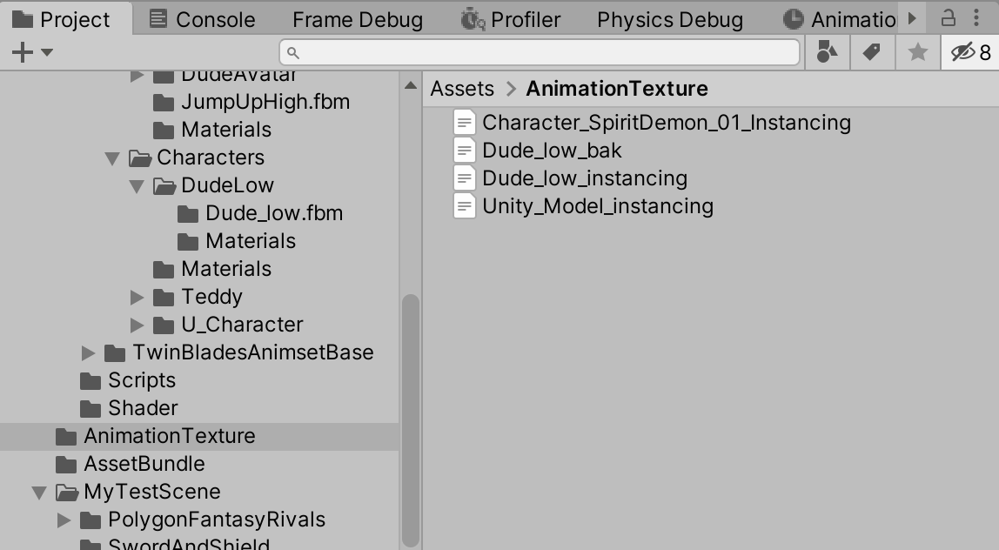
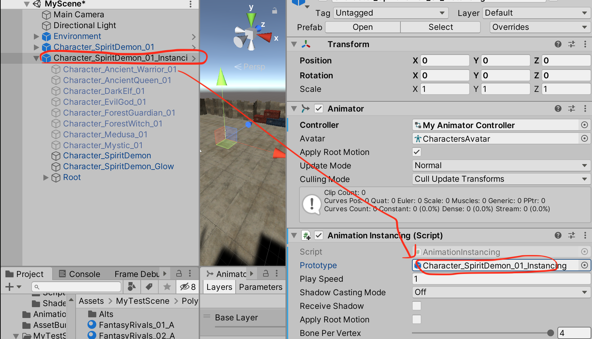
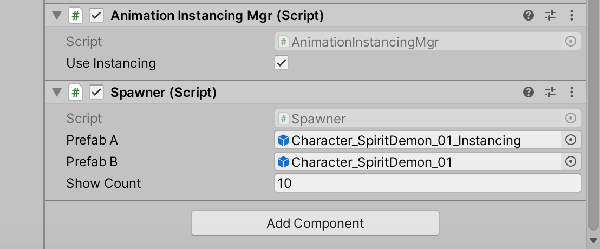
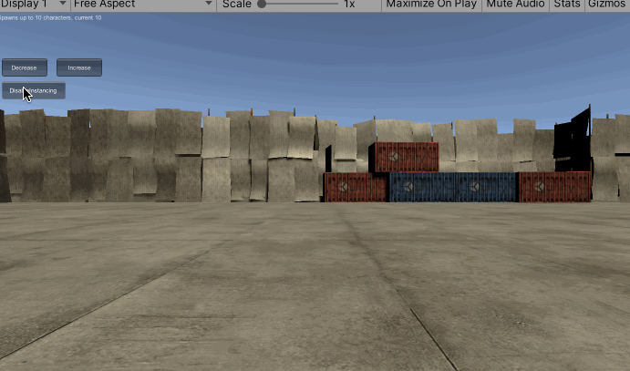

>[https://github.com/Unity-Technologies/Animation-Instancing](https://github.com/Unity-Technologies/Animation-Instancing)

不纠结原理，先看一下怎么使用这个插件

## 普通的Unity 动画

创建一个全新的场景MyScene，然后将PolygonFantasyRivals 模型资源包、SwordAndShield 动画资源包导入到游戏中

创建一个Animator Controller，然后将SwordAndShield 中的Run 动作拖入，作为默认动作



在场景中拖入Environment 环境预制件、Character_SpiritDemon_01 模型预制件



然后将刚才创建的My Animator Controller 托给场景中的Character_SpiritDemon_01 预制件，并且为模型新增这样的模拟运动的脚本

```c#
using System.Collections;
using System.Collections.Generic;
using UnityEngine;

public class MoveController : MonoBehaviour
{
    // Start is called before the first frame update
    void Start()
    {
        
    }

    // Update is called once per frame
    void Update()
    {
        // 比如，物体围绕世界坐标的“(10f,0f,0f)”这个点，以“(0f,0f,1f)”为轴向，也就是Z抽进行旋转，旋转角度是“3f”
        // transform.RotateAround(new Vector3(10f, 0f, 0f), new Vector3(0f, 0f, 1f), 3f);

        transform.RotateAround(transform.position, new Vector3(0f, 1f, 0f), Random.RandomRange(20f, 50f) * Time.deltaTime);
        transform.position = new Vector3(transform.position.x + 1 * Time.deltaTime, transform.position.y, transform.position.z);
    }
}
```

然后运行起来后，角色是这么运动的



## 使用Animation-Instancing

在Hierarchy 中复制Character_SpiritDemon_01 得到一个Character_SpiritDemon_01_Instancing，并且为后者添加AnimationInstancing.cs 脚本

然后打开Animation-Instancing 的窗口，将Character_SpiritDemon_01_Instancing 拖入，点击Generate



重启Unity，然后在AnimationTexture 目录下可以看到对应Character_SpiritDemon_01_Instancing 的文件



复制一份Character_SpiritDemon_01 原来的材质球，并将其Shader 都修改为AnimationInstancing/DiffuseInstancing，然后为Character_SpiritDemon_01_Instancing 所有用到材质球的节点都更换为上面设置了AnimationInstancing/DiffuseInstancing 的材质

注意复制一份新的材质球，就是因为要保持Character_SpiritDemon_01 原来的材质球不变化！

上面Generate 按钮点击后，还可以看到Character_SpiritDemon_01_Instancing 的AnimationInstancing 组件的Prototype 属性设置为它自己了！



为Directional Light 添加Spawner.cs 脚本、AnimationInstancingMgr.cs 脚本，并且Spawner.cs 设置如下的属性



运行效果如下（可以选择使用普通的模式生成多个动画模型，也可以选择使用Animation-Instancing 的方式）



可以选择使用普通的模式生成多个动画模型，也可以选择使用Animation-Instancing 的方式，打开Stat 的话，可以看到后者的Draw Call 等性能指标明显优于前者！（这里不再做分析）

## 原理分析

本文暂时不分析，不过猜测和之前我研究过的基于GPU 实现动画的原理应该是一致的，或者差不多的

* [Shader 动画：应用于DOTS 应用](http://www.xumenger.com/shader-animation-dots-20210117/)
* [Shader 动画：基于GPU 的动画优化](http://www.xumenger.com/shader-animation-20210116/)
* [Shader 动画：传统动画及性能分析方法论](http://www.xumenger.com/shader-animation-20210115/)

## 参考资料

* [【转】Animation Instancing：高性能大规模动画解决方案](https://www.jianshu.com/p/cce8047a9903)
* [基于Animation Instancing的人群模拟](https://zhuanlan.zhihu.com/p/28255631)
* [Animation Instancing – Instancing for SkinnedMeshRenderer](https://blogs.unity3d.com/cn/2018/04/16/animation-instancing-instancing-for-skinnedmeshrenderer/)
* [Unity Animation Instancing 官方解决方案初试](https://blog.csdn.net/huutu/article/details/109759751)
* [https://github.com/Unity-Technologies/Animation-Instancing](https://github.com/Unity-Technologies/Animation-Instancing)
* [Shader 动画：应用于DOTS 应用](http://www.xumenger.com/shader-animation-dots-20210117/)
* [Shader 动画：基于GPU 的动画优化](http://www.xumenger.com/shader-animation-20210116/)
* [Shader 动画：传统动画及性能分析方法论](http://www.xumenger.com/shader-animation-20210115/)
