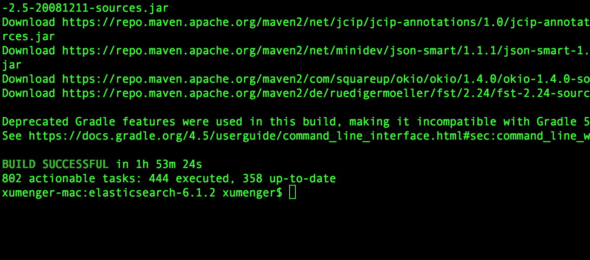
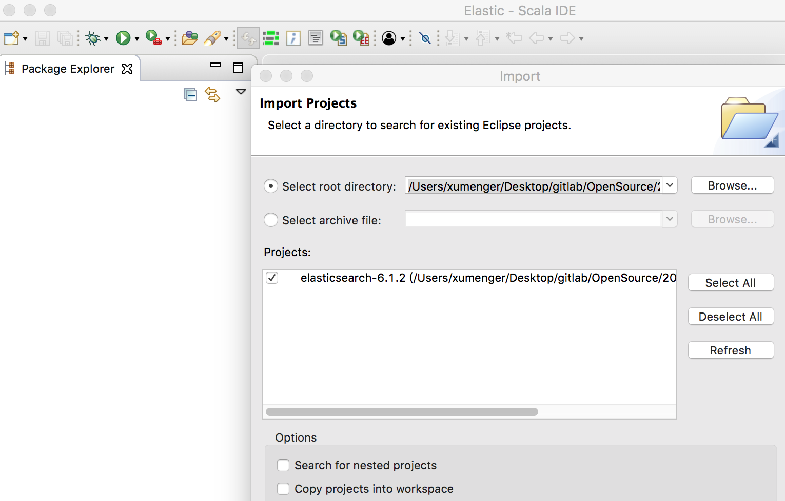

>下载v6.1.2: [https://github.com/elastic/elasticsearch/releases/tag/v6.1.2](https://github.com/elastic/elasticsearch/releases/tag/v6.1.2)

解压源码包到自己的目录，执行编译

```sh
cd elasticsearch-6.1.2
./gradlew assemble
```

可能会出现这样的报错

```
FAILURE: Build failed with an exception.

* Where:
Build file '/Users/xumenger/Desktop/gitlab/OpenSource/20210303-elastic/elasticsearch-6.1.2/benchmarks/build.gradle' line: 31

* What went wrong:
A problem occurred evaluating project ':benchmarks'.
> Failed to apply plugin [id 'elasticsearch.build']
   > JAVA_HOME must be set to build Elasticsearch

* Try:
Run with --stacktrace option to get the stack trace. Run with --info or --debug option to get more log output.

* Get more help at https://help.gradle.org

BUILD FAILED in 5s
```

查询到的一些说法是：elasticsearch 运行需要Java 1.8 但是构建项目需要Java 1.10

不用管上面的报错，为了将工程导入Eclipse，在ElasticSearch 的源码目录执行以下命令，生成Eclipse 的项目文件

```sh
gradle eclipse
```



然后即可导入到Eclipse



## ElasticSearch 主要内部模块介绍

**Cluster**模块是主节点执行集群管理的封装实现，管理集群状态，维护集群层面的配置信息，主要功能：

* 管理集群状态，将新生成的集群状态发布到集群所有节点
* 调用allocation 模块执行分片分配，决策哪些分片应该分配到哪些节点
* 在集群各节点中直接迁移分片，保持数据平衡

**allocation**模块封装了分片分配相关的功能和策略，包括主分片的分配和副分片的分配，本模块由主节点调用。创建新索引、集群完全重启都需要分片分配的过程

**Discovery**发现模块负责发现集群中的节点，以及选举主节点。当节点加入或退出集群时，主节点会采取相应的行动，从某种角度来说，发现模块起到了类似Zookeeper 的作用，选主并管理集群拓扑

**gateway**负责对接到Master 广播下来的集群状态（cluster state）数据的持久化存储，并在集群完全重启时恢复它们

**Indices**索引模块管理全局级的索引设置，不包括索引级的（索引设置分为全局级和每个索引级），它还封装了索引数据恢复功能，集群启动阶段需要的主分片恢复和副分片恢复就是在这个模块实现的

**HTTP**模块允许通过JSON over HTTP 的方式访问ES 的API，HTTP 模块本质上是完全异步的，这意味着没有阻塞线程等待响应，使用异步通信进行HTTP 的好处是解决了C10k 问题

**Transport**传输模块用于集群内节点之间的内部通信。从一个节点到另一个节点的每个请求都使用传输模块。如同HTTP 模块，传输模块本质上也是完全异步的，传输模块使用TCP 通信，每个节点都与其他节点维持若干TCP 长连接。内部节点间的所有通信都是本模块承载的

**Engine**模块封装了对Lucene 的操作及translog 的调用，它是对一个分片读写操作的最终提供着

>ES 使用Guice 框架进行模块划管理。Guice 是Google 开发的轻量级依赖注入框架（IoC）
