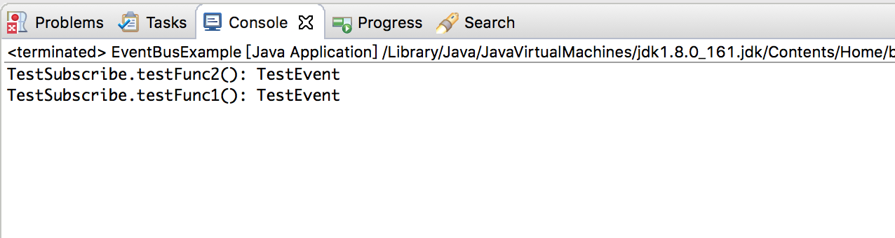

EventBus 是Guava 中的一个工具。EventBus 允许组件之间通过发布-订阅进行通信，而不需要组件之间显式的注册，它专门设计为代替使用显式注册的传统的Java 进程内事件分发。相比于MQ 更加简洁，轻量，它可以在一个小系统模块内部使用

EventBus 主要用于组件间通信，在使用的时候不需要考虑层级关系也写大量的接口回调，使用起来简单高效，基本一个post 和一个onEvent 方法就能搞定

## 原理分析

EventBus 中有三个关键要素

**事件（Event）**：事件是EventBus 之间互相通信的基本单位，一个Event 可以是任何类型。如果你想将任意一个Bean 作为事件，这个类不需要做任何改变，就可以作为事件Event。不过在项目中不会这么随便，一般会定义特定的事件类，类名以Event 作为后缀，里面定义一些变量或者函数等

**事件发布者（Publisher）**：即发送事件到EventBus 事件总线的一方，事件发布者调用post() 方法，将事件发给EventBus

**事件订阅者（Subscriber）**：即接收事件的一方，订阅者需要在自己的方法上添加@Subscribe 注解声明自己为事件订阅者。另外还需要将自己所在的类，注册到EventBus中，EventBus 才能扫描到这个订阅者

EventBus 是用了反射，并且维护了一个全局map，记录Event 到Method 的映射

## 具体案例

先在pom.xml 中引入Guava

```xml
<dependency>
  <groupId>com.google.guava</groupId>
  <artifactId>guava</artifactId>
  <version>18.0</version>
</dependency>
```

直接看一个EventBus 的案例

```java
package com.xum.e001.EventBus;

import com.google.common.eventbus.EventBus;
import com.google.common.eventbus.Subscribe;

public class EventBusExample 
{
    // 测试方法
    public static void main(String[] args)
    {
        // 构造事件订阅者
        TestSubscribe subscribe = new TestSubscribe();
        
        // 构造事件
        TestEvent event = new TestEvent("TestEvent");
        
        // 构造事件总线
        EventBus eventBus = new EventBus();
        
        // 向事件总线注册订阅者
        eventBus.register(subscribe);
        
        // 向事件总线发布时间
        eventBus.post(event);
    }
    
    
    // 事件类
    public static class TestEvent 
    {
        private String name;
        
        public TestEvent(String name)
        {
            this.name = name;
        }
        
        public String getName()
        {
            return this.name;
        }
    }
    
    // 事件订阅者
    public static class TestSubscribe
    {
        @Subscribe
        public void testFunc1(TestEvent event)
        {
            System.out.println("TestSubscribe.testFunc1(): " + event.getName());
        }
        
        @Subscribe
        public void testFunc2(TestEvent event)
        {
            System.out.println("TestSubscribe.testFunc2(): " + event.getName());
        }
    }

}
```

运行效果如下


