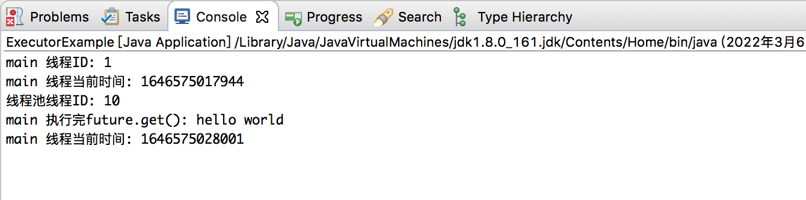

ExecutorService 时Java 中对线程池定义的一个接口，在J.U.C 包中，包括下面这几种线程池

* newSingleThreadExecutor: 创建一个单线程化的线程池，它只会用唯一的工作线程来执行任务
* newCachedThreadPool: 创建一个可缓存线程池，如果线程池长度超过处理需要，可灵活回收空闲线程；若无可回收，则新建线程
* newFixedThreadPool: 创建一个定长线程池，可控制线程池最大并发数，超出的线程会在队列中等待
* newScheduledThreadPool: 创建一个定长线程池，支持定时及周期性任务执行

比如下面演示一个单线程化的线程池的使用方式和运行效果

```java
package com.xum.e002.Executor;

import java.util.concurrent.ExecutionException;
import java.util.concurrent.ExecutorService;
import java.util.concurrent.Executors;
import java.util.concurrent.Future;

public class ExecutorExample 
{
    // 测试方法
    public static void main(String[] args)
    {
        // 打印当前线程的线程ID
        System.out.println("main 线程ID: " + Thread.currentThread().getId());
        System.out.println("main 线程当前时间: " + System.currentTimeMillis());
        
        // 创建一个单线程化的线程池，它只会用唯一的工作线程来执行任务
        ExecutorService executorService = Executors.newSingleThreadExecutor();
        
        Future<String> future = executorService.submit(() -> {
            System.out.println("线程池线程ID: " + Thread.currentThread().getId());
            
            try {
                Thread.sleep(10000);
            } catch (InterruptedException e) {
                e.printStackTrace();
            }
            
            return "hello world";
        });
        
        try {
            // 根据返回的Future 对象检查任务是否执行完成
            String result = future.get();
            System.out.println("main 执行完future.get(): " + result);
            System.out.println("main 线程当前时间: " + System.currentTimeMillis());
        } catch (InterruptedException | ExecutionException e) {
            e.printStackTrace();
        }

        // 关闭ExecutorService
        executorService.shutdown();
    }
}
```

运行的效果如下所示



>Future.get() 阻塞等待了10s ！

当我们使用完成ExecutorService 之后应该关闭它，否则它里面的线程会一直处于运行状态。比如上例的应用程序是通过main() 方法启动的，在这个main()退出之后，如果应用程序中的ExecutorService 没有关闭，这个应用将一直运行。之所以会出现这种情况，是因为ExecutorService 中运行的线程会阻止JVM 关闭

如果要关闭ExecutorService 中执行的线程，我们可以调用ExecutorService.shutdown() 方法。在调用shutdown() 之后，ExecutorService 不会立即关闭，但是它不再接收新的任务，直到当前所有线程执行完成才会关闭，所有在shutdown() 执行之前提交的任务都会被执行

如果想立即关闭 ExecutorService，我们可以调用ExecutorService.shutdownNow()方法。这个动作将跳过所有正在执行的任务和被提交还没有执行的任务。但是它并不对正在执行的任务做任何保证，有可能它们都会停止，也有可能执行完成
