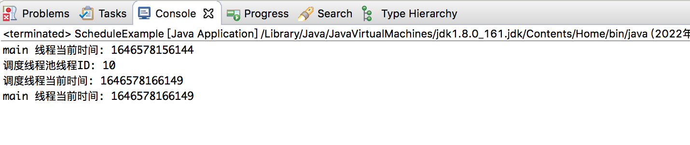
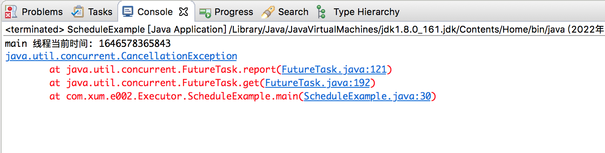

Java 中的ScheduledExecutorService 可以用于实现的线程池调度，比如下面的测试程序

```java
package com.xum.e002.Executor;

import java.util.concurrent.Executors;
import java.util.concurrent.ScheduledExecutorService;
import java.util.concurrent.ScheduledFuture;
import java.util.concurrent.TimeUnit;

public class ScheduleExample 
{
    // 测试方法
    public static void main(String[] args)
    {
        // 创建一个单线程化的线程池，它只会用唯一的工作线程来执行任务
        ScheduledExecutorService scheduleExecutorService = Executors.newSingleThreadScheduledExecutor();
        
        // 调度逻辑
        TestSchedule testSchedule = new TestSchedule();
        
        System.out.println("main 线程当前时间: " + System.currentTimeMillis());
        
        // 定时调度，10000ms 后运行
        ScheduledFuture<?> scheduleFuture = scheduleExecutorService.schedule(testSchedule, 10000, TimeUnit.MILLISECONDS);
        
        try {
            // 根据返回的ScheduledFuture 对象检查任务是否执行完成
            scheduleFuture.get();
            System.out.println("main 线程当前时间: " + System.currentTimeMillis());
        } catch (InterruptedException | ExecutionException e) {
            e.printStackTrace();
        }

        // 关闭调度线程池
        scheduleExecutorService.shutdown();
    }
    
    
    static class TestSchedule implements Runnable
    {
        @Override
        public void run() {
            System.out.println("调度线程池线程ID: " + Thread.currentThread().getId());
            System.out.println("调度线程当前时间: " + System.currentTimeMillis());
        }
        
    }
}
```

运行效果如下



## 取消定时任务

可以使用ScheduledFuture.cancel() 取消定时任务。如果取消后，再调用ScheduledFuture.get() 的话就会抛出异常，比如下面的例子

```java
package com.xum.e002.Executor;

import java.util.concurrent.ExecutionException;
import java.util.concurrent.Executors;
import java.util.concurrent.ScheduledExecutorService;
import java.util.concurrent.ScheduledFuture;
import java.util.concurrent.TimeUnit;

public class ScheduleExample 
{
    // 测试方法
    public static void main(String[] args)
    {
        // 创建一个单线程化的线程池，它只会用唯一的工作线程来执行任务
        ScheduledExecutorService scheduleExecutorService = Executors.newSingleThreadScheduledExecutor();
        
        // 调度逻辑
        TestSchedule testSchedule = new TestSchedule();
        
        System.out.println("main 线程当前时间: " + System.currentTimeMillis());
        
        // 定时调度，10000ms 后运行
        ScheduledFuture<?> scheduleFuture = scheduleExecutorService.schedule(testSchedule, 10000, TimeUnit.MILLISECONDS);
        
        // 可以在这里直接取消任务
        scheduleFuture.cancel(false);
        
        try {
            // 根据返回的ScheduledFuture 对象检查任务是否执行完成
            scheduleFuture.get();
            System.out.println("main 线程当前时间: " + System.currentTimeMillis());
        } catch (Exception e) {
            e.printStackTrace();
        }
        
        // 关闭调度线程池
        scheduleExecutorService.shutdown();
    }
    
    
    static class TestSchedule implements Runnable
    {
        @Override
        public void run() {
            System.out.println("调度线程池线程ID: " + Thread.currentThread().getId());
            System.out.println("调度线程当前时间: " + System.currentTimeMillis());
        }
        
    }
}
```

运行效果如下



在调用cancel() 之后再调用get()，导致抛出异常

