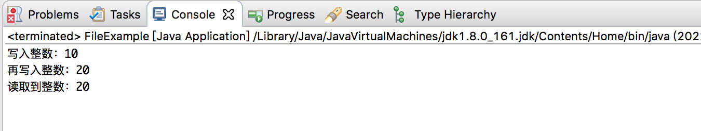
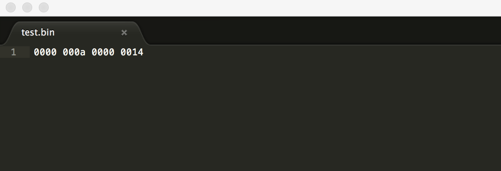
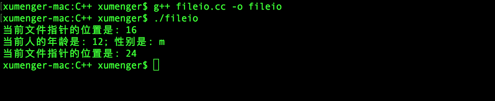

对比一下在Java 与C++ 中的实现细节

## Java 中使用RandomAccessFile 实现文件随机IO

```java
package com.xum.e003.JavaFile;

import java.io.File;
import java.io.IOException;
import java.io.RandomAccessFile;

import com.google.common.io.Files;

public class FileExample 
{
    private static final String FILE_NAME = "test.bin";
    
    public static void main(String[] args) throws IOException
    {
        File file = new File("./" + FILE_NAME);
        // 如果文件不存在，则创建文件
        if (!file.exists()) {
            Files.touch(file);
        }
        
        RandomAccessFile randomAccessFile = new RandomAccessFile(file, "rw");
        
        // 设置文件大小
        randomAccessFile.setLength(8);
        
        // 写入内容
        randomAccessFile.writeInt(10);
        System.out.println("写入整数：10");
        randomAccessFile.writeInt(20);
        System.out.println("再写入整数：20");
        
        // seek() 方法将文件指针偏移量，从这个文件开始测量，进行下一个读或写操作
        // 偏移量可以被设置为超出文件的末尾。设置偏移超出了文件的末尾不会改变文件长度
        // 文件长度，也只是由偏移已被设置为超出文件的末尾之后写入更改
        
        // 定位到第4个字节（从0开始）
        randomAccessFile.seek(4);
        
        // 读取内容，因为最开始分别写入10（0-3字节）、20（4-7字节），上面seek(4)，再readInt，所以预期会读到20
        Integer i = randomAccessFile.readInt();
        System.out.println("读取到整数：" + i);
        
        // 关闭文件
        randomAccessFile.close();
    }
}
```

运行效果如下



在test.bin 中可以看到二进制内容如下，刚好是10（十六进制A）和20（十六进制14）



## C++ 中使用fstream 实现文件随机IO

随机访问文件，即可以任意地向前或向后移动文件指针，具体使用的函数是seekp() 和seekg()。seekp() 即seek put，用于输出流；seekg() 即seek get，用于输入流

可以使用tellp() 和tellg() 函数返回文件指针的当前位置

比如一些典型的用法

* seekg(100, ios::beg) 将文件指针移动到从文件开始第100 个字节处
* seekg(-100, ios::end) 将文件指针移动到从文件末尾向后第100 个字节处
* seekp(42, ios::cur) 将文件指针从当前位置向前移动42 个字节
* seekp(-42, ios::cur) 将文件指针从当前位置向后移动42 个字节
* seekp(100) 将文件指针移动到文件第100 个字节处

看一个具体的例子

```cpp
#include <iostream>
#include <fstream>

using namespace std;

class Person 
{
    public:
        Person() {}
        Person(int age, char sex)
        {
            this->age = age;
            this->sex = sex;
        }

        int getAge() const
        {
            return this->age;
        }

        char getSex() const 
        {
            return this->sex;
        }

    private:
        int age;
        char sex;
};

int main()
{
    fstream fs;

    // 写方式打开文件
    fs.open("data.dat", ios::out | ios::binary);

    Person p1(10, 'm');
    Person p2(11, 'f');
    Person p3(12, 'm');

    fs.write(reinterpret_cast<char*>(&p1), sizeof(Person));
    fs.write(reinterpret_cast<char*>(&p2), sizeof(Person));
    fs.write(reinterpret_cast<char*>(&p3), sizeof(Person));

    fs.close();

    // 读方式打开文件
    fs.open("data.dat", ios::in | ios::binary);
    Person newP;

    // 文件随机寻址
    fs.seekg(2 * sizeof(Person));

    cout << "当前文件指针的位置是: " << fs.tellg() << endl;

    fs.read(reinterpret_cast<char*>(&newP), sizeof(Person));

    cout << "当前人的年龄是: " << newP.getAge() << "; 性别是: " << newP.getSex() << endl;

    cout << "当前文件指针的位置是: " << fs.tellg() << endl;

    fs.close();

    return 0;
}
```

编译运行效果如下


