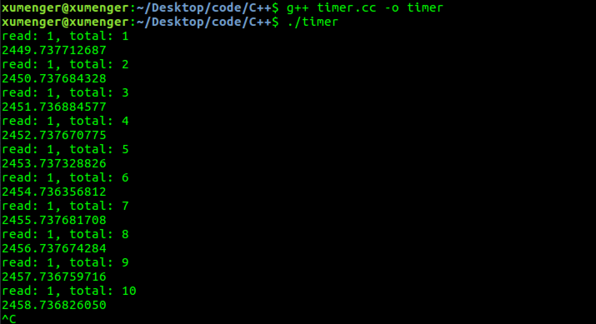

创建一个timerfd，然后由epoll 监听其事件对应做相应的事件处理，下面是一个简单的demo

```c
#include <stdio.h>
#include <stdint.h>
#include <unistd.h>    // close()
#include <string.h>
#include <stdlib.h>
#include <pthread.h>
#include <errno.h>
#include <sys/epoll.h>
#include <sys/timerfd.h>

#define EPOLL_LISTEN_CNT      256
#define EPOLL_LISTEN_TIMEOUT  500

int main()
{
    // create epoll fd 
    int epfd = epoll_create(EPOLL_LISTEN_CNT);
    if (epfd < 0)
    {
        printf("[ERROR]: epoll_create error[%d:%d:%s]", epfd, errno, strerror(errno));
        return -1;
    }

    // set itimerspec
    struct itimerspec new_value;
    new_value.it_value.tv_sec = 2;
    new_value.it_value.tv_nsec = 0;
    new_value.it_interval.tv_sec = 1;
    new_value.it_interval.tv_nsec = 0;

    // create timerfd
    int tmfd = timerfd_create(CLOCK_MONOTONIC, TFD_NONBLOCK | TFD_CLOEXEC);
    if (tmfd < 0)
    {
        printf("[ERROR]: epoll_create error[%d:%d:%s]", tmfd, errno, strerror(errno));
        return -1;
    }

    // set timer 
    int ret = timerfd_settime(tmfd, 0, &new_value, NULL);
    if (ret < 0)
    {
        printf("[ERROR]: epoll_create error[%d:%d:%s]", ret, errno, strerror(errno));
        close(tmfd);
        return -1;
    }

    // add timerfd to epollfd 
    struct epoll_event event;
    memset(&event, 0, sizeof(event));
    event.data.fd = tmfd;
    event.events = EPOLLIN | EPOLLET;

    ret = epoll_ctl(epfd, EPOLL_CTL_ADD, tmfd, &event);
    if (ret < 0)
    {
        printf("[ERROR]: epoll_create error[%d:%d:%s]", ret, errno, strerror(errno));
        close(tmfd);
        return -1;
    }

    // handle event 
    struct epoll_event events[EPOLL_LISTEN_CNT];
    memset(events, 0, sizeof(events));

    uint64_t total_exp = 0;

    while (1)
    {
        // wait epoll event 
        int fd_cnt = epoll_wait(epfd, events, EPOLL_LISTEN_CNT, EPOLL_LISTEN_TIMEOUT);
        for (int i = 0; i < fd_cnt; i++)
        {
            int sfd = events[i].data.fd;
            if ((events[i].events & EPOLLIN) &&(sfd == tmfd))
            {
                // handle timerfd 
                uint64_t exp = 0;
                // 可以用read函数读取计时器的超时次数，该值是一个8字节无符号的长整型
                read(sfd, &exp, sizeof(uint64_t));

                // 打印次数
                total_exp += exp;
                printf("read: %llu, total: %llu\n", (unsigned long long)exp, (unsigned long long)total_exp);

                // 打印当前时间
                struct timespec curr;
                if (clock_gettime(CLOCK_MONOTONIC, &curr) == -1)
                {
                    printf("clock_gettime error\n");
                    return -1;
                }
                printf("%ld.%03ld\n", curr.tv_sec, curr.tv_nsec);
            }
        }
    }

    return 0;
}
```

编译运行的效果如下，每隔一秒钟事件触发一次



## timespec 与itimerspec

```c
struct timespec {
    time_t tv_sec;                 // Seconds
    long   tv_nsec;                // Nanoseconds
};

struct itimerspec {
    struct timespec it_interval;   // 定时间隔周期
    struct timespec it_value;      // 第一次超时时间
}
```

## timerfd_create()

```c
/**
 * CLOCK_REALTIME: 系统实时时间，随系统实时时间改变而改变，即从UTC1970-1-1 0:0:0 开始计时，中间时刻如果系统时间被用户改成其他，则对应的时间相应改变
 * CLOCK_MONOTONIC: 从系统启动这一刻起开始计时，不受系统时间被用户改变的影响
 *
 * TFD_NONBLOCK: 非阻塞模式
 * TFD_CLOEXEC: 表示当程序执行exec 函数时本fd 将被系统自动关闭，表示不传递
 */
int tmfd = timerfd_create(CLOCK_MONOTONIC, TFD_NONBLOCK | TFD_CLOEXEC);
```

## timerfd_settime()

```c
/**
 * fd: 参数fd是timerfd_create 函数返回的文件句柄
 * flags：参数flags 为1 代表设置的是绝对时间（TFD_TIMER_ABSTIME 表示绝对定时器）；为0 代表相对时间
 * new_value: 参数new_value 指定定时器的超时时间以及超时间隔时间
 * old_value: 如果old_value 不为NULL，old_vlaue 返回之前定时器设置的超时时间
 *
 * it_interval 不为0则表示是周期性定时器
 * it_value 和it_interval都为0表示停止定时器
 */
int ret = timerfd_settime(tmfd, 0, &new_value, NULL);
```
