转载自[https://juejin.cn/post/6844903495489847310](https://juejin.cn/post/6844903495489847310)

## 背景

>软件的核心是其为用户解决领域相关问题的能力。  -- Eric Evans《领域驱动设计--软件核心复杂性应对之道》

交易系统作为电商平台架构的核心系统之一，它为解决什么问题呢？我认为它应该最大化满足买卖双方的价值交换，在交易前、后提供完备的服务

交易前：客户购买下单，支付金额，电商网站确认支付后进行配送发货；交易后：在退换周期内，客户申请退换，电商进行退换处理，并返还客户金额，同时对交易金额进行结算

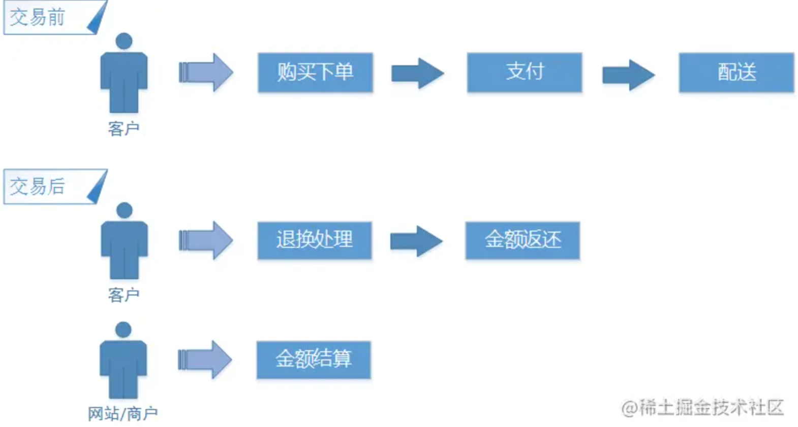

完整交易需要图中多个核心流程来支撑，其本身的业务链条比较长；它会引入订单、支付单、配送单、售后服务等多个领域概念；产生营销活动抵扣、支付方式、退换货策略等不同的业务规则；使系统具有较高的复杂性。对于交易系统构建者来说，如何理清关联、避免僵化设计、如何进行科学的构建呢？

## 交易系统领域设计

现实中的很多软件/应用系统最主要的复杂性并不在技术上，而是来自领域本身、用户的活动或业务。当这种领域复杂性在设计中没有得到解决时，基础技术的构思再好也无济于事。而这种聚焦于领域和领域逻辑复杂性问题，大师Eric Evans在《领域驱动设计--软件核心复杂性应对之道》一书中，已经给出了完整的设计范式和原则

跟随大师的脚步，从领域驱动设计的角度，重新思考整个交易系统的设计

### 领域划分

>在一个大型系统中，如果因为缺少一种全局性的原则而使人们无法根据元素在模式（这些模式被应用于整个设计）中的角色来解释这些元素，那么开发人员就会陷入“只见树木，不见森林”的境地。-- Eric Evans 《领域驱动设计--软件核心复杂性应对之道》

交易系统包含的内容太多繁杂，很难对系统的全貌直接描述，所以需要对其进行分解，将交易过程中涉及的业务问题划分到不同的业务子域中。如：用户的登录/注册（用户域），网站上展示商品的管理（商品域），商品购买后的支付（支付域）等。让复杂的交易问题渐逐步分解，让子域聚焦本域内的问题解决

以交易为核心，理清业务子域：

* 用户域：用户账号登录/注册、用户信息管理等
* 商户域：企业账户、商户分级、合同及协议管理等
* 商品域：分类、商品信息、标签、价格管理等
* 营销域：打折降价活动、卡码券、预售等
* 订单域：订单生成、订单查询、订单生命周期管理、订单业务对账等
* 支付域：与第三方资金支付、个人资金账户、资金交易方式的管理等
* 仓储/配送域：商品的库存管理、配送管理等
* 售后域：退货、退款、评价管理等
* 结算域：交易金额，与商户、平台、第三方的结算

业务子域划分过程中，通过领域统一视图来呈现系统的全貌，有利于我们理解各个子域在整体系统中所处的位置以及之间的关系；同时在不需要知道细节的情况下，在大脑中建立系统的概况模型。基于对电商交易侧领域知识的理解，我整理出的领域统一视图

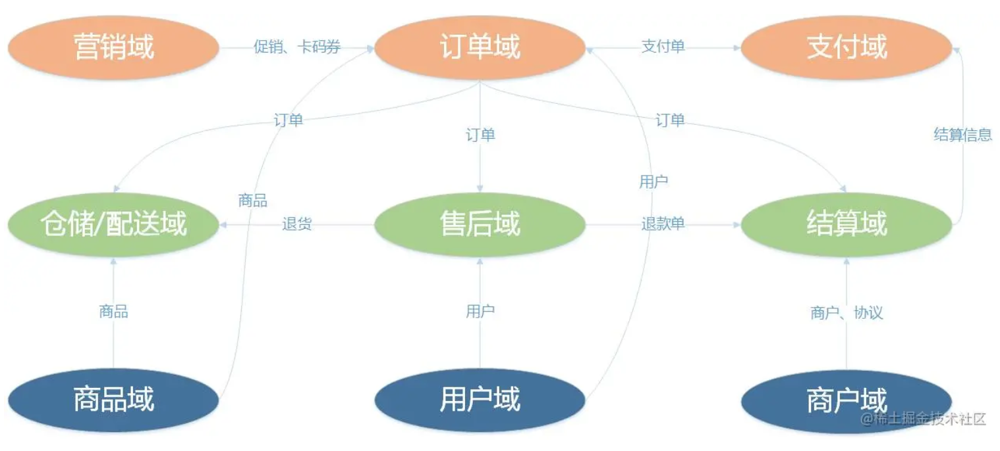

从交易系统来看

* 核心域：订单域、支付域、营销域
* 支撑域：仓储配送域、售后域、结算域
* 通用域：用户域、商品域、商户域

教育电商中的商品，是以服务、虚拟商品为主，实物商品为辅，因此弱化仓储/配送（或物流），将它放在支撑域位置上；同时提升售后服务在整个系统中的重要性，将售后服务从订单域中分化出来，独立成业务子域

### 子域划分

领域统一视图，明确子域角色与关系之后还是不够的，凭这些还无法进行后续的领域模型设计；我们需要进一步明确子域的核心关注点。在明确核心关注点的同时，我们会通过核心流程的走查，来反向验证子域细化模型是否与核心业务保持一致

子域细化会从多个维度上进行（以订单子域为例）

* 领域概念：订单、预售定金单、预售尾款单等
* 业务规则：商品结算金额与订单支付金额不能小于零，多种订单抵扣使用的顺序，金额在购买商品的分摊比例等
* 交互场景：结算使用卡券抵扣，提交订单、我的订单查询等
* 业务流程：用户下单流程、订单取消流程、对账等

订单域细化后的形态

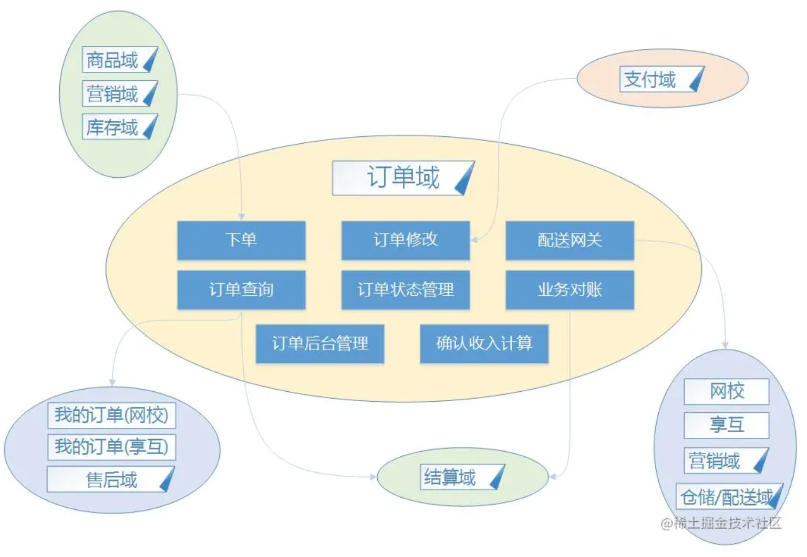

（其他子域不再逐一叙述）

领域统一视图，描述了系统领域的大型结构；它会随着系统的演进而改变，也会随着子域丰富与深层模型精炼而变动。同时在全局的视野，来指导子域的细化。子域在其细化的过程，是对模型进一步设计提供系统性策略：让强关联的业务模型内聚在同一个子域，让弱关联的模型分离出去

随着业务的发展，基于交易数据的财务需求逐步增多，交易系统将会诞生财务子域，内聚多个财务模型；而确认收入计算模型，也会将从订单域中分离出去，汇聚到财务子域中

## 订单域核心设计

领域驱动模型设计提供了大量模式，让设计更加自然的实现模型，从而避免或减少反映领域模型而出现的僵化设计。我将通过订单域的核心服务之一：下单服务，来讨论这些模式的使用

以前台下单场景为例，它是指用户在前台结算页上提交订单信息，并生成订单的过程。主要流程如下

* 用户在结算页上提交选购的商品
* 订单服务接收到用户提交的数据，进行订单模型的填充（用户、商品、订单跟踪信息、结转信息等）
* 商品促销折扣、卡码券抵扣及营销规则的计算
* 订单金额计算（商品结算价、卡券抵扣、现金收入、金额分摊等）
* 订单持久化
* 订单创建完成后，卡码券使用通知

下单的时序图（已经被简化）：

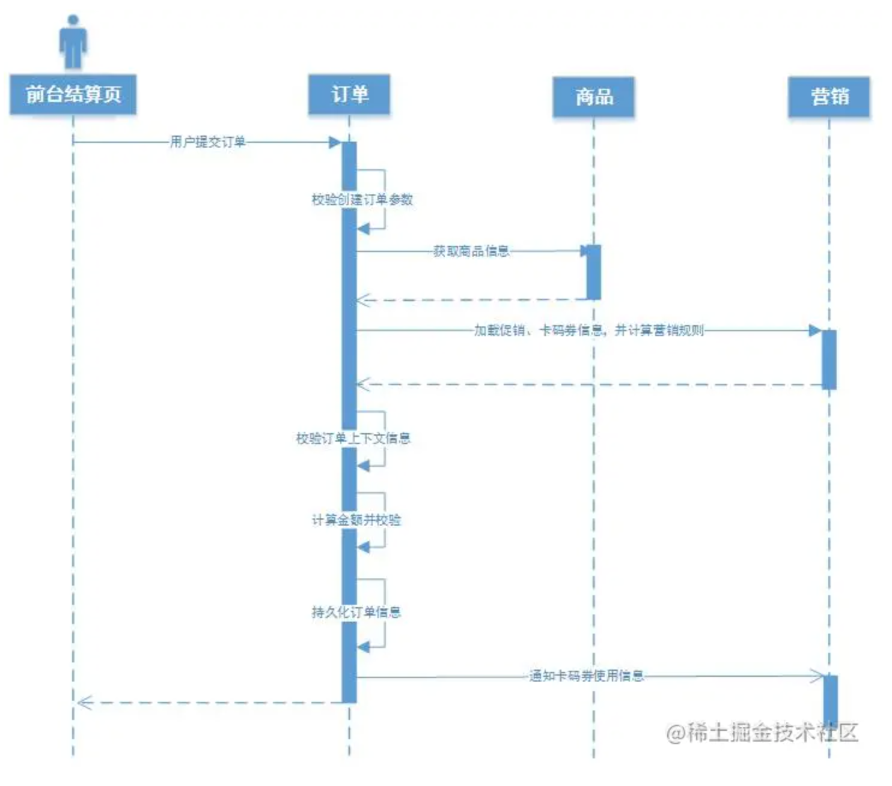

## 领域模式

在明确下单业务逻辑后，在开发服务前需要明确领域分层与模型（此时可能无法一次性把所需的都细化清楚）：

* 服务的领域分层
* 承载用户提交订单信息的对象模型，承载持久化订单信息的对象模型，域商品、营销域之间的通信模型
* 订单域中的有届上下文信息（用于填充用户提交的订单信息、商品信息、金额计算规则、基于订单信息的显示约束等）

领域分层：

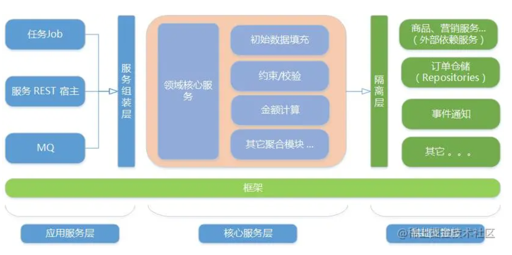

明确领域分层，有助于系统在开发阶段时，团队在对领域层次模型保持一致，对模块、服务、仓储给予预先的划分。避免产生违反系统中的分层约定或原则

对象模型

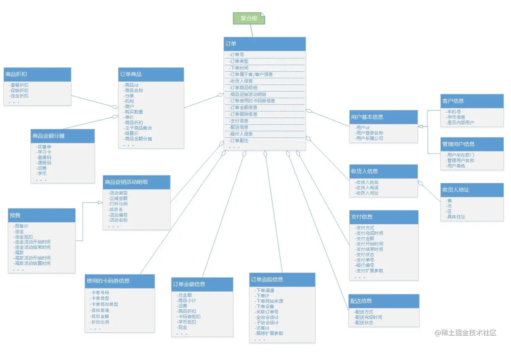

有界上下文

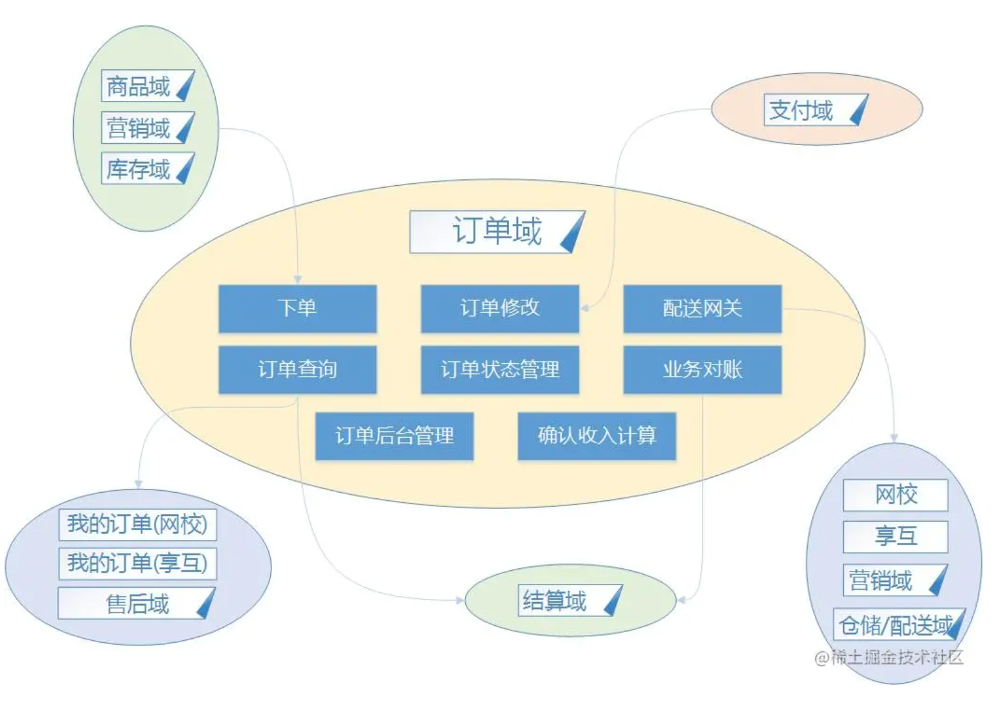

这一阶段是为系统建立完整自封闭的领域模型。领域驱动架构相对比较容易理解，但建立一个完整自封闭的领域模型却很困难。“领域模型”是一个针对业务逻辑抽象的分析模型，它反映出对领域问题的整体描述。领域模型不是编程中的实现模型，而是一组抽象概念的集合

领域需求的最初细节，在功能层面通过领域专家的讨论得出。领域专家并不一定需要熟知软件开发领域的知识，相反强调的是具有领域中的相关知识。领域需求在相互讨论中不断得到细化，还有可能在开发过程中出现需求的反复或变更，这都要求领域模型的建立完善是一个反复重构的过程

### 设计模式应用

为了保证软件实现的简洁（避免僵化设计），不管实际情况如何复杂，设计与模型都需要保持一致；在面对这种局面时，可以运用建模和设计的最佳实践来解决。如：面向对象设计的23 种常用模式，通用职责分配软件模式GRASP 的9 种设计原则，还有Martin Fowler 在《分析模式》中论述的最佳实践等等

随着下单服务的细化，会遇到更多复杂的问题，如：

**问题一**：订单对象的创建，在不同渠道中订单构建的信息也是不一样的；如：用户购买下单、预售订单、后台下单等

在领域驱动设计中，对复杂对象构建给出了领域工厂模式来解决。领域工厂模式包含：简单工厂、抽象工厂、建造者等设计模式

订单对象的创建，采用Builder（建造者）模式

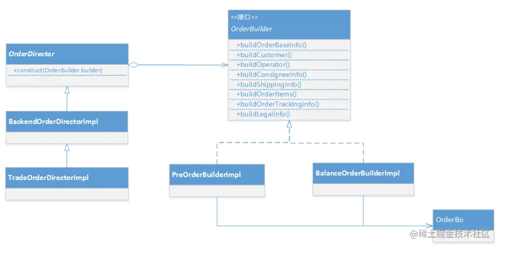

**问题二**：订单金额的计算；在一个订单中可以购买多个商品，每个商品可以拥有不同的商品折扣，而卡券折扣可以作用不同商品上，会在3 个维度上独立变化

金额计算核心在于商品金额分摊计算，它可以在3 个维度独自变化，需要分离

* 商品折扣、卡券折扣的基价计算规则
* 金额计算因子（被分摊的商品集合、单个分摊商品基价、分摊商品总基价、分摊金额）

使用策略模式，让基价计算规则与计算因子分离

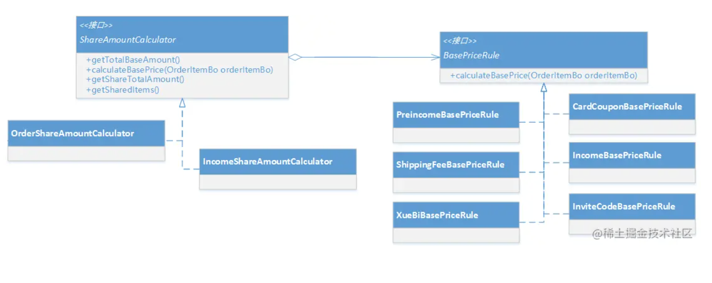

使用职责链模式，让不同商品享有不同折扣、抵扣金额计算器形成独自的链条，进行计算商品金额

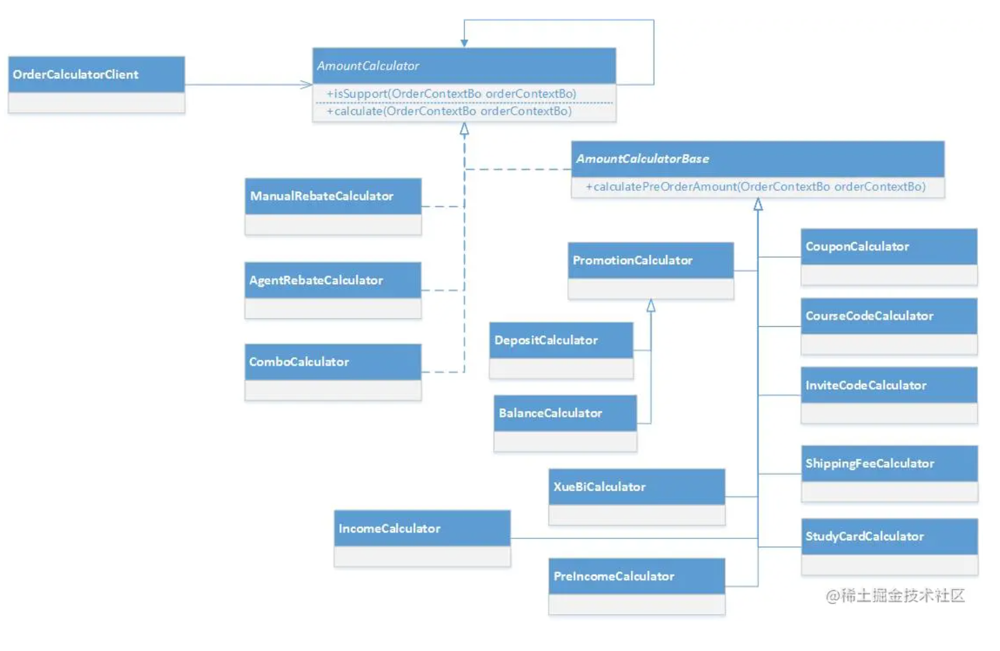

模式的应用，让复杂模型的设计，变得更优雅。设计元素非常自然的组合到一起，其结果可以被清晰地刻画出来。让业务逻辑被合理的分散到不同的领域对象中，代码结构更加清晰

## 系统突破

持续重构让事物逐步变得有序。代码和模型的每一次精化都让开发人员有了更加清晰的认识。一系列微小的重构会逐渐汇聚深层次模型，最终会给系统带来巨大价值的突破

交易初期的系统模型

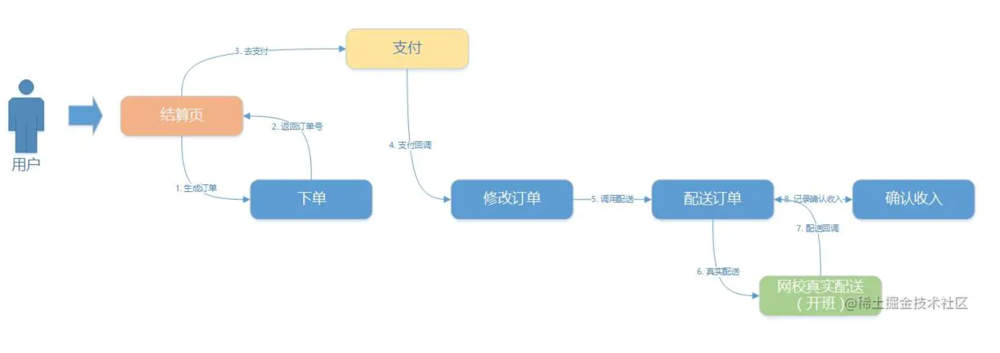

随着其他业务系统开始关心订单的状态（订单创建、支付、配送），需要将订单状态告知业务系统；但交易系统又不想与他们产生直接依赖，在下单、修改订单、配送订单等节点接入MQ，交易系统通过MQ 把订单状态通知到业务系统。引入MQ 不久之后，发现交易系统已经具备领域事件的特征，引发了事件驱动的重构

交易重构后的系统模型

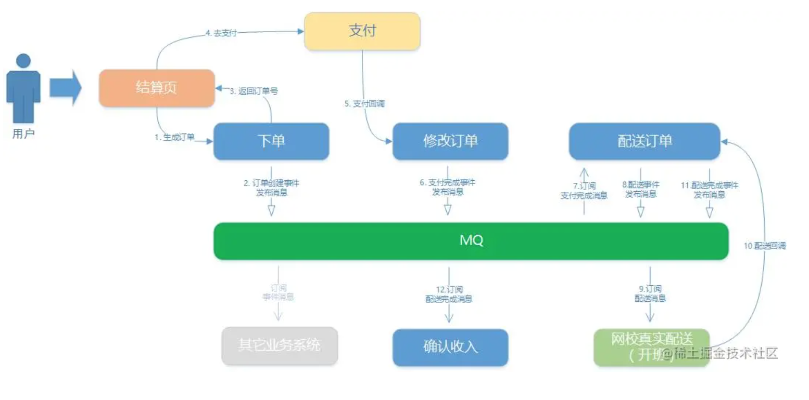

事件模型的引入，让交易链上系统之间的耦合性进一步降低，为系统各自独立进化带来了更大的空间

## 总结

本文是基于我个人对交易系统的理解，讲述了有关领域驱动设计的中大型结构、精炼、常用模型（实体、值对象、服务、分层结构）、设计模式应用、突破等。分享了在领域驱动设计方面的经验及思考，希望能给大家在实际项目中运用领域驱动设计提供一些启发和帮助
