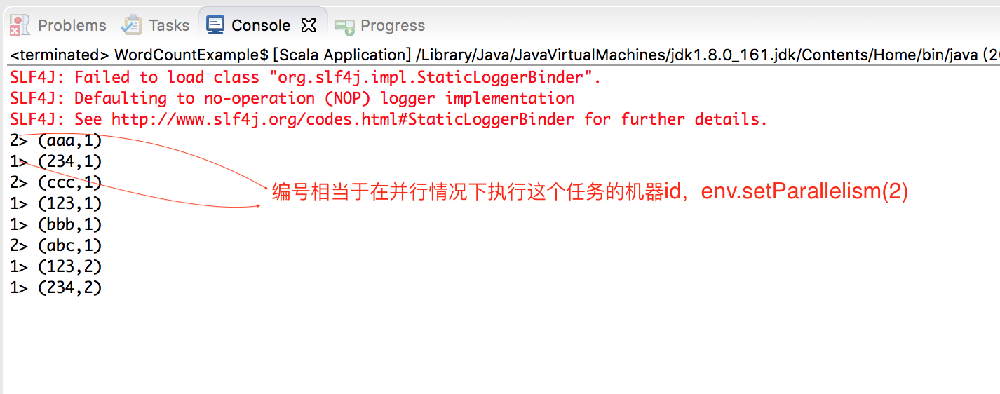

>对比[《Spark 计算框架：Spark Core RDD》](http://www.xumenger.com/spark-core-1-rdd-20201125/)、[《Spark 计算框架：RDD 应用案例》](http://www.xumenger.com/spark-core-7-rdd-examples-20201125/)

>Flink 官方文档: [https://nightlies.apache.org/flink/flink-docs-release-1.2/](https://nightlies.apache.org/flink/flink-docs-release-1.2/)

>[https://nightlies.apache.org/flink/flink-docs-release-1.2/quickstart/setup_quickstart.html](https://nightlies.apache.org/flink/flink-docs-release-1.2/quickstart/setup_quickstart.html)

如下为Maven 依赖

```xml
<!-- Flink 依赖 -->
<dependency>
    <groupId>org.apache.flink</groupId>
    <artifactId>flink-scala_2.11</artifactId>
    <version>1.12.1</version>
</dependency>
<dependency>
    <groupId>org.apache.flink</groupId>
    <artifactId>flink-streaming-scala_2.11</artifactId>
    <version>1.12.1</version>
</dependency>
<dependency>
    <groupId>org.apache.flink</groupId>
    <artifactId>flink-connector-kafka_2.11</artifactId>
    <version>1.12.1</version>
</dependency>
<!-- 需要flink-clients，否则Eclipse下启动报错 -->
<dependency>
    <groupId>org.apache.flink</groupId>
    <artifactId>flink-clients_2.11</artifactId>
    <version>1.12.1</version>
</dependency>
```

编写Flink 程序如下

```scala
package com.xum.flinks

import org.apache.flink.streaming.api.scala.StreamExecutionEnvironment
import org.apache.flink.streaming.api.scala.DataStream


object WordCountExample 
{
  def main(args: Array[String]) 
  {
    // 文件目录
    val logFile = "./example.txt"
    
    // 获取批处理的执行环境
    val env: StreamExecutionEnvironment = StreamExecutionEnvironment.getExecutionEnvironment
    env.setParallelism(2)
    
    // 读取文件
    val text: DataStream[String] = env.readTextFile(logFile)
    
    // 引入隐式转换
    import org.apache.flink.api.scala._
    
    // 单词统计
    val counts = text.flatMap(_.split(" "))
                     .map((_,1))
                     .keyBy(0)
                     .sum(1)

    //输出结果
    counts.print()
 
    // 执行
    env.execute("Flink WordCount Example")
  }
}
```

对应的测试文件内容如下

```
aaa 123
bbb 123
ccc 234
abc 234
```

直接在Eclipse 下运行，输出结果如下



>为什么和[《Spark 计算框架：搭建Spark 环境》](http://www.xumenger.com/spark-env-20201123/) 中Spark 实现的WordCount 的运行效果不同呢？keyBy 算子的原理是什么？

>Flink 中的DataStream 和DataSet 是什么？

>Flink 有哪些常用的算子？

>Spark 有groupBy 算子，Flink 没有，为什么？Flink 有没有类似的算子？
