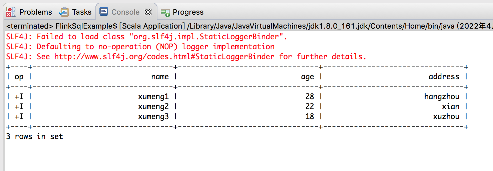

>对比[Spark 计算框架：Spark SQL](http://www.xumenger.com/spark-2-sql-20201126/)

>参考官方文档: [https://nightlies.apache.org/flink/flink-docs-release-1.12/dev/table/](https://nightlies.apache.org/flink/flink-docs-release-1.12/dev/table/)

首先，Maven 引入相关依赖

```xml
<dependency>
    <groupId>org.apache.flink</groupId>
    <artifactId>flink-table-planner-blink_2.11</artifactId>
    <version>1.12.1</version>
</dependency>

<dependency>
    <groupId>org.apache.flink</groupId>
    <artifactId>flink-table-api-scala-bridge_2.11</artifactId>
    <version>1.12.1</version>
</dependency>

<dependency>
    <groupId>org.apache.flink</groupId>
    <artifactId>flink-table-common</artifactId>
    <version>1.12.1</version>
</dependency>

<dependency>
    <groupId>org.apache.flink</groupId>
    <artifactId>flink-connector-hive_2.11</artifactId>
    <version>1.12.1</version>
</dependency>

<!-- https://mvnrepository.com/artifact/org.apache.flink/flink-json -->
<dependency>
    <groupId>org.apache.flink</groupId>
    <artifactId>flink-json</artifactId>
    <version>1.12.1</version>
</dependency>
<dependency>
    <groupId>org.apache.flink</groupId>
    <artifactId>flink-csv</artifactId>
    <version>1.12.1</version>
</dependency>
```

准备测试数据csv.txt 如下

```
xumeng1, 28, hangzhou
xumeng2, 22, xian
xumeng3, 18, xuzhou
```

编写Flink 程序如下

```scala
package com.xum.flinks

import org.apache.flink.streaming.api.scala.StreamExecutionEnvironment
import org.apache.flink.table.api.DataTypes
import org.apache.flink.table.api.Table
import org.apache.flink.table.api.bridge.scala.StreamTableEnvironment
import org.apache.flink.table.descriptors.Csv
import org.apache.flink.table.descriptors.FileSystem
import org.apache.flink.table.descriptors.Schema

object FlinkSqlExample {
  def main(args: Array[String]) 
  {
    // 获取批处理的执行环境
    val env: StreamExecutionEnvironment = StreamExecutionEnvironment.getExecutionEnvironment
    val tableEnv = StreamTableEnvironment.create(env)
    
    // 加载JSON 文件
    tableEnv.connect(new FileSystem().path("./csv.txt"))
            .withFormat(new Csv()
                        .fieldDelimiter(',')
                        .deriveSchema())
            .withSchema(new Schema() 
                        // 这个表结构要跟csv 中的内容对的上
                        .field("name", DataTypes.STRING())
                        .field("age", DataTypes.STRING())
                        .field("address", DataTypes.STRING())
            )
            .createTemporaryTable("userTable")
            
    // 创建表
    val inputTable: Table = tableEnv.from("userTable")
    
    // 执行SQL
    val tableResult = tableEnv.sqlQuery("SELECT * FROM userTable").execute()
    
    // 打印结果
    tableResult.print()
  }
}
```

运行后，输出如下


