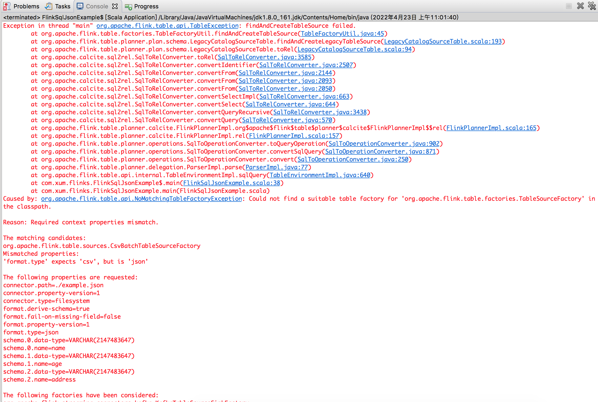

>对比[Spark 计算框架：Spark SQL](http://www.xumenger.com/spark-2-sql-20201126/)

>参考官方文档: [https://nightlies.apache.org/flink/flink-docs-release-1.12/dev/table/](https://nightlies.apache.org/flink/flink-docs-release-1.12/dev/table/)

准备测试数据example.json 如下

```
{"name": "xumeng1", "age": "29", "address": "hangzhou"}
{"name": "xumeng2", "age": "22", "address": "xian"}
{"name": "xumeng3", "age": "18", "address": "xuzhou"}
```

编写测试程序如下

```scala
package com.xum.flinks

import org.apache.flink.streaming.api.scala.StreamExecutionEnvironment
import org.apache.flink.table.api.DataTypes
import org.apache.flink.table.api.Table
import org.apache.flink.table.api.bridge.scala.StreamTableEnvironment
import org.apache.flink.table.descriptors.FileSystem
import org.apache.flink.table.descriptors.Json
import org.apache.flink.table.descriptors.Schema


object FlinkSqlJsonExample 
{
  def main(args: Array[String]) 
  {
    // 获取批处理的执行环境
    val env: StreamExecutionEnvironment = StreamExecutionEnvironment.getExecutionEnvironment
    val tableEnv = StreamTableEnvironment.create(env)
    
    // 加载JSON 文件
    tableEnv.connect(new FileSystem().path("./example.json"))
            .withFormat(new Json()
                        .failOnMissingField(false)
                        .deriveSchema()
            )
            .withSchema(new Schema() 
                        //这个表结构要跟json 中的内容对的上
                        .field("name", DataTypes.STRING())
                        .field("age", DataTypes.STRING())
                        .field("address", DataTypes.STRING())
            )
            .createTemporaryTable("userTable")
            
    // 创建表
    val inputTable: Table = tableEnv.from("userTable")
    
    // 执行SQL
    val tableResult = tableEnv.sqlQuery("SELECT * FROM userTable").execute()
    
    // 打印结果
    tableResult.print()
  }
}
```

但是运行的时候出现报错



