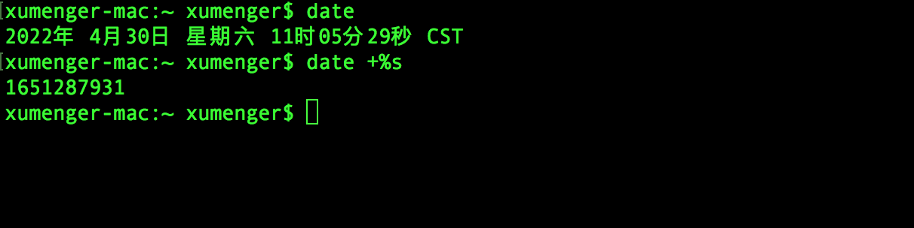

比如这样的场景，在Spark SQL 中创建的一张表里面有一个字段是秒级别的时间戳，希望将其转换成yyyyMM 格式的日期，然后根据日期进行聚合统计

秒级别的时间戳是下面这个样子的



对应的Spark Scala 代码如下

```scala
// 创建一个SparkConf
val sparkConf = new SparkConf().setMaster("local[*]").setAppName("UDF Test")

// 创建一个SparkSession
val spark = SparkSesstion.builder().config(sparkConf).getOrCreate()

// 加载数据
val oldDF = spark.read......

// 使用旧的DF 再创建一张表
oldDF.createOrReplaceTempView("oldUser")

// 创建一个日期格式化工具
val dateFormat = new SimpleDateFormat("yyyyMM")

// 注册UDF，将秒级别时间戳转换成年月格式（注意将秒转成毫秒）
spark.udf.regiser("convertDate", (x: Int) => dateFormat.format(new Date(x * 1000L)).toInt)

// 在SQL 中使用UDF，转换日期格式
val newDF = spark.sql("select name, sex, convertDate(timestamp) as yearmonth from oldUser")

// 使用新的DF 再创建一张表
newDF.createOrReplaceTempView("newUser")

// 再执行SQL 对日期进行聚合
val retDF = spark.sql("select yearmonth, count(*) as cnt from newUser group by yearmonth order by cnt desc")

// ...
spark.stop()
```
