>函数可视化的网站是 [https://www.desmos.com/calculator?lang=zh-CN](https://www.desmos.com/calculator?lang=zh-CN)

比如我们在数学中经常定义的函数: y = x, 0 < x < 1，对应在[https://www.desmos.com/calculator?lang=zh-CN](https://www.desmos.com/calculator?lang=zh-CN) 效果如下

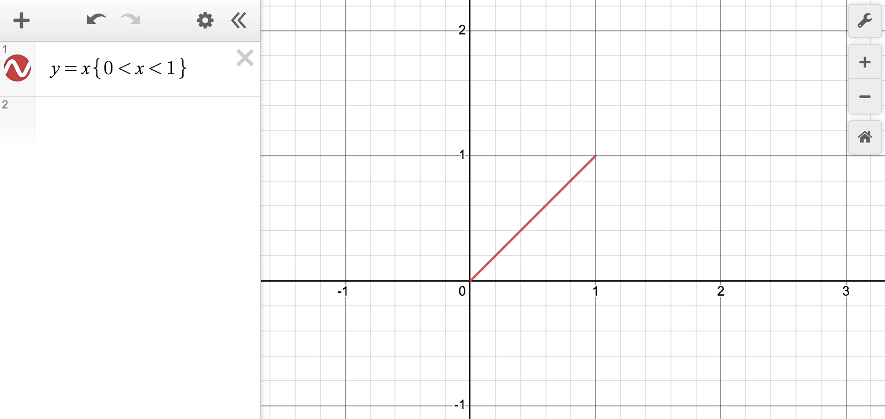

y = x ^ 2

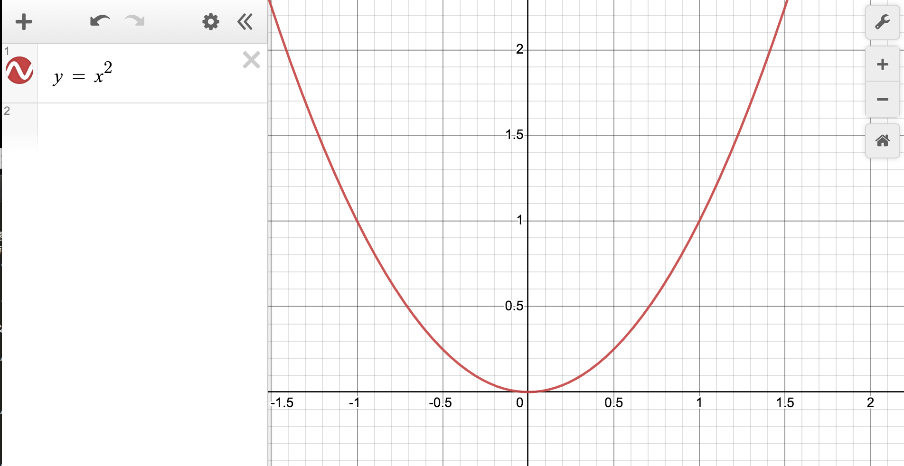

y = x ^ 3

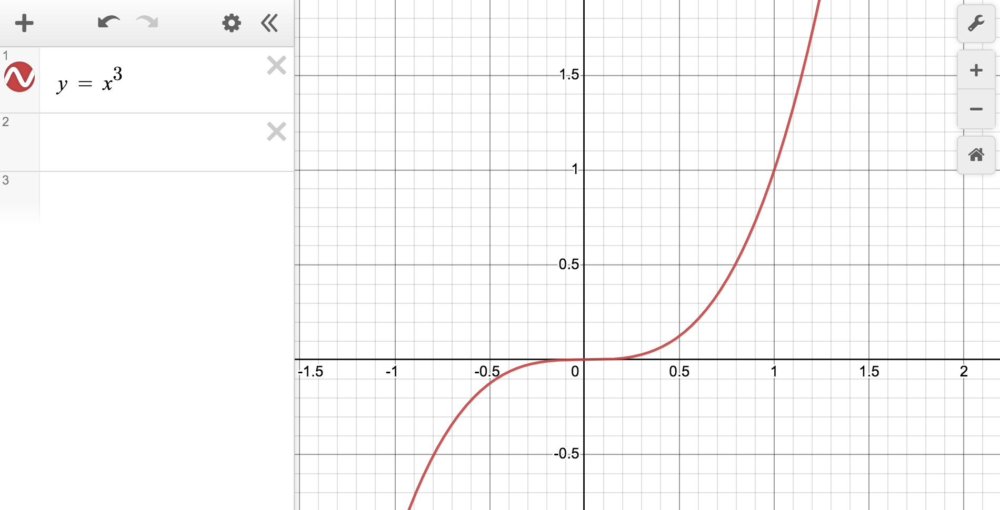

y = sin(x) 正弦函数

y = cos(x) 余弦函数

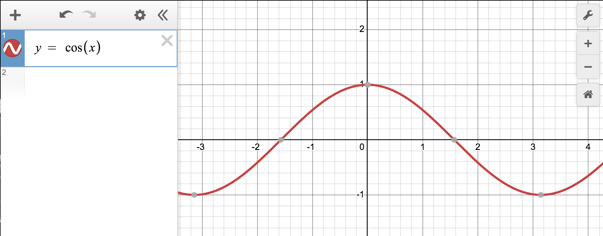

y = floor(sin(x))

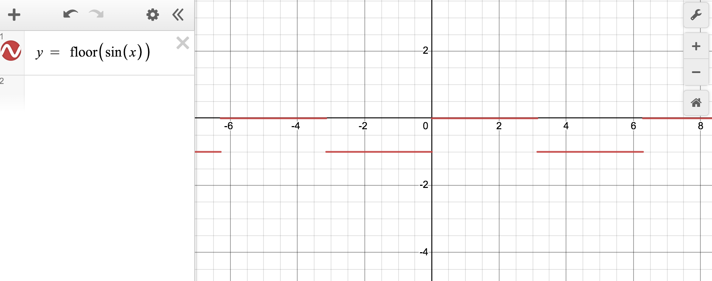

y = ceil(cos(x))

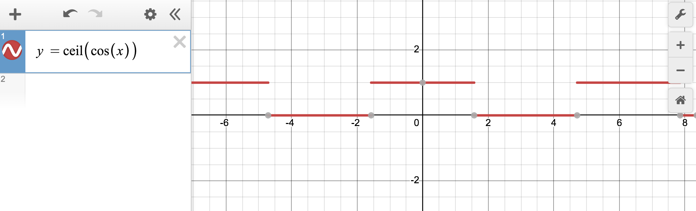

y = abs(cos(x * 9) * sin(x * 3))

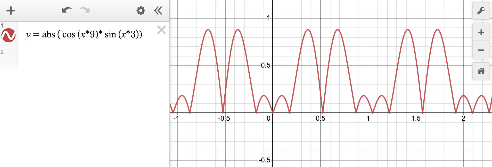

## Shader Function

更多的 Shader Function 可以参考[The Book of Shaders](https://thebookofshaders.com/)

比如[https://thebookofshaders.com/05/](https://thebookofshaders.com/05/)

基于这些函数可以帮助我们“绘制”各种好看的效果

[smoothstep](https://thebookofshaders.com/glossary/?search=smoothstep)

[clamp](https://thebookofshaders.com/glossary/?search=clamp)

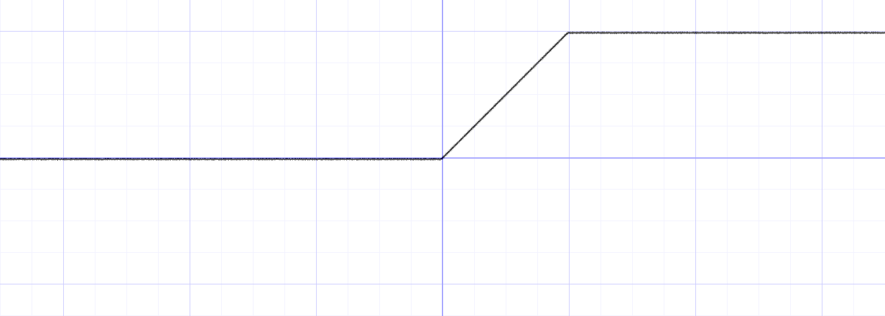

[step](https://thebookofshaders.com/glossary/?search=step)

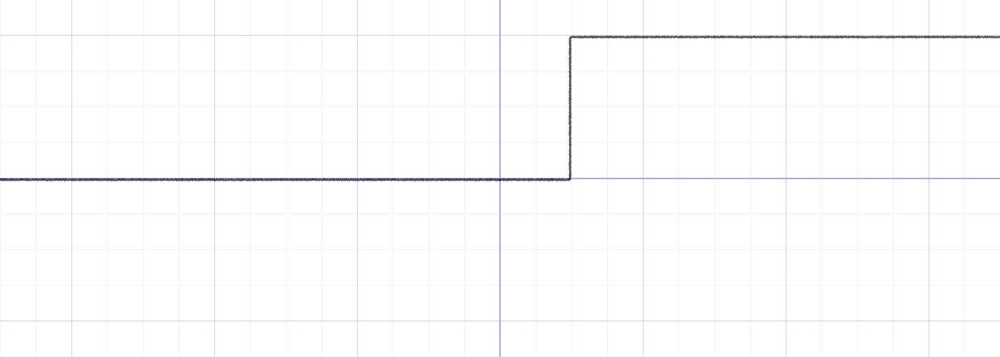

[fract](https://thebookofshaders.com/glossary/?search=fract)

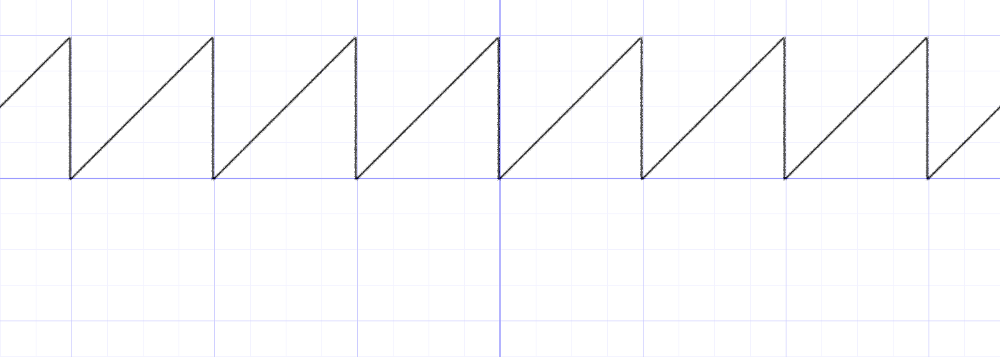

[floor](https://thebookofshaders.com/glossary/?search=floor)

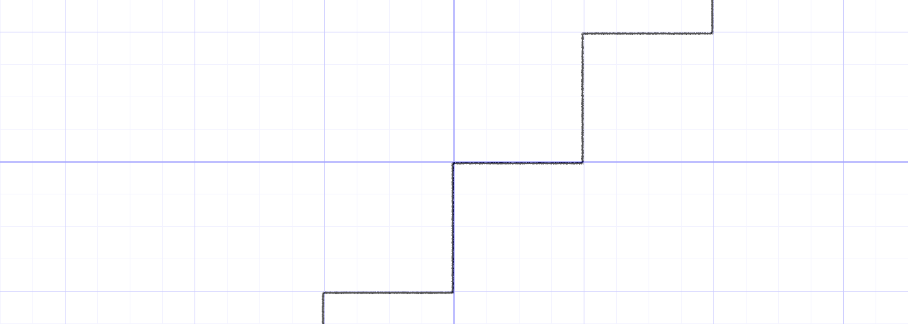

[ceil](https://thebookofshaders.com/glossary/?search=ceil)

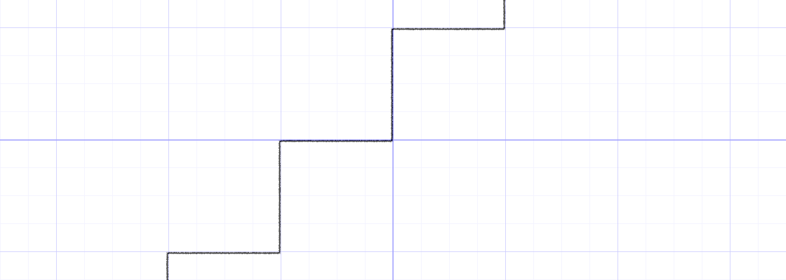

另外推荐[Shader 函数可视化](https://juejin.cn/post/6844903671705108487)

