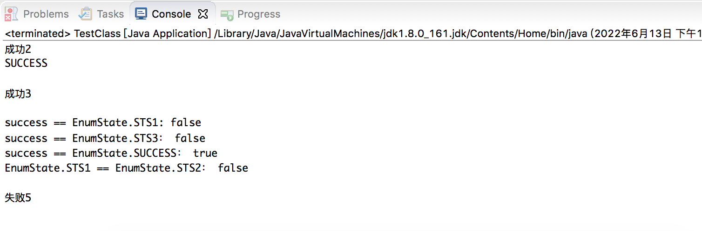
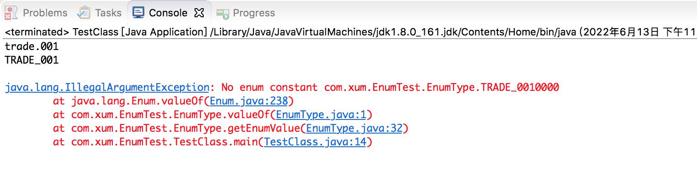

在日常的业务开发中，比如支付的场景，经常会定义状态、类型等枚举值，那么在Java 层面也建议用枚举类进行封装，不要硬编码，不要用常量定义！

比如定义一个状态枚举类如下所示：

```java
public enum EnumState 
{
    STS1("SUCCESS",     "成功1"),
    SUCCESS("SUCCESS",  "成功2"),
    STS2("SUCCESS",     "成功3"),
    STS3("FAIL",        "失败4"),
    FAIL("FAIL",        "失败5");
    
    private final String code;
    private final String desc;
    
    private EnumState(String code, String desc) 
    {
        this.code = code;
        this.desc = desc;
    }
    
    public String getCode()
    {
        return this.code;
    }
    
    public String getDesc()
    {
        return this.desc;
    }
}
```


```java
package com.xum.EnumTest;

public class TestClass 
{
    public static void main( String[] args ) 
    {
        // 基于字符串得到枚举类 SUCCESS("SUCCESS",  "成功2"),
        // 而不是STS1("SUCCESS",     "成功1"), STS2("SUCCESS",     "成功3"),
        EnumState success = EnumState.valueOf("SUCCESS");
        System.out.println(success.getDesc());   // 得到描述
        System.out.println(success.name());      // 得到枚举的名字，注意不是我们定义的code、desc成员变量
        System.out.println();
        
        EnumState sts3 = EnumState.valueOf("STS3");
        System.out.println(sts3.getDesc());
        System.out.println();
        
        System.out.println("success == EnumState.STS1: " + (success == EnumState.STS1));
        System.out.println("success == EnumState.STS3： " + (success == EnumState.STS3));
        System.out.println("success == EnumState.SUCCESS： " + (success == EnumState.SUCCESS));    // 这两者相等！
        System.out.println("EnumState.STS1 == EnumState.STS2： " + (EnumState.STS1 == EnumState.STS3));
        System.out.println();
        
        // 得到枚举对象 FAIL("FAIL", "成功");
        // 字符串映射到枚举类对象，是根据对象名称，而不是第一个参数的值！！
        EnumState fail = EnumState.valueOf("FAIL");
        System.out.println(fail.getDesc());        
    }
}
```



>使用枚举类不光是为了封装，比如可以基于枚举类针对上面的例子实现状态模式的封装！主要的目的就是为了实现面向对象中的封装！

对于比如接口中获取的值，或者从数据库中加载到的字符串的值就等于枚举类中某个枚举的对象名，可以用上面的方式转换，但还是有不同的情况，比如数据库中的值是trade.001、refund.002 这种，带有特殊符号，Java 语法上不支持直接用这个命名，怎么办？

## 遇事不决，加一层

在定义一个枚举类，如下所示：

```java
package com.xum.EnumTest;

public enum EnumType {
    TRADE_001("trade.001", "支付"),
    REFUND_001("trade.001", "退款")
    ;

    private String code;
    private String desc;
    
    private EnumType(String code, String desc)
    {
        this.code = code;
        this.desc = desc;
    }
    
    public String getCode()
    {
        return this.code;
    }
    
    public String getDesc()
    {
        return this.desc;
    }
    
    // 加一层：加一个方法，不直接调用valueOf
    // trade.001 得到TRADE_001 枚举类
    // 无法转换得到则抛出异常
    public static EnumType getEnumValue(String str) 
    {
        String dst = str.replace(".", "_").toUpperCase();
        return EnumType.valueOf(dst);

        // 这里也可以通过一个Map 映射得到
        // 在一个静态代码块中初始化这个Map！
    }

}
```

测试代码如下

```java
package com.xum.EnumTest;

public class TestClass 
{
    public static void main( String[] args ) 
    {
        EnumType trade = EnumType.getEnumValue("trade.001");
        System.out.println(trade.getCode());
        System.out.println(trade.name());
        System.out.println();
        
        // 无法转换的则抛出异常
        try {
            EnumType trade000 = EnumType.getEnumValue("trade.0010000");
        } catch (Exception e) {
            e.printStackTrace();
        }
    }
}
```


