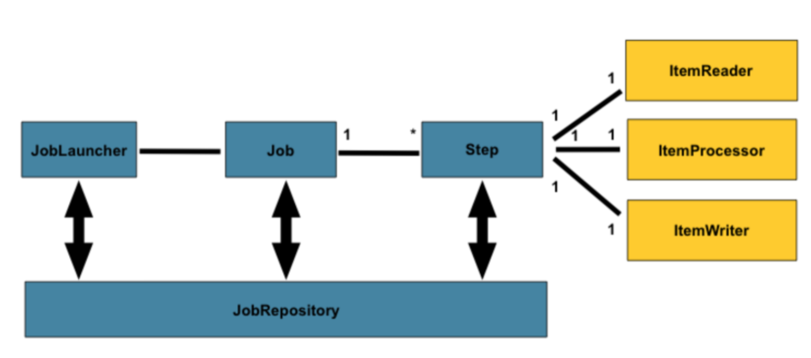
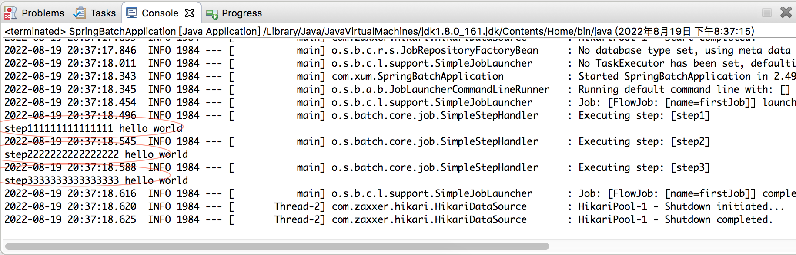
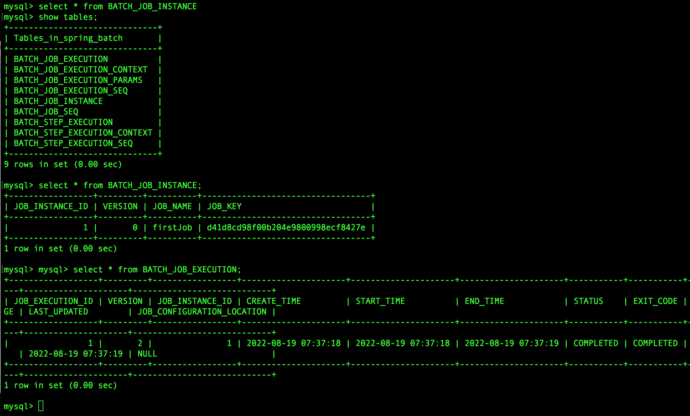

>[https://spring.io/projects/spring-batch/](https://spring.io/projects/spring-batch/)

>[https://docs.spring.io/spring-batch/docs/current/reference/html/index.html](https://docs.spring.io/spring-batch/docs/current/reference/html/index.html)

>[https://www.springbatch.cn/](https://www.springbatch.cn/)

SpringBatch是一个轻量级的批处理框架，但并不是调度框架，实际逻辑可能需要结合其他的调度框架配合使用。目前很多银行的批处理系统应用会选择使用SpringBatch 实现

## SpringBatch 架构与核心概念



* JobLauncher 任务启动器，启动任务，是程序的入口
* Job 代表一个具体的任务
    * Job 的定义对应batch\_job\_instance 中的一个记录
    * Job 的每次执行对应batch\_job\_execution 中的一个记录
    * batch\_job\_execution\_params 对应Job 这次执行过程中的参数
    * batch\_job\_execution\_context 对应这次执行的上下文信息
* Step 代表一个具体的步骤，一个Job 可包含多个Step。读取、处理、输出
    * batch\_step\_execution 对应Step 每次执行的记录
    * batch\step\_execution\_context 对应这次执行的上下文信息
* JobRepository 存储数据，执行过程中记录任务状态等信息

以上对于SpringBatch 的架构，以及涉及到的相关表进行了解释说明！

继续介绍更多概念：

**JobInstance**。Job 定义了一个工作流程，JonInstance 就是这个工作流程的一个具体实例。每次Job 执行的时候就会产生一个JobInstance

**JobParameters**。Job 具体执行的时候贯穿这个JobInstance 的配置参数，不同的JobParameters 产生不同的JobInstance。相同的JobParameters 会复用上次的JobInstance

**JobExecution**。表示JobInstance 的一次运行，JobInstance 可能运行成功或失败

**StepEexcution**。类似JobExecution，表示Step 的一次运行。Job 与Step 是一对多的关系，所以JobExecution 与StepEexcution 也是一对多的关系

**Flow**是多个Step 的集合，可以被多个Job 复用，使用FlowBuilder 来创建

## SpringBatch 简单案例

首先启动MySQL，并创建必要的数据库

```shell
$ mysql.server start
$ mysql -u root -p

mysql> create database spring_batch;
mysql> use spring_batch;
```

引入Maven 依赖

```xml
<project xmlns="http://maven.apache.org/POM/4.0.0" xmlns:xsi="http://www.w3.org/2001/XMLSchema-instance" xsi:schemaLocation="http://maven.apache.org/POM/4.0.0 http://maven.apache.org/xsd/maven-4.0.0.xsd">
  <modelVersion>4.0.0</modelVersion>
  <groupId>com.xum</groupId>
  <artifactId>SpringBatchExample</artifactId>
  <version>0.0.1-SNAPSHOT</version>
  <packaging>jar</packaging>
  
  <parent>
    <groupId>org.springframework.boot</groupId>
      <artifactId>spring-boot-starter-parent</artifactId>
      <version>2.1.5.RELEASE</version>
      <relativePath/>
  </parent>
  
  <dependencies>
    <dependency>
        <groupId>org.springframework.boot</groupId>
        <artifactId>spring-boot-starter-batch</artifactId>
    </dependency>
    
     <dependency>
        <groupId>org.springframework.boot</groupId>
        <artifactId>spring-boot-starter-test</artifactId>
    </dependency>
    
     <dependency>
        <groupId>org.springframework.batch</groupId>
        <artifactId>spring-batch-test</artifactId>
    </dependency>
    
    <dependency>
        <groupId>org.springframework.boot</groupId>
        <artifactId>spring-boot-starter-jdbc</artifactId>
    </dependency>
    
    <dependency>
        <groupId>mysql</groupId>
        <artifactId>mysql-connector-java</artifactId>
        <version>8.0.19</version>
    </dependency>

  </dependencies>
</project>
```

配置数据源

```yml
spring:
  datasource:
    driverClassName: com.mysql.jdbc.Driver
    url: jdbc:mysql://localhost:3306/spring_batch
    username: root
    password:
    # 指定mysql 的建表语句，否则创建的表可能不符合mysql 的规范！！！！
    shcema: classpath:/org/springframework/batch/core/schema-mysql.sql
  batch:
    # 启动时自动创建数据表
    initialize-schema: always
```

启动程序

```java
package com.xum;

import org.springframework.boot.SpringApplication;
import org.springframework.boot.autoconfigure.SpringBootApplication;

@SpringBootApplication
public class SpringBatchApplication 
{
    public static void main(String[] args)
    {
        SpringApplication.run(SpringBatchApplication.class, args);
    }
}
```

定义Job、Flow、Step

```java
package com.xum.batch;

import org.springframework.batch.core.Job;
import org.springframework.batch.core.Step;
import org.springframework.batch.core.StepContribution;
import org.springframework.batch.core.configuration.annotation.EnableBatchProcessing;
import org.springframework.batch.core.configuration.annotation.JobBuilderFactory;
import org.springframework.batch.core.configuration.annotation.StepBuilderFactory;
import org.springframework.batch.core.job.builder.FlowBuilder;
import org.springframework.batch.core.job.flow.Flow;
import org.springframework.batch.core.scope.context.ChunkContext;
import org.springframework.batch.core.step.tasklet.Tasklet;
import org.springframework.batch.repeat.RepeatStatus;
import org.springframework.beans.factory.annotation.Autowired;
import org.springframework.context.annotation.Bean;
import org.springframework.context.annotation.Configuration;

@Configuration
@EnableBatchProcessing
public class JobConfiguration 
{
    @Autowired
    private JobBuilderFactory jobBuilderFactory;
    
    @Autowired
    private StepBuilderFactory stepBuilderFactory;
    
    @Bean
    public Job firstJob()
    {
        return jobBuilderFactory.get("firstJob")
                .start(firstFlow())
                .next(step3())
                .end()
                .build();
    }
    
    @Bean
    public Flow firstFlow()
    {
        return new FlowBuilder<Flow>("firstFlow")
                .start(step1())
                .next(step2())
                .build();
    }

    @Bean
    public Step step1() 
    {
        return stepBuilderFactory.get("step1")
                .tasklet(new Tasklet() {

                    public RepeatStatus execute(StepContribution arg0, ChunkContext arg1) throws Exception {
                        System.out.println("step111111111111111 hello world");
                        return RepeatStatus.FINISHED;
                    }    
                })
                .build();
    }
    
    @Bean
    public Step step2() 
    {
        return stepBuilderFactory.get("step2")
                .tasklet(new Tasklet() {

                    public RepeatStatus execute(StepContribution arg0, ChunkContext arg1) throws Exception {
                        System.out.println("step2222222222222222 hello world");
                        return RepeatStatus.FINISHED;
                    }    
                })
                .build();
    }
    
    @Bean
    public Step step3() 
    {
        return stepBuilderFactory.get("step3")
                .tasklet(new Tasklet() {

                    public RepeatStatus execute(StepContribution arg0, ChunkContext arg1) throws Exception {
                        System.out.println("step3333333333333333 hello world");
                        return RepeatStatus.FINISHED;
                    }    
                })
                .build();
    }
}
```

运行程序，输出信息如下（可以看到Job 是自动执行的，有的时候我希望在特定逻辑下触发执行，怎么实现？）



查看数据库，新增了一些调度表，以及本次Job 的执行信息



## 更多内容和问题

* 以上的例子只是展示简单的使用，没有涉及到底层的实现、原理！
* 上面的例子，可以看到Job 是自动执行的，有的时候我希望在特定逻辑下触发执行，怎么实现？JobLauncher？
* 以上的例子没有涉及到Listener、Reader、Processor、Writer 的使用演示！
* 怎么使用Split 实现多个Step 或Flow 并发执行（各自一个线程）
* JobExecutionDecider 决策器怎么使用？
* JobParamters 怎么使用，如何实现参数的传递？
* Job 的嵌套？子Job、父Job。有什么应用场景？使用Flow 不也可以吗？
* JobLauncher 怎么使用？
* JobRepository 有什么用？
* 监听器（Listener）可以监听Job、Step 的执行情况，可以实现Job 执行完成后，回调Listener 执行相关逻辑
* chunk 方式与Tasklet 有什么区别？分别适用什么场景？
* chunk 指定每批次处理的条数，在处理的过程中是如何管理内存的，海量数据情况下是否容易导致OOM 问题？
