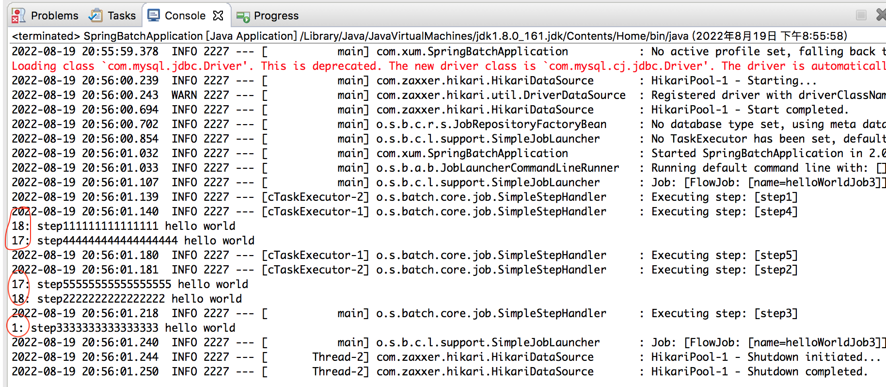

其他信息同上一篇文章！

默认多个Step 是串行执行的，可以使用Split 实现并发执行，看一下下面的效果，涉及到三个线程

```java
package com.xum.batch;

import org.springframework.batch.core.Job;
import org.springframework.batch.core.Step;
import org.springframework.batch.core.StepContribution;
import org.springframework.batch.core.configuration.annotation.EnableBatchProcessing;
import org.springframework.batch.core.configuration.annotation.JobBuilderFactory;
import org.springframework.batch.core.configuration.annotation.StepBuilderFactory;
import org.springframework.batch.core.job.builder.FlowBuilder;
import org.springframework.batch.core.job.flow.Flow;
import org.springframework.batch.core.scope.context.ChunkContext;
import org.springframework.batch.core.step.tasklet.Tasklet;
import org.springframework.batch.repeat.RepeatStatus;
import org.springframework.beans.factory.annotation.Autowired;
import org.springframework.context.annotation.Bean;
import org.springframework.context.annotation.Configuration;
import org.springframework.core.task.SimpleAsyncTaskExecutor;

@Configuration
@EnableBatchProcessing
public class JobConfiguration 
{
    @Autowired
    private JobBuilderFactory jobBuilderFactory;
    
    @Autowired
    private StepBuilderFactory stepBuilderFactory;
    
    @Bean
    public Job helloWorldJob3()
    {
        return jobBuilderFactory.get("helloWorldJob3")
                .start(firstFlow1())                                       // 开一个线程
                .split(new SimpleAsyncTaskExecutor()).add(firstFlow2())    // 再开一个线程
                .next(step3())                                             // 通过输出可以看到又开启了一个线程
                .end()
                .build();
    }
    
    @Bean
    public Flow firstFlow1()
    {
        return new FlowBuilder<Flow>("firstFlow1")
                .start(step1())
                .next(step2())
                .build();
    }
    
    @Bean
    public Flow firstFlow2()
    {
        return new FlowBuilder<Flow>("firstFlow2")
                .start(step4())
                .next(step5())
                .build();
    }

    @Bean
    public Step step1() 
    {
        return stepBuilderFactory.get("step1")
                .tasklet(new Tasklet() {

                    public RepeatStatus execute(StepContribution arg0, ChunkContext arg1) throws Exception {
                        System.out.println(Thread.currentThread().getId() + ": step111111111111111 hello world");
                        return RepeatStatus.FINISHED;
                    }    
                })
                .build();
    }
    
    @Bean
    public Step step2() 
    {
        return stepBuilderFactory.get("step2")
                .tasklet(new Tasklet() {

                    public RepeatStatus execute(StepContribution arg0, ChunkContext arg1) throws Exception {
                        System.out.println(Thread.currentThread().getId() + ": step2222222222222222 hello world");
                        return RepeatStatus.FINISHED;
                    }    
                })
                .build();
    }
    
    @Bean
    public Step step3() 
    {
        return stepBuilderFactory.get("step3")
                .tasklet(new Tasklet() {

                    public RepeatStatus execute(StepContribution arg0, ChunkContext arg1) throws Exception {
                        System.out.println(Thread.currentThread().getId() + ": step3333333333333333 hello world");
                        return RepeatStatus.FINISHED;
                    }    
                })
                .build();
    }
    
    @Bean
    public Step step4() 
    {
        return stepBuilderFactory.get("step4")
                .tasklet(new Tasklet() {

                    public RepeatStatus execute(StepContribution arg0, ChunkContext arg1) throws Exception {
                        System.out.println(Thread.currentThread().getId() + ": step444444444444444444 hello world");
                        return RepeatStatus.FINISHED;
                    }    
                })
                .build();
    }
    
    @Bean
    public Step step5() 
    {
        return stepBuilderFactory.get("step5")
                .tasklet(new Tasklet() {

                    public RepeatStatus execute(StepContribution arg0, ChunkContext arg1) throws Exception {
                        System.out.println(Thread.currentThread().getId() + ": step55555555555555555 hello world");
                        return RepeatStatus.FINISHED;
                    }    
                })
                .build();
    }
}
```

运行效果如下，可以看到涉及到三个线程


