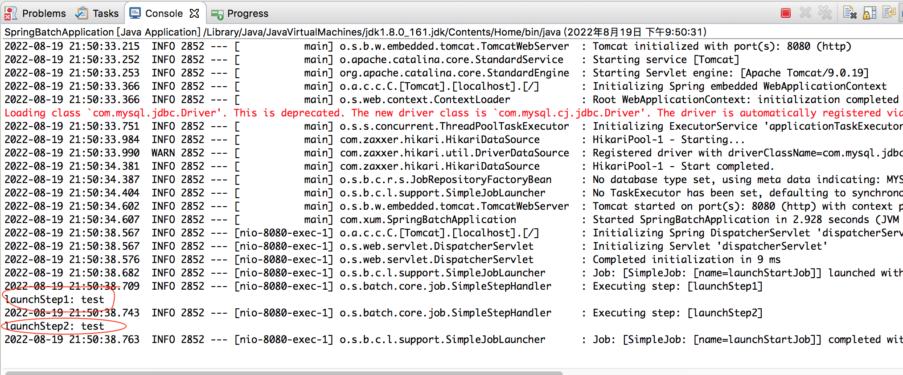

在上面的几个例子中可以看到当程序启动的时候，Job 会自动执行，但是在真实的场景中，往往需要某些条件触发，比如银行清算系统，需要检查到银联下发了SFTP 文件之后才能运行Job 等……

那么如何实现Job 的调度？

在pom.xml 引入web 依赖，用于实现由Controller 触发Job 的执行

```xml
<dependency>
  <groupId>org.springframework.boot</groupId>
  <artifactId>spring-boot-starter-web</artifactId>
</dependency>
```

在application.yml 中关闭任务自动执行

```yml
spring:
  batch:
    job:
      enabled: false
```

Controller 代码如下，在收到请求时调度Job

```java
package com.xum.controller;

import org.springframework.batch.core.Job;
import org.springframework.batch.core.JobParameters;
import org.springframework.batch.core.JobParametersBuilder;
import org.springframework.batch.core.JobParametersInvalidException;
import org.springframework.batch.core.launch.JobLauncher;
import org.springframework.batch.core.repository.JobExecutionAlreadyRunningException;
import org.springframework.batch.core.repository.JobInstanceAlreadyCompleteException;
import org.springframework.batch.core.repository.JobRestartException;
import org.springframework.beans.factory.annotation.Autowired;
import org.springframework.web.bind.annotation.PathVariable;
import org.springframework.web.bind.annotation.RequestMapping;
import org.springframework.web.bind.annotation.RestController;

@RestController
public class StartJobController 
{
    @Autowired
    private JobLauncher jobLauncher;
    
    // 注入Job Bean
    @Autowired
    private Job launchStartJob;
    
    
    @RequestMapping("/job/{msg}")
    public String runJob(@PathVariable String msg) throws JobExecutionAlreadyRunningException, 
                                                          JobRestartException, 
                                                          JobInstanceAlreadyCompleteException, 
                                                          JobParametersInvalidException
    {
        // 把参数值传给任务
        JobParameters params = new JobParametersBuilder()
                .addString("msg", msg)
                .toJobParameters();
        
        // 启动任务，并传递参数
        jobLauncher.run(launchStartJob, params);
        
        return "success";
    }
}
```

定义Job 的代码如下

```java
package com.xum.batch;

import java.util.Map;

import org.springframework.batch.core.ExitStatus;
import org.springframework.batch.core.Job;
import org.springframework.batch.core.JobParameter;
import org.springframework.batch.core.Step;
import org.springframework.batch.core.StepContribution;
import org.springframework.batch.core.StepExecution;
import org.springframework.batch.core.StepExecutionListener;
import org.springframework.batch.core.configuration.annotation.EnableBatchProcessing;
import org.springframework.batch.core.configuration.annotation.JobBuilderFactory;
import org.springframework.batch.core.configuration.annotation.StepBuilderFactory;
import org.springframework.batch.core.scope.context.ChunkContext;
import org.springframework.batch.core.step.tasklet.Tasklet;
import org.springframework.batch.repeat.RepeatStatus;
import org.springframework.beans.factory.annotation.Autowired;
import org.springframework.context.annotation.Bean;
import org.springframework.context.annotation.Configuration;

@Configuration
@EnableBatchProcessing
public class JobLauncherDemo implements StepExecutionListener
{
    @Autowired
    private JobBuilderFactory jobBuilderFactory;
    
    @Autowired
    private StepBuilderFactory stepBuilderFactory;
    
    // 这里并未考虑线程安全问题，只是展示其使用
    private Map<String, JobParameter> params;
    
    
    // 在Step 执行之前
    public void beforeStep(StepExecution stepExecution) {
        params = stepExecution.getJobParameters().getParameters();
    }    
        
    // 在Step 执行之后
    public ExitStatus afterStep(StepExecution stepExecution) 
    {
        // TODO Auto-generated method stub
        return null;
    }
    
    @Bean
    public Job launchStartJob()
    {
        return jobBuilderFactory.get("launchStartJob")
                .start(launchStep1())
                .next(launchStep2())
                .build();
    }
    
    @Bean
    public Step launchStep1() 
    {
        return stepBuilderFactory.get("launchStep1")
                .listener(this)
                .tasklet(new Tasklet() {

                    public RepeatStatus execute(StepContribution arg0, ChunkContext arg1) throws Exception {
                        System.out.println("launchStep1: " + params.get("msg").getValue());
                        return RepeatStatus.FINISHED;
                    }    
                })
                .build();
    }
    
    @Bean
    public Step launchStep2() 
    {
        return stepBuilderFactory.get("launchStep2")
                .listener(this)
                .tasklet(new Tasklet() {

                    public RepeatStatus execute(StepContribution arg0, ChunkContext arg1) throws Exception {
                        System.out.println("launchStep2: " + params.get("msg").getValue());
                        return RepeatStatus.FINISHED;
                    }    
                })
                .build();
    }
}
```

在浏览器中输入 [http://localhost:8080/job/test](http://localhost:8080/job/test) 回车

看到程序执行输出：

