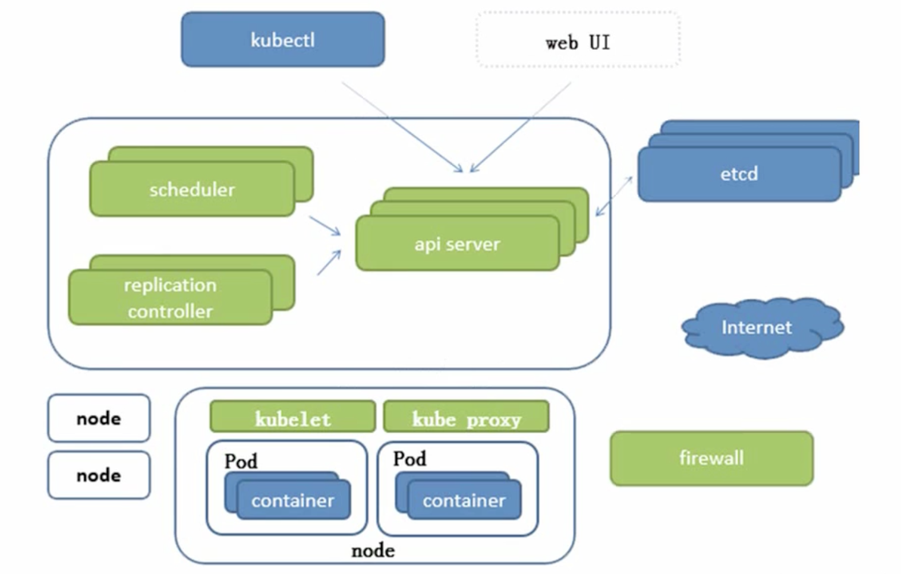
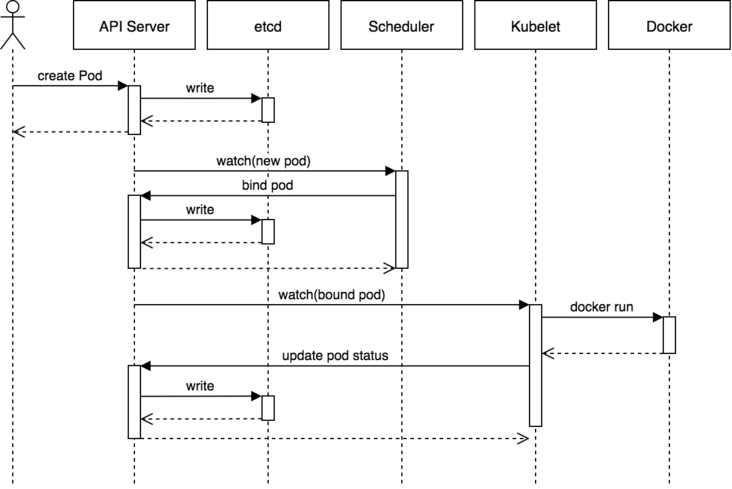

>Golang 官方网站：[https://golang.google.cn/](https://golang.google.cn/)

>etcd、Docker、K8s 这些目前流行的软件、系统都是基于Golang 开发的，所以适当了解Golang 是很有必要的！

## 搭建Golang 环境

可以去[Golang 的镜像](https://gomirrors.org/) 下载安装包，比如MacOS 环境下载.pkg 安装包，双击下载！默认安装到/usr/local/go/ 目录

编辑`~/.bash_profile` 文件，添加环境变量配置

```shell
export GOPATH="/usr/local/go/"

# 注意设置GOOS 很重要，否则后续syscall.Sethostname 等syscall 下面的API 调用都会报错：undefined: syscall.Sethostname
export GOOS="linux"

export PATH=$PATH:$GOPATH/bin
```

`source ~/.bash_profile` 使配置生效。然后执行`go version` 检查是否生效！

编写一个测试程序如下（函数、变量、条件、循环……）

```go
// 包声明
package main

// 引入包，fmt 包实现了格式化 IO（输入/输出）的函数
import (
    "fmt"
    "strconv"
)

// 和C、C++、Java 中的main() 函数一样，程序执行入口
func main() {
    // 定义字符串变量，不指定类型
    var hello = "Hello"

    // 定义字符串变量，指定类型
    var golang string = "Golang"
    
    // 定义int 类型
    var i int = 0

    // 循环
    for i=0; i<10; i++ {
        // 条件
        if i%2 == 0 {
            // 输出结果（字符串连接）
            fmt.Println(hello + ", " + golang + " " + strconv.Itoa(i))
        }
    }
}
```

可以使用下面两种方式执行

```shell
# 直接执行
go run hello.go

# 先编译，再执行
go build hello.go
./hello
```

## Golang 结构体struct

```go
package main

import "fmt"

// 定义结构体
type User struct {
    name string
    age int
    address string
}

func main() {
    var u1 User

    u1.name = "xumenger"
    u1.age = 27
    u1.address = "xuzhou"

    // 函数调用
    printInfo(&u1)
}

// 定义函数，参数是指针类型
func printInfo(u *User) {
    fmt.Printf("User name: %s\n", u.name)
    fmt.Printf("User age: %d\n", u.age)
    fmt.Printf("User address: %s\n", u.address)
}
```

## Golang 接口interface

```go
package main

import (
    "fmt"
)

// 定义接口
type Car interface {
    get_name() string
    run(speed int) bool
}

// 定义结构体
type Audi struct {
    name string
}

// 实现接口方法name()
func (audi Audi) get_name() string {
    audi.name = "Audi"
    return audi.name
}

// 实现接口方法run(speed)
func (audi Audi) run(speed int) bool {
    fmt.Println("Audi run")
    return true
}


// 测试函数
func main() {
    var car Car

    car = new(Audi)
    fmt.Println(car.get_name())
    car.run(100)
}
```

## 手写Docker 引擎

>参考[Re0: 从零开始的容器化技术：神奇代码在哪里第13期](https://www.bilibili.com/video/BV1EU4y1J7sz/)

>[https://gitee.com/mirrors_lizrice/containers-from-scratch/blob/master/main.go](https://gitee.com/mirrors_lizrice/containers-from-scratch/blob/master/main.go)

注意下面的代码，需要在Linux 环境下运行！

```go
package main

import (
    "fmt"
    "io/ioutil"
    "os"
    "os/exec"
    "path/filepath"
    "strconv"
    "syscall"
)

// go run main.go run <cmd> <args>
func main() {
    switch os.Args[1] {
    case "run":
        run()
    case "child":
        child()
    default:
        panic("help")
    }
}

func run() {
    fmt.Printf("Running %v \n", os.Args[2:])

    // 调用exe 用于起一个子进程，设置参数为child，对应会在新的进程中走到child() 方法
    cmd := exec.Command("/proc/self/exe", append([]string{"child"}, os.Args[2:]...)...)

    // 重置标准输入输出，否则输入/输出/错误无法在run 对应的Command 的上下文中
    cmd.Stdin = os.Stdin
    cmd.Stdout = os.Stdout
    cmd.Stderr = os.Stderr

    // syscall.CLONE_NEWUTS
    //   会在新的UTS namespace 中创建一个进程，原来的hostname 等会从父进程继承,
    //   但是如果后续在子进程中改了hostname，子进程退出后，父进程的hostname还是原来的，不会受影响
    // syscall.CLONE_NEWPID
    //   子进程会在新的PID namespace里面
    //   这样container 和host 实现进程隔离，其1 号process 分别表示不同的process
    //   但是ps 命令是从/proc/ 下面获取进程信息，要想在container 上下文中ps 命令返回容器进程
    //   那么container 和主机的/proc/ 也需要分开。可以通过安装一个新的文件系统实现！
    // syscall.CLONE_NEWNS 隔离挂载命名空间
    //   如果该标志被设置，则clone的子进程会被挂载在新的namespace 中
    cmd.SysProcAttr = &syscall.SysProcAttr{
        Cloneflags:   syscall.CLONE_NEWUTS | syscall.CLONE_NEWPID | syscall.CLONE_NEWNS,
        Unshareflags: syscall.CLONE_NEWNS,
    }

    // 在容器中执行child 命令（切换到child() 函数）
    must(cmd.Run())
}

func child() {
    fmt.Printf("Running %v \n", os.Args[2:])

    cg()

    cmd := exec.Command(os.Args[2], os.Args[3:]...)
    cmd.Stdin = os.Stdin
    cmd.Stdout = os.Stdout
    cmd.Stderr = os.Stderr

    // 但是ps 命令是从/proc/ 下面获取进程信息，要想在container 上下文中ps 命令返回容器进程
    // 那么container 和主机的/proc/ 也需要分开。可以通过安装一个新的文件系统实现！
    must(syscall.Sethostname([]byte("container")))
    must(syscall.Chroot("/home/liz/ubuntufs"))
    must(os.Chdir("/"))
    must(syscall.Mount("proc", "proc", "proc", 0, ""))
    must(syscall.Mount("thing", "mytemp", "tmpfs", 0, ""))

    must(cmd.Run())

    must(syscall.Unmount("proc", 0))
    must(syscall.Unmount("thing", 0))
}


// 使用cgroup 限制容器可使用的资源：内存、CPU 等
func cg() {
    // 在Linux 的/sys/fs/cgroup/ 目录下可以查看资源设置情况
    cgroups := "/sys/fs/cgroup/"

    pids := filepath.Join(cgroups, "pids")
    os.Mkdir(filepath.Join(pids, "liz"), 0755)
    must(ioutil.WriteFile(filepath.Join(pids, "liz/pids.max"), []byte("20"), 0700))
    // Removes the new cgroup in place after the container exits
    must(ioutil.WriteFile(filepath.Join(pids, "liz/notify_on_release"), []byte("1"), 0700))
    must(ioutil.WriteFile(filepath.Join(pids, "liz/cgroup.procs"), []byte(strconv.Itoa(os.Getpid())), 0700))
}


func must(err error) {
    if err != nil {
        panic(err)
    }
}
```

## 复习K8s 架构图

>[Kubernetes 技术应用：Kubernetes 介绍](http://www.xumenger.com/k8s-20210801/)



以下来自Heptio 博客的序列图显示了在简单的Pod 创建过程中涉及的组件。它很好地说明了API 服务器和etcd 的交互作用

